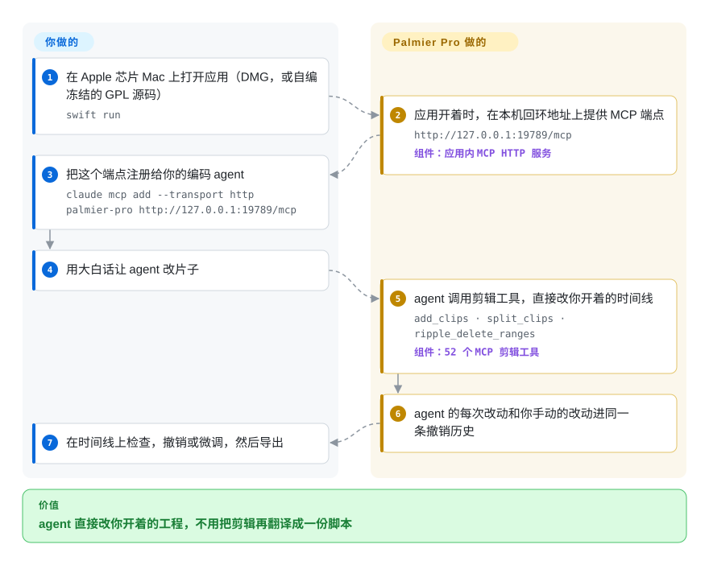

# Palmier Pro

你想让 Claude Code 或 Codex 干剪辑里的体力活——剪掉停顿、加字幕、在口播上铺空镜——可 agent 只会写脚本，你的片子却在它碰不到的剪辑软件里。Palmier Pro 是一款 macOS 原生剪辑器，开着时在本机开一扇门（MCP 服务），让 agent 直接改你眼前这条时间线；注意只有 v0.7.6 及之前的源码开源，之后的版本已转为闭源。

## 何时使用

你在 Apple 芯片的 Mac 上做短视频或口播，日常已经泡在 Claude Code、Codex 或 Cursor 里。想交出去的活很具体：“把句子之间的停顿删掉，加逐字字幕，嘉宾说话时切到二机位”。用脚本类工具，你得先用 Python 或 JSON 把剪法描述一遍，再打开图形界面修结果；用纯图形界面的剪辑器，agent 根本进不去。你选 Palmier Pro，是因为 agent 和你改的是**同一个开着的工程**：应用通过本机 MCP 端点暴露 52 个剪辑工具，界面操作和 agent 操作走同一套底层操作、进同一条撤销历史，你可以在时间线上看着它改，随时撤销和纠正。生成新素材（Seedance、Kling、Nano Banana Pro 等模型）也内置在编辑器里，按 Palmier 账号计费。

和最接近的替代品比，决定性的取舍是：[Concat](concat.zh.md) 同样是带自动化接口的原生剪辑器，但它跨平台、完全离线、AGPL 授权，提供的是 JSON-RPC／gRPC 服务而不是 MCP 工具集；[video-use](../../video-production/video-use.zh.md) 让 agent 用 ffmpeg 把一堆原始素材直接剪成成片，中间没有剪辑器。当你想留在真正的时间线里审 agent 的每一步改动、手上是 macOS 26 加 Apple 芯片、并且接受“持续维护的是闭源二进制，开源部分是冻结快照”时，选 Palmier Pro。

## 怎么用起来

Palmier Pro 是一个 Swift 应用，建在苹果自家的媒体栈上（AVFoundation 负责解码、播放，Core Image 加自写的 Metal 着色器负责特效和调色）。应用开着时，会在你自己机器上跑一个小 HTTP 服务，说的是 MCP——Model Context Protocol，一种让 AI agent 发现并调用工具的标准协议。你把这个地址注册给 agent 一次；之后你提剪辑要求，agent 就去调 `add_clips`、`split_clips`、`ripple_delete_ranges`（删掉一段并自动合拢空隙）这类工具，应用把改动落到你开着的时间线上。打个比方：不是让 agent 写一份菜谱再由你照着做，而是给它第二只鼠标，直接在你的工程上操作。应用替你做的：时间线模型、渲染、工具契约、每次调用的参数校验，以及你俩共用的一条撤销历史。你要做的：打开工程、说清要什么、检查结果、导出（导出成视频文件，或 FCPXML／Final Cut Pro 7 XML，交给 Resolve、Final Cut 或 Premiere）。应用内还有一个聊天 agent，能用你自己的 Anthropic／OpenAI 密钥或 Palmier 额度做同样的事；而用 AI 生成新片段，一律要走 Palmier 的托管后端。

<!-- flow-steps:begin (generated from flows/palmier-pro.json by tools/flow_card.py — do not edit) -->

流程文字版

1. **你**：在 Apple 芯片 Mac 上打开应用（DMG，或自编冻结的 GPL 源码） — `swift run`
2. **Palmier Pro**：应用开着时，在本机回环地址上提供 MCP 端点 — `http://127.0.0.1:19789/mcp` — 组件：`应用内 MCP HTTP 服务`
3. **你**：把这个端点注册给你的编码 agent — `claude mcp add --transport http palmier-pro http://127.0.0.1:19789/mcp`
4. **你**：用大白话让 agent 改片子
5. **Palmier Pro**：agent 调用剪辑工具，直接改你开着的时间线 — `add_clips · split_clips · ripple_delete_ranges` — 组件：`52 个 MCP 剪辑工具`
6. **Palmier Pro**：agent 的每次改动和你手动的改动进同一条撤销历史
7. **你**：在时间线上检查，撤销或微调，然后导出

**价值**：agent 直接改你开着的工程，不用把剪辑再翻译成一份脚本

<!-- flow-steps:end -->

## 何时不用

- **你要一个会持续修 bug 的开源剪辑器。** 只有 `last-gpl-source` 标签（2026-08-24，对应 v0.7.6）之前的源码是 GPL-3.0；v0.7.6 之后的版本是专有软件、不公开源码，仓库也在 2026-08-28 停止接受贡献。要当前版本仍然开源的剪辑器，选 [Concat](concat.zh.md) 或 Kdenlive（未收录），因为冻结的快照不会再从原作者那里得到安全和兼容性修复。
- **你不在 macOS 26 加 Apple 芯片上。** README 和 `Package.swift` 都要求 macOS 26（Tahoe）与 M 系列芯片，项目开发规范还明确不为其他系统版本或架构加兼容。Windows、Linux 用 [Concat](concat.zh.md) 或 Kdenlive（未收录）；想在浏览器里剪，关注 [OpenCut](opencut.zh.md)。
- **你要在服务器上无人值守地批量出片。** MCP 服务只在 Mac 上的图形应用开着时存在，一个应用实例对应它开着的工程；有工作室在 issue #302 里问无头运行和并行出片，得到的回复是“发邮件聊”。CI 里按模板渲染用 [Remotion](../../video-production/remotion.zh.md)；Python 批量剪辑用 [MoviePy](../video-audio/editing-and-cutting/moviepy.zh.md)。
- **你想生成素材却不想绑定厂商账号，或想用自己的模型密钥。** 生成片段调用的是 Palmier 的 Convex 后端（`generations:submit`），按 Palmier 额度扣费；后端代码不在仓库里，没有 Palmier 的 Clerk／Convex 配置自编出来的版本，会把账号后端标成配置缺失。想自己掌控生成链路，就直接调各家模型 API，或用 [OpenMontage](../../video-production/open-montage.zh.md) 这类流水线。
- **你不信任同一台 Mac 上的其他本地进程。** MCP 端点只绑定 `127.0.0.1` 并校验 `Origin` 头，但没有令牌；任何本地进程都能操控开着的工程，issue #302 也指出了这一点。在共用机器上别开着它，或改用 [Concat](concat.zh.md)——它的本地服务每次运行都生成随机令牌。
- **你要做自己的剪辑器或无头剪辑服务。** fork 一个单厂商、已冻结的 Swift 应用，会把你绑在 macOS 26 和 GPL 义务上；要可复用的时间线引擎，用 [MLT](../video-audio/editing-and-cutting/mlt.zh.md)。
- **你的团队用剪映／CapCut 剪。** Palmier Pro 导出的是 FCPXML 和 FCP7 XML，不是剪映草稿（导出剪映草稿的请求 issue #580 仍开着）。要让 agent 写剪映工程，用 [pyJianYingDraft](../nle-automation/pyjianyingdraft.zh.md) 或 [JianYing Editor Skill](../nle-automation/jianying-editor-skill.zh.md)。

## 横向对比

| 替代品 | 是否收录 | 我们的评价 | 取舍 |
|---|---|---|---|
| [Concat](concat.zh.md) | ✅ | 如果你要在 Windows、Linux 或 macOS 上有一个 agent 能操控、完全离线、当前版本仍开源的原生剪辑器，选 Concat；只有在 macOS 26 上、又想要 MCP 剪辑工具加内置生成时，才选 Palmier Pro。 | Concat 换来跨平台、离线语音能力和带令牌的本地服务；代价是单人维护的 beta、AGPL 义务，也没有 MCP 工具集。 |
| [OpenCut](opencut.zh.md) | ✅ | 更看重浏览器里的开源剪辑器、不急着要能用的 agent 集成时，关注 OpenCut；需要 agent 现在就改你的时间线，选 Palmier Pro。 | OpenCut 换来浏览器可达性和 MIT 开源代码；但当前仓库正在重写、没有可用版本，也没有 agent 工具接口。 |
| [video-use](../../video-production/video-use.zh.md) | ✅ | 活儿是“把一文件夹原始素材剪成成片”、不需要在时间线里审时，选 video-use；想在剪辑器里看、撤销、微调 agent 的每一步，选 Palmier Pro。 | video-use 换来可移植（有 ffmpeg 的系统都能跑）且不需要图形界面；代价是没有交互式审片，转写还要 ElevenLabs Scribe 密钥。 |
| Kdenlive | 未收录 | 要一个长期存在、各平台都能用、完全开源的桌面剪辑器，选 Kdenlive；只有需要 MCP agent 剪辑和内置生成时才选 Palmier Pro。本轮标签页收录批次未添加。 | Kdenlive 换来十年级别的 KDE 项目、当前版本就是 GPL 源码；但它没有 MCP agent 接口，也没有内置 AI 生成。 |
| Final Cut Pro | 非仓库 | 接付费客户的活、需要成熟且有厂商支持的 Mac 剪辑器，选 Final Cut Pro；Palmier Pro 用来让 agent 出粗剪，再经 FCPXML 交过去。 | Final Cut Pro 是苹果的闭源商业软件：稳定完整，但没有 MCP agent 接口、没有源码；Palmier Pro 的 FCPXML 导出让两者可以接力。 |

## 技术栈

- **语言／界面：** Swift 6.2（单个 SwiftPM 可执行目标），SwiftUI 加 AppKit；项目开发规范写明只支持 macOS 26 与 arm64。
- **媒体：** AVFoundation 负责解码、播放和导出；Core Image 加 12 个自写 Metal 着色器（抠像、曲线、LUT、颗粒、辉光、暗角等），由 SwiftPM 构建插件编译；导出器覆盖视频文件、FCPXML、XMEML（Final Cut Pro 7 XML），另有 HDR 导出。
- **Agent 接口：** 用 `modelcontextprotocol/swift-sdk` 实现 MCP HTTP 服务（`ToolName` 里 52 个工具）；应用内 agent 可走 Anthropic／OpenAI 自带密钥客户端，或 Palmier 托管客户端；附带一个 `mcpb` 包，一键装进 Claude Desktop。
- **账号与生成后端：** Clerk（登录）和 Convex（任务、上传、额度）的客户端 SDK；后端本身不在本仓库。
- **可选构建特性：** `BundledSpeech`（MLX、`speech-swift`，用于语音活动检测和人声增强）与 `ProductionTelemetry`（Sentry、PostHog）。另有 Sparkle（自动更新）、`swift-transformers`、Lottie。

## 依赖

- **硬件／系统：** macOS 26（Tahoe）及以上的 Apple 芯片 Mac——没有 Intel、Windows 或 Linux 版本。
- **用持续维护的二进制：** 装 DMG 即可；更新通过 Sparkle 从本仓库的 `appcast.xml` 拉取。
- **用 AI 生成和托管聊天 agent：** 需要 Palmier 账号和额度（联网访问 Palmier 后端，其背后再调各家模型服务）。
- **不用额度跑应用内 agent：** 需要你自己的 Anthropic 或 OpenAI API 密钥。
- **从外部让 agent 剪辑：** 一个支持 MCP 的客户端（README 列出 Claude Code、Codex、Cursor、Claude Desktop）。
- **自编 GPL 源码：** Xcode 附带的 Swift 6.2 工具链；`scripts/bundle.sh` 从 `.env` 读取账号功能所需的 Clerk／Convex 配置，签名身份默认是 Palmier 自己的。

## 运维难度

**用二进制很低，自己接管开源版本中到高。** 作为用户，它就是一个桌面应用：装 DMG，想生成就登录，再给 agent 加一行 MCP 配置。你不需要维护任何服务器，但生成按额度计费，而且本机 MCP 端口是一个没有鉴权的控制入口。反过来，若要接管 GPL 快照，你得自己编译 Swift 6.2 应用、放弃账号后端（或自己写一个）、自己签名公证，并独自承担以后所有 macOS 与依赖的修复，因为上游已不再公开源码。

## 健康度与可持续性

- **维护（2026-09-28）：** *产品*很活跃——v0.10.1 于 2026-09-26 发布，此前 0.x 版本大约每周一发；但*开源部分*已停：最后一次源码变更是 `last-gpl-source` 标签（2026-08-24），此后 main 上只有 appcast 与许可说明的提交，节点是“Retire public source development”（#578，2026-08-28）。v0.10.x 的发布说明引用了本仓库里不存在的 PR 编号，说明开发转到了私有仓库。
- **治理／bus factor：** 单一厂商 Palmier, Inc.（README 徽章显示为 Y Combinator S24）。一位维护者（`htin1`）约占 ~1,100 次提交中的 1,005 次，第二位（`mricopeng`）52 次，其余每人不超过 10 次。
- **背书与 Lindy：** 创建于 2026-04-07，约六个月。太年轻，谈不上 Lindy 先验；而且这次改授权把开源代码“老而仍活跃”的路也堵上了：一个年轻仓库，开源线已经停了。
- **采用度：** 六个月约 1.45 万星、1.1 千 fork，最近 30 个发布的附件累计下载约 9.8 万次（2026-09-28）。星数反映的是对整个产品的关注，而产品主体现在是闭源的。延续 GPL 代码的 fork 中星最多的（`TimLai666/fronda`）只有 19 星，2026-07-30 之后没有推送。
- **风险信号：** v0.7.6 之后从 GPL-3.0 改为专有二进制许可（`BINARY_LICENSE.md` 禁止复制、修改和逆向之后的二进制）；生成功能锁定在厂商后端和额度上；生产构建可选带遥测（Sentry、PostHog）；本机控制端口没有令牌。

## 存疑（未验证）

- [推断] “开发转到私有仓库”是根据 v0.10.1 发布说明引用的 PR #142–#145 在公开仓库中返回 404 推出来的（2026-09-28 核查）；厂商没有说明代码现在放在哪里。
- [未验证] 冻结的 GPL 源码在没有 Palmier Clerk／Convex 配置时能否编译并正常使用，本页没有实测：代码里是标记 `isMisconfigured` 而不是崩溃，但 `bundle.sh` 的提示仍写着应用“will fatalError on launch”。剪辑、MCP 与自带密钥聊天应当不依赖后端 [推断]，但这里没有实际编译。
- [未验证] 支持的生成模型（Seedance、Kling、Nano Banana Pro 等）与价格来自作者声明，且随版本变化；本页没有跑过生成。
- [未验证] 星数、fork 数、下载量和提交数（14,482／1,129／30 个发布约 9.79 万次／约 1,100）是 2026-09-28 的 GitHub API 瞬时值。
- [未验证] Y Combinator S24 的背景只来自 README 徽章。
- [推断] 批量出片的无头与并行限制是根据架构（MCP 服务在图形界面进程内）和无公开答复的 issue #302 推断的，没有实测。
