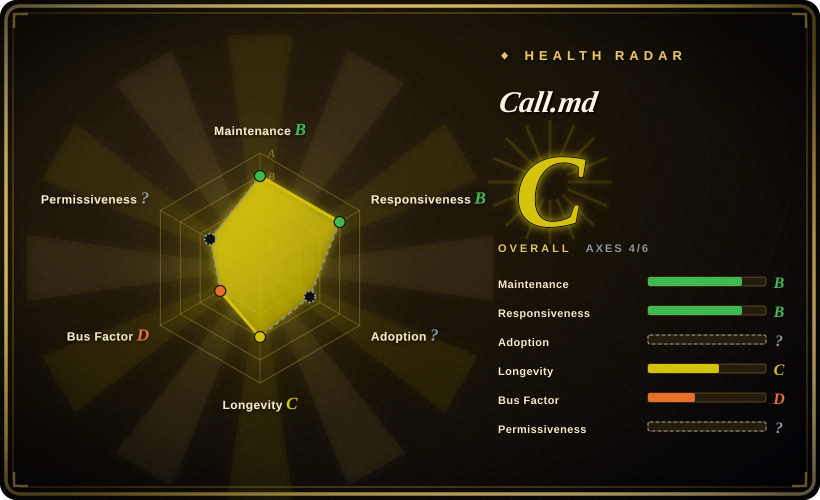
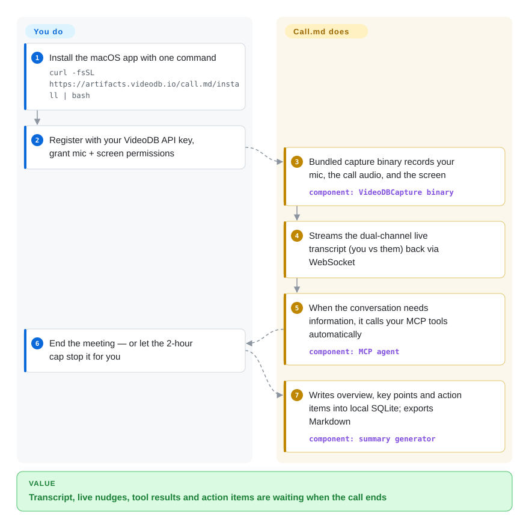

# Call.md

You finished a long call and cannot write down who committed to what — nobody was free to take notes while you were talking. Call.md is a macOS meeting copilot that records your mic, the call's audio, and your screen, streams a dual-channel live transcript, fires your MCP tools during the call, and produces summary, key points and action items after it — but the recording and transcription run through VideoDB's hosted API, so the raw audio leaves your machine.

## When to use

You are a founder or sales engineer living in back-to-back video calls on a Mac, and the pain is post-call: you leave a negotiation remembering the vibe but not the commitments, and retyping the transcript into a notes app never happens. You reach for Call.md because it is the rare meeting tool whose entire loop — transcript buffer, talk-ratio and pace metrics, coaching nudges, summary generator, webhook payloads — is readable, patchable source in an Electron app, rather than a subscription black box (Granola, Otter, Fireflies are all closed SaaS). The deciding capability is in-call automation: its MCP agent watches the live transcript and invokes your own connected MCP servers — ticket lookup, CRM, internal docs — showing results inline, which off-the-shelf note-takers do not do.

You also reach for it as a *reference implementation* if you are building on VideoDB's capture/transcription SDK: it is that vendor's flagship example app (docs.videodb.io), so the SDK integration — capture sessions, WebSocket streaming, insights calls — is wired exactly as the vendor intends, and you can fork it into your own meeting product. The tradeoff you are accepting: transparency and agent automation, at the price of a hard dependency on VideoDB's cloud for every intelligent feature.

## How it works

When you start a meeting, the app spawns the closed capture binary (`VideoDBCapture.app/…/capture` on macOS, `capture.exe` on Windows) that ships inside the npm `videodb` SDK; it records microphone, system audio, and screen, and the app opens a capture session in your VideoDB cloud collection. Transcription comes back over a WebSocket as two separate channels — you vs them. Everything else runs locally in the Electron main process: a transcript buffer feeding conversation metrics (talk ratio, WPM, monologue detection), a rate-limited nudge engine, live-assist suggestions, and an MCP agent that decides when to call which of your configured MCP servers (MCP, the Model Context Protocol — the plug-in standard that lets an app invoke external tools). What is *not* local is every AI call: assists, intent detection, and summaries go out through VideoDB's OpenAI-compatible proxy (default `https://api.videodb.io`, model `ultra`; the base URL is overridable in runtime config, but the key must be a VideoDB key). When the meeting ends — or the built-in 2-hour cap stops it — the summary generator writes a narrative overview, topic-level key points, and action items into a local SQLite database, ready to export as Markdown or push to n8n/Zapier webhooks. So "local-first" is true of your notes, history, and settings — but not of the media: the raw recording is uploaded.

<!-- flow-steps:begin (generated from flows/call-md.json by tools/flow_card.py — do not edit) -->

Text version of the flow

1. **You**: Install the macOS app with one command — `curl -fsSL https://artifacts.videodb.io/call.md/install | bash`
2. **You**: Register with your VideoDB API key, grant mic + screen permissions
3. **Call.md**: Bundled capture binary records your mic, the call audio, and the screen — component: `VideoDBCapture binary`
4. **Call.md**: Streams the dual-channel live transcript (you vs them) back via WebSocket
5. **Call.md**: When the conversation needs information, it calls your MCP tools automatically — component: `MCP agent`
6. **You**: End the meeting — or let the 2-hour cap stop it for you
7. **Call.md**: Writes overview, key points and action items into local SQLite; exports Markdown — component: `summary generator`

**Value**: Transcript, live nudges, tool results and action items are waiting when the call ends

<!-- flow-steps:end -->

## When NOT to use

- **The audio cannot leave the machine.** Call.md's "local-first" covers storage only: capture goes to a VideoDB cloud session and every LLM call goes through `api.videodb.io`. For confidential calls, build on a local ASR instead — [OpenAI Whisper](../media-processing/video-audio/speech-and-subtitles/whisper.md) or another on-device model — or evaluate self-hosted local-transcription note-takers like Meetily (not indexed; not added in this batch).
- **You need recording on Linux or Windows ARM64.** The SDK ships capture binaries only for `darwin-arm64`, `darwin-x64`, and `win32-x64`; on other builds the app refuses to record (UI, MCP, history still work). For always-on cross-platform capture, Screenpipe (not indexed; not added in this batch) or a Windows-x64 source build is the path.
- **You refuse a vendor account for a "open-source" tool.** Registration requires a VideoDB API key, and even the installer is a `curl … | bash` from the vendor's artifacts host. If you want BYO-key polish, the closed incumbents (Granola, Otter — not a repo) are the alternative; if you want no vendor at all, the local stack is.
- **Meetings run longer than 2 hours.** Active recording hard-stops at the cap; changing it means editing `MAX_RECORDING_DURATION_MS` in source and rebuilding.
- **You are betting on community ownership.** The default branch carries no `LICENSE` file, no git tags, no releases, and no `.github/` CI directory; one contributor holds ~86% of contributions [推断 — from the contributors API]. You are betting on a vendor's showcase app: fork early if your workflow depends on it.

## Comparison

| Alternative | In index | Our verdict | Tradeoff |
|---|---|---|---|
| Granola | not a repo | Pick Granola for a zero-setup, polished AI notetaker with strong speaker attribution; pick Call.md when you must read or patch the copilot loop and fire your own MCP tools mid-call. | Closed commercial app with no repository — out of scope by shape; better UX, no source, no agent automation, subscription. |
| Meetily | 未收录 | If the deciding constraint is that transcript models must run self-hosted, evaluate Meetily; Call.md only wins when you accept VideoDB's cloud pipeline and want live coaching plus MCP automation. | Both open-source note-takers; Meetily keeps audio on your machine, Call.md trades that for richer in-call intelligence — not added in this batch. |
| Screenpipe | 未收录 | Pick Screenpipe for 24/7 capture you can search after the fact across everything you saw and said; pick Call.md for deliberate, per-meeting recording with a copilot on top. | Continuous recording is a different privacy surface and always-on ops; Call.md is meeting-scoped but macOS/Windows-x64 only and cloud-dependent — not added in this batch. |
| [OpenAI Whisper](../media-processing/video-audio/speech-and-subtitles/whisper.md) | ✅ | When the deliverable is a transcript and nothing else, run Whisper yourself; Call.md exists because transcription is wired into live assist, metrics, and post-call action items. | Whisper is the DIY engine Call.md outsources — you own model choice and privacy, but build the whole app around it. |
| VideoDB platform API | not a repo | Build your own meeting intelligence against VideoDB's capture/insights APIs directly instead of adopting this app if the product surface, not the desktop loop, is what you want. | The hosted API is this app's load-bearing backend (README "How It Works", `videodb.service.ts`); choosing Call.md silently chooses it — price and terms live on the vendor's side. |

## Tech stack

- **Desktop shell:** Electron 42, TypeScript 5.8, with the main process running the business logic and a React 19 + Tailwind CSS + shadcn/ui renderer.
- **Internal API:** tRPC 11 over Hono, bound to `127.0.0.1` with a loopback-only CORS policy; preload bridge with `contextIsolation`, no Node integration, Chromium sandbox on.
- **Storage:** Drizzle ORM + `better-sqlite3` (local SQLite; sole encrypted authority for the API key); Zustand state; pino logging.
- **AI/capture:** `videodb` npm SDK ^0.3.0 (streams, capture sessions, bundled closed capture binaries under `node_modules/videodb/bin`), `openai` SDK pointed at the VideoDB proxy, `@modelcontextprotocol/sdk` ^1.0.0 for tool servers (stdio and HTTP transports).
- **Build:** Vite for the renderer, `electron-builder` for mac/win/linux artifacts, Node 22.12+/npm 10+ for development; `tsx --test` unit suite in `tests/`.

## Dependencies

- **Vendor account (required):** a VideoDB API key (console.videodb.io) — transcription, insights, and all LLM calls route through the hosted API; internet is mandatory for intelligent features.
- **OS/platform:** macOS 12+ (Apple Silicon or Intel) for recording; Windows x64 via source build only; Linux runs everything except recording. Mic + screen-recording permissions (newer macOS labels it "Screen & System Audio Recording").
- **Native parts:** the SDK's closed-source capture binary and `better-sqlite3` prebuilds must be present in the package; the build script verifies both.
- **Optional integrations:** Google Calendar OAuth, your own MCP servers, n8n/Zapier/CRM webhook endpoints.
- **[未验证] Vendor pricing/quotas:** free-tier limits and whether paid tiers gate features were not tested; the key model itself is vendor-side.

## Ops difficulty

**Low to use, medium to own.** As a user: one curl installer, a key, and OS permissions; data lives in one SQLite file under Application Support, and upgrades migrate in place. As an operator/self-hoster: there is no self-hosted backend to operate — you depend on VideoDB availability — and if you rebuild, you handle Electron native-module rebuilds (`npm run rebuild`), code-signing/notarization on macOS, and the fact that the repo publishes no tags or CI, so reproducing the shipped DMG is on you [推断: repo tree has no `.github/` or release assets as of 2026-09].

## Health & viability

- **Maintenance (2026-09-28).** Active but young: created 2026-02-25 (~7 months), last push 2026-08-19 (~5.5 weeks before verification). Issue handling is real — an April security audit (issue #27) closed with a hardening PR (#33, merged 2026-08-19), and 2 issues were open at verification. No git tags and no GitHub releases ever published; v1.0.4 exists only in `package.json`.
- **Governance / bus factor.** High risk: 4 contributors total, top one (`omgate234`) 81 of ~94 contributions (~86%) [推断 — contributors API]. No CODEOWNERS, CONTRIBUTING, or CI workflows in the tree; security reports go to `support@videodb.io`.
- **Backing & age/Lindy.** An official VideoDB (Organization account, videodb.io — a video-AI API company) showcase among ~12 org repos, several updated in 2026-09, so the vendor is alive; but a 7-month-old app gives a *weak* Lindy prior, and its roadmap serves the API's marketing. [推断]
- **Adoption.** ~1.5k stars, 168 forks, 2 open issues (as of 2026-09-28); the npm `videodb` SDK it rides on is still released into 2026 (0.3.2, 2026-09-03). Only 5 watchers against 1.5k stars is an anomalous ratio — growth channels unverified. [未验证]
- **Risk flags.** License declared as MIT only in `package.json` and a README badge — no `LICENSE` file in the default branch; installer and DMGs come from vendor infra via `curl | bash`; earlier credential-storage flaws (publicly reported issue #27) were fixed in the 2026-08 hardening, so pre-August builds are worse than the README claims [推断 — issue/PR timeline]; complete vendor lock-in is the structural risk.

## Caveats (unverified)

- [未验证：仓库树中无 LICENSE 文件] The MIT license is asserted in `package.json` and the README badge; no `LICENSE` file exists on the default branch as of 2026-09-28, so the legal grant is technically unconfirmed until a file is committed.
- [未验证：缺复现环境] Live-assist quality, coaching-nudge behavior, and transcription-language coverage are the vendor's reported features, not independently measured; issue #25 confirms non-English language support depends on the VideoDB backend.
- [未验证：依赖厂商账号体系] VideoDB free-tier limits, pricing, and whether any feature is quota-gated were not tested.
- [未验证：star 来源无法核实] The star/watchers ratio (1.5k stars, 5 watchers) is anomalous; no claim is made about how stars were acquired.
- [未验证：仅读 README 声明] macOS signing/notarization and the `curl | bash` artifact pipeline were not reproduced; the installer script's pinned `VERSION=1.0.0` also lags `package.json`'s 1.0.4, so what the hosted DMG actually contains was not verified.
- [推断：依据 contributors API] ~86% top-contributor share and the "pre-August builds store credentials worse" statement are inferred from the contributors endpoint and the issue #27 → PR #33 timeline respectively, not from release-note diffs per version.
