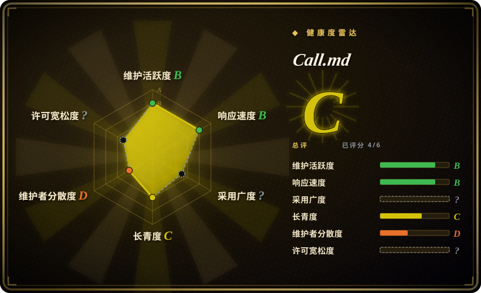
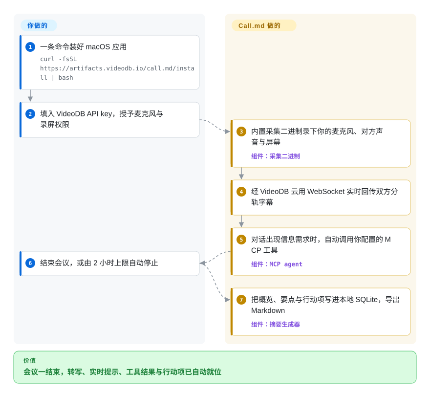

# Call.md

刚结束一场两小时的谈判，你说不出谁答应了什么——开会时没人腾得出手做记录。Call.md 是一个 macOS 桌面会议副驾驶：录下你的麦克风、对方的系统声音与屏幕，实时回传双方分轨字幕，会中自动调用你配置的 MCP 工具，会后自动生成概览、要点与行动项；代价是录制与转写全走 VideoDB 云端 API，原始音频会离开你的机器。

## 何时使用

你是整天在 Mac 上背靠背开视频会的创始人或销售工程师，痛点在会后：离开会议只记得气氛，不记得承诺，把转写稿重新整理成笔记这一步永远不会发生。你选 Call.md，是因为它把整条会议循环——转写缓冲、说话占比与语速指标、提示引擎、摘要生成、webhook 推送——都写成可读可改的 Electron 源码，而不是一个订阅制黑盒（Granola、Otter、Fireflies 全是闭源 SaaS）。真正拉开差距的是会中自动化：它的 MCP agent 盯着实时字幕，在对话出现信息需求时主动调用你自己接入的 MCP 服务（工单、CRM、内部文档），结果当场内联展示——现成记录工具做不到这一点。

如果你正要基于 VideoDB 的采集/转写 SDK 做产品，它也值得当成官方参考实现来读：这是该厂商的旗舰示例应用（docs.videodb.io），capture 会话、WebSocket 流式回传、insights 调用都按厂商意图接线，可以直接 fork 成你自己的会议产品。你接受的交换是：透明与 agent 自动化，换取对 VideoDB 云管道的硬依赖——每一个智能功能都走它的 API。

## 怎么用起来

点「New Meeting」后，应用会拉起 npm 包 `videodb` 里自带的闭源采集二进制（macOS 上是 `VideoDBCapture.app` 内的 `capture`，Windows 上是 `capture.exe`），同时录麦克风、系统声音与屏幕，并在你的 VideoDB 云 collection 里开一个 capture 会话；转写通过 WebSocket 以「你 vs 对方」两条分轨实时回流。其余全在你本机的 Electron 主进程里跑：转写缓冲喂给会话指标（说话占比、语速、独白检测）、限速的提示引擎、live-assist 建议，以及一个决定「此刻该调你哪个 MCP 服务」的 MCP agent（MCP 即 Model Context Protocol，让应用调用外部工具的插件标准）。不本地的是所有 AI 调用：辅助、意图检测、摘要都经 VideoDB 的 OpenAI 兼容代理发出（默认 `https://api.videodb.io`，模型 `ultra`；基址可在运行配置里改，但密钥必须是 VideoDB 的）。会议结束时——或触发内置的 2 小时上限自动停止——摘要生成器把叙述概览、分主题要点与行动项写进本地 SQLite，供导出 Markdown 或推送 n8n/Zapier webhook。所以「local-first」对笔记、历史、设置成立，对媒体不成立：原始录制是上传到云的。

<!-- flow-steps:begin (generated from flows/call-md.json by tools/flow_card.py — do not edit) -->

流程文字版

1. **你**：一条命令装好 macOS 应用 — `curl -fsSL https://artifacts.videodb.io/call.md/install | bash`
2. **你**：填入 VideoDB API key，授予麦克风与录屏权限
3. **Call.md**：内置采集二进制录下你的麦克风、对方声音与屏幕 — 组件：`采集二进制`
4. **Call.md**：经 VideoDB 云用 WebSocket 实时回传双方分轨字幕
5. **Call.md**：对话出现信息需求时，自动调用你配置的 MCP 工具 — 组件：`MCP agent`
6. **你**：结束会议，或由 2 小时上限自动停止
7. **Call.md**：把概览、要点与行动项写进本地 SQLite，导出 Markdown — 组件：`摘要生成器`

**价值**：会议一结束，转写、实时提示、工具结果与行动项已自动就位

<!-- flow-steps:end -->

## 何时不用

- **音频不能离开机器。** Call.md 的「local-first」只覆盖存储：采集进 VideoDB 云会话，每个 LLM 调用都走 `api.videodb.io`。机密会议请基于本地 ASR 自建——[OpenAI Whisper](../media-processing/video-audio/speech-and-subtitles/whisper.zh.md)——或评估自托管本地转写的开源记录器 Meetily（未收录，本批未添加）。
- **需要在 Linux 或 Windows ARM64 上录制。** SDK 只为 `darwin-arm64`、`darwin-x64`、`win32-x64` 发布采集二进制，其余平台的应用会直接拒绝开始录制（界面、MCP、历史仍可用）。要跨平台常开录制，走 Screenpipe（未收录，本批未添加）或 Windows x64 源码构建。
- **不接受一个「开源工具」还要注册厂商账号。** 注册必须有 VideoDB API key，连安装器都是 `curl … | bash` 拉厂商 artifacts。要 BYO 密钥的成熟体验，替代品是闭源的 Granola/Otter（非仓库）；要彻底无厂商，就得自建本地栈。
- **单场会超过 2 小时。** 活跃录制到上限自动停止，想改只能改源码里的 `MAX_RECORDING_DURATION_MS` 再重新构建。
- **你把长期押注放在社区接管上。** 默认分支里没有 `LICENSE` 文件、没有 git tag、没有 release、没有 `.github/` CI 目录，约 86% 的提交来自一名贡献者 [推断：按 contributors API]。这本质是厂商展示型应用：如果你的流程依赖它，尽早 fork。

## 横向对比

| 替代品 | 是否收录 | 我们的评价 | 取舍 |
|---|---|---|---|
| Granola | 非仓库 | 要零配置、打磨好的 AI 记录器和更强的说话人归因，选 Granola；要能读能改的 copilot 循环和会中调用自有 MCP 工具，选 Call.md。 | 闭源商业应用，无仓库，按形态出本索引之外：体验更成熟，但没有源码、没有 agent 自动化、订阅计费。 |
| Meetily | 未收录 | 决定性约束若是转写模型必须自托管跑，评估 Meetily；只有当你接受 VideoDB 云管道、又想要实时教练提示加 MCP 自动化时，Call.md 才占优。 | 同为开源会议记录器：Meetily 把音频留在本机，Call.md 用隐私换更丰富的会中智能——本批未添加。 |
| Screenpipe | 未收录 | 要 7×24 常录、事后检索「你看过说过的一切」，选 Screenpipe；要按会议显式录制并叠加 copilot，选 Call.md。 | 常开录制是另一套隐私面与运维负担；Call.md 只在会议期间录，但仅 macOS/Windows x64 且依赖云——本批未添加。 |
| [OpenAI Whisper](../media-processing/video-audio/speech-and-subtitles/whisper.zh.md) | 已收录 | 交付物只是转写稿时，自己跑 Whisper；Call.md 的价值在于把转写接进了 live-assist、指标与会后行动项。 | Whisper 是 Call.md 外包出去的那类引擎——模型与隐私归你，但整个应用要你自己建。 |
| VideoDB 平台 API | 非仓库 | 你要的是会议智能的产品形态而非桌面闭环时，直接对 VideoDB 的 capture/insights API 建模，而不是采用这个应用。 | 托管 API 是本应用承重的后端（README「How It Works」、`videodb.service.ts`）：选 Call.md 等于隐含选了它，价格与条款都在厂商侧。 |

## 技术栈

- **桌面壳：** Electron 42 + TypeScript 5.8，业务逻辑全在主进程，渲染层是 React 19 + Tailwind CSS + shadcn/ui。
- **内部 API：** tRPC 11 挂在 Hono 上，只绑 `127.0.0.1` 并只接受回环来源的 CORS；preload 桥接，`contextIsolation` 开启、无 Node 集成、Chromium sandbox 开启。
- **存储：** Drizzle ORM + `better-sqlite3`（本地 SQLite，是 API key 的唯一加密权威）；Zustand 状态管理；pino 日志。
- **AI/采集：** `videodb` npm SDK ^0.3.0（流式、capture 会话、`node_modules/videodb/bin` 下随包发布的闭源采集二进制）、指向 VideoDB 代理的 `openai` SDK、`@modelcontextprotocol/sdk` ^1.0.0（stdio 与 HTTP 两种传输）。
- **构建：** Vite 打包渲染层，`electron-builder` 出 mac/win/linux 产物，开发需 Node 22.12+/npm 10+；`tests/` 下是 `tsx --test` 单测。

## 依赖

- **厂商账号（必需）：** VideoDB API key（console.videodb.io）——转写、insights 与全部 LLM 调用都路由到托管 API，智能功能离不开网。
- **操作系统/平台：** 录制需 macOS 12+（Apple Silicon 或 Intel）；Windows x64 仅源码构建；Linux 除录制外全功能可跑。需授予麦克风与屏幕录制权限（新版 macOS 叫「屏幕与系统音频录制」）。
- **原生件：** 随包的闭源采集二进制与 `better-sqlite3` 预编译必须打进产品，构建脚本会校验两者。
- **可选集成：** Google Calendar OAuth、你自己的 MCP 服务、n8n/Zapier/CRM 的 webhook 端点。
- [未验证：依赖厂商账号体系] VideoDB 免费额度的边界与是否有功能被配额门控，未实测。

## 运维难度

**用起来低，维护起来中。** 作为使用者：一条 curl 安装命令、一个 key、两个系统权限；数据收在 Application Support 下的单个 SQLite 文件里，升级自动迁移。作为运维者：没有可自托管的后端——你依赖 VideoDB 的可用性——而若要自行重建，Electron 原生模块要 `npm run rebuild`、macOS 要自己签名公证，且仓库不发布 tag 与 CI，复现出厂 DMG 的担子在你 [推断：2026-09 时仓库树内无 `.github/`，无任何 release]。

## 健康度与可持续性

- **维护（2026-09-28）。** 活跃但年轻：2026-02-25 建仓（约 7 个月），最后推送 2026-08-19（验证时约 5.5 周前）。issue 响应是真实的：4 月的安全审计（issue #27）以加固 PR（#33，2026-08-19 合并）收尾，验证时开放 issue 仅 2 个。从未发过 git tag 或 GitHub release，v1.0.4 只存在于 `package.json`。
- **治理/巴士系数。** 高风险：全部 4 名贡献者，第一名（`omgate234`）占约 94 次贡献中的 81 次（约 86%）[推断：contributors API]。树内无 CODEOWNERS、无 CONTRIBUTING、无 CI 工作流，安全漏洞走 `support@videodb.io` 私报。
- **背靠与年龄/Lindy。** 它是 VideoDB（Organization 账号，videodb.io——一家视频 AI API 公司）约 12 个仓库中的旗舰展示应用，其中多个仓库 2026-09 仍在更新，厂商活着；但 7 个月的应用龄按 Lindy 先验是**弱信号**，且路线图服务于其 API 的营销 [推断]。
- **采用度。** 约 1.5k stars、168 forks、开放 issue 2（2026-09-28）；它所依赖的 npm `videodb` SDK 仍在发版（0.3.2，2026-09-03）。1.5k stars 却只有 5 个 watchers，比例反常，增长渠道未核 [未验证]。
- **风险信号。** MIT 仅在 `package.json` 与 README 徽章中声明，默认分支无 `LICENSE` 文件；安装器与 DMG 经 `curl | bash` 从厂商基础设施下发；曾被公开审计的凭据存储缺陷（issue #27）在 2026-08 加固中修复，意味着 8 月前的构建比 README 当前描述更差 [推断：按 issue/PR 时间线]；结构性风险是对厂商的全面锁定。

## 存疑（未验证）

- [未验证：仓库树中无 LICENSE 文件] MIT 许可只出现在 `package.json` 与 README 徽章；截至 2026-09-28 默认分支没有 `LICENSE` 文件，法律授权在文件提交前无法确认。
- [未验证：缺复现环境] live-assist 质量、提示引擎行为与转写语言覆盖面是厂商自述功能，未独立实测；issue #25 证实非英语语言支持取决于 VideoDB 后端。
- [未验证：依赖厂商账号体系] VideoDB 免费层限额、定价及是否有功能被配额门控，未测试。
- [未验证：无发布记录可对照] 「v1.0.4」无 tag、无 release，出厂二进制与该代码版本的一致性无法核对（仓库内 install 脚本仍指向 `VERSION="1.0.0"`）。
- [推断：按 contributors API] 约 86% 的单一贡献者占比来自 contributors 统计，可能低估合并者的实际工作量。
- [推断：按 issue #27 与 PR #33 时间线] 「2026-08 前的构建凭据存储更差」由公开审计 issue 与加固 PR 的先后推得，未对具体历史版本验证。
