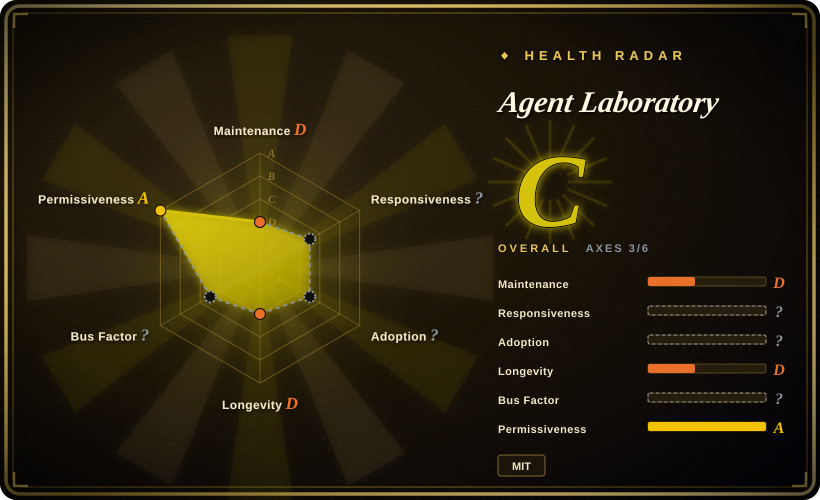
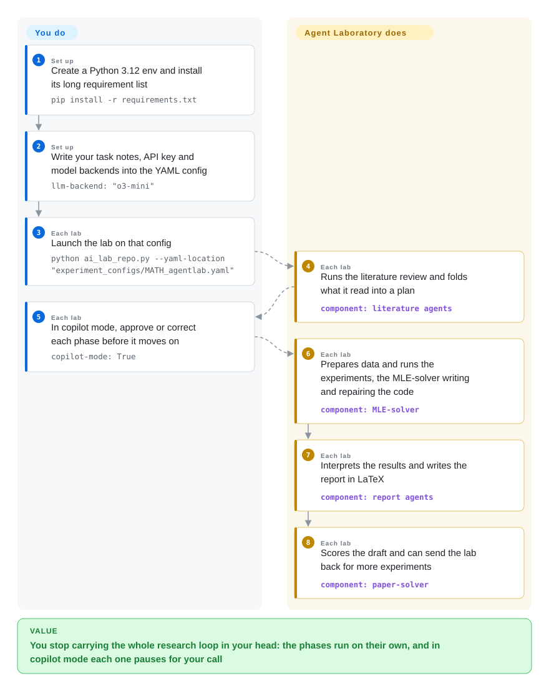

# Agent Laboratory

You have the idea; what surrounds it — the literature sweep, the plan, the data prep, the experiments, the plots, the report — is weeks of context switching before anything is written down. Agent Laboratory hands those stages to role-played LLM agents that run the research pipeline for you, with an optional copilot mode that stops at every phase and waits for your call.

## When to use

You are a researcher (or a small group) who wants to be the one deciding *what* is studied, not the one writing the glue: you have a topic or a concrete idea, you know what compute and models are available, and you would rather review a phase than do it. You write those facts into a YAML config — model backend, API key, how many papers the literature review should read, how many labs to run, and per-phase notes about your GPUs and your style — and the lab walks literature review → plan formulation → data preparation → running experiments → results interpretation → report writing → report refinement. Turn copilot mode on and each phase pauses for your approval, which is the honest way to use it: the agents write and repair code through the bundled MLE-solver, so you want to see the plan before it spends your API budget.

It is the most steerable of the autonomous-research pipelines: cheaper to reason about than [The AI Scientist](ai-scientist.md) because you approve each phase instead of reading a finished PDF, MIT-licensed where that one is not, and it carries checkpoints you can resume from plus an AgentRxiv mode where labs upload and build on each other's papers. Pick it over [OpenResearch](../agent-frameworks/coding-agents/orchestration-and-review/openresearch.md) when you do not want to bring your own coding agent, supply a run command, or think about experiment lineage — and accept in exchange that you get no git-tracked experiment tree and no compute routing. The deciding tradeoff: a role-based lab gives you a research workflow out of the box, but its agents own the code they write on your behalf.

## How it works

The repository is a fixed cast of LLM roles (a PhD student, a postdoc, an ML engineer, a professor) driven from `ai_lab_repo.py`, with the phase list hard-coded: literature review, plan formulation, data preparation, running experiments, results interpretation, report writing, then report refinement. The roles are given tools rather than freedom: an arXiv search tool (`SUMMARY` for semantically similar papers, `FULL_TEXT` for an id), Hugging Face and Python execution, Semantic Scholar for references, and LaTeX for the report; the MLE-solver interprets the ML engineer's commands while writing and repairing experiment code, and the paper-solver both searches for related work and scores the draft, which is what can send the lab back for another round of experiments. Each phase writes state into the run's checkpoints, and every phase ends with the configurable copilot pause. What stays yours: the topic, the models and keys, the compute notes, the phase approvals, and the decision to stop. What it takes over: reading the literature, planning, writing and repairing the experiment code, drawing the figures, and producing the report — with the paper written in whatever language you asked for.

<!-- flow-steps:begin (generated from flows/agent-laboratory.json by tools/flow_card.py — do not edit) -->

Text version of the flow

1. **You** (Set up): Create a Python 3.12 env and install its long requirement list — `pip install -r requirements.txt`
2. **You** (Set up): Write your task notes, API key and model backends into the YAML config — `llm-backend: "o3-mini"`
3. **You** (Each lab): Launch the lab on that config — `python ai_lab_repo.py --yaml-location "experiment_configs/MATH_agentlab.yaml"`
4. **Agent Laboratory** (Each lab): Runs the literature review and folds what it read into a plan — component: `literature agents`
5. **You** (Each lab): In copilot mode, approve or correct each phase before it moves on — `copilot-mode: True`
6. **Agent Laboratory** (Each lab): Prepares data and runs the experiments, the MLE-solver writing and repairing the code — component: `MLE-solver`
7. **Agent Laboratory** (Each lab): Interprets the results and writes the report in LaTeX — component: `report agents`
8. **Agent Laboratory** (Each lab): Scores the draft and can send the lab back for more experiments — component: `paper-solver`

**Value**: You stop carrying the whole research loop in your head: the phases run on their own, and in copilot mode each one pauses for your call

<!-- flow-steps:end -->

## When NOT to use

- **You need code that is maintained or a security posture you can defend.** There has been no commit since 2025-08-20 (that one a README edit; the last code change is 2025-03-27) with ~61 open issues, and on 2026-09-20 someone opened a public "security vulnerability disclosure request" naming CVE-2026-35772 that has drawn no maintainer reply. The bundled AgentRxiv web app is a Flask service with a placeholder `SECRET_KEY` in the source. If you need a live project, use [OpenResearch](../agent-frameworks/coding-agents/orchestration-and-review/openresearch.md), because an unmaintained lab that executes generated code is a liability you keep paying for.
- **You need every change traceable to a commit and a run.** The lab writes and repairs its own experiment code inside the run; there is no branch per idea and no per-run code snapshot, so "which code produced this number" is answered by reading the logs, not by git. Use [OpenResearch](../agent-frameworks/coding-agents/orchestration-and-review/openresearch.md) when that lineage is the point, because its experiment tree exists exactly to answer that question.
- **Your work does not fit a benchmark-shaped loop.** The tools are arXiv + Hugging Face + Python + LaTeX, the examples and solvers are aimed at ML-benchmark tasks (MATH, MLE-bench-style, PaperBench-style), and the notes tip tells you to hand it baseline numbers and sample evaluation code. For a non-ML domain, or a pipeline with manual data preparation, either write a template for [The AI Scientist](ai-scientist.md) or drive your own agent in [OpenResearch](../agent-frameworks/coding-agents/orchestration-and-review/openresearch.md), because you would be fighting the role assumptions here.
- **You need broad model support or open weights.** The README lists OpenAI (o1, o1-preview, o1-mini, gpt-4o, o3-mini) and DeepSeek backends only, expects a paid frontier model for good results, and its examples were written against o1-era models. With local weights or a different vendor, use [OpenResearch](../agent-frameworks/coding-agents/orchestration-and-review/openresearch.md) — any harness you already run, including a local model server — or talk to a plain coding agent.
- **You want a small, cheap, legible loop.** This is a heavy install (torch, transformers, spacy, datasets and more) and each lab burns many LLM calls across phases, multiplying with `parallel-labs`. If a single file and a fixed budget is enough, use [autoresearch](autoresearch.md); if you only want the literature half, use a deep-research agent such as [GPT Researcher](../deep-research/gpt-researcher.md).
- **You need the report to be reliably complete.** Open issues describe sections that come out missing and long stalls during a phase — consistent with a multi-phase agent loop with retries — so budget for supervising and re-running rather than trusting a first pass. [未验证]

## Comparison

| Alternative | In index | Our verdict | Tradeoff |
|---|---|---|---|
| [OpenResearch](../agent-frameworks/coding-agents/orchestration-and-review/openresearch.md) | ✅ | Choose OpenResearch when you want to keep your own agent and get git-tracked experiment lineage and multi-backend compute; choose Agent Laboratory when you want the research workflow itself handed over and are willing to approve each phase. | OpenResearch gives lineage, isolation and compute routing but no research scaffolding and no agenda; Agent Laboratory gives the phases and the roles but leaves code traceability and compute routing to you. |
| [The AI Scientist](ai-scientist.md) | ✅ | Choose The AI Scientist for the autonomous one-shot pipeline on one of its templates; choose Agent Laboratory when you want per-phase approval and MIT terms. | The AI Scientist is more cited and produces a compiled paper without you, under a restrictive licence and a template-bound scope; Agent Laboratory is steerable and permissively licensed but narrower in model support and equally quiet. |
| [autoresearch](autoresearch.md) | ✅ | Choose autoresearch when one GPU, one metric and a 5-minute fixed budget is the whole loop; choose Agent Laboratory when the deliverable is a written report and not a training diff. | autoresearch is a single-file scaffold with no literature phase, no report and no roles, but it is trivial to read and has no heavy dependency surface; Agent Laboratory scripts the whole workflow at the cost of a large install and model spend. |
| [GPT Researcher](../deep-research/gpt-researcher.md) | ✅ | Choose GPT Researcher when only the literature-and-synthesis half is needed; choose Agent Laboratory when the literature has to feed actual experiments and a report. | GPT Researcher owns the search→read→synthesize loop and stops there; Agent Laboratory continues into code, experiments and LaTeX but does the literature phase less deeply. |
| [OpenHands](../agent-frameworks/coding-agents/orchestration-and-review/openhands.md) | ✅ | Choose OpenHands when you would rather give a general coding agent a sandboxed machine and a task than adopt a research-lab shape; choose Agent Laboratory when the phase structure is the value. | OpenHands is a maintained platform with containment and no research opinion; Agent Laboratory is an opinionated research workflow with no platform and no upkeep. |

## Tech stack

- **Python**, README-recommended 3.12 in a venv, with a heavy `requirements.txt` (torch 2.5, transformers, datasets, spacy, scikit-learn, seaborn, arxiv, semanticscholar and more).
- **Role agents** are defined in `agents.py` and orchestrated by `ai_lab_repo.py`; `inference.py` wraps the model backends (OpenAI, DeepSeek, with Anthropic and Google client libraries also declared).
- **Two command interpreters** do the work: `mlesolver.py` translates the ML engineer's commands into file edits and executions with a repair loop, and `papersolver.py` supplies the arXiv `SUMMARY` / `FULL_TEXT` tools plus referee scoring.
- **Configuration** is YAML (`experiment_configs/*.yaml`) with a `task-notes` block per phase; run state is checkpointed so a lab can resume with `load-existing`.
- **AgentRxiv** ships as a Flask + SQLite web app (`app.py`) with a sentence-transformers similarity index over uploaded PDFs, so labs can upload and retrieve each other's papers.
- **LaTeX** is optional: `--compile-latex "false"` skips PDF compilation where `pdflatex` is unavailable.

## Dependencies

- **Python 3.12** (recommended) with the pinned requirement set — a large venv, several GB with torch and spacy models.
- **Model API access:** an OpenAI key (the YAML carries the key inline) or DeepSeek; the README's supported list is o1 / o1-preview / o1-mini / gpt-4o / o3-mini plus `deepseek-chat`, chosen with `--llm-backend`.
- **Optional `pdflatex`** if you want compiled PDFs; without it, keep `compile-latex` off.
- **Literature access** over the network (arXiv, Semantic Scholar, Hugging Face datasets) — the arXiv tools are the lab's only way to read prior work.
- **Not bundled:** datasets, baselines or evaluation code — the notes tip tells you to hand the lab baseline numbers and sample loading code in the config, and the authors note that quality tracks how much you write there.

## Ops difficulty

**Medium — easy to start, awkward to keep alive.** Setup is a virtualenv plus a long install, and one command runs a lab; the burden is everything around it: writing task notes detailed enough that the agents do not wander, watching phases for stalls and retrying them, and paying for a multi-phase LLM loop where cost scales with how many labs and papers you ask for. Checkpoints make resuming cheap, and there is no service or release to maintain — but there is also no one upstream fixing bugs, and the lab executes code it writes, so the sandbox and the API spend are both yours to own.

## Health & viability

- **Maintenance — effectively stopped (as of 2026-09-22).** No commits since 2025-08-20, and that was a README edit; the last code change was 2025-03-27. ~61 open issues remain, and the newest activity of note is an unresponded security-disclosure request (#118, 2026-09-20). The radar cannot score responsiveness or governance here (no first-response sample; contributions unattributable in its window), which is itself consistent with a repo nobody is tending. Judge it as a paper artifact with a public issue tracker, not a maintained tool. [推断]
- **Governance / bus factor — one author, personal account.** The repository is owned by a User (not an organization), the top contributor has ~13 commits against ~2 for the next, and there is no CONTRIBUTING, SECURITY or GOVERNANCE file — the MIT LICENSE is the only governance artifact. [推断]
- **Backing & longevity — academic, not institutional.** It comes from a published paper (arXiv 2501.04227) with authors from several labs and a `@jhu.edu` contact, which gives it provenance but no organization committed to upkeep; the AgentRxiv line was announced in March 2025 and appears frozen with the rest of the repo. [推断]
- **Age & Lindy — old enough to judge, and the judgement is negative.** Created 2025-01-08 (~20 months) and quiet for over a year, so the Lindy prior provides no rescue: this is the "long-abandoned" failure case, and its role definitions are written for o1-era models. [推断]
- **Adoption — attention without upkeep.** ~5.9k stars and ~800 forks, plus README translations in roughly seventeen languages (community contributions) — a signal of interest in the *idea* of an agent lab rather than of a dependency anyone maintains. The radar leaves this axis ungraded (no usable registry signal), so treat the counts as attention only. [未验证]
- **Risk flags — unpatched disclosure and a placeholder secret.** An open 2026-09 security-disclosure request with no maintainer response, a Flask app checking in `SECRET_KEY = 'your-secret-key'`, and agents that execute code they write. The MIT licence itself is clean, and there is no relicensing history. [未验证]

## Caveats (unverified)

- [未验证] Star/fork counts (~5.9k stars, ~800 forks), commit and last-push dates are read from the GitHub API on 2026-09-22 and are date-sensitive.
- [未验证] Issue #118 (2026-09-20, still open, no maintainer reply) *claims* a vulnerability under CVE-2026-35772. That identifier returned no record from the NVD API and no GitHub advisory when I queried both on 2026-09-22, so the specific CVE claim is unconfirmed; what is verified is that the disclosure sits unanswered on a repo with no code changes since 2025-03-27.
- [未验证] "Sections come out missing" and "phases stall" are drawn from open issue titles (#103, #111), not from reproducing a run — the behaviour may depend on model, config and version.
- [未验证] The cost and quality claims (stronger models give better research, cost/benefit balancing) are the README's guidance, not measured here; the per-lab spend was not estimated.
- [推断] The AgentRxiv line being frozen is inferred from the repository's overall commit silence; I did not check whether AgentRxiv is served from elsewhere.
- [未验证] The MLE-solver's repair loop and the paper-solver's referee scoring are described from reading `mlesolver.py`, `papersolver.py` and `ai_lab_repo.py`; I did not run a lab end to end.
- [未验证] "Translations in roughly seventeen languages" is a count of files under `readme/`; whether each is current with the English README was not checked.
- [推断] The affiliation reading (academic provenance, several labs, no institutional owner of the repo) comes from the citation list and the contact address, not from a governance statement.
