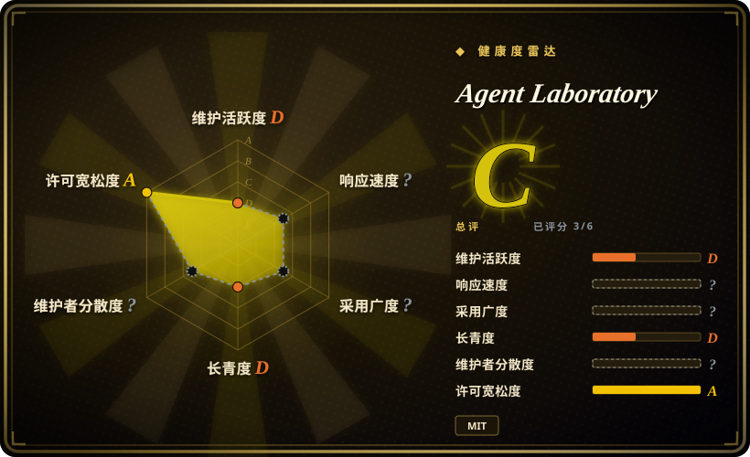
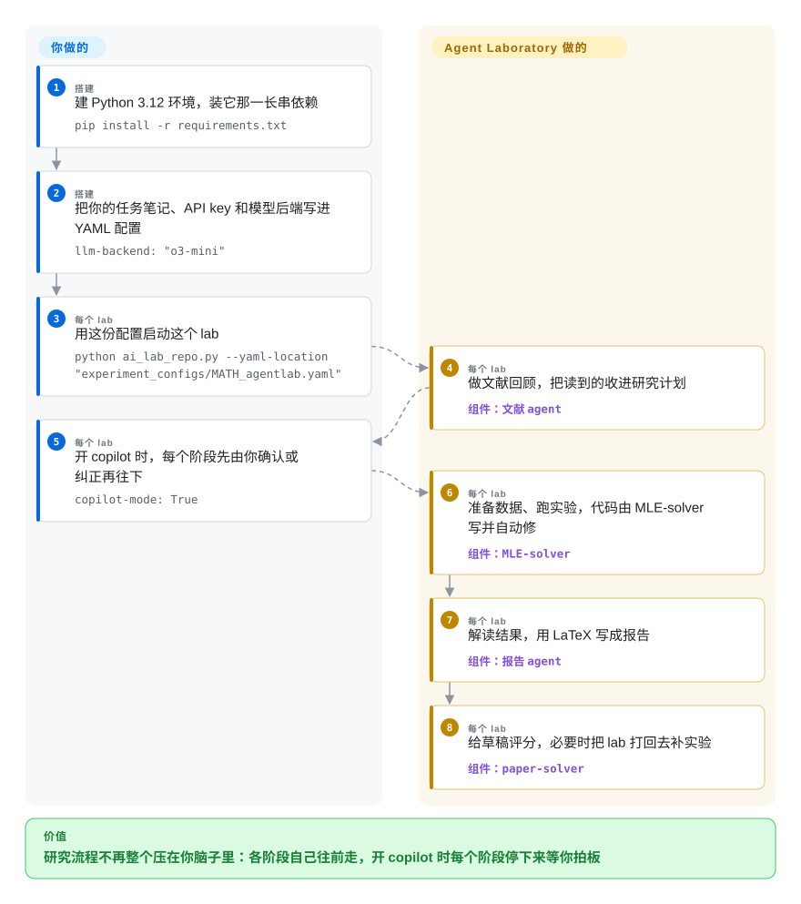

# Agent Laboratory

想法你有，但想法周围那一圈——扫文献、定计划、备数据、跑实验、画图、写报告——是几周的上下文切换，最后才落下第一行字。Agent Laboratory 把这些阶段交给一组扮演角色的 LLM agent 去跑，并提供一个可选的 copilot 模式：每个阶段都停下来等你拍板。

## 何时使用

你是做研究的人（或一个小团队），想让「研究什么」由你定，而不是由你写那些胶水代码：你有一个题目或具体想法，清楚自己有什么算力和模型，也更愿意审一个阶段而不是亲手做。你把这些事实写进一份 YAML 配置——模型后端、API key、文献回顾读几篇、同时跑几个 lab，以及按阶段给你的 GPU 和风格写备注——lab 就按文献回顾、计划制定、数据准备、跑实验、结果解读、报告写作、报告精修往下走。把 copilot 打开，每个阶段都会停下来等你确认，这也是它诚实的用法：agent 是通过内置的 MLE-solver 自己写并修实验代码的，所以在它花掉你的 API 预算之前，你最好先看看计划。

在所有自动科研流水线里，它是最可干预的一个：比 [The AI Scientist](ai-scientist.zh.md) 更容易想清楚，因为你逐阶段确认，而不是最后读一份 PDF；它还是 MIT，而那一位不是；它带你可续跑的 checkpoint，还有一个 AgentRxiv 模式，让各个 lab 上传并接着别人的论文往下做。相比 [OpenResearch](../agent-frameworks/coding-agents/orchestration-and-review/openresearch.zh.md)，它的好处是你不用自带 coding agent、不用写运行命令、也不用想实验血统——代价是没有 git 跟踪的实验树、也没有算力路由。要付的代价很明确：角色化的实验室开箱就给你一套研究流程，但替你写代码的是它的 agent，代码归属你得自己接手。

## 怎么用起来

这个仓库是一组固定的 LLM 角色（博士生、博士后、ML 工程师、教授），由 `ai_lab_repo.py` 驱动，阶段列表写死在代码里：文献回顾、计划制定、数据准备、跑实验、结果解读、报告写作、报告精修。给角色的不是自由，而是工具：一个 arXiv 搜索工具（`SUMMARY` 找语义相近的论文，`FULL_TEXT` 按 id 取全文）、Hugging Face 与 Python 执行、Semantic Scholar 找引用、LaTeX 写报告；MLE-solver 解析 ML 工程师的命令并写出、修复实验代码，paper-solver 既检索相关工作也给草稿打分——正是它的评分能把 lab 打回去再做一轮实验。每个阶段都把状态写进 checkpoint，每个阶段末尾都有可配置的 copilot 暂停。留给你的：题目、模型与密钥、算力备注、逐阶段确认，以及什么时候停。它接过去的：读文献、定计划、写并修实验代码、画图、产出报告——而且报告用你指定的语言写。

<!-- flow-steps:begin (generated from flows/agent-laboratory.json by tools/flow_card.py — do not edit) -->

流程文字版

1. **你**（搭建）：建 Python 3.12 环境，装它那一长串依赖 — `pip install -r requirements.txt`
2. **你**（搭建）：把你的任务笔记、API key 和模型后端写进 YAML 配置 — `llm-backend: "o3-mini"`
3. **你**（每个 lab）：用这份配置启动这个 lab — `python ai_lab_repo.py --yaml-location "experiment_configs/MATH_agentlab.yaml"`
4. **Agent Laboratory**（每个 lab）：做文献回顾，把读到的收进研究计划 — 组件：`文献 agent`
5. **你**（每个 lab）：开 copilot 时，每个阶段先由你确认或纠正再往下 — `copilot-mode: True`
6. **Agent Laboratory**（每个 lab）：准备数据、跑实验，代码由 MLE-solver 写并自动修 — 组件：`MLE-solver`
7. **Agent Laboratory**（每个 lab）：解读结果，用 LaTeX 写成报告 — 组件：`报告 agent`
8. **Agent Laboratory**（每个 lab）：给草稿评分，必要时把 lab 打回去补实验 — 组件：`paper-solver`

**价值**：研究流程不再整个压在你脑子里：各阶段自己往前走，开 copilot 时每个阶段停下来等你拍板

<!-- flow-steps:end -->

## 何时不用

- **你需要还在维护的代码，或者一个你能辩护的安全姿态。** 自 2025-08-20 起没有任何提交（那一笔还是改 README，最后一次改代码是 2025-03-27），约 61 个 open issue，并且 2026-09-20 有人在公开 issue 里提出安全漏洞披露请求、点名 CVE-2026-35772，至今没有维护者回复。随仓库附带的 AgentRxiv 是一个 Flask 服务，源码里 `SECRET_KEY` 还是占位值。需要一个活着的项目就用 [OpenResearch](../agent-frameworks/coding-agents/orchestration-and-review/openresearch.zh.md)，因为一个没人维护、又会执行生成代码的 lab，是要持续付代价的负债。
- **你需要每一处改动都能对回某次提交和某次 run。** lab 在运行过程中自己写并修实验代码，没有「一个想法一条分支」，也没有按 run 的代码快照，所以「这个数字来自哪份代码」只能靠翻日志回答，而不是靠 git。当这份血统本身就是目的时，用 [OpenResearch](../agent-frameworks/coding-agents/orchestration-and-review/openresearch.zh.md)，因为它的实验树存在的意义正是回答这个问题。
- **你的工作不是基准测试那种形状。** 它给的工具是 arXiv 加 Hugging Face 加 Python 加 LaTeX，示例与 solver 都瞄准 ML 基准任务（MATH、MLE-bench 式、PaperBench 式），README 的备注技巧也要求你把基线数字和示例评估代码交给它。非 ML 领域、或者需要手工备数据的流程，要么给 [The AI Scientist](ai-scientist.zh.md) 写个模板，要么在 [OpenResearch](../agent-frameworks/coding-agents/orchestration-and-review/openresearch.zh.md) 里自己驱动 agent，否则你是在跟这里的角色假设较劲。
- **你需要广泛的模型支持或者开放权重。** README 列出的后端只有 OpenAI（o1、o1-preview、o1-mini、gpt-4o、o3-mini）和 DeepSeek，要好结果还得是付费的前沿模型，示例也是按 o1 时代的模型写的。用本地权重或别的厂商，就用 [OpenResearch](../agent-frameworks/coding-agents/orchestration-and-review/openresearch.zh.md)——你已经有的任何 harness，包括本地模型服务——或者直接跟一个普通 coding agent 对话。
- **你想要一个又小又省又看得懂的闭环。** 这是一个很重的安装（torch、transformers、spacy、datasets 等等），而且每个 lab 会在各阶段烧掉大量 LLM 调用，开 `parallel-labs` 还会翻倍。一个文件加固定预算够用的话，用 [autoresearch](autoresearch.zh.md)；只需要文献那一半，用 [GPT Researcher](../deep-research/gpt-researcher.zh.md) 这类 deep research agent。
- **你需要报告可靠地写完整。** 公开 issue 里有「某些章节总是缺」和阶段长时间卡住的说法——这跟一个带重试的多阶段 agent 循环相符——所以要预留监督和重跑的预算，别指望一遍过。[未验证]

## 横向对比

| 替代品 | 是否收录 | 我们的评价 | 取舍 |
|---|---|---|---|
| [OpenResearch](../agent-frameworks/coding-agents/orchestration-and-review/openresearch.zh.md) | ✅ | 如果你要保留自己的 agent、并拿到 git 跟踪的实验血统和多后端算力，选 OpenResearch；如果你想把研究流程本身交出去、并愿意逐阶段点头，选 Agent Laboratory。 | OpenResearch 给血统、隔离和算力路由，但不给科研脚手架也不给议程；Agent Laboratory 给阶段和角色，但代码可追溯性与算力路由得你自己补。 |
| [The AI Scientist](ai-scientist.zh.md) | ✅ | 想用它的某个模板一次性自主跑完，选 The AI Scientist；想逐阶段确认、并用 MIT 条款，选 Agent Laboratory。 | The AI Scientist 引用更多、不用你参与就能产出编译好的论文，但许可证受限、范围绑死模板；Agent Laboratory 可干预、许可宽松，但模型支持更窄、停更时间一样长。 |
| [autoresearch](autoresearch.zh.md) | ✅ | 如果一块 GPU、一个指标加 5 分钟固定预算就是全部闭环，选 autoresearch；如果交付物是一份写好的报告而不是一个训练改动，选 Agent Laboratory。 | autoresearch 是单文件脚手架，没有文献阶段、没有报告、没有角色，但读起来毫无负担、依赖面也小；Agent Laboratory 把整套流程脚本化，代价是庞大的安装和模型开销。 |
| [GPT Researcher](../deep-research/gpt-researcher.zh.md) | ✅ | 只需要「文献加综合」那一半时选 GPT Researcher；文献必须喂给真正的实验和报告时选 Agent Laboratory。 | GPT Researcher 拥有搜索到综合这整圈、也就到此为止；Agent Laboratory 继续走到代码、实验和 LaTeX，但文献阶段做得更浅。 |
| [OpenHands](../agent-frameworks/coding-agents/orchestration-and-review/openhands.zh.md) | ✅ | 如果你更愿意给一个通用 coding agent 一台沙箱机器和一个任务，而不是采用「研究实验室」这个形状，选 OpenHands；如果阶段结构本身就是价值，选 Agent Laboratory。 | OpenHands 是有维护的平台，带隔离、但不带科研观点；Agent Laboratory 是有观点的研究流程，没有平台、也没人维护。 |

## 技术栈

- **Python**，README 建议在 venv 里用 3.12，配一份很重的 `requirements.txt`（torch 2.5、transformers、datasets、spacy、scikit-learn、seaborn、arxiv、semanticscholar 等）。
- **角色 agent** 定义在 `agents.py`，由 `ai_lab_repo.py` 编排；`inference.py` 封装模型后端（OpenAI、DeepSeek，依赖里也声明了 Anthropic 与 Google 的客户端库）。
- **两个命令解释器**干实际活：`mlesolver.py` 把 ML 工程师的命令翻译成文件改动与执行，并带修复循环；`papersolver.py` 提供 arXiv 的 `SUMMARY`／`FULL_TEXT` 工具和审稿打分。
- **配置**是 YAML（`experiment_configs/*.yaml`），每个阶段有一段 `task-notes`；运行状态会 checkpoint，可以带 `load-existing` 续跑。
- **AgentRxiv** 以 Flask 加 SQLite 的 Web 应用形式附带（`app.py`），用 sentence-transformers 给上传的 PDF 建相似度索引，让各 lab 互相上传和检索论文。
- **LaTeX 可选**：没有 `pdflatex` 时用 `--compile-latex "false"` 跳过 PDF 编译。

## 依赖

- **Python 3.12**（建议）加固定版本的依赖集——一个很大的 venv，装完 torch 与 spacy 模型后有好几 GB。
- **模型 API：** 一个 OpenAI key（YAML 里直接写 key）或 DeepSeek；README 支持列表是 o1／o1-preview／o1-mini／gpt-4o／o3-mini 加 `deepseek-chat`，用 `--llm-backend` 选择。
- **可选的 `pdflatex`**：想要编译好的 PDF 就需要，否则把 `compile-latex` 关掉。
- **联网取文献**（arXiv、Semantic Scholar、Hugging Face 数据集）——arXiv 工具是 lab 读前人工作的唯一途径。
- **不含：** 数据集、基线、评估代码——备注技巧要求你把基线数字和示例加载代码写进配置，作者也说明质量取决于你在那儿写了多少。

## 运维难度

**中等——开始容易，维持别扭。** 起手是一个 virtualenv 加一次长时间安装，一条命令就能跑一个 lab；负担都在周边：任务备注要写得足够细、否则 agent 会跑偏，阶段要盯着是否卡住并重跑，以及为一个多阶段 LLM 循环付钱——成本随你要几个 lab、几篇论文而放大。checkpoint 让续跑很便宜，也没有服务或版本要维护——但上游同样没人修 bug，而且 lab 会执行自己写的代码，所以沙箱和 API 开销都得你自己扛。

## 健康度与可持续性

- **维护：实际上已停（截至 2026-09-22）。** 自 2025-08-20 起没有提交，那一笔还是改 README；最后一次改代码是 2025-03-27。约 61 个 open issue 挂着，最新的动静是一条无人回应的安全披露请求（#118，2026-09-20）。雷达在这里给不出响应速度和治理（没有首次响应样本；窗口内贡献无法归因），这本身就符合「没人照看」的仓库。把它当作一份带公开 issue 区的论文产物，而不是在维护的工具。[推断]
- **治理与 bus factor：一位作者，个人账号。** 仓库属于个人（User）而不是组织，首位贡献者约 13 次提交，第二位约 2 次；树里没有 CONTRIBUTING、SECURITY、GOVERNANCE，唯一的治理文件是 MIT 的 LICENSE。[推断]
- **背书与寿命：学术出身，没有机构接手。** 它来自一篇已发表论文（arXiv 2501.04227），作者来自多个实验室，联系邮箱是 `@jhu.edu`，这给了它出处，但没有任何组织承诺维护；AgentRxiv 这条线 2025 年 3 月宣布，之后看起来跟仓库其余部分一起冻结了。[推断]
- **年龄与 Lindy：够老，可以下判断，而判断是负面的。** 创建于 2025-01-08（约 20 个月），已经安静一年多，所以 Lindy 先验在这里救不了它：这正是「老而废弃」的那个失败面，而且它的角色定义是按 o1 时代的模型写的。[推断]
- **采用：有关注，没有维护。** 约 5.9k star、约 800 fork，README 还有大约十七种语言的翻译（社区贡献）——这更像是大家对「agent 实验室」这个**想法**感兴趣，而不是有人在依赖它。雷达对这一轴不给分（没有可用的注册表信号），所以只把这些数字当作注意力。[未验证]
- **风险标记：未处理的披露请求和占位密钥。** 一条 2026-09 的安全披露请求无人回应，Flask 应用里 `SECRET_KEY = 'your-secret-key'` 直接提交进了仓库，而且 agent 会执行自己写的代码。MIT 许可本身是干净的，也没有改授权历史。[未验证]

## 存疑（未验证）

- [未验证] star／fork 数（约 5.9k star、约 800 fork）、提交与最后推送日期取自 2026-09-22 的 GitHub API，对时间敏感。
- [未验证] issue #118（2026-09-20，仍开放、无维护者回复）**声称**存在编号 CVE-2026-35772 的漏洞。我在 2026-09-22 查询 NVD API 与 GitHub advisory 都查不到这条记录，所以该 CVE 主张未经确认；能确认的是这条披露挂在一个自 2025-03-27 起没有代码改动的仓库上、且无人回应。
- [未验证] 「某些章节缺失」和「阶段卡住」来自公开 issue 标题（#103、#111），不是复现出来的——实际行为可能随模型、配置和版本而变。
- [未验证] 成本与质量的说法（模型越强研究越好、要在性能与成本间权衡）是 README 的指导，不是这里测出来的；每个 lab 的花费也没有估算。
- [推断] AgentRxiv 这条线冻结了，是从整个仓库的提交静默推断的；我没有核查 AgentRxiv 是否在别处提供服务。
- [未验证] MLE-solver 的修复循环和 paper-solver 的审稿打分，是我读 `mlesolver.py`、`papersolver.py`、`ai_lab_repo.py` 后的描述；我没有端到端跑过一个 lab。
- [未验证] 「大约十七种语言的翻译」是 `readme/` 目录下的文件数；每一份是否与英文 README 同步没有核查。
- [推断] 关于出身的判断（学术背景、多实验室作者、仓库无机构所有）来自引用列表与联系邮箱，不是来自任何治理声明。
