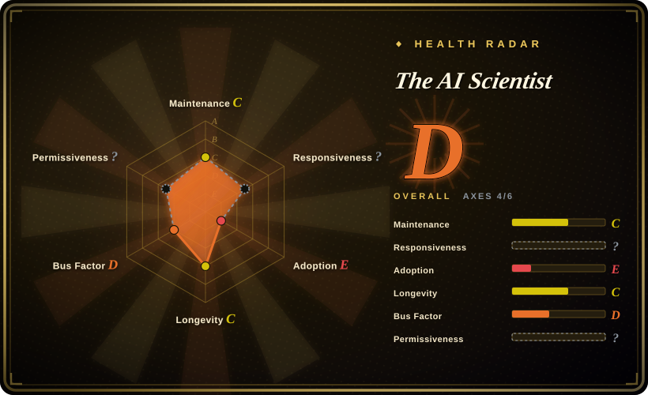
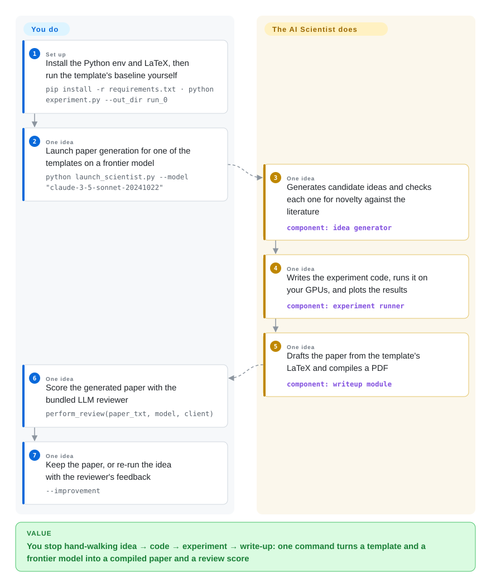

# The AI Scientist

Getting one honest experimental answer costs days before you learn anything: you read the related work, write and debug the experiment, plot it, then fight LaTeX and citations for a draft nobody asked for. The AI Scientist runs that whole loop unattended — it generates ideas, novelty-checks them against the literature, writes and executes the experiment code on your GPUs, and emits a compiled paper that a second LLM pass scores.

## When to use

You are the person who has to produce research output and you want to see how far the loop can run without you: not a literature summary, but an idea, the code that tests it, the plots, and a paper-shaped PDF. You have Linux, at least one NVIDIA GPU, a frontier-model API key, and a domain that fits one of the templates the repo maintains (nanoGPT, 2D diffusion, grokking) — or you are willing to write a template of your own by matching `experiment.py`, `plot.py`, `prompt.json`, `seed_ideas.json` and `latex/template.tex`.

Reach for it as the *reference implementation* of the fully automatic pipeline — this is the codebase behind the "AI Scientist" paper, so its three templates, its idea generator, and its LLM reviewer are the thing other projects are measured against. Pick it over [Agent Laboratory](agent-laboratory.md) when you want the autonomous one-shot pipeline that scores its own output with a reviewer rather than a role-played lab you approve phase by phase; pick it over [OpenResearch](../agent-frameworks/coding-agents/orchestration-and-review/openresearch.md) when you do not want to supply the research agenda, the run command, and the compute routing yourself. The deciding tradeoff: you hand over the choice of ideas and the writing, and in exchange you accept a template-bound, self-contained pipeline whose license now constrains what you may do with the papers.

## How it works

The repository is a pipeline of LLM passes over three per-domain *templates* — each template is a small trainable experiment with its own LaTeX skeleton, and it is the only place the domain knowledge lives. You pre-run that template's baseline yourself (`run_0`) so later runtimes on your hardware are comparable, then `launch_scientist.py` walks the stages: an idea generator proposes candidates and screens them for novelty against Semantic Scholar or OpenAlex; a code-editing pass (the repo depends on `aider-chat`) writes the experiment on top of the template; the experiment runs as a subprocess on your GPUs under a timeout, and a plotting pass turns its output into figures; a writeup pass assembles the paper in LaTeX from the template and compiles the PDF. A separate reviewer pass then reads the compiled text and returns a 1–10 score, weaknesses, and an accept/reject decision, and re-running with `--improvement` feeds that back. What stays yours: the template, the baseline, the model choice, the GPUs — and the judgement about whether a generated result means anything. What it takes over: idea generation, the code-run-plot loop, the LaTeX, and the first round of review.

<!-- flow-steps:begin (generated from flows/ai-scientist.json by tools/flow_card.py — do not edit) -->

Text version of the flow

1. **You** (Set up): Install the Python env and LaTeX, then run the template's baseline yourself — `pip install -r requirements.txt · python experiment.py --out_dir run_0`
2. **You** (One idea): Launch paper generation for one of the templates on a frontier model — `python launch_scientist.py --model "claude-3-5-sonnet-20241022"`
3. **The AI Scientist** (One idea): Generates candidate ideas and checks each one for novelty against the literature — component: `idea generator`
4. **The AI Scientist** (One idea): Writes the experiment code, runs it on your GPUs, and plots the results — component: `experiment runner`
5. **The AI Scientist** (One idea): Drafts the paper from the template's LaTeX and compiles a PDF — component: `writeup module`
6. **You** (One idea): Score the generated paper with the bundled LLM reviewer — `perform_review(paper_txt, model, client)`
7. **You** (One idea): Keep the paper, or re-run the idea with the reviewer's feedback — `--improvement`

**Value**: You stop hand-walking idea → code → experiment → write-up: one command turns a template and a frontier model into a compiled paper and a review score

<!-- flow-steps:end -->

## When NOT to use

- **You need to publish the output under your own terms.** The repo was Apache-2.0 until 2025-12-19, when it was re-licensed to *The AI Scientist Source Code License v1.0* (a Responsible-AI-style licence, not OSI-approved): it requires prominent machine-generation disclosure in any manuscript you generate or disseminate, forbids surveillance / undisclosed synthetic media / unsupervised diagnosis / criminal prediction uses, and requires those restrictions to be carried into downstream agreements. If you need permissive terms for anything you ship, use [Agent Laboratory](agent-laboratory.md) (MIT) or [OpenResearch](../agent-frameworks/coding-agents/orchestration-and-review/openresearch.md) (MIT) instead, because once generated papers are the deliverable the licence is the product constraint.
- **Your research question cannot be expressed as code in one of its templates.** The FAQ is explicit that this iteration is restricted to ideas expressible as code, and only three templates are maintained by the authors — everything else in `templates/` is community-contributed and unmaintained. If your domain is elsewhere, build the loop on a workspace instead: [OpenResearch](../agent-frameworks/coding-agents/orchestration-and-review/openresearch.md) with your own agent, because you would be authoring the template either way.
- **You need a maintained dependency, or a security posture you can defend.** The last push was 2025-12-19 and it *was* the licence change, so the code has been untouched for ~9 months with ~120 open issues — including an unaddressed shell-quoting report against `os.popen(f"chktex {writeup_file} …")` in `ai_scientist/perform_writeup.py`. Worse, executing model-written code is the design: the README's own caution names dangerous packages, web access and process spawning, and points you at the community Dockerfile to contain it. If you need a live project or a sandboxed runtime, use [OpenResearch](../agent-frameworks/coding-agents/orchestration-and-review/openresearch.md) or [OpenHands](../agent-frameworks/coding-agents/orchestration-and-review/openhands.md), because containment is a platform feature, not something this pipeline gives you.
- **You have no NVIDIA GPU or no frontier-model budget.** The code targets Linux + NVIDIA + CUDA, CPU-only machines are called infeasible for the templates, and the FAQ puts a paper at "typically less than $15" with Claude Sonnet 3.5 while warning that models weaker than GPT-4 class do not work. If you only need the literature side, use a deep-research agent such as [Local Deep Research](../deep-research/local-deep-research.md) and skip the experiment machinery entirely.
- **You want to steer each step.** This is autonomous by default — 50 ideas unless you say otherwise — and the interesting decisions are made by prompts inside the templates. Use [Agent Laboratory](agent-laboratory.md)'s copilot mode, or drive your own agent by hand in [OpenResearch](../agent-frameworks/coding-agents/orchestration-and-review/openresearch.md), because "let it run and read the PDF" and "I decide what to try next" are different tools.
- **You need a reproducible or peer-reviewable result.** Baseline runs must be re-done per machine for runtime comparisons, success rates are the paper's reported figures rather than a guarantee, and nothing here reproduces a published number. Treat the output as a draft to triage; if the number matters, reproduce it in your own harness.

## Comparison

| Alternative | In index | Our verdict | Tradeoff |
|---|---|---|---|
| [OpenResearch](../agent-frameworks/coding-agents/orchestration-and-review/openresearch.md) | ✅ | Choose OpenResearch when the agenda, the agent and the compute are yours and the missing layer is the experiment bookkeeping; choose The AI Scientist when you want the whole idea-to-paper loop executed without your input. | The AI Scientist supplies an agenda and a paper template but no experiment lineage, no multi-backend routing, and a restricted licence; OpenResearch supplies lineage and compute routing but no agenda and no paper writer. |
| [Agent Laboratory](agent-laboratory.md) | ✅ | Choose Agent Laboratory when you want the same research loop with per-phase human approval and MIT terms; choose The AI Scientist when you want the autonomous one-shot run and the bundled ICLR-style reviewer. | Agent Laboratory is steerable (copilot mode) and permissively licensed but its model support is narrow and it has been quiet even longer; The AI Scientist is the more cited reference whose licence now taxes publication. |
| [autoresearch](autoresearch.md) | ✅ | Choose autoresearch when you want the smallest possible loop — one file, one metric, one GPU, an agent mutating `train.py`; choose The AI Scientist when you want the full paper pipeline with idea generation and LaTeX. | autoresearch has no writeup, no literature phase and no licence problem, but also no reviewer pass and no templates beyond one training script; The AI Scientist is the complete, heavier, licence-encumbered system. |
| [OpenHands](../agent-frameworks/coding-agents/orchestration-and-review/openhands.md) | ✅ | Choose OpenHands when what you actually need is a sandboxed agent platform that can run coding tasks safely; choose The AI Scientist when the deliverable is a generated paper and not a fixed issue. | OpenHands gives you containment, self-hosting and a live project, but zero research scaffolding; The AI Scientist gives the research scaffolding inside a pipeline that executes model-written code by design. |
| AI-Scientist-v2 (SakanaAI/AI-Scientist-v2) | 未收录 | Check the successor first if you want the maintained line of this project: it moves the experiment phase to agentic tree search. | A separate repository (~7.2k stars, created 2025-04, same licence family, also last pushed 2025-12) rather than a branch; this page covers the v1 codebase whose templates and reviewer sit behind it. |

## Tech stack

- **Python under conda** (README pins Python 3.11), plus a LaTeX toolchain: the install does `apt-get install texlive-full`, and `pdflatex` is required for the writeup stage.
- **Models** are reached through `ai_scientist/llm.py`: OpenAI, Anthropic (direct, Bedrock, or Vertex), DeepSeek, OpenRouter, Gemini — and `aider-chat` is a declared dependency, which is the code-editing engine behind the experiment stage.
- **Research code** is PyTorch + CUDA; `requirements.txt` also carries `transformers`, `datasets`, `wandb`, `matplotlib`, `pypdf`.
- **Literature** comes from Semantic Scholar (`S2_API_KEY`, optional for throughput) or OpenAlex (no key, `--engine openalex`).
- **Templates** are the extension point: `experiment.py`, `plot.py`, `prompt.json`, `seed_ideas.json`, `latex/template.tex`. The maintained three are nanoGPT (credited to Karpathy's nanoGPT), 2D diffusion (tiny-diffusion and friends) and grokking; the rest are community PRs.
- **The reviewer** is reusable on its own: `ai_scientist/perform_review.py` plus the `review_iclr_bench/` analysis scripts were used to compare an LLM reviewer against ICLR decisions.

## Dependencies

- **Hardware:** Linux with an NVIDIA GPU and CUDA; the templates are not CPU-feasible, and per-machine baseline runs are expected before an experiment is judged.
- **Toolchain:** conda (or equivalent) with Python 3.11, `texlive-full` (a multi-GB install that the README warns takes a long time), and the pip set in `requirements.txt` including PyTorch.
- **Keys and spend:** a frontier-model API key (Anthropic / OpenAI / DeepSeek / OpenRouter / Google), optionally a Semantic Scholar key for higher throughput; author-reported cost is under ~$15 per generated paper, and `wandb` is in the dependency list if you enable it.
- **Optional:** Docker if you take the community `experimental/Dockerfile` route to contain model-written code.
- **Not bundled:** the ideas, the baseline numbers, or any guarantee that a run finishes — the README documents a per-template success rate instead.

## Ops difficulty

**Medium, with a long tail of babysitting.** The setup is a conda env plus a large LaTeX install, and the run itself is one command — but each template needs its own data preparation and a hand-run baseline, ideas run for hours on a GPU, and failures ("no PDF, no review") are an expected outcome the FAQ tells you to read the paper about rather than debug. There is no service to operate, no release to track, and no upgrade path; the operational risks sit elsewhere: model spend per idea, unbounded code execution from a pipeline nobody has patched since December 2025, and the disclosure duty the licence attaches to anything you generate.

## Health & viability

- **Maintenance — dormant (as of 2026-09-22).** Last push 2025-12-19, and that commit is the licence change; before it the repo's work was largely the 2024 paper release. No tagged releases exist, and there are ~120 open issues including a security-flavoured one (#251) filed 2026-08-04 with no maintainer reply. The radar cannot score responsiveness here at all (no qualifying first-response sample in its window), so dormancy is the reading. Read it as a published research artifact that is no longer being developed. [推断]
- **Governance / bus factor — one lab, one author on the critical path.** Sakana AI owns the repository as an organization, but contribution is heavily concentrated (`conglu1997` at ~66 commits, everything else in single digits) and there is no CONTRIBUTING or SECURITY file in the tree — the licence file is the only governance artifact. [推断]
- **Backing & longevity — well-funded lab, but not behind this repo's upkeep.** Sakana AI is a real research company with a visible track record of releases, which is why the *ideas* here are widely cited — but backing the lab is not the same as staffing the v1 repository, and the maintained line has moved to a separate successor repo. [推断]
- **Age & Lindy — the prior does not help here.** Created 2024-08-12 (~2.1 years), which is old enough to have been used and cited widely, but "old and inactive" is the failing half of the Lindy test: the templates target 2024-era models and the code has been frozen since the licence changed. Treat it as a pattern source, not a dependency. [推断]
- **Adoption — high attention, and the forks are the signal.** ~14.6k stars and ~2.0k forks, with generated example papers checked into `example_papers/`; for research code that fork ratio usually means people are copying and adapting rather than depending on it. The radar grades this axis **E** because it scores code dependents — its raw `dependent_repos_count` is 0 (no repository imports it) — which is the right reading for a pipeline nobody vendors, and a reminder that the stars are attention rather than dependency. [未验证]
- **Risk flags — the licence is the headline.** Apache-2.0 → *The AI Scientist Source Code License v1.0* on 2025-12-19, complete with a mandatory disclosure clause and a propagation clause; add unpatched shell-quoting in the writeup stage, uncontained execution of model-written code by design, and no releases to pin.

## Caveats (unverified)

- [未验证] Star/fork counts (~14.6k stars, ~2.0k forks) and the last-push date are read from the GitHub API on 2026-09-22 and are date-sensitive.
- [未验证] "Typically less than $15 per paper", the per-template success-rate claim, "we recommend only frontier models above GPT-4 class", and the model/benchmark choices are the README's and paper's own reported figures; I did not run the pipeline or reproduce a paper.
- [未验证] The re-licence facts come from the LICENSE file ("Version 1.0, December 2025") plus the commit "Update license from Apache 2.0 to AI Scientist License 1.0" dated 2025-12-19; I am not a lawyer and this is not legal advice about how the clauses apply to your use.
- [推断] Whether the licence's restrictions bind the *template* code that was vendored from third-party repositories (nanoGPT is MIT, tiny-diffusion and others carry their own terms, per the README's credits) is a question I could not settle from the files; treat the combination as something to check before you ship template-derived code.
- [未验证] Issue #251's shell-quoting report is confirmed only as *filed and unanswered*; I verified the `os.popen(f"chktex {writeup_file} …")` line exists in `ai_scientist/perform_writeup.py` (line 80) but did not assess exploitability in your environment.
- [未验证] The successor repository AI-Scientist-v2 is named here as the maintained line from its metadata (~7.2k stars, created 2025-04, last push 2025-12, same licence family); I did not read its code or compare capabilities.
- [推断] "Dormant rather than abandoned" is my reading of the commit history (a licence commit with no follow-up) — the project has not declared itself end-of-life.
- [未验证] The claim that the bundled reviewer matches the ICLR analysis scripts' reported behaviour comes from the README's description of `review_iclr_bench/`; I did not run the reviewer or read its evaluation.
