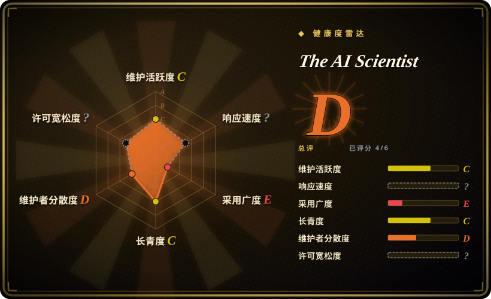
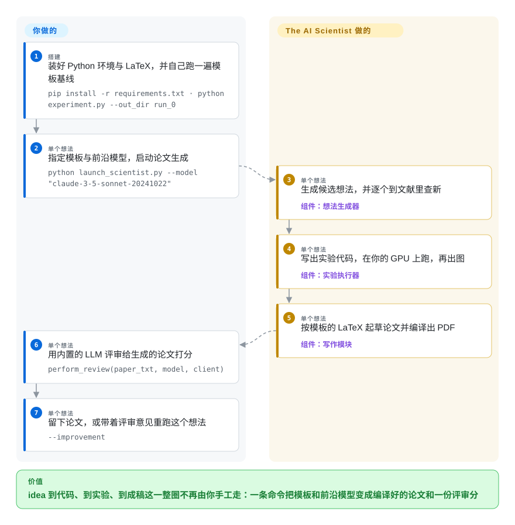

# The AI Scientist

想拿到一个可信的实验结论，得先花掉好几天：读相关工作、写实验代码并调通、画图，最后还要跟 LaTeX 和引用搏斗，只为一个没人要的草稿。The AI Scientist 把这一整圈无人值守地跑完——生成想法、到文献里查新、写出实验代码并在你的 GPU 上执行，最后产出一篇编译好的论文，再由另一轮 LLM 给出评分。

## 何时使用

你是那个必须产出研究成果的人，想知道这条链路能离你多远：不是要一份文献综述，而是要一个想法、验证它的代码、图，以及一份论文形状的 PDF。你手上有 Linux、至少一张 NVIDIA GPU、一个前沿模型的 API key，并且你的方向能塞进它维护的模板之一（nanoGPT、2D diffusion、grokking）——或者你愿意照着 `experiment.py`、`plot.py`、`prompt.json`、`seed_ideas.json`、`latex/template.tex` 自己写一个模板。

把它当作全自动流水线的**参考实现**来选：它就是那篇「AI Scientist」论文背后的代码，三个模板、想法生成器和 LLM 评审都是别的项目拿来对照的东西。相比 [Agent Laboratory](agent-laboratory.zh.md)，它更适合你想要「一次跑完、自己给自己打分」而不是分阶段让你点头的角色扮演实验室；相比 [OpenResearch](../agent-frameworks/coding-agents/orchestration-and-review/openresearch.zh.md)，它更适合你不想自己出研究议程、运行命令和算力路由的场景。要付的代价很具体：想法和写作都交给它之后，你会接受一个绑死模板、自成一体、且许可证现在会限制你拿论文去做什么的流水线。

## 怎么用起来

这个仓库是一串作用在**模板**上的 LLM 处理：每个模板是一个小型可训练实验，自带 LaTeX 骨架，领域知识只存在于模板里。你先自己把该模板的基线跑一遍（`run_0`），这样之后在你机器上的运行时间才可比；然后 `launch_scientist.py` 按阶段往下走：想法生成器提出候选，并用 Semantic Scholar 或 OpenAlex 查新；一轮代码编辑（依赖里就有 `aider-chat`）在模板之上写出实验；实验作为子进程在你的 GPU 上带超时执行，再由绘图环节把输出变成图；写作环节按模板拼出 LaTeX 论文并编译成 PDF。之后另有一轮评审读编译后的正文，返回 1–10 的分数、弱点清单和接收／拒稿决定，用 `--improvement` 重跑就能把评审意见喂回去。留给你的：选模板、跑基线、选模型、出 GPU——以及判断一个生成出来的结果到底有没有意义。它接过去的：生成想法、代码到实验到画图这一圈、LaTeX，以及第一轮评审。

<!-- flow-steps:begin (generated from flows/ai-scientist.json by tools/flow_card.py — do not edit) -->

流程文字版

1. **你**（搭建）：装好 Python 环境与 LaTeX，并自己跑一遍模板基线 — `pip install -r requirements.txt · python experiment.py --out_dir run_0`
2. **你**（单个想法）：指定模板与前沿模型，启动论文生成 — `python launch_scientist.py --model "claude-3-5-sonnet-20241022"`
3. **The AI Scientist**（单个想法）：生成候选想法，并逐个到文献里查新 — 组件：`想法生成器`
4. **The AI Scientist**（单个想法）：写出实验代码，在你的 GPU 上跑，再出图 — 组件：`实验执行器`
5. **The AI Scientist**（单个想法）：按模板的 LaTeX 起草论文并编译出 PDF — 组件：`写作模块`
6. **你**（单个想法）：用内置的 LLM 评审给生成的论文打分 — `perform_review(paper_txt, model, client)`
7. **你**（单个想法）：留下论文，或带着评审意见重跑这个想法 — `--improvement`

**价值**：idea 到代码、到实验、到成稿这一整圈不再由你手工走：一条命令把模板和前沿模型变成编译好的论文和一份评审分

<!-- flow-steps:end -->

## 何时不用

- **你需要按自己的条件发布产出。** 这个仓库曾是 Apache-2.0，2025-12-19 改授权为 *The AI Scientist Source Code License v1.0*（仿 Responsible AI License，不是 OSI 认证的开源许可）：任何由它生成或传播的论文都必须显著声明机器生成，禁止用于监控、未标注的合成媒体、无人监督的诊断、犯罪预测等用途，并且要求把这些限制写进下游协议。如果你要交付的东西需要宽松许可，用 [Agent Laboratory](agent-laboratory.zh.md)（MIT）或 [OpenResearch](../agent-frameworks/coding-agents/orchestration-and-review/openresearch.zh.md)（MIT），因为一旦生成出来的论文就是交付物，许可证本身就是产品约束。
- **你的研究问题没法写成它某个模板里的代码。** FAQ 说得很清楚：这个版本仅限于能表达为代码的想法，而作者维护的只有三个模板，`templates/` 里其余全是社区贡献、无人维护。方向不在这三个里的话，不如把这条链路搭在工作台上：[OpenResearch](../agent-frameworks/coding-agents/orchestration-and-review/openresearch.zh.md) 配你自己的 agent——反正你都要自己写模板。
- **你需要一个还在维护的依赖，或者一个你能辩护的安全姿态。** 最后一次推送是 2025-12-19，而且推的就是改许可证，也就是说代码已经约 9 个月没人动、约 120 个 open issue——其中包括一条至今无回应的 shell 拼接问题报告，指向 `ai_scientist/perform_writeup.py` 里的 `os.popen(f"chktex {writeup_file} …")`。更根本的是，执行模型写出来的代码是它的设计：README 自己的警告就点名了危险包、联网访问和进程生成，并让你用社区 Dockerfile 去做隔离。需要活着维护的项目或沙箱运行时，用 [OpenResearch](../agent-frameworks/coding-agents/orchestration-and-review/openresearch.zh.md) 或 [OpenHands](../agent-frameworks/coding-agents/orchestration-and-review/openhands.zh.md)，因为隔离是平台能力，不是这条流水线给你的。
- **你没有 NVIDIA GPU，也没有前沿模型的预算。** 它面向 Linux 加 NVIDIA 加 CUDA，README 直言模板在纯 CPU 机器上不现实；FAQ 给出每篇论文「通常低于 15 美元」（用 Claude Sonnet 3.5），并警告弱于 GPT-4 级别的模型不行。只要你真正需要的是文献那一半，就用 [Local Deep Research](../deep-research/local-deep-research.zh.md) 这类 deep research agent，别背这套实验机器。
- **你想逐步插手。** 它默认就是自主的——不说就是 50 个想法——关键决定都由模板里的提示词做了。要插手就用 [Agent Laboratory](agent-laboratory.zh.md) 的 copilot 模式，或者在 [OpenResearch](../agent-frameworks/coding-agents/orchestration-and-review/openresearch.zh.md) 里自己手动驱动 agent；「让它跑完、我看 PDF」和「下一步做什么我说了算」本来就不是同一个工具。
- **你需要可复现、可同行评议的结果。** 基线必须每台机器各自重跑才能比较运行时间，成功率是论文报告的数字而不是承诺，这里也不会替你复现任何已发表结果。把产出当成待筛的草稿；数字要紧就回到你自己的实验装置里复现。

## 横向对比

| 替代品 | 是否收录 | 我们的评价 | 取舍 |
|---|---|---|---|
| [OpenResearch](../agent-frameworks/coding-agents/orchestration-and-review/openresearch.zh.md) | ✅ | 如果议程、agent 和算力都是你自己的、缺的只是实验记账，选 OpenResearch；如果你想要「想法到论文」这整圈不用你参与就执行完，选 The AI Scientist。 | The AI Scientist 提供议程和论文模板，但没有实验血统、没有多后端路由，许可证还限制发布；OpenResearch 提供血统与算力路由，但不给议程也不写论文。 |
| [Agent Laboratory](agent-laboratory.zh.md) | ✅ | 如果你想要同样的研究流程但每个阶段都要人确认、且用 MIT 条款，选 Agent Laboratory；如果你想要一次性自主跑完并自带 ICLR 式评审，选 The AI Scientist。 | Agent Laboratory 可干预（copilot 模式）、许可宽松，但模型支持窄、停更时间还更长；The AI Scientist 是引用更多的参考实现，而它的许可证现在给发表加了成本。 |
| [autoresearch](autoresearch.zh.md) | ✅ | 如果你要的是最小闭环——一个文件、一个指标、一块 GPU，让 agent 改 `train.py`，选 autoresearch；如果你要带想法生成和 LaTeX 的完整论文流水线，选 The AI Scientist。 | autoresearch 没有写作、没有文献阶段、也没有许可证问题，但同样没有评审环节，模板也只有一个训练脚本；The AI Scientist 是完整、更重、且带许可负担的那一套。 |
| [OpenHands](../agent-frameworks/coding-agents/orchestration-and-review/openhands.zh.md) | ✅ | 如果你真正需要的是一个能安全跑编码任务的沙箱 agent 平台，选 OpenHands；如果交付物是生成出来的论文而不是一个 issue 修复，选 The AI Scientist。 | OpenHands 给你隔离、自托管和一个在维护的项目，但没有任何科研脚手架；The AI Scientist 给你科研脚手架，代价是这条流水线在设计上就会执行模型写的代码。 |
| AI-Scientist-v2（SakanaAI/AI-Scientist-v2） | 未收录 | 如果你要的是这个项目的延续线，先去看后继仓库：它把实验阶段换成了 agentic tree search。 | 那是一个独立仓库（约 7.2k star、2025-04 创建、同一许可证家族、最后推送同为 2025-12），不是分支；本页讲的是它背后的 v1 代码，包括模板和评审器。 |

## 技术栈

- **conda 下的 Python**（README 指定 Python 3.11），加一套 LaTeX 工具链：安装脚本里有 `apt-get install texlive-full`，写作阶段需要 `pdflatex`。
- **模型**统一走 `ai_scientist/llm.py`：OpenAI、Anthropic（直连、Bedrock 或 Vertex）、DeepSeek、OpenRouter、Gemini——依赖里还有 `aider-chat`，它是实验阶段背后那个改代码的引擎。
- **科研代码**是 PyTorch 加 CUDA；`requirements.txt` 里还有 `transformers`、`datasets`、`wandb`、`matplotlib`、`pypdf`。
- **文献**来自 Semantic Scholar（`S2_API_KEY`，可选，用于提高吞吐）或 OpenAlex（不需要 key，用 `--engine openalex`）。
- **模板**是扩展点：`experiment.py`、`plot.py`、`prompt.json`、`seed_ideas.json`、`latex/template.tex`。作者维护的三个是 nanoGPT（致谢 Karpathy 的 nanoGPT）、2D diffusion（tiny-diffusion 等）和 grokking，其余都是社区 PR。
- **评审器**可以单独用：`ai_scientist/perform_review.py` 加 `review_iclr_bench/` 里的分析脚本，当初就是用它把 LLM 评审和 ICLR 的真实决定做对照。

## 依赖

- **硬件：** Linux 加 NVIDIA GPU 和 CUDA；模板在纯 CPU 上不现实，而且按设计你要先在自己的机器上跑一遍基线，之后实验结论才被当作可比。
- **工具链：** conda（或等价物）加 Python 3.11、`texlive-full`（好几 GB，README 提醒装很久），以及 `requirements.txt` 里那一整套 pip 依赖，包括 PyTorch。
- **密钥与开销：** 一个前沿模型的 API key（Anthropic／OpenAI／DeepSeek／OpenRouter／Google），可选 Semantic Scholar key 提高吞吐；作者给出的成本约每篇论文 15 美元以内；依赖里还有 `wandb`，要用需自行开启。
- **可选：** 想给模型写的代码加一层隔离，可以走社区贡献的 `experimental/Dockerfile` 那条 Docker 路线。
- **不含：** 想法、基线数字、以及「一次跑一定出论文」的保证——README 给的是每个模板的成功率，不是承诺。

## 运维难度

**中等，尾巴很长。** 起手是一个 conda 环境加一次体积很大的 LaTeX 安装，跑起来也只是一条命令——但每个模板都要单独准备数据、手工跑基线，一个想法在 GPU 上要跑好几个小时，而「没出 PDF、没出评审」是 FAQ 明确预期你要翻论文去理解的结果，不是拿来 debug 的。没有要运维的服务、没有版本要跟、也没有升级路径；风险在别处：每个想法的模型花费、一条 2025 年 12 月之后没人打过补丁的流水线在执行模型写的代码，以及许可证附加在你生成物上的披露义务。

## 健康度与可持续性

- **维护：已休眠（截至 2026-09-22）。** 最后一次推送 2025-12-19，那笔提交就是改许可证；此前仓库的工作基本止于 2024 年的论文发布。没有任何 tagged release，约 120 个 open issue，其中 #251（2026-08-04 提，带安全色彩）至今没有维护者回复。雷达在这里根本给不出响应速度（窗口内没有合格的首次响应样本），所以「休眠」就是答案。把它读作一份已发表、且不再开发的研究产物。[推断]
- **治理与 bus factor：一个实验室，关键路径上一个人。** 仓库以组织身份归 Sakana AI 所有，但贡献高度集中（`conglu1997` 约 66 次提交，其余都是个位数），树里没有 CONTRIBUTING 也没有 SECURITY，唯一的治理文件就是 LICENSE。[推断]
- **背书与寿命：实验室有钱，但这个仓库没人管。** Sakana AI 是一家真实存在、发布记录可见的研究公司，所以这里的**想法**被广泛引用；但实验室的背书不等于 v1 仓库有人在维护，延续线已经挪到独立的继任仓库。[推断]
- **年龄与 Lindy：这一项帮不上忙。** 创建于 2024-08-12（约 2.1 年），够老、也被用被引过；但「老而不活跃」正是 Lindy 检验里失败的那一半：模板瞄准的是 2024 年的模型，代码自改许可证后冻结至今。把它当模式来源，而不是依赖。[推断]
- **采用：注意力很高，fork 数才是信号。** 约 14.6k star、约 2.0k fork，`example_papers/` 里还存着生成出来的样例论文；对研究代码来说，这样的 fork 比例通常意味着大家在复制改写，而不是在依赖它。雷达这一轴给 **E**，因为它量的是代码依赖者——原始值 `dependent_repos_count` 为 0（没有任何仓库 import 它）——对一条没人 vendor 的流水线这正是对的读法，也提醒你 star 是注意力而不是依赖。[未验证]
- **风险标记：许可证是头条。** 2025-12-19 从 Apache-2.0 改成 *The AI Scientist Source Code License v1.0*，带强制披露条款和下游传播条款；再叠加写作阶段未修补的 shell 拼接、设计上不隔离地执行模型写的代码，以及没有可固定版本的 release。

## 存疑（未验证）

- [未验证] star／fork 数（约 14.6k star、约 2.0k fork）与最后推送日期取自 2026-09-22 的 GitHub API，对时间敏感。
- [未验证] 「每篇论文通常低于 15 美元」、每个模板的成功率说法、「只建议使用 GPT-4 级别以上的前沿模型」，以及模型／基准的选择，都是 README 与论文的自述；我没有跑这条流水线，也没有复现任何一篇论文。
- [未验证] 改授权的事实来自 LICENSE 文件（标注 Version 1.0, December 2025）与 2025-12-19 的提交「Update license from Apache 2.0 to AI Scientist License 1.0」；我不是律师，这不构成关于条款如何适用于你的用法的法律意见。
- [推断] 许可证的限制是否同样约束那些从第三方仓库引入的**模板**代码（nanoGPT 是 MIT，tiny-diffusion 等各带条款，见 README 的致谢），我无法从文件里判定；要发布基于模板的代码前，请把两者叠加起来单独确认。
- [未验证] issue #251 的 shell 拼接问题，我只确认了它「已被提交且无人回应」；`os.popen(f"chktex {writeup_file} …")` 确实存在于 `ai_scientist/perform_writeup.py` 第 80 行，但我没有评估它在你的环境里是否可被利用。
- [未验证] 这里把后继仓库 AI-Scientist-v2 称为延续线，依据是它的元数据（约 7.2k star、2025-04 创建、最后推送 2025-12、同一许可证家族）；我没有读它的代码，也没有做能力对比。
- [推断] 「休眠而非放弃」是我对提交历史的解读（一笔改许可证的提交之后没有后续），项目本身没有声明停止维护。
- [未验证] 内置评审器与 ICLR 分析脚本所报告行为一致的说法，来自 README 对 `review_iclr_bench/` 的描述；我没有运行评审器，也没有读它的评估。
