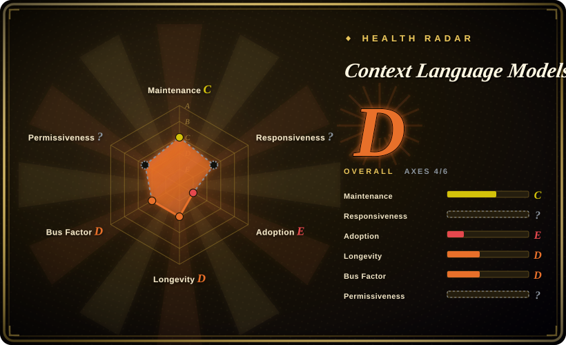
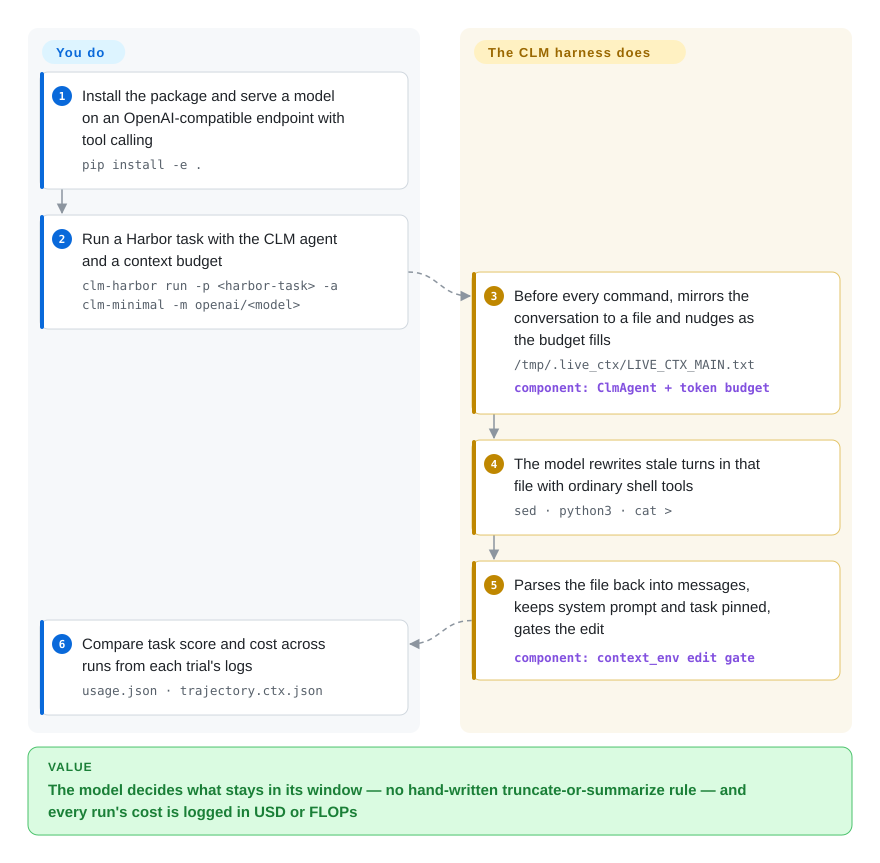

# Context Language Models (CLM)

A long-running agent keeps paying for stale text — a 60,000-character search dump from early in the run is re-read on every later turn — and the usual fixes (truncate, or summarize when the window is full) are rules the harness imposes without the model's say. This repo, the code release of a Meta/University of Washington paper, mirrors the conversation into a file the model can rewrite with ordinary shell commands, so the model itself decides what to cut and what to keep.

## When to use

You run long-horizon agent evaluations — deep-research questions like BrowseComp-Plus, or a 12-hour improvement task — on a local open model such as Qwen3.6-27B served by vLLM, with a context budget around 32k tokens. Your runs die in one of two ways: the harness's summarize-when-full step throws away the one grep result the model needed three hours later, or the transcript hits the limit and the trial ends with `context length exceeded`. You want to test, and measure in compute rather than just tokens, whether letting the model manage its own context beats a rule you wrote. Reach for this repo when your tasks already run on [Harbor](https://github.com/harbor-framework/harbor) (or can): `clm-harbor` is the Harbor CLI with one extra agent, `-a clm-minimal`, that gives the model a single `bash` tool plus an editable mirror of its own transcript, budget nudges, rollback-and-retry when an output overflows, and FLOPs accounting that credits prefix-cache reuse.

The deciding tradeoff against its closest substitutes: Letta also lets the model edit its own memory, but through memory-block tools inside an application server whose job is persistence across sessions; mini-swe-agent (the paper's shared baseline backbone) has no context management at all; Recursive Language Models keep the input outside the window and recurse over it. CLM is the option where the *live working context of a single run* is the thing the model edits, with no new tool vocabulary — only files and shell — and the repo also ships the pieces a paper needs around it: a skill-evolution loop (`clm_icl`), RL advantage-function patches (`clm_rl`), and Suffix Cache Reuse, an SGLang patch that stops mid-context edits from forcing a full re-prefill.

## How it works

Before every command the harness writes the editable part of the conversation — every turn after the system prompt and the task — to `/tmp/.live_ctx/LIVE_CTX_MAIN.txt` inside the task sandbox, one `[[CTX_TURN i role=…]]` block per message. The model is told (in a ~60-line system prompt) to free space by replacing stale regions of that file with short summaries using ordinary tools like `sed` or a Python one-liner; a turn that only edits the file and prints nothing does not count against the step budget. After the command, the harness parses the file back into a message list, keeps the system prompt and task pinned, and runs an "edit gate" — a size check that either accepts any edit that still fits the limit (`fit`) or only edits that shrink the context (`shrink`); it never judges *what* was deleted. What the project does for you: the mirror, the parsing, token counting, escalating reminders at 25/50/75% of budget, rolling back the newest turns when an output overflows, and logging cost in USD or FLOPs. What stays yours: the model and its serving endpoint (tool calling must be on), the Harbor task, the budget and config, and — if you serve on SGLang yourself — whether to add the separate Suffix Cache Reuse patch. An analogy: instead of an editor trimming the model's notebook for it, the model is handed the eraser, and the harness only checks that the notebook still fits in the bag.

<!-- flow-steps:begin (generated from flows/context-language-models.json by tools/flow_card.py — do not edit) -->

Text version of the flow

1. **You**: Install the package and serve a model on an OpenAI-compatible endpoint with tool calling — `pip install -e .`
2. **You**: Run a Harbor task with the CLM agent and a context budget — `clm-harbor run -p <harbor-task> -a clm-minimal -m openai/<model>`
3. **Context Language Models (CLM)**: Before every command, mirrors the conversation to a file and nudges as the budget fills — `/tmp/.live_ctx/LIVE_CTX_MAIN.txt` — component: `ClmAgent + token budget`
4. **Context Language Models (CLM)**: The model rewrites stale turns in that file with ordinary shell tools — `sed · python3 · cat >`
5. **Context Language Models (CLM)**: Parses the file back into messages, keeps system prompt and task pinned, gates the edit — component: `context_env edit gate`
6. **You**: Compare task score and cost across runs from each trial's logs — `usage.json · trajectory.ctx.json`

**Value**: The model decides what stays in its window — no hand-written truncate-or-summarize rule — and every run's cost is logged in USD or FLOPs

<!-- flow-steps:end -->

## When NOT to use

- **Anything commercial.** The whole repository is **CC BY-NC 4.0** (read from `LICENSE`; GitHub's API shows `NOASSERTION`). A non-commercial content licence on software rules out using the harness, the SGLang patch or the skill-evolution loop in a product. If you want the same mirror-file mechanism in a coding agent, use pi-clm (a separate MIT-licensed extension for [Pi](../agent-frameworks/coding-agents/terminal-agents/pi.md)); for model-edited memory in production, use [Letta](../agent-memory/app-memory/letta.md) (Apache-2.0); or re-implement the idea from the paper yourself.
- **You need memory that survives across sessions.** CLM manages the context *within one run*; nothing persists when the trial ends. Use a store from the [agent-memory](../agent-memory/INDEX.md) tree such as [Letta](../agent-memory/app-memory/letta.md).
- **Your agent does not run on Harbor.** `ClmAgent` subclasses Harbor's `BaseAgent`, the package pins `harbor==0.16.1` and Python `>=3.12,<3.14`, and trials run in a Docker (or Singularity) sandbox by default. On Pi, use pi-clm; on any other harness, port the protocol — the system prompt in `clm_agent/prompts.yaml` is the portable part — rather than wrapping your agent in Harbor.
- **You handle untrusted content and cannot audit what the model writes into its own context.** The paper's discussion states: "Editable context can become another channel through which prompt injections or self-generated instructions persist across turns." The edit gate checks size only. Where a web page or tool output could smuggle instructions, keep a harness-owned summarizer (the Codex-style summary the paper compares against) so the harness, not the model, decides what survives.
- **You want Suffix Cache Reuse on your own serving stack.** It is a monkeypatch for exactly SGLang 0.5.16 and was validated on Qwen3.6-27B on one GPU (`--tp-size 1`); it also reserves a separate GPU side buffer (~22 GiB at defaults for that model). On other versions, models or tensor-parallel setups, stay on plain [SGLang](../llm-inference/serving-engines/sglang.md) or [vLLM](../llm-inference/serving-engines/vllm.md) prefix caching; with a hosted API model it does not apply at all.
- **You want to reproduce the RL results end to end.** Training code is not in the repo: `clm_rl/` is two patches against pinned commits of ProRL-Agent-Server and Slime, and the README says you must compute the efficiency score and per-token role masks yourself. If you need a turnkey agent-RL stack, start from a training framework in [llm-training](../llm-training/INDEX.md).
- **You need a dependency you can pin and forget.** Twelve days old at verification, three commits, version `0.1.0`, no tests for the `clm` package (only the SGLang patch has tests), no CI, and a "Coming soon: ContextBench" still open. Treat it as reference code to read and fork, and treat the headline gains (e.g. +11.4% accuracy with 21.5% fewer FLOPs on BrowseComp-Plus) as the authors' reported results, not guarantees.

## Comparison

| Alternative | In index | Our verdict | Tradeoff |
|---|---|---|---|
| [Letta](../agent-memory/app-memory/letta.md) | ✅ | Choose Letta when an application needs model-edited memory that persists across sessions under Apache-2.0; choose CLM only to research how a model should manage the live context of one long run. | Letta gives a production server, memory-block tools and a permissive licence, but you adopt its agent loop and tool vocabulary; CLM uses plain files and bash inside Harbor, is non-commercial, and keeps nothing after the trial. |
| mini-swe-agent | not indexed | Choose mini-swe-agent as the simplest bash-only baseline to compare against; add CLM when that baseline runs out of context on long tasks. | MIT, widely used and minimal, and CLM's own task template adapts its instructions; but it has no context management, so long trajectories hit the window. Real repo, not added in this tab batch. |
| Recursive Language Models (`rlm`) | not indexed | Choose RLM when the problem is one huge *input* the model should inspect programmatically; choose CLM when the problem is a *transcript* that grows turn by turn. | RLM (MIT, pip-installable, tested) keeps the context as a REPL variable and recurses with sub-LM calls; CLM keeps everything in the window and lets the model rewrite it. The CLM paper uses RLM as a baseline. Real repo, not added in this tab batch. |
| pi-clm | not indexed | If you want the CLM mechanism in a day-to-day coding agent rather than an evaluation harness, pick pi-clm (an extension for the Pi coding agent) over this repo. | MIT-licensed and installs with one `pi install`, but it is a one-star, day-old third-party port with none of this repo's FLOPs accounting, configs or trajectory format. Real repo, not added in this tab batch. |
| [SGLang](../llm-inference/serving-engines/sglang.md) (stock prefix cache) | ✅ | For serving any agent in production, stay on stock SGLang; add this repo's Suffix Cache Reuse patch only when you serve Qwen3.6-27B on SGLang 0.5.16 for a context-editing agent. | Stock radix caching is supported across models and versions but re-prefills every token after the first edit; SCR reuses the surviving tokens (the authors report matching accuracy at 65% of the prefix-reuse FLOPs on BrowseComp-Plus) at the cost of an approximation, a pinned version and a large side buffer. |

## Tech stack

- **Language:** Python (≈405 KB) plus a Bash example runner; the `clm` package requires Python `>=3.12,<3.14`.
- **Agent harness (`clm/clm_harness`):** a Harbor agent (`ClmAgent`) with a single `bash` tool; model calls through LiteLLM; token counting with tiktoken (exact tokenizer via optional `transformers`); YAML configs for BrowseComp-Plus and EdgeBench; ATIF-CTX, an extension of Harbor's trajectory format that records context segments and multi-agent sub-trajectories.
- **Skill evolution (`clm/clm_icl`):** a propose-validate-gate loop that rewrites a `SKILL.md` appended to the system prompt, with a standard-error gate and a Pareto frontier over accuracy and cost.
- **RL (`clm/clm_rl`):** two `git apply` patches adding a dual-channel GRPO advantage to ProRL-Agent-Server (`8bc67cc`) and Slime (`bf9b1a3`).
- **Serving (`suffix_cache_reuse`):** a separate package that monkeypatches SGLang 0.5.16 at start-up through a `sitecustomize.py`; handles full-attention and linear-attention (GatedDeltaNet) layers.

## Dependencies

- **Required:** `harbor==0.16.1`, `litellm>=1.70,<2`, `tiktoken>=0.7`, `pyyaml>=6.0`; Harbor's sandbox runtime (Docker by default in the example script, Singularity supported).
- **A model endpoint:** any OpenAI-compatible server with tool calling enabled, whose context window holds `context_budget_tokens + max_tokens` (32,000 + 16,384 by default) — the repo's example is vLLM serving Qwen3.6-27B — or a hosted model by its LiteLLM name.
- **Cost accounting:** `cost_metric=auto` refuses to start without a FLOPs model size; pass `cost_metric=usd` (the CLI does this by default) or a `flops_model_key`.
- **Optional:** `transformers>=4.40` for exact-tokenizer FLOPs; `sglang==0.5.16` and a GPU for Suffix Cache Reuse; ProRL-Agent-Server and Slime checkouts for the RL patches; a proposer model (e.g. an Anthropic model via LiteLLM) for `clm_icl`.

## Ops difficulty

**Medium to high.** Installing the harness is one `pip install -e .`, but a useful run needs three moving parts you operate: a Harbor task and its container sandbox, a model server with tool calling and a large enough window (a GPU for the 27B example), and a budget/config choice that the README documents in detail but that you must tune per benchmark. Suffix Cache Reuse adds a pinned SGLang version, a single-GPU constraint and a ~22 GiB side buffer you must leave room for; the RL part is patch-and-integrate work inside two other codebases. There is no release process, CI or support channel, so upgrades mean re-reading the diff.

## Health & viability

- **Maintenance (as of 2026-09-30):** repository created 2026-09-18; the whole codebase landed in one "Initial release" commit on 2026-09-30, followed by two README commits the same day. No tags or releases; one open PR (from the pi-clm author). [推断] It has the shape of a paper code drop, and whether it gets maintained past publication is unknown.
- **Governance / bus factor:** hosted under the `facebookresearch` organization, but every commit so far is from one author (the paper's first author). No `GOVERNANCE`, no CI; `CONTRIBUTING.md` and a code of conduct are the Meta boilerplate.
- **Backing & longevity:** backed by a University of Washington / Meta Superintelligence Labs author list (paper arXiv:2609.37725, submitted 2026-09-29). Age is under two weeks, so the Lindy prior gives it no credit; Meta research repos are often left as-is after the paper ships. [推断]
- **Adoption:** 9 stars and 3 forks at verification; one third-party port already exists (`@lolipopshock/pi-clm` on npm, MIT, published 2026-09-30).
- **Risk flags:** CC BY-NC 4.0 on code (non-commercial only); third-party code under MIT is acknowledged in `NOTICE`. Exact pins (`harbor==0.16.1`, `sglang==0.5.16`) will age quickly. The authors themselves flag editable context as a prompt-injection persistence channel.

## Caveats (unverified)

- [未验证] All benchmark numbers (BrowseComp-Plus +11.4% accuracy / −21.5% FLOPs, EdgeBench +5% / −59% FLOPs, +35.9 points from skill evolution, +47.6% from RL on Qwen3.5-9B, SCR at 65% of prefix-reuse FLOPs) are the authors' reported results; not reproduced here because that needs the benchmark environments and GPUs.
- [推断] "Paper code drop that may not be maintained" is inferred from the commit history (one bulk initial commit, 3 commits total, no tests or CI for `clm`) and from the general pattern of research-org repos, not from any stated maintenance plan.
- [未验证] pi-clm's fidelity to this repo's mechanism (and its lack of FLOPs accounting and configs) is judged from its npm description and repo metadata only; its source was not read.
- [推断] The ~22 GiB SCR side-buffer figure is the README's logged example for Qwen3.6-27B at default settings; other models and settings will differ.
- [推断] The claim that the edit gate checks size only is read from `context_env/edit_gate.py`; other parts of `harness.py` (41 KB) were not audited for content-level checks.
- [未验证] Whether CC BY-NC 4.0 is enforceable or appropriate for software is a legal question not settled here; treat it as non-commercial as the authors state.
