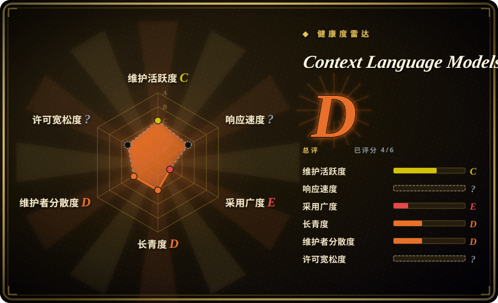
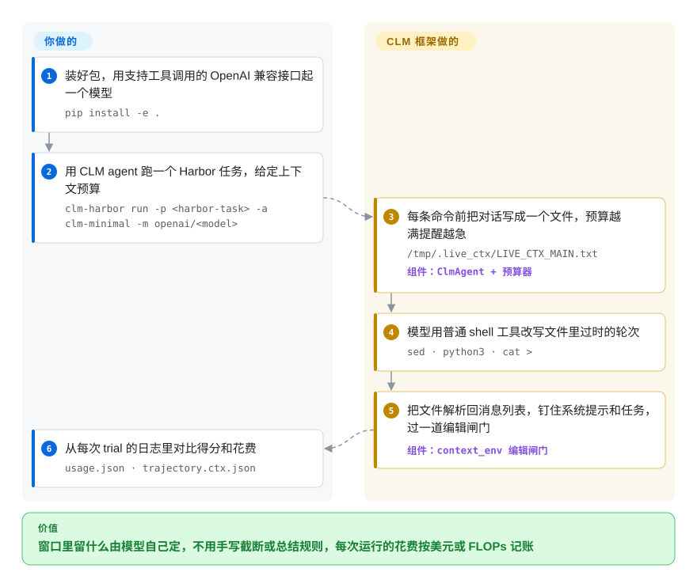

# Context Language Models (CLM)

长时间运行的 agent 一直在为过时的文字买单：开头一次搜索吐回来的几万字网页，之后每一轮都要被重新读一遍；常见的补救办法是截断，或者窗口满了就总结，这些规则都由框架说了算，模型自己插不上手。这个仓库是 Meta 与华盛顿大学一篇论文的代码，它把对话写成沙箱里的一个文件，让模型用 sed、python 这类普通命令自己改，删什么、留什么由模型决定。

## 何时使用

你在做长程 agent 评测：BrowseComp-Plus 这类深度检索题，或者一跑 12 小时的持续改进任务；模型是本地部署的开源模型，比如用 vLLM 起的 Qwen3.6-27B，上下文预算大约 32k token。你的运行总是以两种方式之一失败：要么框架“满了就总结”的那一步，把模型三小时后才用得上的那条 grep 结果扔掉了；要么对话直接撑爆窗口，trial 以 `context length exceeded` 结束。你想验证“让模型自己管上下文”是否比你手写的规则更好，而且要按计算量而不只是 token 数来算账。如果你的任务已经跑在 [Harbor](https://github.com/harbor-framework/harbor) 上（或者能迁过去），就该想到这个仓库：`clm-harbor` 就是 Harbor 的命令行，多注册了一个 agent `-a clm-minimal`。它只给模型一个 `bash` 工具，外加一份可编辑的对话镜像文件、随预算升级的提醒、输出溢出时的回滚重试，以及把前缀缓存复用算进去的 FLOPs 记账。

和最接近的替代品相比，决定性的取舍在这里：Letta 也让模型改自己的记忆，但走的是应用服务器里的记忆块工具，目标是跨会话持久化；mini-swe-agent（论文里各方法共用的基线骨架）根本不做上下文管理；Recursive Language Models 把输入放在窗口外，递归地去查。CLM 的位置是：模型编辑的是*单次运行的实时工作上下文*，而且不引入新的工具词汇，只有文件和 shell。仓库还附带一篇论文需要的配套件：技能演化循环（`clm_icl`）、RL 优势函数补丁（`clm_rl`），以及 Suffix Cache Reuse——一个 SGLang 补丁，避免上下文中间被改后整段重算。

## 怎么用起来

每执行一条命令之前，框架把对话里可编辑的部分（系统提示和任务之后的每一轮）写到任务沙箱里的 `/tmp/.live_ctx/LIVE_CTX_MAIN.txt`，每条消息一个 `[[CTX_TURN i role=…]]` 块。系统提示（约 60 行）告诉模型：用 `sed` 或一段 Python 之类的普通工具，把文件里过时的段落换成简短总结来腾地方；一轮如果只改文件、不输出任何东西，就不计入步数预算。命令跑完后，框架把文件解析回消息列表，系统提示和任务始终钉住不动，再过一道“编辑闸门”——它只看大小：`fit` 模式接受任何改完仍在限额内的编辑，`shrink` 模式只接受让上下文变小的编辑；它从不判断删掉的是*什么*。框架替你做的：镜像文件、解析回写、token 计数、在预算 25%／50%／75% 处逐级提醒、输出溢出时回滚最新几轮、按美元或 FLOPs 记账。留给你的：模型和它的服务端点（必须开启工具调用）、Harbor 任务、预算与配置，以及如果你自己用 SGLang 部署，要不要再加上独立的 Suffix Cache Reuse 补丁。打个比方：不是由编辑替模型删笔记本，而是把橡皮直接交给模型，框架只检查笔记本还塞不塞得进书包。

<!-- flow-steps:begin (generated from flows/context-language-models.json by tools/flow_card.py — do not edit) -->

流程文字版

1. **你**：装好包，用支持工具调用的 OpenAI 兼容接口起一个模型 — `pip install -e .`
2. **你**：用 CLM agent 跑一个 Harbor 任务，给定上下文预算 — `clm-harbor run -p <harbor-task> -a clm-minimal -m openai/<model>`
3. **Context Language Models (CLM)**：每条命令前把对话写成一个文件，预算越满提醒越急 — `/tmp/.live_ctx/LIVE_CTX_MAIN.txt` — 组件：`ClmAgent + 预算器`
4. **Context Language Models (CLM)**：模型用普通 shell 工具改写文件里过时的轮次 — `sed · python3 · cat >`
5. **Context Language Models (CLM)**：把文件解析回消息列表，钉住系统提示和任务，过一道编辑闸门 — 组件：`context_env 编辑闸门`
6. **你**：从每次 trial 的日志里对比得分和花费 — `usage.json · trajectory.ctx.json`

**价值**：窗口里留什么由模型自己定，不用手写截断或总结规则，每次运行的花费按美元或 FLOPs 记账

<!-- flow-steps:end -->

## 何时不用

- **任何商用场景。** 整个仓库是 **CC BY-NC 4.0**（读的是 `LICENSE` 文件；GitHub API 显示为 `NOASSERTION`）。软件套上非商业的内容许可，意味着框架本身、SGLang 补丁和技能演化循环都不能进产品。想在编码 agent 里用同样的镜像文件机制，用 pi-clm（给 [Pi](../agent-frameworks/coding-agents/terminal-agents/pi.zh.md) 的独立扩展，MIT 许可）；生产环境要“模型自己改记忆”，用 [Letta](../agent-memory/app-memory/letta.zh.md)（Apache-2.0）；或者照论文自己重新实现。
- **你要的是跨会话留存的记忆。** CLM 管的是*单次运行之内*的上下文，trial 结束什么都不留。去 [agent-memory](../agent-memory/INDEX.zh.md) 分类挑一个存储，比如 [Letta](../agent-memory/app-memory/letta.zh.md)。
- **你的 agent 不跑在 Harbor 上。** `ClmAgent` 继承自 Harbor 的 `BaseAgent`，包钉死了 `harbor==0.16.1` 和 Python `>=3.12,<3.14`，trial 默认跑在 Docker（或 Singularity）沙箱里。用 Pi 就装 pi-clm；用别的框架就移植协议——`clm_agent/prompts.yaml` 里的系统提示才是能带走的部分——别为此把 agent 塞进 Harbor。
- **你要处理不可信内容，又没法审计模型往自己上下文里写了什么。** 论文的讨论部分原话是：“Editable context can become another channel through which prompt injections or self-generated instructions persist across turns.”（可编辑的上下文可能成为提示注入或模型自生指令跨轮留存的又一条通道。）编辑闸门只查大小。网页或工具输出可能夹带指令的场景，保留由框架掌控的总结器（论文对比过的 Codex 式总结），让框架而不是模型决定哪些内容留下。
- **你想把 Suffix Cache Reuse 装到自己的推理栈上。** 它是专门针对 SGLang 0.5.16 的猴子补丁，只在单卡（`--tp-size 1`）Qwen3.6-27B 上验证过，还要额外占一块 GPU 侧缓冲（该模型默认配置约 22 GiB）。别的版本、模型或张量并行配置，继续用原生 [SGLang](../llm-inference/serving-engines/sglang.zh.md) 或 [vLLM](../llm-inference/serving-engines/vllm.zh.md) 的前缀缓存；用托管 API 模型则完全用不上。
- **你想端到端复现 RL 结果。** 训练代码不在仓库里：`clm_rl/` 只是针对 ProRL-Agent-Server 与 Slime 固定提交的两个补丁，README 写明效率分数和逐 token 角色掩码要你自己算。需要开箱即用的 agent RL 栈，从 [llm-training](../llm-training/INDEX.zh.md) 里的训练框架起步。
- **你要一个能钉版本就不管的依赖。** 核实时仓库才 12 天，3 个提交，版本 `0.1.0`，`clm` 包没有测试（只有 SGLang 补丁带测试），没有 CI，“Coming soon: ContextBench”还挂着。把它当可读、可 fork 的参考代码；标题里的收益（比如 BrowseComp-Plus 上准确率 +11.4%、FLOPs −21.5%）是作者报告的结果，不是保证。

## 横向对比

| 替代品 | 是否收录 | 我们的评价 | 取舍 |
|---|---|---|---|
| [Letta](../agent-memory/app-memory/letta.zh.md) | ✅ | 应用需要“模型自己改、跨会话留存”的记忆，并且要 Apache-2.0，选 Letta；只有在研究模型该如何管理单次长运行的实时上下文时，才选 CLM。 | Letta 有生产级服务器、记忆块工具和宽松许可，代价是要接受它的 agent 循环和工具词汇；CLM 只用 Harbor 里的普通文件和 bash，但限非商用，trial 结束什么都不留。 |
| mini-swe-agent | 未收录 | 要一个最简单的纯 bash 基线来做对照，选 mini-swe-agent；当这个基线在长任务上撑爆上下文时，再叠上 CLM。 | MIT、用的人多、极简，CLM 的任务模板就改编自它的指令；但它没有任何上下文管理，长轨迹必然撞窗口。真实仓库，本批次未收录。 |
| Recursive Language Models（`rlm`） | 未收录 | 问题是一份巨大的*输入*、需要模型用代码去翻查时，选 RLM；问题是一段逐轮增长的*对话记录*时，选 CLM。 | RLM（MIT，可 pip 安装，有测试）把上下文放成 REPL 变量，靠子模型调用递归处理；CLM 把一切留在窗口里，让模型自己改写。CLM 论文把 RLM 当基线之一。真实仓库，本批次未收录。 |
| pi-clm | 未收录 | 想在日常编码 agent 而不是评测框架里用 CLM 机制，选装在 Pi 编码 agent 上的 pi-clm，而不是本仓库。 | MIT 许可，一条 `pi install` 就装好；但它是刚发布一天、1 颗星的第三方移植，没有本仓库的 FLOPs 记账、配置和轨迹格式。真实仓库，本批次未收录。 |
| [SGLang](../llm-inference/serving-engines/sglang.zh.md)（原生前缀缓存） | ✅ | 生产环境给任何 agent 做推理，留在原生 SGLang；只有在 SGLang 0.5.16 上为会改上下文的 agent 部署 Qwen3.6-27B 时，才加本仓库的 Suffix Cache Reuse 补丁。 | 原生 radix 缓存跨模型、跨版本都受支持，但第一处编辑之后的每个 token 都要重算；SCR 复用保留下来的 token（作者报告在 BrowseComp-Plus 上以 65% 的前缀复用 FLOPs 达到同等准确率），代价是引入近似、钉死版本、占一大块侧缓冲。 |

## 技术栈

- **语言：** Python（约 405 KB），外加一个 Bash 示例脚本；`clm` 包要求 Python `>=3.12,<3.14`。
- **Agent 框架（`clm/clm_harness`）：** 一个 Harbor agent（`ClmAgent`），只带一个 `bash` 工具；通过 LiteLLM 调模型；用 tiktoken 计 token（装了可选的 `transformers` 就用精确分词器）；为 BrowseComp-Plus 和 EdgeBench 准备了 YAML 配置；ATIF-CTX 是对 Harbor 轨迹格式的扩展，记录上下文片段和多 agent 子轨迹。
- **技能演化（`clm/clm_icl`）：** “提议—校验—门控”循环，改写附加在系统提示后面的 `SKILL.md`，用标准误门控，并给出准确率与成本的 Pareto 前沿。
- **RL（`clm/clm_rl`）：** 两个 `git apply` 补丁，给 ProRL-Agent-Server（`8bc67cc`）和 Slime（`bf9b1a3`）加上双通道 GRPO 优势函数。
- **推理（`suffix_cache_reuse`）：** 独立的包，启动时通过 `sitecustomize.py` 给 SGLang 0.5.16 打猴子补丁；同时处理全注意力层和线性注意力（GatedDeltaNet）层。

## 依赖

- **必需：** `harbor==0.16.1`、`litellm>=1.70,<2`、`tiktoken>=0.7`、`pyyaml>=6.0`；Harbor 的沙箱运行时（示例脚本默认 Docker，也支持 Singularity）。
- **模型端点：** 任意开启了工具调用的 OpenAI 兼容服务，窗口要装得下 `context_budget_tokens + max_tokens`（默认 32,000 + 16,384）——仓库示例是 vLLM 部署 Qwen3.6-27B；也可以用 LiteLLM 名字直接调托管模型。
- **成本记账：** `cost_metric=auto` 在没有 FLOPs 模型规模时拒绝启动；传 `cost_metric=usd`（命令行默认就会加）或给一个 `flops_model_key`。
- **可选：** `transformers>=4.40` 做精确分词的 FLOPs；Suffix Cache Reuse 需要 `sglang==0.5.16` 和 GPU；RL 补丁需要 ProRL-Agent-Server 与 Slime 的代码；`clm_icl` 需要一个提议模型（比如经 LiteLLM 调的 Anthropic 模型）。

## 运维难度

**中到高。** 装框架只要一条 `pip install -e .`，但跑出有用的结果要你自己运维三样东西：Harbor 任务及其容器沙箱、开了工具调用且窗口够大的模型服务（27B 示例需要 GPU），以及每个评测都得调的预算与配置（README 写得很细，但调参归你）。Suffix Cache Reuse 再加上钉死的 SGLang 版本、单卡限制和约 22 GiB 需要预留的侧缓冲；RL 部分则是在另外两个代码库里打补丁、做集成。没有发版流程、CI 或支持渠道，升级只能重读 diff。

## 健康度与可持续性

- **维护（截至 2026-09-30）：** 仓库创建于 2026-09-18；全部代码在 2026-09-30 的一个“Initial release”提交里一次落地，当天又有两个 README 提交。没有 tag 或 release；一个未合并的 PR（来自 pi-clm 作者）。[推断] 形态是论文代码发布，论文发出之后是否还有人维护，目前未知。
- **治理／巴士因子：** 挂在 `facebookresearch` 组织下，但至今所有提交都来自同一位作者（论文一作）。没有 `GOVERNANCE`，没有 CI；`CONTRIBUTING.md` 和行为准则是 Meta 的模板。
- **背书与寿命：** 作者来自华盛顿大学与 Meta Superintelligence Labs（论文 arXiv:2609.37725，2026-09-29 提交）。仓库不到两周，Lindy 先验给不了任何加分；Meta 的研究仓库常在论文发出后就原样搁置。[推断]
- **采用：** 核实时 9 星、3 个 fork；已经出现一个第三方移植（npm 上的 `@lolipopshock/pi-clm`，MIT，2026-09-30 发布）。
- **风险信号：** 代码用 CC BY-NC 4.0（仅限非商用）；`NOTICE` 里声明了 MIT 许可的第三方代码。精确钉版本（`harbor==0.16.1`、`sglang==0.5.16`）会很快过时。作者自己指出可编辑上下文是提示注入的留存通道。

## 存疑（未验证）

- [未验证] 所有评测数字（BrowseComp-Plus 准确率 +11.4%／FLOPs −21.5%，EdgeBench +5%／FLOPs −59%，技能演化 +35.9 分，Qwen3.5-9B 上 RL +47.6%，SCR 以 65% 前缀复用 FLOPs 达到同等准确率）都是作者报告的结果；这里没有复现，因为需要对应的评测环境和 GPU。
- [推断] “论文代码发布、未必持续维护”是从提交历史（一次性初始提交，共 3 个提交，`clm` 无测试和 CI）和研究机构仓库的一般规律推出来的，不是依据任何公开的维护计划。
- [未验证] pi-clm 对本仓库机制的还原程度（以及它缺少 FLOPs 记账和配置）只依据 npm 描述和仓库元数据判断，没有读它的源码。
- [推断] SCR 侧缓冲约 22 GiB，是 README 给出的 Qwen3.6-27B 默认配置下的日志示例；换模型或配置会不同。
- [推断] “编辑闸门只查大小”读自 `context_env/edit_gate.py`；`harness.py`（41 KB）的其余部分没有逐行审查是否有内容层面的检查。
- [未验证] CC BY-NC 4.0 用在软件上是否可执行、是否合适，是法律问题，这里不下结论；按作者声明视为仅限非商用。
