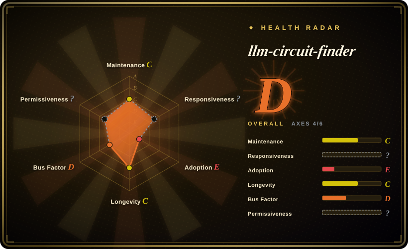
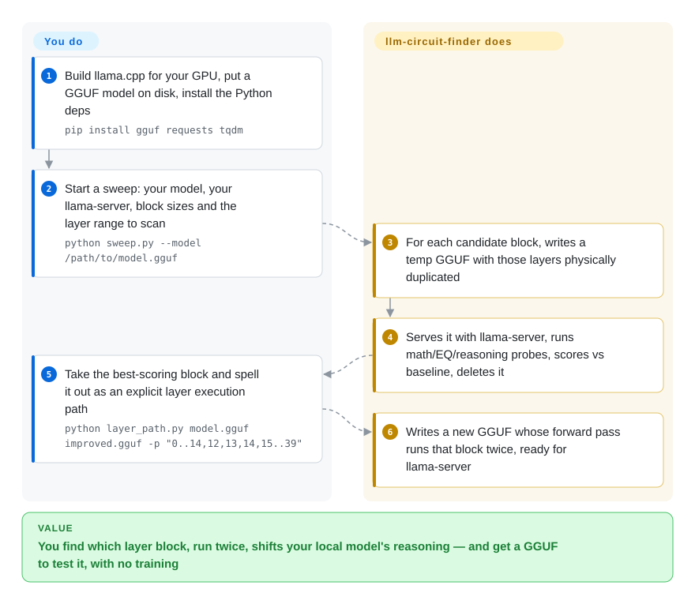

# llm-circuit-finder

A small Python toolkit that searches a GGUF model for contiguous "reasoning circuits" and duplicates those layer blocks in the forward pass — no training, no weight edits, just re-routing hidden states through the same layers twice — then validates the effect with probes and lm-evaluation-harness.

## When to use

You're a hobbyist or independent researcher with a couple of consumer GPUs and a quantized GGUF of some open model (Devstral, Qwen2.5-Coder, Phi-4, whatever you have locally). You read David Ng's RYS post about duplicating layers to make a model "think twice," and you want to actually try it on *your* model without renting an H200 or kicking off a fine-tune. The problem is that "which layers do I duplicate?" has no general answer — the right block is model-specific and the boundaries are sharp. llm-circuit-finder is built for exactly this loop: `sweep.py` performs GGUF surgery to physically duplicate layer ranges, spins up `llama-server` on the modified model, runs three probe suites (math, EQ, BBH-derived reasoning), scores against baseline, deletes the temp GGUF, and moves to the next config — coarse blocks first to find the hot zone, then stride-1 to pin the exact boundaries. Once you've found a circuit, `layer_path.py` lets you bake an explicit execution path (`0..9,7,8,9,10..63`) into a new GGUF and `compare_eval.py` confirms it on standard benchmarks. It's a learn-by-running research demo, not a product: you keep the artifacts (the modified GGUF, the eval JSON) and own the whole pipeline.

## How it works

The technique is RYS layer duplication: a transformer model is a stack of layers that each refine the hidden state (the model's running internal representation of the text), and sending that state through a particular block of layers a second time can shift how well the model reasons. The tool's job is the *search*. You give `sweep.py` your GGUF (llama.cpp's single-file model format) and your `llama-server` binary; for every candidate block it writes a temporary copy of the model with those layers physically duplicated, serves it, runs three small probe suites (math, EQ, BBH-derived reasoning), compares against the unmodified model, and deletes the copy — coarse blocks first to find the hot zone, then stride-1 to pin the boundaries. Picture tasting a soup after adding one more pass of each spice, one spice at a time. Reading the sweep table and deciding which block is a real win is your call; `layer_path.py` then writes the final GGUF with an explicit execution path, and validating it on standard benchmarks with `lm_eval` + `compare_eval.py` is an extra step you run yourself.

<!-- flow-steps:begin (generated from flows/llm-circuit-finder.json by tools/flow_card.py — do not edit) -->

Text version of the flow

1. **You**: Build llama.cpp for your GPU, put a GGUF model on disk, install the Python deps — `pip install gguf requests tqdm`
2. **You**: Start a sweep: your model, your llama-server, block sizes and the layer range to scan — `python sweep.py --model /path/to/model.gguf`
3. **llm-circuit-finder**: For each candidate block, writes a temp GGUF with those layers physically duplicated
4. **llm-circuit-finder**: Serves it with llama-server, runs math/EQ/reasoning probes, scores vs baseline, deletes it
5. **You**: Take the best-scoring block and spell it out as an explicit layer execution path — `python layer_path.py model.gguf improved.gguf -p "0..14,12,13,14,15..39"`
6. **llm-circuit-finder**: Writes a new GGUF whose forward pass runs that block twice, ready for llama-server

**Value**: You find which layer block, run twice, shifts your local model's reasoning — and get a GGUF to test it, with no training

<!-- flow-steps:end -->

## When NOT to use

- **You need reliable, general capability gains.** The repo's own checked-in evals show the trade is real but *not* free: the Devstral-24B surgery raises causal judgement and GSM8k but *drops* IFEval, MBPP, and date understanding — average across all metrics went slightly **down** (0.7610 → 0.7488). This buys a cognitive-profile shift, not a free upgrade.
- **You're not running GGUF / llama.cpp.** The entire pipeline is GGUF + `llama-server`. There's no HF-transformers or vLLM path; PyTorch-checkpoint or API-only models are out of scope.
- **You want a maintained, versioned library.** It's a single-author research demo with no tagged release and no test suite; treat it as code to read and adapt, not a dependency to pin.
- **You can't spare extra VRAM/latency.** Duplicated layers are physical copies in the GGUF — ~1.5 GiB extra for 3 layers on a 24B model and inference slows roughly in proportion to the added layers (~7.5% for 3 extra of 40).
- **You want statistically rigorous claims.** Headline deltas come from small probe suites and `--limit`-capped eval runs on a handful of tasks; they're directional findings on specific models, not benchmarked guarantees.
- **You expect it to "just work" on any model.** The circuit location and size differ per architecture; you have to run the sweep to find them, and a one-layer shift can erase or invert the effect.

## Comparison

| Alternative | In index | Our verdict | Tradeoff |
|---|---|---|---|
| RYS / `mergekit` passthrough (layer-stacking model merges) | 未收录 | Choose mergekit passthrough when you need a general layer-stacking model-merge tool. | mergekit's `passthrough` method also duplicates/stacks layers, but it's a general model-merging toolkit aimed at producing a finished merged model; llm-circuit-finder adds the *search* loop (sweep + probes) to discover *which* block to duplicate and validate it. |
| lm-evaluation-harness | 未收录 | Choose lm-evaluation-harness when you only need the standard benchmark runner. | The standard benchmark runner this repo calls out to for validation; it measures models but doesn't perform or search layer surgery. |
| Mechanistic-interpretability circuit tooling (e.g. TransformerLens) | 未收录 | Choose mechanistic-interpretability tooling when you need feature-level understanding via patching/ablation. | Studies circuits via activation patching/ablation on HF models for *understanding*; this repo is a coarse, capability-oriented "duplicate whole layer blocks in GGUF and measure" demo, not feature-level interp. |
| Fine-tuning / LoRA stacks | 未收录 | Choose fine-tuning or LoRA stacks when you need to change weights to improve a capability. | Change weights to improve a capability; this is orthogonal (no training) and the author notes you can stack both. Different cost/benefit and reproducibility profile. |

## Tech stack

- **Language:** Python (≈3.10+), a set of standalone CLI scripts (`sweep.py`, `layer_path.py`, `gguf_surgery.py`, probe scripts, `compare_eval.py`, `visualize.py`).
- **Model format / runtime:** GGUF models served by `llama.cpp`'s `llama-server` (CPU, CUDA, Vulkan, or Metal builds).
- **Core mechanism:** GGUF layer-duplication "surgery" producing a modified model with an explicit layer execution path, written to tmpfs (`/dev/shm`) and deleted per test.
- **Evaluation:** built-in math / EQ / BBH-derived reasoning probes; optional EleutherAI lm-evaluation-harness for standard benchmarks (BBH, GSM8k, IFEval, MBPP).
- **Viz:** optional `matplotlib` text/PNG heatmaps of sweep results.

## Dependencies

- **Required Python:** `gguf`, `requests`, `tqdm` (per the README quick-start `pip install`).
- **External binaries:** a built `llama.cpp` (`llama-server`) with the right backend for your hardware.
- **Optional:** `lm-eval` (lm-evaluation-harness) for benchmark validation; `matplotlib` for heatmaps.
- **Hardware:** Linux; enough VRAM/RAM to hold the model plus the extra duplicated layers. Author developed on two AMD consumer GPUs (RX 7900 XT + RX 6950 XT) and ran fuller evals on a rented H200.

## Ops difficulty

**Medium.** No service to deploy and no training infra, but you must build llama.cpp for your backend, have a GGUF model on disk, and wire `llama-server` ports/devices correctly; sweeps spawn/kill servers and write large temp GGUFs to tmpfs, so you need the RAM and disk headroom. Validation via lm-evaluation-harness adds its own setup. It's a run-it-yourself research script, so expect to read the code and tune flags rather than follow a turnkey path; no packaging, versioning, or CI to lean on.

## Health & viability

- **Responsiveness**: Cannot be scored — too_young.
- **Maintenance (as of 2026-10-08):** all 18 commits landed 2026-03-18..20 and nothing has been pushed since (~6.5 months), no tagged release, no test suite or CI visible. [推断] It has the shape of a one-off research drop, not a maintained tool — there's no cadence to track.
- **Governance / bus factor:** a **single-author** repo under a personal account with only ~240 stars — minimal bus factor and no community process. If the author stops, it stops; you should expect to read and adapt the scripts yourself rather than file issues and wait.
- **Age & Lindy verdict (created 2026-03, ~0 yr):** brand-new and tiny. [推断] **Unproven by Lindy** — neither old nor widely adopted; its credibility rests on the technique (RYS layer-duplication) and the author's own checked-in evals, not on survival or usage. Treat it as a learn-by-running demo.
- **Risk flags:** README claims MIT but the repo has no LICENSE file and GitHub's API detects no license (re-checked 2026-10-08) — a real licensing ambiguity to resolve before depending on it. Results are directional (small probe suites, `--limit`-capped runs) and the headline gains are net-negative on some metrics, so don't read it as a validated capability boost. [未验证]

## Caveats (unverified)

- [未验证] License is stated as "MIT" in the README, but GitHub's API reports no detected license file (no SPDX match) for the repo, and the file tree has no LICENSE file (re-checked 2026-10-08) — the only grant is the README's one-word `## License` section.
- [未验证] Star count ~242 and last commit 2026-03-20 as of 2026-10-08; GitHub stars are unreliable and date-sensitive — treat as indicative only.
- [未验证] Headline result claims (e.g. logical deduction 0.22→0.76, reasoning +23% on Qwen2.5-Coder-32B, the Devstral all-metric average 0.7610→0.7488) are the author's own probe/eval numbers on specific quantized models with capped sample sizes; not independently reproduced here.
- [未验证] The README's one-line summary cites "Qwen2.5-32B" while the Results section uses "Qwen2.5-Coder-32B" and gives different duplicated-layer indices (7-9 vs the summary's "3 specific layers"); the exact model/layers for each headline figure should be read off the results folder, not the summary.
- [推断] No tagged release, test suite, or CI is visible in the file tree, so the "maturity: research demo" framing is inferred from repo structure (standalone scripts + a results/ folder), not a declared project status.
- [推断] "Works on most transformer models" is the author's expectation extrapolated from Mistral/Qwen2 architectures and Ng's Qwen2-72B work; it is not verified across architectures.
