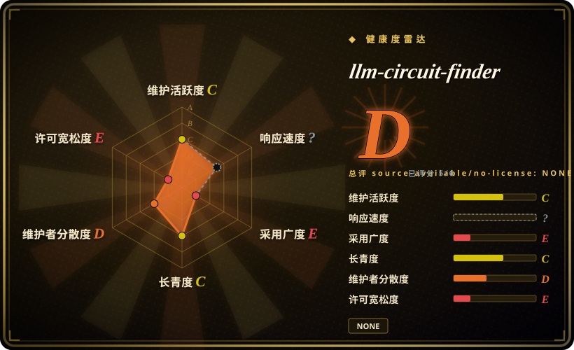
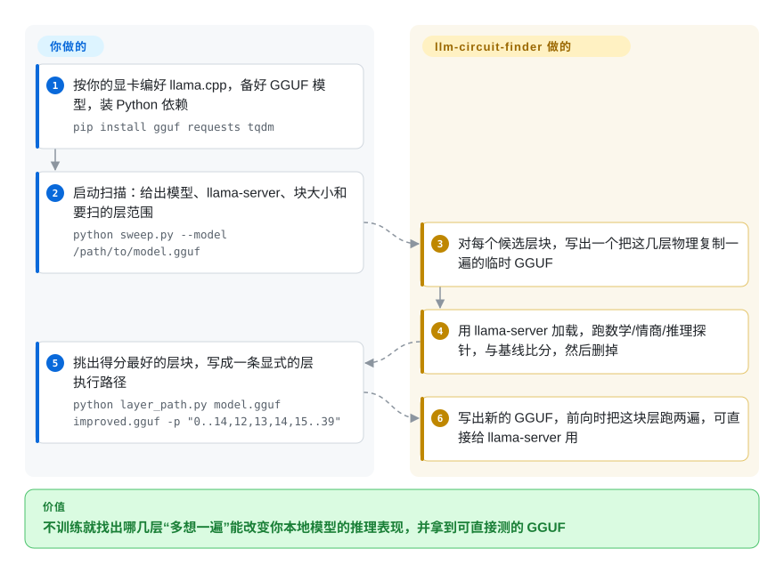

# llm-circuit-finder

一个小巧的 Python 工具集：在 GGUF 模型里搜索连续的「推理电路」层块，并在前向传播中把这些层块复制一遍——不训练、不改权重，只是让 hidden states 再过同一批层一次——然后用内置探针和 lm-evaluation-harness 验证效果。

## 何时使用

你是个手头有两张消费级显卡、本地存着某个开源模型量化 GGUF（Devstral、Qwen2.5-Coder、Phi-4，手边有啥都行）的业余爱好者或独立研究者。你读了 David Ng 关于「复制层让模型多想一遍」的 RYS 文章，想在*你自己的*模型上真刀真枪试一下，又不想去租 H200、也不想跑微调。难点在于「到底复制哪几层」没有通用答案——正确的层块依模型而定，而且边界很尖锐。llm-circuit-finder 正是为这个循环而生：`sweep.py` 做 GGUF 手术、物理复制某段层范围，在改过的模型上拉起 `llama-server`，跑三套探针（数学、EQ、BBH 衍生的推理），与基线打分对比，删掉临时 GGUF，再换下一个配置——先用大块粗扫找到热区，再用 stride-1 钉死精确边界。一旦找到电路，`layer_path.py` 让你把显式执行路径（`0..9,7,8,9,10..63`）烤进一个新的 GGUF，`compare_eval.py` 在标准基准上复核。它是个边跑边学的研究 demo，不是产品：产物（改过的 GGUF、eval JSON）归你，整条流水线也由你掌控。

## 怎么用起来

它用的技术叫 RYS 层复制：transformer 模型是一摞层，每层都在加工隐藏状态（模型对这段文本的内部表示，边算边更新），让这个状态把某一段层再走一遍，可能改变模型推理的好坏。这个工具负责的是*搜索*。你把自己的 GGUF（llama.cpp 用的单文件模型格式）和 `llama-server` 交给 `sweep.py`；它对每个候选层块写出一份把这几层物理复制一遍的临时模型，加载起来，跑三组小探针（数学、情商、基于 BBH 的推理），和原模型比分，再删掉临时文件——先用大块找“热区”，再按步长 1 卡准边界。好比一锅汤，每次只给一种调料多加一遍，尝一口再决定。看扫描结果、判断哪个层块是真收益，是你的事；之后用 `layer_path.py` 按显式执行路径写出最终 GGUF，再用 `lm_eval` 加 `compare_eval.py` 在标准基准上验证，也要你自己额外去跑。

<!-- flow-steps:begin (generated from flows/llm-circuit-finder.json by tools/flow_card.py — do not edit) -->

流程文字版

1. **你**：按你的显卡编好 llama.cpp，备好 GGUF 模型，装 Python 依赖 — `pip install gguf requests tqdm`
2. **你**：启动扫描：给出模型、llama-server、块大小和要扫的层范围 — `python sweep.py --model /path/to/model.gguf`
3. **llm-circuit-finder**：对每个候选层块，写出一个把这几层物理复制一遍的临时 GGUF
4. **llm-circuit-finder**：用 llama-server 加载，跑数学/情商/推理探针，与基线比分，然后删掉
5. **你**：挑出得分最好的层块，写成一条显式的层执行路径 — `python layer_path.py model.gguf improved.gguf -p "0..14,12,13,14,15..39"`
6. **llm-circuit-finder**：写出新的 GGUF，前向时把这块层跑两遍，可直接给 llama-server 用

**价值**：不训练就找出哪几层“多想一遍”能改变你本地模型的推理表现，并拿到可直接测的 GGUF

<!-- flow-steps:end -->

## 何时不用

- **你想要稳定、通用的能力提升。** 仓库自带的 eval 显示这笔交易是真的、但*并不免费*：Devstral-24B 手术抬高了 causal judgement 和 GSM8k，却*拉低*了 IFEval、MBPP 和 date understanding——全指标平均反而略**降**（0.7610 → 0.7488）。它换来的是认知画像的偏移，不是白嫖的升级。
- **你没在用 GGUF / llama.cpp。** 整条流水线都是 GGUF + `llama-server`。没有 HF-transformers 或 vLLM 路径；PyTorch checkpoint 或纯 API 模型不在范围内。
- **你想要一个有维护、有版本的库。** 它是单作者研究 demo，没有打 tag 的 release、也没有测试套件；当作可读可改的代码，而不是要 pin 的依赖。
- **你挤不出额外的 VRAM/延迟。** 复制的层是 GGUF 里的物理拷贝——24B 模型复制 3 层约多吃 1.5 GiB，推理大致按增加的层数成比例变慢（40 层里多 3 层约慢 7.5%）。
- **你需要统计上严谨的结论。** 头条数字来自小规模探针套件和被 `--limit` 截断、只跑几个任务的 eval；它们是特定模型上的方向性发现，不是带保证的基准。
- **你指望它在任何模型上「开箱即用」。** 电路位置和大小随架构不同；你必须跑 sweep 去找，而且层块挪动一层就可能让效果消失甚至反转。

## 横向对比

| 替代品 | 是否收录 | 我们的评价 | 取舍 |
|---|---|---|---|
| RYS / `mergekit` passthrough（层堆叠式模型合并） | 未收录 | 需要通用的层堆叠模型合并工具时，选 mergekit passthrough。 | mergekit 的 `passthrough` 方法同样会复制/堆叠层，但它是个通用模型合并工具、目标是产出一个合并好的成品模型；llm-circuit-finder 多了*搜索*循环（sweep + 探针）来发现*该复制哪个*层块并验证它。 |
| lm-evaluation-harness | 未收录 | 只需要标准基准运行器时，选 lm-evaluation-harness。 | 本仓库调用的标准基准运行器；它度量模型，但不做、也不搜索层手术。 |
| 机理可解释性电路工具（如 TransformerLens） | 未收录 | 需要通过 patching/消融做 feature 级理解时，选机理可解释性工具。 | 通过在 HF 模型上做 activation patching/消融来*理解*电路；本仓库是个粗粒度、面向能力的「在 GGUF 里复制整段层块并测量」demo，不是 feature 级别的可解释性。 |
| 微调 / LoRA 栈 | 未收录 | 需要改权重来提升能力时，选微调或 LoRA 栈。 | 改权重来提升某个能力；本工具与之正交（不训练），作者也指出两者可以叠加。成本/收益和可复现性画像不同。 |

## 技术栈

- **语言：** Python（约 3.10+），一组独立 CLI 脚本（`sweep.py`、`layer_path.py`、`gguf_surgery.py`、各探针脚本、`compare_eval.py`、`visualize.py`）。
- **模型格式 / 运行时：** 由 `llama.cpp` 的 `llama-server` 加载的 GGUF 模型（CPU、CUDA、Vulkan 或 Metal 构建）。
- **核心机制：** GGUF 层复制「手术」，产出带显式层执行路径的改造模型，写到 tmpfs（`/dev/shm`）并在每次测试后删除。
- **评测：** 内置数学 / EQ / BBH 衍生推理探针；可选用 EleutherAI 的 lm-evaluation-harness 跑标准基准（BBH、GSM8k、IFEval、MBPP）。
- **可视化：** 可选 `matplotlib`，对 sweep 结果出文本/PNG 热力图。

## 依赖

- **必需 Python 包：** `gguf`、`requests`、`tqdm`（按 README quick-start 的 `pip install`）。
- **外部二进制：** 一份按你硬件后端编译好的 `llama.cpp`（`llama-server`）。
- **可选：** `lm-eval`（lm-evaluation-harness）用于基准验证；`matplotlib` 用于热力图。
- **硬件：** Linux；足够装下模型加上额外复制层的 VRAM/RAM。作者在两张 AMD 消费级显卡（RX 7900 XT + RX 6950 XT）上开发，并在租来的 H200 上跑了更完整的 eval。

## 运维难度

**中等。** 没有服务要部署、也没有训练基础设施，但你得为你的后端编译 llama.cpp、磁盘上备好一个 GGUF 模型、并正确接好 `llama-server` 的端口/设备；sweep 会反复拉起/杀掉 server 并向 tmpfs 写大块临时 GGUF，所以你需要相应的 RAM 和磁盘余量。用 lm-evaluation-harness 做验证又会带来它自己的配置。它是个自己跑的研究脚本，所以预期是读代码、调参数，而不是走一条交钥匙路径；没有打包、版本或 CI 可以依靠。

## 健康度与可持续性

- **响应速度**：无法计算——too_young。
- **维护（截至 2026-10-08）：** 全部 18 个提交都落在 2026-03-18 至 20 日，此后再无推送（约 6.5 个月），无打 tag 的 release，也看不到测试套件或 CI。[推断] 形态像一次性的研究投放，而非受维护的工具——没有节奏可追踪。
- **治理 / bus factor：** 这是挂在个人账号下的**单作者**仓库，仅约 240 star——bus factor 极低、无社区流程。作者一停它就停；你应预期自己读代码、改脚本，而不是提 issue 等回应。
- **年龄与 Lindy 判定（创建于 2026-03，约 0 年）：** 全新且体量很小。[推断] **Lindy 上未经证明**——既不老也未被广泛采用；它的可信度建立在技术本身（RYS 层复制）和作者自带的 eval 上，而非存活或使用量。把它当作边跑边学的 demo。
- **风险标记：** README 称 MIT，但仓库里没有 LICENSE 文件，GitHub API 也检测不到许可证（2026-10-08 复核）——这是依赖前需先解决的真实许可歧义。结果是方向性的（小探针套件、`--limit` 截断的运行），且头条收益在部分指标上净为负，所以别把它读成一次已验证的能力提升。[未验证]

## 存疑（未验证）

- [未验证] README 里写着 license 为「MIT」，但 GitHub API 报告仓库未检测到 license（无 SPDX 匹配），文件树里也没有 LICENSE 文件（2026-10-08 复核）——唯一的授权依据是 README 里一个词的 `## License` 小节。
- [未验证] 截至 2026-10-08，star 约 242、最后一次提交为 2026-03-20；GitHub star 不可靠且与日期强相关——仅作参考。
- [未验证] 头条结果（如 logical deduction 0.22→0.76、Qwen2.5-Coder-32B 推理 +23%、Devstral 全指标平均 0.7610→0.7488）是作者本人在特定量化模型上、用受限样本量跑出的探针/eval 数字；本页未做独立复现。
- [未验证] README 摘要写的是「Qwen2.5-32B」，而 Results 小节用的是「Qwen2.5-Coder-32B」且给出了不同的复制层序号（7-9 对摘要里的「3 specific layers」）；每个头条数字对应的确切模型/层数应从 results 文件夹读取，而非摘要。
- [推断] 文件树里看不到打 tag 的 release、测试套件或 CI，所以「maturity: research demo」这一定性是从仓库结构（独立脚本 + 一个 results/ 文件夹）推断的，并非项目声明的状态。
- [推断] 「在大多数 transformer 模型上都能用」是作者从 Mistral/Qwen2 架构和 Ng 的 Qwen2-72B 工作外推出的预期，未跨架构验证。
