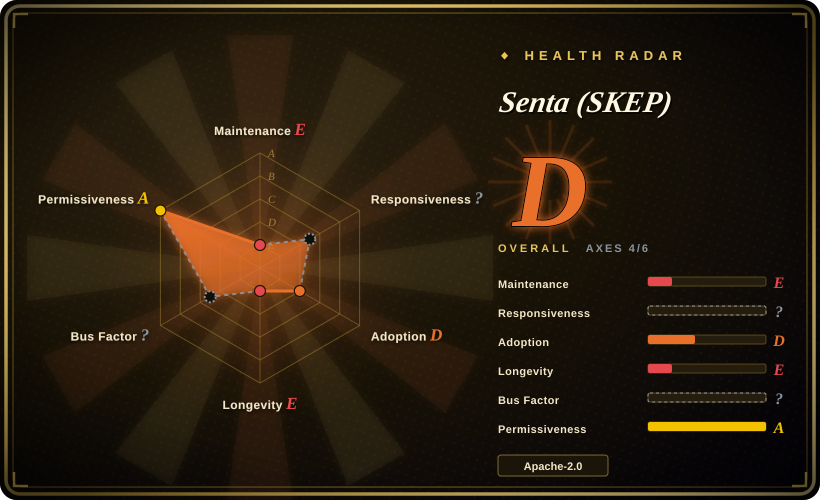
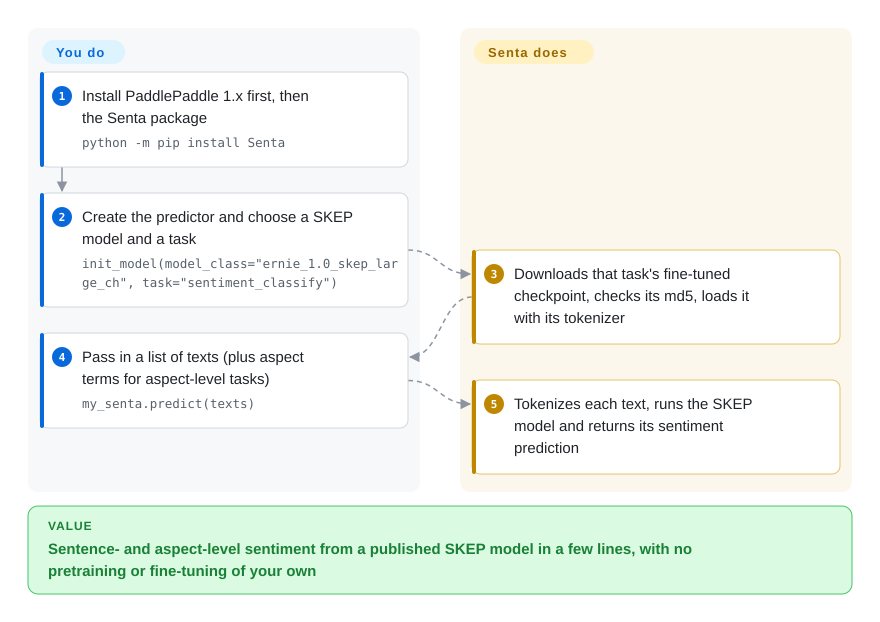

# Senta (SKEP)

Baidu's open-source sentiment-analysis toolkit built on SKEP — a sentiment-knowledge-enhanced pretraining method (ACL 2020) — shipping Chinese/English pretrained models and a one-line prediction tool, all on the PaddlePaddle 1.x framework.

## When to use

You're an NLP researcher or a product engineer working primarily in Chinese, and you need sentiment analysis — sentence-level polarity, aspect-level sentiment, or opinion-role extraction — with strong reported accuracy on Chinese benchmarks (ChnSentiCorp, NLPCC). You want to *reproduce or build on the SKEP paper* rather than train from scratch. You clone Senta, install PaddlePaddle, download the released SKEP Chinese/English checkpoints (initialized from ERNIE/RoBERTa), and use the bundled one-click predictor to score text in a few lines, or fine-tune on your own data using the provided training scripts.

You reach for it specifically when you're inside the **PaddlePaddle / ERNIE ecosystem** and want a sentiment-specialized pretrained model with a published method behind it — the value is the SKEP models and the reproducible benchmark setup, not a general-purpose, framework-agnostic library.

## How it works

The asset is SKEP: Baidu took general pretrained language models (ERNIE, RoBERTa — models that already learned a language from huge unlabeled text) and pretrained them further with sentiment knowledge, masking and predicting sentiment words and aspect–opinion pairs so the model learns which words carry feeling. Senta ships those models already fine-tuned for three tasks — sentence-level polarity, aspect-level sentiment (how the text feels about one named thing, say the battery), and opinion extraction. On the one-click path you install PaddlePaddle 1.x yourself, `pip install Senta`, create a `Senta()` object and call `init_model()` with a model name and a task; Senta downloads that checkpoint, checks its md5 and loads it with the right tokenizer, and `predict()` then scores your texts. You still own the legacy Paddle/CUDA environment; retraining or reproducing the paper numbers is a separate path through the `script/` shell scripts and the `model_files/` download scripts.

<!-- flow-steps:begin (generated from flows/senta.json by tools/flow_card.py — do not edit) -->

Text version of the flow

1. **You**: Install PaddlePaddle 1.x first, then the Senta package — `python -m pip install Senta`
2. **You**: Create the predictor and choose a SKEP model and a task — `init_model(model_class="ernie_1.0_skep_large_ch", task="sentiment_classify")`
3. **Senta (SKEP)**: Downloads that task's fine-tuned checkpoint, checks its md5, loads it with its tokenizer
4. **You**: Pass in a list of texts (plus aspect terms for aspect-level tasks) — `my_senta.predict(texts)`
5. **Senta (SKEP)**: Tokenizes each text, runs the SKEP model and returns its sentiment prediction

**Value**: Sentence- and aspect-level sentiment from a published SKEP model in a few lines, with no pretraining or fine-tuning of your own

<!-- flow-steps:end -->

## When NOT to use

- **You're not on PaddlePaddle.** It targets PaddlePaddle 1.6.3 specifically — an old, pre-2.0 Paddle release. If your stack is PyTorch/TF/HF Transformers, the integration cost is high and there's no first-class port here. For most teams a Hugging Face sentiment model is the lower-friction path. [推断]
- **You need a maintained, current toolkit.** No commits since 2020-06, pinned to a long-superseded Paddle 1.x and old NLP deps; expect environment archaeology and no upstream fixes. Baidu's newer NLP work lives in PaddleNLP/ERNIE repos, not here.
- **You want easy, modern install.** PaddlePaddle 1.6.3 + CUDA 10.1 + cuDNN 7.4 + NCCL2 with hand-set `LD_LIBRARY_PATH` (per `env.sh`) is a heavy, dated GPU setup, not a `pip install` and go. [推断]
- **English-first or multilingual-broad needs.** It does ship English SKEP, but the project's emphasis and strongest story is Chinese sentiment; broad multilingual sentiment is better served elsewhere.
- **Production serving at scale.** This is research/reference code; you'd wrap and harden it yourself, and you'd be doing so on an EOL framework version.

## Comparison

| Alternative | In index | Our verdict | Tradeoff |
|---|---|---|---|
| Hugging Face sentiment models | 未收录 | Choose Hugging Face sentiment models when you need a large catalog of fine-tuned models with easy integration. | Huge catalog of fine-tuned sentiment models (incl. Chinese) on PyTorch/Transformers with trivial install; not the specific SKEP method, but far easier to adopt and maintain. |
| PaddleNLP / ERNIE | 未收录 | Choose PaddleNLP/ERNIE when you need Baidu's actively maintained successor NLP stack on Paddle 2.x. | Baidu's actively-maintained successor NLP stack on Paddle 2.x; where current Baidu NLP (incl. sentiment) development actually happens — Senta is the older, frozen sibling. |
| SnowNLP / cnsenti | 未收录 | Choose SnowNLP or cnsenti when you need lightweight Chinese sentiment libraries. | Lightweight Chinese sentiment libraries (lexicon/classic ML); trivial to run, far weaker than pretrained transformers — opposite end of the accuracy/effort tradeoff. |
| [CLIP](../vision-and-multimodal/clip.md) | ✅ | Choose CLIP when you need a same-shelf reference model release in vision-language rather than sentiment analysis. | Unrelated modality (vision-language) but the same shelf — an org-published reference model release where the *checkpoints + paper* are the asset, not active library maintenance. |

## Tech stack

- **Language:** Python.
- **Framework:** PaddlePaddle 1.6.3 (Baidu's deep-learning framework, 1.x line).
- **Method/models:** SKEP sentiment pretraining; released Chinese/English checkpoints initialized from ERNIE 1.0/2.0 and RoBERTa.
- **Supporting libs:** `nltk`, `numpy`, `scikit-learn`, `sentencepiece`, `six` (pinned, older versions).
- **Surface:** training (`train.py`), inference (`infer.py`), a one-click prediction tool, and config/data scaffolding.

## Dependencies

- **Framework:** PaddlePaddle 1.6.3 (the README pins `paddlepaddle-gpu==1.6.3.post107`); a GPU build is the expected path.
- **System (GPU path):** CUDA 10.1, cuDNN 7.4, NCCL2, with library paths exported manually via `env.sh`.
- **Models:** SKEP Chinese/English checkpoints must be downloaded separately into `model_files/` (not in-repo).
- **Python libs:** `nltk==3.4.5`, `numpy==1.14.5`, `scikit-learn==0.20.4`, `sentencepiece==0.1.83`, `six` — all old pins. [推断]

## Ops difficulty

**High, driven by the framework.** The model usage itself is straightforward (download checkpoint, run the predictor), but the *environment* is the burden: PaddlePaddle 1.6.3 is a pre-2.0 release tied to CUDA 10.1 / cuDNN 7.4 / NCCL2, configured by hand-editing `env.sh` and `LD_LIBRARY_PATH`. Reproducing that GPU stack in 2026 means pinning old CUDA and an EOL Paddle, almost certainly inside a container. Because the project is idle, you get no help when the dated stack breaks. Inference on a single GPU is light; the difficulty is purely getting the legacy framework to run.

## Health & viability

- **Responsiveness**: Cannot be scored — no_traffic.
- **Maintenance (2026-10).** Last commit on the default branch 2020-06 (the 2024-08 `pushed_at` brought no default-branch commit); last PyPI release `Senta` 2.0.0 in 2020-05; no GitHub releases; ~74 open issues. Effectively **idle/coasting** — the SKEP work is "published and frozen", with active Baidu NLP development moved to PaddleNLP/ERNIE. [推断]
- **Governance / backing.** Backed by **Baidu** (Organization owner) — real institutional weight and a peer-reviewed method (ACL 2020) behind it. But big-vendor backing doesn't equal *this repo* being maintained; Baidu has clearly moved its NLP roadmap elsewhere. Bus-factor concern is "superseded by sibling project", not "lone hobbyist". [推断]
- **Age & Lindy verdict.** Created 2018-07 (~8 years, quiet for the last ~6) but **not currently active** ⇒ age is not Lindy on its own here; its durable value is the SKEP method/checkpoints, not living maintenance. [推断]
- **Adoption.** ~2.0k stars / ~360 forks; cited via the SKEP ACL 2020 paper and used in the Paddle/ERNIE community. [未验证]
- **Risk flags.** **EOL framework pin** (PaddlePaddle 1.6.3) is the dominant risk — it gates every other thing; license itself (Apache-2.0) is permissive and not a concern. The one-click predictor also downloads checkpoints with TLS certificate checks turned off (`requests.get(url, verify=False, ...)` in `senta/train.py`; it does compare an md5 fetched over the same channel). [推断]

## Caveats (unverified)

- [未验证] ~2.0k stars / ~360 forks / ~74 open issues as of 2026-10-08; counts are date-sensitive and indicative only.
- [未验证] Exact availability/locations of the SKEP checkpoint downloads are not re-verified here; the README points to `model_files/` download steps.
- [推断] "PaddlePaddle 1.6.3 + CUDA 10.1 won't install easily on a modern machine" is inferred from the pinned versions and `env.sh`, not from a tested install on current hardware.
- [未验证] Only one of the checkpoint URLs `init_model()` downloads (`senta.bj.bcebos.com/skep/1a/model_files.tar.gz`, ~1.2 GB) was HEAD-checked and answered 200 on 2026-10-08; the other models' URLs were not checked, and a dead one breaks the one-click path for that model.
- [推断] "Development moved to PaddleNLP/ERNIE" is inferred from this repo's idleness plus Baidu's known active NLP repos, not from an explicit deprecation notice in Senta.
