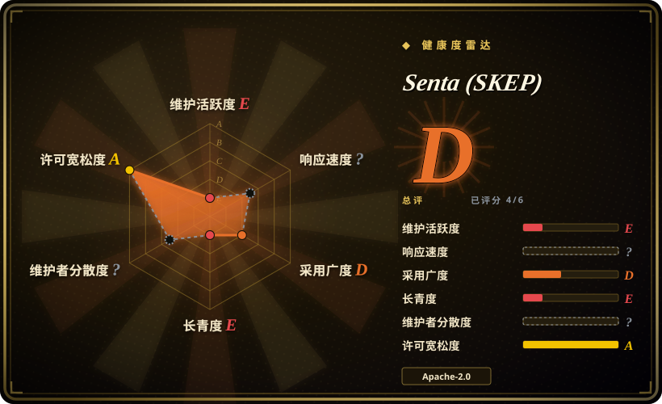
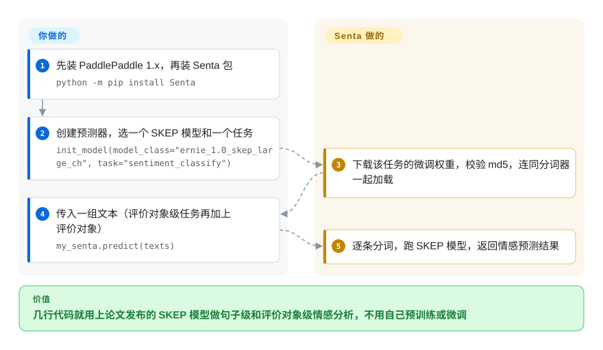

# Senta (SKEP)

百度开源的情感分析工具包，基于 SKEP——一种情感知识增强的预训练方法（ACL 2020）——提供中英文预训练模型和一键预测工具，全部跑在 PaddlePaddle 1.x 框架上。

## 何时使用

你是个主要做中文的 NLP 研究者或产品工程师，需要情感分析——句子级极性、评价对象级情感，或观点角色抽取——并希望在中文基准（ChnSentiCorp、NLPCC）上有不错的报告精度。你想*复现或在 SKEP 论文上做拓展*，而非从零训练。你 clone Senta，装上 PaddlePaddle，下载发布的 SKEP 中英文 checkpoint（由 ERNIE/RoBERTa 初始化），用自带的一键预测器几行代码给文本打分，或用提供的训练脚本在自己的数据上微调。

你选它，正是当你身处 **PaddlePaddle / ERNIE 生态**、想要一个背后有发表方法的情感专用预训练模型时——价值在于 SKEP 模型和可复现的基准设置，而非一个通用、框架无关的库。

## 怎么用起来

真正的资产是 SKEP：百度拿通用预训练语言模型（ERNIE、RoBERTa——已经从海量无标注文本里学会一门语言的模型），再用情感知识继续预训练：遮住情感词和“评价对象—观点”词对让模型去猜，从而学会哪些词带情绪。Senta 把这些模型针对三个任务微调好了——句子级情感极性、评价对象级情感（文本对某个具体对象的态度，比如“电池”）和观点抽取。走一键化路径时，你自己装好 PaddlePaddle 1.x，`pip install Senta`，创建 `Senta()` 对象，用模型名和任务名调用 `init_model()`；Senta 会下载对应权重、校验 md5、配好分词器加载起来，之后 `predict()` 给你的文本打分。老旧的 Paddle/CUDA 环境仍得你自己维护；重训或复现论文数字是另一条路，要用 `script/` 下的 shell 脚本和 `model_files/` 里的下载脚本。

<!-- flow-steps:begin (generated from flows/senta.json by tools/flow_card.py — do not edit) -->

流程文字版

1. **你**：先装 PaddlePaddle 1.x，再装 Senta 包 — `python -m pip install Senta`
2. **你**：创建预测器，选一个 SKEP 模型和一个任务 — `init_model(model_class="ernie_1.0_skep_large_ch", task="sentiment_classify")`
3. **Senta (SKEP)**：下载该任务的微调权重，校验 md5，连同分词器一起加载
4. **你**：传入一组文本（评价对象级任务再加上评价对象） — `my_senta.predict(texts)`
5. **Senta (SKEP)**：逐条分词，跑 SKEP 模型，返回情感预测结果

**价值**：几行代码就用上论文发布的 SKEP 模型做句子级和评价对象级情感分析，不用自己预训练或微调

<!-- flow-steps:end -->

## 何时不用

- **你不在 PaddlePaddle 上。** 它专门面向 PaddlePaddle 1.6.3——一个老的、2.0 之前的 Paddle 版本。若你的栈是 PyTorch/TF/HF Transformers，集成成本很高，这里也没有一流的移植。对多数团队，Hugging Face 上的情感模型是摩擦更小的路径。[推断]
- **你需要维护中的、当下的工具包。** 自 2020-06 起再无提交，钉死在早被取代的 Paddle 1.x 和老 NLP 依赖上；预期要做环境考古且无上游修复。百度更新的 NLP 工作在 PaddleNLP/ERNIE 仓库里，不在这。
- **你想要轻松、现代的安装。** PaddlePaddle 1.6.3 加 CUDA 10.1 加 cuDNN 7.4 加 NCCL2，还要手设 `LD_LIBRARY_PATH`（见 `env.sh`），是一套又重又旧的 GPU 配置，不是 `pip install` 就走。[推断]
- **以英文为先或要广覆盖多语言。** 它确实带英文 SKEP，但项目的重心和最强的故事是中文情感；广覆盖的多语言情感在别处更合适。
- **规模化的生产推理服务。** 这是研究/参考代码；你得自己封装加固，而且是在一个 EOL 框架版本上做。

## 横向对比

| 替代品 | 是否收录 | 我们的评价 | 取舍 |
|---|---|---|---|
| Hugging Face 情感模型 | 未收录 | 需要大量微调好的情感模型和简单集成时，选 Hugging Face 情感模型。 | PyTorch/Transformers 上海量微调好的情感模型（含中文），安装极简；不是 SKEP 这个具体方法，但采用与维护都容易得多。 |
| PaddleNLP / ERNIE | 未收录 | 需要百度在 Paddle 2.x 上维护中的后继 NLP 栈时，选 PaddleNLP/ERNIE。 | 百度在 Paddle 2.x 上积极维护的后继 NLP 栈；当下百度 NLP（含情感）开发实际发生的地方——Senta 是更老、已冻结的同门。 |
| SnowNLP / cnsenti | 未收录 | 需要轻量中文情感库时，选 SnowNLP 或 cnsenti。 | 轻量中文情感库（词典/经典 ML）；跑起来极简，远弱于预训练 transformer——精度/成本权衡的另一端。 |
| [CLIP](../vision-and-multimodal/clip.zh.md) | ✅ | 需要视觉语言方向的同货架参考模型发布时，选 CLIP。 | 模态无关（视觉语言）但同一货架——机构发布的参考模型，资产是*checkpoint 加论文*，而非活跃的库维护。 |

## 技术栈

- **语言：** Python。
- **框架：** PaddlePaddle 1.6.3（百度的深度学习框架，1.x 线）。
- **方法/模型：** SKEP 情感预训练；发布的中英文 checkpoint，由 ERNIE 1.0/2.0 和 RoBERTa 初始化。
- **支撑库：** `nltk`、`numpy`、`scikit-learn`、`sentencepiece`、`six`（钉死的较老版本）。
- **接口：** 训练（`train.py`）、推理（`infer.py`）、一键预测工具，以及配置/数据脚手架。

## 依赖

- **框架：** PaddlePaddle 1.6.3（README 钉死 `paddlepaddle-gpu==1.6.3.post107`）；预期走 GPU 构建。
- **系统（GPU 路径）：** CUDA 10.1、cuDNN 7.4、NCCL2，库路径经 `env.sh` 手动导出。
- **模型：** SKEP 中英文 checkpoint 需单独下载到 `model_files/`（不在仓库内）。
- **Python 库：** `nltk==3.4.5`、`numpy==1.14.5`、`scikit-learn==0.20.4`、`sentencepiece==0.1.83`、`six`——全是老钉死版。[推断]

## 运维难度

**高，由框架驱动。** 模型使用本身直白（下载 checkpoint、跑预测器），但*环境*才是负担：PaddlePaddle 1.6.3 是 2.0 之前的版本，绑定 CUDA 10.1 / cuDNN 7.4 / NCCL2，靠手改 `env.sh` 和 `LD_LIBRARY_PATH` 配置。2026 年复现那套 GPU 栈，意味着钉老 CUDA 和一个 EOL 的 Paddle，几乎肯定要在容器里做。因为项目停摆，旧栈崩了你也得不到帮助。单 GPU 推理很轻；难点纯粹是让遗留框架跑起来。

## 健康度与可持续性

- **响应速度**：无法计算——no_traffic。
- **维护（2026-10）。** 默认分支最后提交在 2020-06（2024-08 的 `pushed_at` 没有带来默认分支提交）；PyPI 上 `Senta` 最后一版 2.0.0 发布于 2020-05；无 GitHub release；约 74 个 open issue。实际上**停摆/吃老本**——SKEP 工作「发布即冻结」，百度活跃的 NLP 开发已转到 PaddleNLP/ERNIE。[推断]
- **治理 / 背书。** 由**百度**背书（Organization owner）——有真正的机构分量，背后是经同行评审的方法（ACL 2020）。但大厂背书不等于*这个仓库*在被维护；百度显然把 NLP 路线图挪到了别处。bus-factor 的顾虑是「被同门项目取代」，而非「孤身爱好者」。[推断]
- **年龄与 Lindy 判断。** 2018-07 创建（约 8 年，近约 6 年无提交）但**当下不活跃**⇒ 此处年龄本身不算 Lindy；它持久的价值是 SKEP 方法/checkpoint，而非活的维护。[推断]
- **采用度。** 约 2.0k star / 约 360 fork；经 SKEP ACL 2020 论文被引用，并在 Paddle/ERNIE 社区中使用。[未验证]
- **风险标记。** **EOL 框架钉死**（PaddlePaddle 1.6.3）是主导风险——它卡住了其他一切；许可本身（Apache-2.0）宽松，不是顾虑。一键化预测器下载权重时还关掉了 TLS 证书校验（`senta/train.py` 里的 `requests.get(url, verify=False, ...)`；它会比对 md5，但 md5 也走同一条通道取回）。[推断]

## 存疑（未验证）

- [未验证] 截至 2026-10-08 约 2.0k star / 约 360 fork / 约 74 个 open issue；数字对时间敏感，仅供参考。
- [未验证] SKEP checkpoint 下载的确切可用性/位置此处未重新核实；README 指向 `model_files/` 的下载步骤。
- [推断]「PaddlePaddle 1.6.3 加 CUDA 10.1 在现代机器上不易安装」是从钉死版本和 `env.sh` 推断，并非来自在当前硬件上的实测安装。
- [未验证] `init_model()` 要下载的权重地址中只 HEAD 探测了一个（`senta.bj.bcebos.com/skep/1a/model_files.tar.gz`，约 1.2 GB），2026-10-08 返回 200；其他模型的地址未查，任何一个失效都会让该模型的一键化路径断掉。
- [推断]「开发已转到 PaddleNLP/ERNIE」是从本仓库停摆加百度已知的活跃 NLP 仓库推断，并非来自 Senta 内明确的弃用声明。
