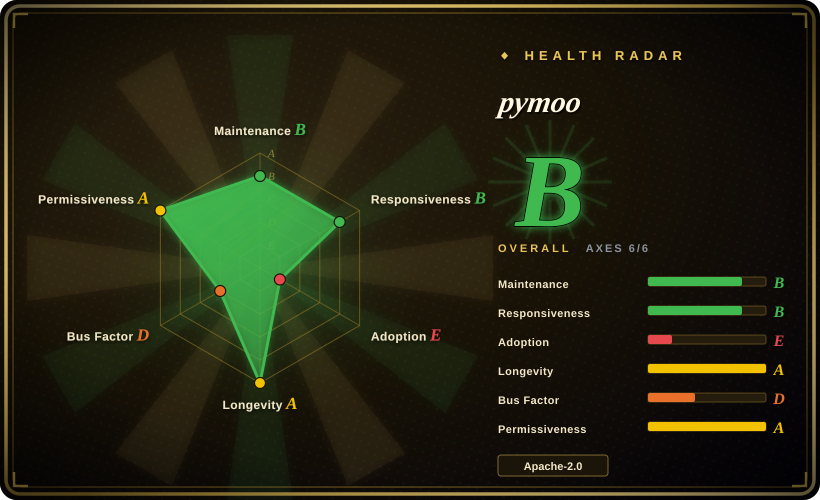

# pymoo

Your problem has several objectives fighting each other — minimize cost *and* weight — so there is no single best answer, only trade-offs. pymoo evolves a population against your evaluation function and hands back a whole Pareto front (the set of non-dominated compromises) with NSGA-II/III, MOEA/D, CMA-ES and friends, plus plotting and decision-making helpers.

## When to use

You're a researcher or engineer with an optimization problem that has **multiple conflicting objectives** — minimize cost *and* weight, maximize throughput *and* reliability — and you need to find the Pareto front, not a single scalar optimum. You define a `Problem` (variables, objectives, constraints), pick an algorithm like `NSGA2`, call `minimize(problem, algorithm, termination)`, and pymoo evolves a population toward the trade-off frontier; then you use its visualization (scatter, PCP) and decision-making modules (e.g. pseudo-weights, compromise programming) to pick a solution. It ships the standard benchmark suites (ZDT, DTLZ, WFG) so you can validate an algorithm before pointing it at your real problem, and it handles mixed/integer variables, constraints, and custom operators.

You reach for it as the **de-facto Python library for evolutionary multi-objective optimization** — when you want well-tested implementations of the canonical algorithms (it's the reference for NSGA-II/III in Python) with a clean, extensible API, rather than re-implementing genetic operators yourself or wiring up a heavier OR solver. [推断]

## How it works

You write one function (or a `Problem` class): give it a vector of decision variables, it returns the objectives (and constraints). pymoo owns the search loop: `minimize(problem, algorithm, termination)` samples an initial population, calls your evaluation function in batches (vectorized or parallel if you make it so), and then the algorithm breeds the next generation — NSGA-II, for example, sorts the merged pool by non-domination (no other solution beats it on *every* objective) and keeps the spread-out front — until your termination (generations, runtime, convergence) fires. What comes back is not one answer but a whole final population: `res.X`/`res.F` are the surviving decision vectors and their objective values, i.e. your Pareto-front approximation, which `pymoo.visualization` (`Scatter`, parallel-coordinates) can plot against the benchmark's known front. What stays yours: the objective function itself (and its compute cost — that's where the real hours go), the evaluation budget, the seed for reproducibility, and the eventual pick of one trade-off to ship — its MCDM modules (pseudo-weights, compromise programming) help you choose.

<!-- flow-steps:begin (generated from flows/pymoo.json by tools/flow_card.py — do not edit) -->

Text version of the flow

1. **You**: Install into your Python environment — `pip install -U pymoo`
2. **You**: Define a problem (or borrow a benchmark) and pick an algorithm — `problem = get_problem("zdt1") · algorithm = NSGA2(pop_size=100)` — component: `Problem / Algorithm`
3. **You**: Run the search with a termination budget and a seed — `res = minimize(problem, algorithm, ('n_gen', 200), seed=1, verbose=True)`
4. **pymoo**: Evolves the population generation by generation toward the trade-off front — component: `NSGA2`
5. **You**: Read the Pareto front off res.F and plot it — `plot.add(res.F, color="red")`

**Value**: A whole trade-off front from one minimize() call, without writing any evolutionary machinery yourself

<!-- flow-steps:end -->

## When NOT to use

- **Your problem is convex / linear / smooth and single-objective.** For LP/QP/convex problems, a proper solver (SciPy, CVXPY, Gurobi/OR-Tools) is vastly faster and gives optimality guarantees that population metaheuristics do not. Don't bring an evolutionary algorithm to a problem gradient descent or an LP solver owns.
- **You need gradient-based / large-scale continuous optimization.** Evolutionary methods are derivative-free and sample-hungry; for high-dimensional differentiable objectives, gradient methods (PyTorch/JAX, scipy.optimize) converge far more efficiently.
- **Each evaluation is very expensive and you have a tiny budget.** Population EAs need many function evaluations; if a single objective eval costs hours, look at Bayesian/surrogate optimization (Ax/BoTorch, Optuna) instead, or pymoo's surrogate-assisted patterns with care. [推断]
- **You want hyperparameter tuning specifically.** Optuna/Ax are purpose-built for that workflow (pruning, dashboards, trial storage); pymoo is a general optimization framework, not an HPO platform.
- **You can't tolerate stochastic, non-reproducible-by-default results.** EAs are randomized; you must fix seeds and run multiple times to characterize performance — that's inherent, not a bug.

## Comparison

| Alternative | In index | Our verdict | Tradeoff |
|---|---|---|---|
| DEAP | 未收录 | Choose DEAP when you need a flexible low-level evolutionary-computation toolkit. | Flexible evolutionary-computation toolkit; very general/low-level, but you assemble more yourself — pymoo gives higher-level, ready multi-objective algorithms and benchmarks. |
| Platypus | 未收录 | Choose Platypus when you need another Python multi-objective EA library. | Another Python multi-objective EA library; smaller scope/community than pymoo's algorithm + tooling breadth. [推断] |
| Optuna / Ax (BoTorch) | 未收录 | Choose Optuna or Ax when you need Bayesian/surrogate optimization for expensive evaluations or HPO. | Bayesian/surrogate optimization, ideal for expensive evaluations and HPO; different paradigm (sample-efficient, not population-based) — complementary, not a drop-in. |
| jMetal (Java/Py) | 未收录 | Choose jMetal when you need an established multi-objective metaheuristics framework in the Java/Python ecosystem. | Established multi-objective metaheuristics framework; jMetalPy mirrors it in Python — comparable goals, different ecosystem and API style. |
| [OR-Tools](../optimization-solvers/or-tools.md) | ✅ | Choose OR-Tools when your problem is structured — linear, integer or routing — and you want an exact answer inside the same Python process; choose pymoo when the objectives genuinely conflict and what you need is a trade-off front, not one optimum. | OR-Tools returns an optimum with a bound but requires the problem to be written as a model; pymoo takes an arbitrary evaluation function and hands back a Pareto set with no optimality guarantee and far more evaluations. |
| SciPy / Gurobi | 未收录 | Choose SciPy when a single-objective LP/convex problem fits `scipy.optimize` and you already depend on it; choose Gurobi when a hard MIP needs commercial performance. Neither is indexed here: SciPy is a general scientific-computing library rather than an optimization solver, and Gurobi is closed-source with no repository. | Exact/convex/MILP solvers; the right tool when your problem is structured, where EAs are the wrong hammer. They are complementary to pymoo rather than substitutes — you reach for them when the problem stops being a black-box multi-objective search. |

## Tech stack

- **Language:** Python (>= 3.10 per `pyproject.toml`).
- **Numeric core:** NumPy + SciPy; `autograd`, `cma`, `moocore` for specific algorithm/metric support; `matplotlib` for visualization; `alive_progress` for progress.
- **Speedups:** some modules ship optional **Cython-compiled** versions for performance (build via the included setup); pure-Python fallback exists if compilation didn't run.
- **Surface:** `Problem`/`Algorithm`/`minimize` API, operator library (sampling/crossover/mutation), test-problem suites, visualization, and MCDM/decision-making modules.

## Dependencies

- **Runtime:** `numpy`, `scipy`, `matplotlib`, `moocore`, `autograd`, `cma`, `alive_progress`, `Deprecated` — all pip-installable, no external services.
- **Build (optional):** a C compiler + `Cython` to build the compiled speedups from source; `pip install pymoo` ships prebuilt Cython wheels for macOS/Windows/manylinux (glibc and musl) across CPython 3.10–3.14 (PyPI, checked 2026-09-28 for 0.6.2).
- **Hardware:** CPU-bound; no GPU required (or used) by the core algorithms.
- **Your problem:** you supply the objective/constraint evaluation — that's where real-world cost lives (e.g. wrapping a simulator).

## Ops difficulty

**Low.** It's a pip-installable library with no services, datastores, or deployment — `pip install -U pymoo` and import. The only operational nuances are: optionally compiling the Cython modules for speed (a build-time concern, with a pure-Python fallback), and the inherent cost of *your* objective function — for expensive simulators you'll manage parallel evaluation (pymoo supports parallelized/vectorized evaluation) and run-time budgets, but that's your problem's cost, not pymoo's. Reproducibility requires fixing random seeds. There is nothing to operate beyond the Python process.

## Health & viability

- **Responsiveness**: Grade B — median first-response time 4.5 hours across 4 qualifying issues/PRs.
- **Maintenance (2026-09).** Last commit on `main` **2026-07-07** (bugfix work on the `como_cmaes` algorithm) and 0 open issues at check time (GitHub API, 2026-09-28) — a tended v0.6.x line, though commit cadence in the trailing quarter is modest, not rapid. Not abandoned. [推断]
- **Governance / backing.** Developed under the `anyoptimization` org (Organization-owned) with a lead maintainer (blankjul) and a real contributor list; tied to academic work (the pymoo IEEE Access paper). Bus factor leans on the lead maintainer but with org structure and multiple contributors — healthier than a lone-author repo. [推断]
- **Age & Lindy verdict.** Created 2017-09 (~8–9 years) **and still actively shipping** ⇒ a **strong Lindy** signal: a mature, long-proven library that remains current, not a hyped newcomer. [推断]
- **Adoption.** ~3.0k stars / 480 forks (GitHub API, 2026-09-28), a citable paper, and use across academic/industrial optimization work; it is a standard reference for NSGA-II/III in Python. [未验证：生产采用广度]
- **Risk flags.** Few. Apache-2.0 (permissive, no relicense history found); the main practical caveat is the general EA caveat (stochastic, evaluation-hungry), not a project-health risk. [推断]

## Caveats (unverified)

- [推断] "De-facto / reference Python library for evolutionary multi-objective optimization" is an inference from adoption + the canonical algorithm set + the paper, not a measured ranking against every alternative.
- [推断] The adoption narrative ("use across academic/industrial optimization work") rests on the citable IEEE Access paper and star/fork counts; no production-user census was done.
