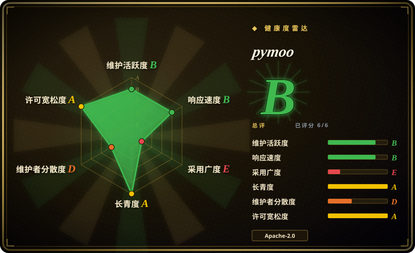
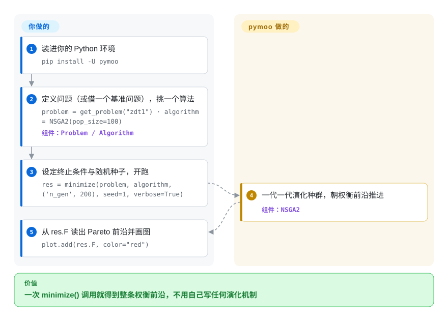

# pymoo

一个做单目标与多目标优化的 Python 框架。你的问题里几个目标在互相打架——既要成本最低又要重量最轻——不存在唯一最优解，只有权衡；pymoo 用你的评估函数演化一个种群，交回一整条 Pareto 前沿（一组互不支配的折中解），算法涵盖 NSGA-II/III、MOEA/D、CMA-ES 等，外加画图与帮你挑解的决策工具。

## 何时使用

你是个研究者或工程师，手上的优化问题有**多个相互冲突的目标**——既要降成本*又要*减重，既要提吞吐*又要*提可靠性——你需要找出 Pareto 前沿，而非单个标量最优。你定义一个 `Problem`（变量、目标、约束），挑一个像 `NSGA2` 的算法，调 `minimize(problem, algorithm, termination)`，pymoo 就把种群朝权衡前沿演化；然后你用它的可视化（散点、PCP）和决策模块（如 pseudo-weights、折中规划）挑一个解。它自带标准基准套件（ZDT、DTLZ、WFG），让你在把算法指向真实问题前先验证它，并且支持混合/整数变量、约束和自定义算子。

你把它当作**演化式多目标优化的事实标准 Python 库**——当你想要规范算法的、经充分测试的实现（它是 Python 里 NSGA-II/III 的参考），配一个干净、可扩展的 API，而不想自己重写遗传算子或接一个更重的 OR 求解器时。[推断]

## 怎么用起来

你写一个函数（或一个 `Problem` 类）：给它一组决策变量，它返回目标值（以及约束）。搜索循环归 pymoo 管：`minimize(problem, algorithm, termination)` 先采出初始种群，成批调用你的评估函数（你把它写成向量化或并行的，它就成批/并行地跑），然后由算法繁育下一代——比如 NSGA-II 把合并后的池子按非支配排序（没有任何解在**每个**目标上都不比它差）排序，留下铺得开的前沿种群——直到你的终止条件（代数、运行时长或收敛）触发。交回来的不是一个答案，而是最后一整个种群：`res.X`/`res.F` 是幸存的决策向量及其目标值，也就是你对 Pareto 前沿的近似；`pymoo.visualization`（`Scatter`、平行坐标图）能把它和基准问题的已知前沿画在一起对比。仍归你管的：目标函数本身（以及它的计算成本——真正的时间花在这里）、评估预算、可复现用的随机种子，以及最终从前沿里挑哪一个折中解交付——它的 MCDM 模块（伪权重、折中规划）能帮你选。

<!-- flow-steps:begin (generated from flows/pymoo.json by tools/flow_card.py — do not edit) -->

流程文字版

1. **你**：装进你的 Python 环境 — `pip install -U pymoo`
2. **你**：定义问题（或借一个基准问题），挑一个算法 — `problem = get_problem("zdt1") · algorithm = NSGA2(pop_size=100)` — 组件：`Problem / Algorithm`
3. **你**：设定终止条件与随机种子，开跑 — `res = minimize(problem, algorithm, ('n_gen', 200), seed=1, verbose=True)`
4. **pymoo**：一代一代演化种群，朝权衡前沿推进 — 组件：`NSGA2`
5. **你**：从 res.F 读出 Pareto 前沿并画图 — `plot.add(res.F, color="red")`

**价值**：一次 minimize() 调用就得到整条权衡前沿，不用自己写任何演化机制

<!-- flow-steps:end -->

## 何时不用

- **你的问题是凸 / 线性 / 光滑且单目标。** 对 LP/QP/凸问题，正经求解器（SciPy、CVXPY、Gurobi/OR-Tools）快得多，还能给出种群元启发式没有的最优性保证。别把演化算法用在梯度下降或 LP 求解器主场的问题上。
- **你需要基于梯度的 / 大规模连续优化。** 演化方法无导数且耗样本；对高维可微目标，梯度方法（PyTorch/JAX、scipy.optimize）收敛高效得多。
- **每次评估极贵而你预算很小。** 种群 EA 需要大量函数评估；若单次目标评估要数小时，请改看贝叶斯/代理优化（Ax/BoTorch、Optuna），或谨慎用 pymoo 的代理辅助模式。[推断]
- **你专门要做超参调优。** Optuna/Ax 是为那个工作流量身打造的（剪枝、看板、trial 存储）；pymoo 是通用优化框架，不是 HPO 平台。
- **你无法容忍随机、默认不可复现的结果。** EA 是随机的；你必须固定种子并多次运行来刻画性能——这是固有特性，不是 bug。

## 横向对比

| 替代品 | 是否收录 | 我们的评价 | 取舍 |
|---|---|---|---|
| DEAP | 未收录 | 需要灵活、偏底层的演化计算工具箱时，选 DEAP。 | 灵活的演化计算工具箱；非常通用/底层，但你要自己拼更多——pymoo 给的是更高层、现成的多目标算法和基准。 |
| Platypus | 未收录 | 需要另一个 Python 多目标 EA 库时，选 Platypus。 | 另一个 Python 多目标 EA 库；范围/社区比 pymoo 的算法加工具广度都小。[推断] |
| Optuna / Ax（BoTorch） | 未收录 | 需要适合昂贵评估或 HPO 的贝叶斯/代理优化时，选 Optuna 或 Ax。 | 贝叶斯/代理优化，适合昂贵评估和 HPO；范式不同（样本高效，非种群式）——互补而非可直接替换。 |
| jMetal（Java/Py） | 未收录 | 需要 Java/Python 生态里的老牌多目标元启发式框架时，选 jMetal。 | 老牌多目标元启发式框架；jMetalPy 在 Python 里镜像它——目标相当，生态和 API 风格不同。 |
| [OR-Tools](../optimization-solvers/or-tools.zh.md) | ✅ | 问题有结构——线性、整数或路径——且你要在同一个 Python 进程里拿到精确解时选 OR-Tools；目标确实互相冲突、你要的是一张权衡前沿而不是单一最优时选 pymoo。 | OR-Tools 给出带界的最优解，但要求问题写成模型；pymoo 接受任意评估函数、交回一组 Pareto 解，没有最优性保证，评估次数也高得多。 |
| SciPy / Gurobi | 未收录 | 单目标 LP／凸问题用 `scipy.optimize` 就够、且你本来就依赖 SciPy 时选 SciPy；硬 MIP 需要商用性能时选 Gurobi。两者此处都不收录：SciPy 是通用科学计算库而不是最优化求解器，Gurobi 闭源且没有仓库。 | 精确／凸／MILP 求解器；问题有结构时是对的工具，那里 EA 是错的锤子。它们与 pymoo 是互补而非替代——当问题不再是黑箱多目标搜索时，你就该转向它们。 |

## 技术栈

- **语言：** Python（按 `pyproject.toml` 要求 >= 3.10）。
- **数值核心：** NumPy 加 SciPy；`autograd`、`cma`、`moocore` 支撑特定算法/指标；`matplotlib` 做可视化；`alive_progress` 做进度。
- **加速：** 部分模块自带可选的 **Cython 编译**版以求性能（用附带的 setup 构建）；若未编译，有纯 Python 回退。
- **接口：** `Problem`/`Algorithm`/`minimize` API、算子库（采样/交叉/变异）、测试问题套件、可视化，以及 MCDM/决策模块。

## 依赖

- **运行时：** `numpy`、`scipy`、`matplotlib`、`moocore`、`autograd`、`cma`、`alive_progress`、`Deprecated`——全部可 pip 安装，无外部服务。
- **构建（可选）：** 用 C 编译器加 `Cython` 从源码构建编译加速；`pip install pymoo` 自带预编译的 Cython wheel，覆盖 macOS/Windows/manylinux（glibc 与 musl）、CPython 3.10–3.14（PyPI，2026-09-28 对 0.6.2 核对）。
- **硬件：** CPU 密集；核心算法不需要（也不用）GPU。
- **你的问题：** 目标/约束的评估由你提供——真实世界的成本就在那里（例如封装一个仿真器）。

## 运维难度

**低。** 它是可 pip 安装的库，无服务、无数据存储、无部署——`pip install -U pymoo` 然后 import。仅有的运维细节是：为求速可选地编译 Cython 模块（一个构建期事项，有纯 Python 回退），以及*你的*目标函数的固有成本——对昂贵仿真器你要管并行评估（pymoo 支持并行/向量化评估）和运行时预算，但那是你问题的成本，不是 pymoo 的。可复现性要求固定随机种子。除了 Python 进程，没什么要运维的。

## 健康度与可持续性

- **响应速度**：Grade B——中位首次响应时间 4.5 小时，基于 4 个 qualifying issues/PRs。
- **维护（2026-09）。** `main` 最后一次提交在 **2026-07-07**（`como_cmaes` 算法的缺陷修复工作），核对时 open issue 为 0（GitHub API，2026-09-28）——是一条有人打理的 v0.6.x 线，只是最近一个季度的提交节奏偏温和、不算快。没有废弃。[推断]
- **治理 / 背书。** 在 `anyoptimization` 组织下开发（Organization 拥有），有一位主维护者（blankjul）和真实的贡献者列表；与学术工作绑定（pymoo 的 IEEE Access 论文）。bus factor 偏向主维护者，但有组织结构和多名贡献者——比孤身作者的仓库更健康。[推断]
- **年龄与 Lindy 判断。** 2017-09 创建（约 8 到 9 年）**且仍在活跃发布**⇒ **强 Lindy** 信号：一个成熟、久经验证、又保持时新的库，而非被炒作的新秀。[推断]
- **采用度。** 约 3.0k star / 480 fork（GitHub API，2026-09-28），有一篇可引用的论文，并在学术/工业优化工作中被使用；它是 Python 里 NSGA-II/III 的标准参考。[未验证：生产采用广度]
- **风险标记。** 不多。Apache-2.0（宽松，未发现 relicense 历史）；主要的实务注意点是 EA 的通病（随机、耗评估），而非项目健康风险。[推断]

## 存疑（未验证）

- [推断]「演化式多目标优化的事实标准 / 参考 Python 库」是从采用度加规范算法集加论文推断，并非对每个替代品的实测排名。
- [推断]「在学术/工业优化工作中被使用」这一采用叙述，支撑是可引用的 IEEE Access 论文与 star/fork 数；没有做过生产用户普查。
