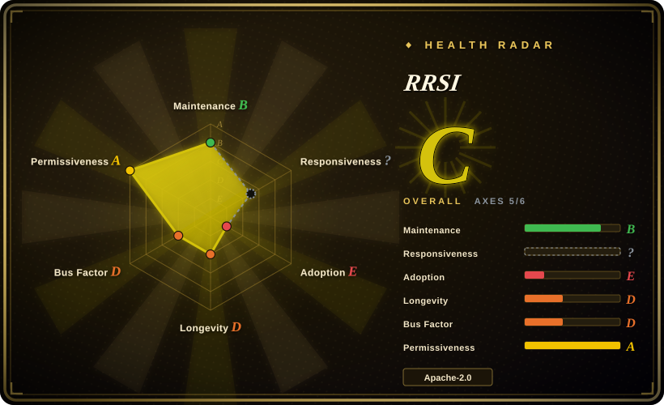
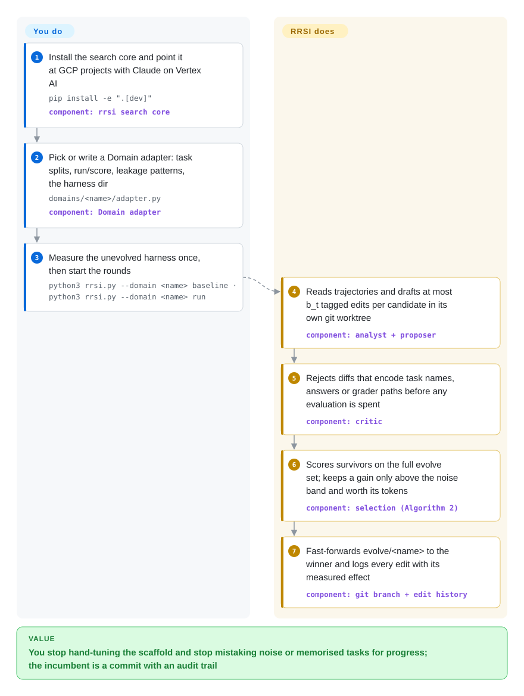

# RRSI

Let an LLM rewrite your agent's prompts and code against a benchmark and it will happily "improve" by memorising the test: +10 points on the tasks it trained on, nothing on anything new. RRSI is Google Research's code for that search with brakes on — edits are few and tagged, a critic throws out task-specific tricks before they are scored, and a gain is only kept if it clears measured noise and pays for the extra tokens it burns.

## When to use

You run an agent — a terminal coding agent, a document-work agent — on top of a frozen model you cannot fine-tune, and you already have a scorable task suite for it. You tried letting a strong model edit the agent's harness (its system prompt, tool wrappers, context handling, sub-agents) in a loop, and the loop found shortcuts: a prompt branch `if the task mentions "fix-git"`, a scoring bump of +1.1 that re-runs showed was noise, a harness that now spends 40% more tokens for the same pass rate. You reach for RRSI when you want that automated harness search but with the overfitting controls written down and auditable: each round a proposer drafts at most *b_t* tagged edits (the budget shrinks over the run), a critic rejects diffs that name tasks, answers or grader paths before any evaluation is paid for, and selection accepts a candidate only if its score clears a noise band and its added inference cost is paid for by the measured gain.

You pick it over prompt-only optimisers such as [SkillOpt](../agent-frameworks/workflow-builders/skillopt.md) or GEPA because RRSI's edit space is the whole harness *code* — control flow, tools, memory, sub-agents — not one text document, and because every candidate lives in its own git worktree so the incumbent is always a commit you can diff. It is also the reference implementation of an arXiv paper (2609.24972, 2026-09) with three worked instances (Terminal-Bench 2.1, Harvey LAB, EngDesign), so it is the thing to read when you want to *reproduce or adapt* regularised harness evolution — not a turnkey product.

## How it works

RRSI is a search loop around your agent, and the split is sharp: you supply the agent (the "harness" directory that gets edited), a task suite with a scorer, and a Domain adapter — one Python module that tells the core how to run the harness on a list of tasks, how to read a trial back, and which patterns count as leakage; RRSI supplies everything else. Each round an analyst model (Claude Opus via Vertex AI) reads failed and successful trajectories — the step-by-step transcripts of what your agent did — and a proposer model edits a copy of the harness in its own git worktree (a second checkout of the same repository on its own branch), tagging every edit with the component it touches and the hypothesis it tests. A critic then screens the diff with a regex denylist plus a model review, bouncing back anything that encodes a task name or expected answer; survivors are scored on the full evolve set, and the selector keeps a winner only if it beats the best score so far minus a noise band (the run-to-run wobble measured on the unchanged harness) and its extra tokens are justified by the gain — then fast-forwards the `evolve/<name>` branch to it. Think of it as a code reviewer who refuses any patch that "fixes" the exam by learning the questions, and a bookkeeper who refuses any win smaller than the measurement error.

<!-- flow-steps:begin (generated from flows/rrsi.json by tools/flow_card.py — do not edit) -->

Text version of the flow

1. **You**: Install the search core and point it at GCP projects with Claude on Vertex AI — `pip install -e ".[dev]"` — component: `rrsi search core`
2. **You**: Pick or write a Domain adapter: task splits, run/score, leakage patterns, the harness dir — `domains/<name>/adapter.py` — component: `Domain adapter`
3. **You**: Measure the unevolved harness once, then start the rounds — `python3 rrsi.py --domain <name> baseline · python3 rrsi.py --domain <name> run`
4. **RRSI**: Reads trajectories and drafts at most b_t tagged edits per candidate in its own git worktree — component: `analyst + proposer`
5. **RRSI**: Rejects diffs that encode task names, answers or grader paths before any evaluation is spent — component: `critic`
6. **RRSI**: Scores survivors on the full evolve set; keeps a gain only above the noise band and worth its tokens — component: `selection (Algorithm 2)`
7. **RRSI**: Fast-forwards evolve/<name> to the winner and logs every edit with its measured effect — component: `git branch + edit history`

**Value**: You stop hand-tuning the scaffold and stop mistaking noise or memorised tasks for progress; the incumbent is a commit with an audit trail

<!-- flow-steps:end -->

## When NOT to use

- **You cannot run Claude on Google Vertex AI.** The proposer, analyst and critic call `AnthropicVertex` directly (`rrsi/llm.py`) and refuse to start without `RRSI_VERTEX_PROJECTS` — there is no OpenAI, direct-Anthropic or local-model path for the search roles (only the frozen *policy* model is a LiteLLM string). If your models live elsewhere, use GEPA or [SkillOpt](../agent-frameworks/workflow-builders/skillopt.md), which ship multiple backends.
- **You have no scorable task suite yet.** Every decision is driven by measured pass rates over repeated trials; without a benchmark and a Domain adapter (task splits, `run`, `score`, trace readers, leakage patterns) there is no signal at all. Build the eval first — [promptfoo](../llm-eval/promptfoo.md) for prompt/agent test suites — and come back when you can score a harness.
- **Your budget is a few dollars.** The shipped coding config evaluates each of 2 candidates on 89 tasks × 2 trials every round for 20 rounds, plus a baseline — on the order of 7,000 full agent runs of Claude Opus before proposer/critic calls [推断：由 `domains/coding/rrsi.json` 的 T/k/m 与任务数相乘得出，未实际计费]. For a cheap first pass on a single prompt, [DSPy](../agent-frameworks/workflow-builders/dspy.md) optimizers or SkillOpt on a small dev set cost orders of magnitude less.
- **You only need to tune one prompt or skill document.** RRSI's machinery (git worktrees, component tags, novelty over tools/memory/sub-agents) earns its keep when the edit space is harness *code*. For a single text artefact, SkillOpt's bounded text edits or DSPy's prompt compilation are simpler and portable.
- **You want the model itself to get better.** RRSI never touches weights; it changes the scaffold around a frozen model. To RL-train an agent's policy, use [Agent Lightning](../llm-training/agent-lightning.md) or ART.
- **You need a maintained dependency.** It is a paper-code release: version 0.1.0 in `pyproject.toml`, no tags, four commits (2026-09-18 → 09-23), one committer, and the Table 2 ablation arms are not switchable yet (issue #2, maintainer promised a follow-up). Its edit-budget schedule also never reaches the paper's final-round budget of 1 (issue #2, fix pending in PR #3). Fork and pin; read it as a reference, do not build a product on `main`.
- **You are on macOS/Windows without Docker and sudo.** The coding instance drives task containers through `sudo -E docker` (`domains/coding/bin/docker`) and the engineering instance jails `code_exec` with bubblewrap and `apt-get` packages — effectively a Linux host with Docker. Choose a hosted eval runner or a lighter optimiser if that host is not available.

## Comparison

| Alternative | In index | Our verdict | Tradeoff |
|---|---|---|---|
| [SkillOpt](../agent-frameworks/workflow-builders/skillopt.md) | ✅ | When the thing you want to improve is one skill/prompt document and you want several model backends, pick SkillOpt; pick RRSI when the edit space must include harness code (tools, control flow, memory, sub-agents) and you need an explicit leakage critic plus a token-cost rule. | SkillOpt: bounded text edits gated by held-out score, portable across providers, deployable as a Markdown file; RRSI: much larger edit space and git-auditable candidates, but Vertex-only search roles and a far heavier evaluation bill. |
| GEPA | not indexed | Pick GEPA when you want a maintained, provider-agnostic reflective optimiser for prompts or code with a Python API; pick RRSI when you specifically need its anti-overfitting regularisers (annealed edit budget, critic, noise floor, cost rule) as designed and measured in the paper. Not added in this tab-intake batch. | GEPA is an actively released library (MIT) you embed; RRSI is a one-paper research loop wired to three benchmarks, trading generality for a documented recipe against benchmark overfitting. |
| ADAS (Automated Design of Agentic Systems) | not indexed | Use ADAS only as the earlier reference for "a meta-agent writes new agent designs in code"; for current work pick RRSI, because it adds selection-side controls ADAS does not have and its repo has not been pushed since 2025-01. Not added in this tab-intake batch. | ADAS: simple open-ended search over agent code, ICLR 2025 artefact, effectively frozen; RRSI: newer, regularised, but equally a research artefact rather than a product. |
| [autoresearch](autoresearch.md) | ✅ | Pick autoresearch when you want an agent to iterate on a *training script* under a fixed 5-minute budget on one GPU; pick RRSI when the object being evolved is an agent harness scored by task pass rate. | Both are "agent edits code, keep only measured improvements" loops; autoresearch is tiny and GPU-bound with val_bpb as the judge, RRSI is heavier, API-bound, and adds critic/noise/cost regularisation. |
| [Agent Lightning](../llm-training/agent-lightning.md) | ✅ | Choose Agent Lightning when you can train the policy model (RL or prompt optimisation over your agent's traces); choose RRSI when the model is frozen and only the scaffold may change. | Agent Lightning changes weights or prompts through a training backend with near-zero agent-code changes; RRSI leaves weights alone and rewrites scaffold code, so gains transfer across policy models but cost full benchmark runs per round. |

## Tech stack

- **Language:** Python ≥ 3.10 for the search core (`rrsi/`: `loop.py`, `propose.py`, `critic.py`, `selection.py`, `history.py`, `schedule.py`, `gitops.py`); the benchmark runners use Python 3.11 environments.
- **Model access:** `anthropic[vertex]` for the three search roles (Claude Opus 4.8 by default, `RRSI_SEARCH_MODEL` overrides the model name, not the provider), with prompt caching of the constitution + harness source; the frozen policy is any LiteLLM model string (paper uses Claude Opus 4.8 and Gemini 3.5 Flash).
- **Isolation and state:** git worktrees and branches per candidate (`evolve/<domain>`, `<domain>/r<t><variant>`), a JSONL edit history and `frontier.json` under `runs/<name>/`.
- **Starting harnesses (vendored, own licenses):** Terminus-2 from harbor (`third_party/harbor_terminus2/`) and archipelago's react_toolbelt runner (`third_party/archipelago/`, with LiteLLM, MCP/fastmcp, pydantic).
- **Benchmarks wired in:** Terminal-Bench 2.1 / SWE-bench Verified via harbor; Harvey LAB with JobBench / GDPval / APEX-Agents wrappers; EngDesign / Frontier-Eng with an MCP tool gateway and bubblewrap jail.

## Dependencies

- **Cloud:** one or more GCP projects with Claude on Vertex AI enabled (`gcloud auth application-default login`, `RRSI_VERTEX_PROJECTS`); the Harvey LAB judge additionally uses Gemini on Vertex.
- **Coding instance:** Docker (called through `sudo -E docker` by default), tmux, `harbor>=0.18` in `domains/coding/.venv`; harbor pulls the Terminal-Bench and SWE-bench images on first use.
- **Workspace instance:** a Harvey LAB checkout at commit `1da4750` (`uv sync`), a Python 3.11 venv with `pip install -e ".[agentic]"`, and a `code_exec` Python with python-docx, openpyxl, python-pptx, pymupdf, pandas.
- **Engineering instance:** the EngDesign repo, a grading venv, `iverilog`/`vvp`/`ffmpeg`, `bubblewrap` and `octave` via apt, plus a Frontier-Engineering checkout for the OOD run.
- **Your own domain:** a `domains/<name>/adapter.py` exporting a `Domain`, a `harness_path`, `SKILL.md` + `PATTERNS.md` (the proposer's constitution) and `rrsi.json` hyperparameters.

## Ops difficulty

**High.** Installing the core is one `pip install -e`, but a real run means operating a benchmark farm: Docker (and leftover containers/networks — the README warns that leaked compose networks exhaust Docker's address pool and fail every later evaluation, hence `scripts/cleanup_docker.sh`), per-benchmark virtualenvs, pinned third-party checkouts, a jailed tool gateway for the engineering tasks, and Vertex quota across one or more GCP projects. Runs are long (20–40 rounds of full-suite evaluation) but resumable (`touch runs/<name>/STOP`, `status`, `reevaluate --t` after an infrastructure failure). Adapting it to a new agent means writing and debugging a Domain adapter and a leakage denylist yourself.

## Health & viability

- **Maintenance (2026-09-29):** repo created 2026-09-16, four commits between 2026-09-18 and 2026-09-23 (code drop, then README/paper alignment), no releases or tags. The maintainer answered the reproduction issue (#2) within days and promised ablation switches; two outside PRs (#1, #3) are open and blocked on Google's CLA check. Too young to call a cadence.
- **Governance / bus factor:** `google-research` organisation repo, but one GitHub account (the paper's first author) is the only listed contributor; contributions require the Google CLA. The README states it is "not an officially supported Google product" and is excluded from Google's OSS vulnerability rewards programme.
- **Backing & longevity:** backed by a strong research org whose paper-code repos typically freeze once the paper is out [推断：依据是 google-research 组织的一般模式，未对本仓库做长期观测]. Two weeks old — the Lindy prior gives it nothing; treat it as a paper artefact whose value is the documented method and its code-to-paper map.
- **Adoption:** ~676 stars and 60 forks within two weeks (2026-09-29, `gh api`); no PyPI package, no dependents found. Interest is from people reproducing the paper, not production users.
- **Risk flags:** hard dependency on Claude via Vertex AI for the search roles; published results depend on proprietary models and some commercial benchmarks (GDPval, APEX-Agents) you may not be able to rerun; known code/paper mismatch in the edit-budget schedule (issue #2). Apache-2.0 core, but `third_party/` carries its own licenses.

## Caveats (unverified)

- [未验证] All benchmark numbers (e.g. Terminal-Bench 2.1 74.2 → 80.2, JobBench 36.0 → 40.7, "30% fewer policy tokens") are the authors' reported results from the README/arXiv abstract; nothing was re-run for this page.
- [推断] The "~7,000 agent runs" cost order is computed from `domains/coding/rrsi.json` (T=20, m=2, k=2, 89 tasks) plus one baseline; re-evaluations, smoke checks and proposer/critic/analyst calls come on top, and no dollar figure is published in the repo.
- [推断] "No non-Vertex path for the search roles" is read from `rrsi/llm.py` at commit be50316e; a later commit could add providers.
- [推断] Linux-only in practice is inferred from `sudo -E docker`, tmux, bubblewrap and `apt-get` in the setup docs; macOS was not tried.
- [未验证] The GEPA and ADAS rows summarise those repos' own descriptions and GitHub metadata (2026-09-29); their feature depth was not reviewed for this page.
- [未验证] Star/fork counts and issue state were measured 2026-09-29 via `gh api` and move daily at this age.
