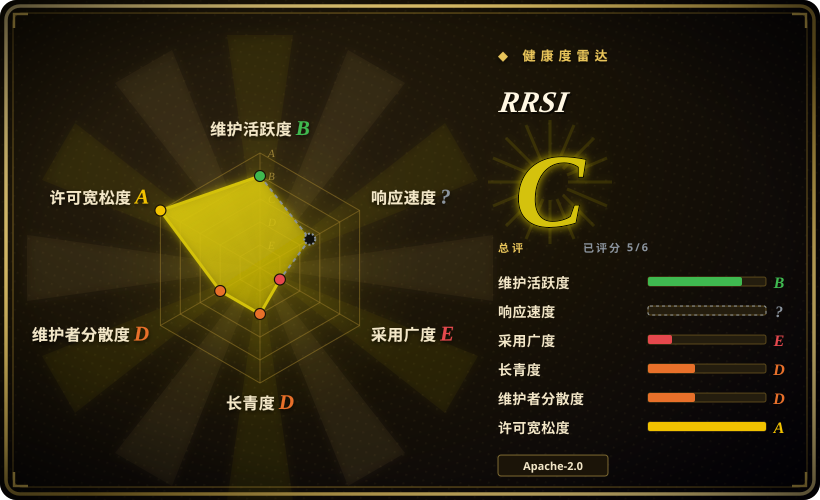
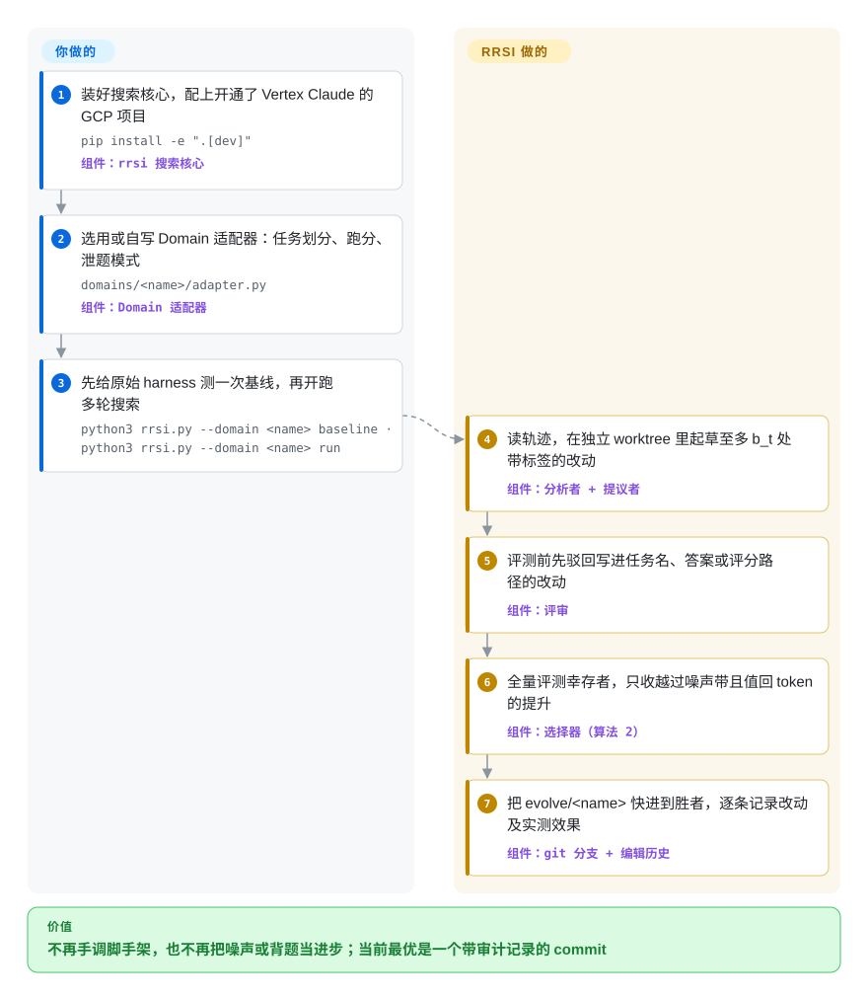

# RRSI

让大模型对着一套题反复改你 agent 的提示词和代码，它很快就学会“背答案”：训练用的题涨了十分，换一套新题一分不涨。RRSI 是 Google Research 放出的“带刹车”的自动改进代码：每轮只许改几处并写明理由，评审先把针对具体题目的小聪明挡掉，涨分还得大于测量误差、并且配得上多烧的 token，才算数。

## 何时使用

你在一个改不了权重的模型上跑 agent——终端里写代码的 agent，或者处理法律文书的 agent——手里已经有一套能打分的任务集。你试过让一个强模型在循环里自动改 agent 的外壳（harness：系统提示、工具封装、上下文管理、子 agent），结果它找到了捷径：提示词里冒出一句 `if the task mentions "fix-git"`，一次 +1.1 分的“提升”重跑后发现只是噪声，还有一版通过率没变、token 却多花了 40%。这时你会想到 RRSI：它同样自动搜索 harness，但把防过拟合的约束写成了代码、可以审计——每轮提议者最多改 *b_t* 处并给每处打上标签（这个上限随轮次收紧），评审在花钱评测之前就驳回点名任务、答案或评分脚本路径的改动，选择器只接受分数越过噪声带、并且新增推理开销被实测收益覆盖的候选。

相比只改提示词的优化器（如 [SkillOpt](../agent-frameworks/workflow-builders/skillopt.zh.md) 或 GEPA），你选 RRSI 的理由是：它能改的是整个 harness 的**代码**——控制流、工具、记忆、子 agent——而不只是一份文本；每个候选都在独立的 git worktree 里，当前最优永远是一个可以 diff 的 commit。它也是一篇 arXiv 论文（2609.24972，2026-09）的参考实现，自带三个实例（Terminal-Bench 2.1、Harvey LAB、EngDesign），所以适合“复现或改造正则化 harness 演化”时去读，而不是拿来即用的产品。

## 怎么用起来

RRSI 是套在你 agent 外面的一个搜索循环，分工很清楚：你提供 agent 本身（会被改写的 harness 目录）、一套带打分的任务集，以及一个 Domain 适配器——一个 Python 模块，告诉核心怎样在一批任务上跑 harness、怎样读回单次试验、哪些模式算“泄题”；其余都由 RRSI 负责。每一轮，分析者模型（经 Vertex AI 调用的 Claude Opus）阅读失败和成功的轨迹——也就是 agent 一步步做了什么的完整记录——提议者模型在独立的 git worktree（同一仓库在另一分支上的第二份检出）里改一份 harness 副本，并给每处改动标注它动了哪个组件、在验证什么假设。接着评审用正则黑名单加模型审阅检查 diff，凡是写进了任务名或预期答案的都打回重改；通过的候选在完整演化集上评分，选择器只在它高于历史最好分数减去噪声带（对未改动 harness 重复测量得到的自然波动）、且多花的 token 被收益覆盖时才收下它，然后把 `evolve/<name>` 分支快进到这个 commit。可以把它想成一位拒收“靠背考题提分”补丁的代码评审，加一位拒记“小于测量误差的胜利”的会计。

<!-- flow-steps:begin (generated from flows/rrsi.json by tools/flow_card.py — do not edit) -->

流程文字版

1. **你**：装好搜索核心，配上开通了 Vertex Claude 的 GCP 项目 — `pip install -e ".[dev]"` — 组件：`rrsi 搜索核心`
2. **你**：选用或自写 Domain 适配器：任务划分、跑分、泄题模式 — `domains/<name>/adapter.py` — 组件：`Domain 适配器`
3. **你**：先给原始 harness 测一次基线，再开跑多轮搜索 — `python3 rrsi.py --domain <name> baseline · python3 rrsi.py --domain <name> run`
4. **RRSI**：读轨迹，在独立 worktree 里起草至多 b_t 处带标签的改动 — 组件：`分析者 + 提议者`
5. **RRSI**：评测前先驳回写进任务名、答案或评分路径的改动 — 组件：`评审`
6. **RRSI**：全量评测幸存者，只收越过噪声带且值回 token 的提升 — 组件：`选择器（算法 2）`
7. **RRSI**：把 evolve/<name> 快进到胜者，逐条记录改动及实测效果 — 组件：`git 分支 + 编辑历史`

**价值**：不再手调脚手架，也不再把噪声或背题当进步；当前最优是一个带审计记录的 commit

<!-- flow-steps:end -->

## 何时不用

- **你用不了 Google Vertex AI 上的 Claude。** 提议者、分析者、评审三个角色直接调用 `AnthropicVertex`（`rrsi/llm.py`），没设 `RRSI_VERTEX_PROJECTS` 就无法启动；搜索角色没有 OpenAI、Anthropic 直连或本地模型的路径（只有被冻结的*策略*模型是 LiteLLM 模型串）。模型在别处的话，用 GEPA 或 [SkillOpt](../agent-frameworks/workflow-builders/skillopt.zh.md)，它们支持多种后端。
- **你还没有能打分的任务集。** 每个决定都靠多次试验的实测通过率；没有基准、没有 Domain 适配器（任务划分、`run`、`score`、轨迹读取、泄题模式），就完全没有信号。先把评测搭起来——提示词和 agent 测试集用 [promptfoo](../llm-eval/promptfoo.zh.md)——能给 harness 打分了再来。
- **你的预算只有几美元。** 仓库自带的 coding 配置每轮要把 2 个候选各在 89 个任务 × 2 次试验上跑一遍，共 20 轮，外加一次基线——在算上提议者和评审的调用之前，就已是约 7000 次完整的 Claude Opus agent 运行 [推断：由 `domains/coding/rrsi.json` 的 T、k、m 与任务数相乘得出，未实际计费]。只想便宜地先调一份提示词，[DSPy](../agent-frameworks/workflow-builders/dspy.zh.md) 的优化器或 SkillOpt 在小开发集上跑，成本低几个数量级。
- **你只需要调一份提示词或 skill 文档。** RRSI 的那套机制（git worktree、组件标签、对工具、记忆、子 agent 的新颖度奖励）在改动对象是 harness *代码*时才值回票价。单份文本用 SkillOpt 的有界文本编辑或 DSPy 的提示词编译更简单，也不绑云厂商。
- **你想让模型本身变强。** RRSI 从不碰权重，只改冻结模型外面那层脚手架。要用强化学习训练 agent 的策略模型，选 [Agent Lightning](../llm-training/agent-lightning.zh.md) 或 ART。
- **你需要一个有人维护的依赖。** 这是论文代码：`pyproject.toml` 里版本 0.1.0，没有 tag，只有四个 commit（2026-09-18 到 09-23），一个提交者；论文表 2 的消融配置还不能切换（issue #2，维护者承诺后续补上），编辑预算的退火曲线也到不了论文说的最后一轮 1 处（issue #2，修复在 PR #3 里待合）。要用就 fork 并锁版本，当参考实现读，别在 `main` 上做产品。
- **你在没有 Docker 和 sudo 的 macOS 或 Windows 上。** coding 实例通过 `sudo -E docker`（`domains/coding/bin/docker`）驱动任务容器，工程实例用 bubblewrap 隔离 `code_exec`、还要 `apt-get` 装包——实际上需要一台带 Docker 的 Linux 主机。没有这样的机器，就换托管的评测平台或更轻的优化器。

## 横向对比

| 替代品 | 是否收录 | 我们的评价 | 取舍 |
|---|---|---|---|
| [SkillOpt](../agent-frameworks/workflow-builders/skillopt.zh.md) | ✅ | 要改进的只是一份 skill 或提示词文档、又想换着用多家模型时，选 SkillOpt；要改的范围必须包含 harness 代码（工具、控制流、记忆、子 agent），并且需要显式的泄题评审和 token 成本规则时，选 RRSI。 | SkillOpt：有界文本编辑、按留出集分数把关，跨厂商可移植，产物是一份 Markdown；RRSI：可改范围大得多、候选在 git 里可审计，但搜索角色只能走 Vertex，评测账单也重得多。 |
| GEPA | 未收录 | 想要一个持续发版、不绑厂商、带 Python API 的反思式优化器来改提示词或代码，选 GEPA；明确需要论文里设计并验证过的那几条防过拟合约束（退火编辑预算、评审、噪声下限、成本规则）时，选 RRSI。本批 tab 收录未添加。 | GEPA 是持续发版、MIT 许可、可嵌入的库；RRSI 是一篇论文的研究循环、绑定三个基准，用通用性换来一套有文档的防“刷榜”配方。 |
| ADAS（Automated Design of Agentic Systems） | 未收录 | 只把 ADAS 当作“元 agent 用代码写新 agent 设计”的早期参考；现在做这件事选 RRSI，因为它补上了 ADAS 没有的选择侧约束，而 ADAS 仓库自 2025-01 起没有推送。本批 tab 收录未添加。 | ADAS：对 agent 代码做简单的开放式搜索，ICLR 2025 的产物，基本冻结；RRSI：更新、带正则化，但同样是研究产物而不是产品。 |
| [autoresearch](autoresearch.zh.md) | ✅ | 想让 agent 在单卡上以 5 分钟为预算反复改*训练脚本*，选 autoresearch；被演化的对象是按任务通过率打分的 agent harness 时，选 RRSI。 | 两者都是“agent 改代码、只留实测更好的版本”的循环；autoresearch 小巧、吃 GPU、用 val_bpb 当裁判，RRSI 更重、吃 API，还多了评审、噪声和成本三道约束。 |
| [Agent Lightning](../llm-training/agent-lightning.zh.md) | ✅ | 能训练策略模型（在 agent 轨迹上做强化学习或提示词优化）时选 Agent Lightning；模型被冻结、只能改脚手架时选 RRSI。 | Agent Lightning 通过训练后端改权重或提示词，agent 代码几乎不用动；RRSI 不碰权重、改的是脚手架代码，收益能跨策略模型迁移，但每轮都要跑完整基准。 |

## 技术栈

- **语言：** 搜索核心为 Python ≥ 3.10（`rrsi/` 下的 `loop.py`、`propose.py`、`critic.py`、`selection.py`、`history.py`、`schedule.py`、`gitops.py`）；各基准的运行器用 Python 3.11 环境。
- **模型接入：** 三个搜索角色用 `anthropic[vertex]`（默认 Claude Opus 4.8，`RRSI_SEARCH_MODEL` 只能换模型名、不能换厂商），把“宪法”文档和 harness 源码作为可缓存前缀；被冻结的策略模型可以是任意 LiteLLM 模型串（论文用了 Claude Opus 4.8 和 Gemini 3.5 Flash）。
- **隔离与状态：** 每个候选一个 git worktree 和分支（`evolve/<domain>`、`<domain>/r<t><variant>`），`runs/<name>/` 下是 JSONL 编辑历史和 `frontier.json`。
- **起始 harness（随仓库附带，各有许可证）：** harbor 的 Terminus-2（`third_party/harbor_terminus2/`）和 archipelago 的 react_toolbelt 运行器（`third_party/archipelago/`，依赖 LiteLLM、MCP/fastmcp、pydantic）。
- **已接好的基准：** 经 harbor 跑 Terminal-Bench 2.1 和 SWE-bench Verified；Harvey LAB 及 JobBench、GDPval、APEX-Agents 的包装脚本；EngDesign 和 Frontier-Eng，配 MCP 工具网关与 bubblewrap 沙箱。

## 依赖

- **云：** 一个或多个开通了 Vertex AI 上 Claude 的 GCP 项目（`gcloud auth application-default login`、`RRSI_VERTEX_PROJECTS`）；Harvey LAB 的评分模型还要用 Vertex 上的 Gemini。
- **coding 实例：** Docker（默认经 `sudo -E docker` 调用）、tmux，以及装在 `domains/coding/.venv` 里的 `harbor>=0.18`；harbor 首次使用时会拉取 Terminal-Bench 和 SWE-bench 镜像。
- **workspace 实例：** 固定在 commit `1da4750` 的 Harvey LAB 检出（`uv sync`），一个装了 `pip install -e ".[agentic]"` 的 Python 3.11 venv，以及给 `code_exec` 用的 Python（需 python-docx、openpyxl、python-pptx、pymupdf、pandas）。
- **工程实例：** EngDesign 仓库、一个评分 venv、`iverilog`、`vvp`、`ffmpeg`，经 apt 安装的 `bubblewrap` 和 `octave`；跑分布外评测还要一份 Frontier-Engineering 检出。
- **你自己的领域：** 一个导出 `Domain` 的 `domains/<name>/adapter.py`、`harness_path`、`SKILL.md` 与 `PATTERNS.md`（提议者的“宪法”），以及 `rrsi.json` 超参数。

## 运维难度

**高。** 装核心只需一条 `pip install -e`，但真正跑一次等于运营一个评测农场：Docker（以及残留的容器和网络——README 提醒，泄漏的 compose 网络会耗尽 Docker 地址池，之后每次评测都失败，所以有 `scripts/cleanup_docker.sh`）、每个基准各自的虚拟环境、固定版本的第三方检出、工程任务的隔离工具网关，以及横跨一个或多个 GCP 项目的 Vertex 配额。一次运行很长（20 到 40 轮全量评测），但可以续跑（`touch runs/<name>/STOP`、`status`，基础设施故障后用 `reevaluate --t` 重测）。要接到新的 agent 上，得自己写并调通 Domain 适配器和泄题黑名单。

## 健康度与可持续性

- **维护（2026-09-29）：** 仓库创建于 2026-09-16，2026-09-18 到 09-23 之间四个 commit（先放代码，再对齐 README 与论文），没有 release 或 tag。维护者几天内回复了复现问题（#2）并承诺补消融开关；两个外部 PR（#1、#3）挂着，卡在 Google 的 CLA 检查上。太年轻，谈不上节奏。
- **治理与巴士因子：** 挂在 `google-research` 组织下，但唯一列出的贡献者是一个 GitHub 账号（论文一作）；贡献要签 Google CLA。README 明说它“不是 Google 官方支持的产品”，也不在 Google 开源漏洞奖励计划范围内。
- **背书与存续：** 背后是很强的研究机构，但这类论文代码仓库通常在论文发表后就冻结 [推断：依据是 google-research 组织的一般模式，未对本仓库做长期观测]。只有两周大——Lindy 先验给不了它任何加分；把它当论文产物看，价值在于写清楚的方法和“论文到代码”的对照表。
- **采用度：** 两周内约 676 star、60 fork（2026-09-29，`gh api`）；没有 PyPI 包，未发现依赖方。关注者是来复现论文的人，不是生产用户。
- **风险信号：** 搜索角色硬依赖 Vertex AI 上的 Claude；论文结果依赖专有模型，部分基准（GDPval、APEX-Agents）是商业的，你未必能重跑；编辑预算曲线与论文描述不一致是已知问题（issue #2）。核心是 Apache-2.0，但 `third_party/` 各有自己的许可证。

## 存疑（未验证）

- [未验证] 所有基准数字（如 Terminal-Bench 2.1 从 74.2 到 80.2、JobBench 从 36.0 到 40.7、“策略 token 少 30%”）都是作者在 README 和 arXiv 摘要里报告的结果，本页没有重跑。
- [推断] “约 7000 次 agent 运行”的成本量级由 `domains/coding/rrsi.json`（T=20、m=2、k=2、89 个任务）加一次基线算出；重测、冒烟检查和提议者、评审、分析者的调用还要另算，仓库里没有公布美元数字。
- [推断] “搜索角色没有非 Vertex 路径”读自 commit be50316e 的 `rrsi/llm.py`；之后的 commit 可能会加别的厂商。
- [推断] “实际上只能在 Linux 上跑”是根据安装文档里的 `sudo -E docker`、tmux、bubblewrap 和 `apt-get` 推出的，没有在 macOS 上试过。
- [未验证] GEPA 和 ADAS 两行只概括了它们自己的描述和 GitHub 元数据（2026-09-29），没有细看功能深度。
- [未验证] star、fork 数和 issue 状态是 2026-09-29 经 `gh api` 测得的，这个年龄的仓库每天都在变。
