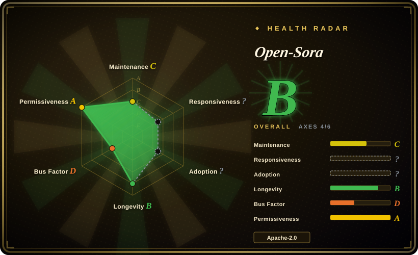
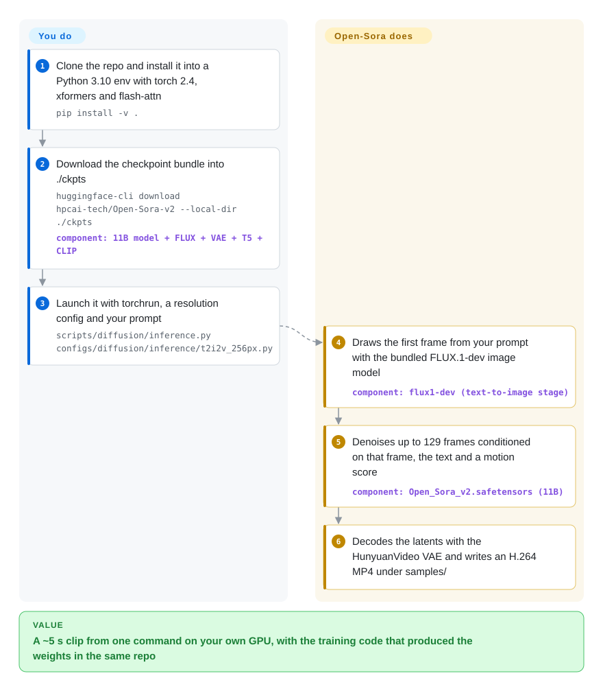

# Open-Sora

Commercial video generators hand you a clip but never the recipe, so you cannot study, retrain or self-host what made it. Open-Sora publishes the whole thing — an 11B text/image-to-video model's weights, the training code and data pipeline, and a report pricing the run at $200k — but it stopped moving in March 2025, and the weights it downloads carry non-Apache licenses.

## When to use

You are an ML researcher or a lab engineer who has to *train* a video diffusion model, not just call one: a paper that ablates the autoencoder, a domain model (surgery footage, driving scenes) that needs its own data, or an internal study of what a full video-model run costs. Most open video models give you weights plus an inference script; the training loop, the data filtering and the parallelism tricks stay private, so you reverse-engineer them from a PDF. Open-Sora is the open option that ships the recipe end to end: `scripts/diffusion/train.py` with staged configs (`image.py`, `stage1.py`, …), a data-prep script that turns a CSV of clips into bucketed training metadata, a 45k-clip Pexels sample dataset, its own deep-compression video autoencoder (Video DC-AE) with training docs, and ColossalAI sequence/tensor parallelism wired in — plus four archived generations (v1.0–v1.3) on branches, each with a report explaining what changed.

Pick it over [Wan2.2](https://github.com/Wan-Video/Wan2.2) or HunyuanVideo when **the reproducible training path is the deliverable** and generation quality is secondary; pick those when you just need the best open clip today. Also reach for it when you run on multi-GPU H100/H200 nodes and want the cost-engineering choices (initialize from an image model, train low-res then fine-tune high-res image-to-video, compress the latent 4×32×32) documented in one place.

## How it works

Open-Sora is a diffusion transformer: it starts from pure noise in a compressed "latent" space — a small grid of numbers that an autoencoder can later expand into video frames — and removes the noise step by step, guided by your prompt. Version 2.0 is tuned for image-to-video, so plain text-to-video runs as a relay: first a separate image model (FLUX.1-dev, downloaded in the same bundle) paints a still frame from your prompt, then the 11B video model animates that frame for up to 129 frames (about 5 seconds at 24 fps), with a "motion score" you can dial from calm to lively. Everything is driven by `torchrun` and a Python config file; there is no server, no API and no GUI in the main path — the repo is a research codebase, and what you own is the environment (a matching CUDA/torch/flash-attn stack), the GPU memory, and any wrapper you build around the script. Training uses the same configs with ColossalAI splitting the work across GPUs; the included Gradio app is the only interactive surface.

<!-- flow-steps:begin (generated from flows/open-sora.json by tools/flow_card.py — do not edit) -->

Text version of the flow

1. **You**: Clone the repo and install it into a Python 3.10 env with torch 2.4, xformers and flash-attn — `pip install -v .`
2. **You**: Download the checkpoint bundle into ./ckpts — `huggingface-cli download hpcai-tech/Open-Sora-v2 --local-dir ./ckpts` — component: `11B model + FLUX + VAE + T5 + CLIP`
3. **You**: Launch it with torchrun, a resolution config and your prompt — `scripts/diffusion/inference.py configs/diffusion/inference/t2i2v_256px.py`
4. **Open-Sora**: Draws the first frame from your prompt with the bundled FLUX.1-dev image model — component: `flux1-dev (text-to-image stage)`
5. **Open-Sora**: Denoises up to 129 frames conditioned on that frame, the text and a motion score — component: `Open_Sora_v2.safetensors (11B)`
6. **Open-Sora**: Decodes the latents with the HunyuanVideo VAE and writes an H.264 MP4 under samples/

**Value**: A ~5 s clip from one command on your own GPU, with the training code that produced the weights in the same repo

<!-- flow-steps:end -->

## When NOT to use

- **You are shipping a commercial product and need a license-clean stack.** The code and the Hugging Face card say Apache-2.0, but the default text-to-video pipeline loads `flux1-dev.safetensors`, which Black Forest Labs publishes under the FLUX.1 [dev] Non-Commercial License; the tech report says the video model itself was initialized from Flux; and the default autoencoder is the HunyuanVideo VAE, whose Tencent Hunyuan Community License (reproduced in Open-Sora's own `LICENSE`) excludes the EU, UK and South Korea and forbids using outputs to improve other models. Use Wan2.2 instead, whose weights are Apache-2.0 on their Hugging Face cards — or get legal review before shipping anything Open-Sora renders.
- **You want a maintained model to build on.** The last code commit was 2025-03-26; since then there has been one README edit (2026-04-09), 13 open PRs sit unreviewed (one contributor withdrew a fix after five months without review), and a bot closes idle issues after 14 days. Pick Wan2.2 (default branch pushed 2026-09-21) or Lightricks' LTX-2 for a model whose bugs still get fixed.
- **You have a 24 GB consumer GPU.** The README's own benchmark on H100/H800 shows 52.5 GB peak for a 256×256 clip on one GPU even with `--offload True`, and 1,656 s at 60.3 GB for 768×768 on one GPU. For desktop cards, run a smaller or quantized model — LTX-Video, the Wan2.2 5B variant, or [stable-diffusion.cpp](../../on-device-ml/stable-diffusion-cpp.md) with quantized Wan weights.
- **You want a node graph or GUI.** [ComfyUI](../../on-device-ml/comfyui.md) lists Wan 2.1/2.2, LTX-Video, HunyuanVideo 1.5, CogVideoX and Mochi as supported video workflows in its README — Open-Sora is not on that list, so you would be scripting `torchrun` yourself.
- **You need long or high-resolution footage.** Generation is capped at `num_frames` below 129 (≈5 s) and two resolutions (256px, 768px). Longer shots mean stitching clips or picking a model built for longer output.
- **You need a finished video — script, voice, cuts — not a clip.** Open-Sora outputs one silent MP4 per prompt. For agent-driven end-to-end production, use a pipeline from [video-production](../../video-production/INDEX.md) such as [OpenMontage](../../video-production/open-montage.md), which calls generators like this as one step.
- **You read "$200k" as "cheap to reproduce".** The report prices a full run at $2 per H200 GPU-hour, i.e. on the order of 100k H200 hours [推断], and the training doc sizes batches on 140 GB H200s with `--nproc_per_node 8`. If you want to adapt a model on a handful of GPUs, fine-tune a smaller open model rather than rerun this recipe.

## Comparison

| Alternative | In index | Our verdict | Tradeoff |
|---|---|---|---|
| [Wan2.2](https://github.com/Wan-Video/Wan2.2) | not indexed | For production-leaning open video generation in 2026, pick Wan2.2 over Open-Sora: it is maintained, Apache-2.0 on both code and weights, and ComfyUI supports it natively. | You gain an active upstream, a 5B variant for smaller GPUs and a clean license; you lose Open-Sora's fully documented from-scratch training recipe and per-version reports. Not added in this tab-intake batch. |
| [HunyuanVideo](https://github.com/Tencent-Hunyuan/HunyuanVideo) | not indexed | Pick HunyuanVideo when you want Tencent's larger, still-updated model and can live with its community license; pick Open-Sora only when the open training pipeline matters more than output quality. | Open-Sora's human-preference study claims parity with HunyuanVideo 11B at 2.0 release, but Open-Sora already depends on HunyuanVideo's VAE — so choosing Open-Sora does not escape the Tencent license's territory limits. Not added in this tab-intake batch. |
| [LTX-Video](https://github.com/Lightricks/LTX-Video) | not indexed | When latency and consumer hardware decide, pick LTX-Video (or its successor LTX-2); pick Open-Sora when you need to retrain from its published recipe on datacenter GPUs. | LTX-Video had ~775k Hugging Face downloads in the last 30 days vs ~1.1k for Open-Sora-v2 (2026-09-29) — a far larger user base — but its weights use a custom "other" license you must read. Not added in this tab-intake batch. |
| [Open-Sora-Plan](https://github.com/PKU-YuanGroup/Open-Sora-Plan) | not indexed | If you want another academic, MIT-licensed open-reproduction project with a similar "open the Sora recipe" goal, compare Open-Sora-Plan; pick hpcaitech's Open-Sora for the ColossalAI-based efficiency engineering and cost report. | Similar ambition and age; Open-Sora-Plan's default branch saw a push on 2026-03-08, a year after Open-Sora's last code change, but neither is a fast-moving upstream. Not added in this tab-intake batch. |
| [ComfyUI](../../on-device-ml/comfyui.md) | ✅ | If you want to generate videos interactively from supported models rather than train one, use ComfyUI with Wan/LTX/Hunyuan nodes instead of Open-Sora's torchrun scripts. | ComfyUI is a runtime/GUI, not a model: it gives you visual workflows and many models, but no training recipe, and it does not list Open-Sora among its supported video models. |

## Tech stack

- **Language / framework:** Python 3.10, PyTorch 2.4.0 + torchvision 0.19 (pinned in `requirements.txt`), xformers and flash-attention (FA3 optional on Hopper), liger-kernel.
- **Parallelism:** [ColossalAI](../../llm-training/colossalai.md) (`colossalai>=0.4.4`) for tensor and sequence parallelism at inference and training; TensorNVMe for checkpoint saving during training.
- **Config system:** mmengine-style Python configs with `_base_` inheritance; every key is overridable from the command line.
- **Model (v2.0):** an 11B MMDiT-style transformer (dual-stream + single-stream blocks, same shape as FLUX.1) conditioned on T5-v1.1-XXL and CLIP ViT-L/14 text embeddings; HunyuanVideo VAE by default, or the in-house Video DC-AE (4×32×32 compression) via `high_compression.py`.
- **Extras:** `openai` client for optional prompt refinement and the dynamic motion-score evaluator; wandb/tensorboard logging; a Gradio demo in `gradio/app.py`.

## Dependencies

- **Hardware:** NVIDIA datacenter GPUs in practice — ~44–60 GB peak memory per GPU in the README's H100/H800 table; 8 GPUs for reasonable 768px latency; training configs sized for 8× H200 (140 GB) nodes.
- **Weights:** the `hpcai-tech/Open-Sora-v2` bundle (Hugging Face or ModelScope) — the 11B model, FLUX.1-dev + its autoencoder, HunyuanVideo VAE, T5-XXL, CLIP — downloaded to `./ckpts`, each carrying its own license.
- **CUDA toolchain:** a CUDA version matching the pinned torch/xformers wheels (the README uses the cu121 index); flash-attn builds from source.
- **Optional external service:** an OpenAI API key for `--refine-prompt` and `--motion-score dynamic`; nothing else phones out.
- **Training data:** your own clips as CSV/parquet with `path,text,num_frames,height,width,aspect_ratio,resolution,fps`, or the 250 GB Pexels-45k sample.

## Ops difficulty

**High.** There is nothing to deploy — no server or API — but everything around the script is on you: matching torch 2.4 / CUDA / xformers / flash-attn builds, ~50 GB of GPU memory per process, a multi-gigabyte weight bundle, and 10–30 minutes per 768px clip on one GPU. Serving it to users means writing your own queue and worker around `torchrun`. Because upstream is dormant, dependency drift (newer torch, newer CUDA drivers) is yours to fix; expect to pin the whole environment in a container. Training is a cluster-scale job.

## Health & viability

- **Maintenance (2026-09-29): dormant.** Releases v1.0 (2024-03) → v1.3 (2025-02), then Open-Sora 2.0 announced 2025-03-12 with no tagged release; the last code commit landed 2025-03-26. The only later commit is a README update (2026-04-09). Community PRs from 2026 have gone unreviewed, and the low open-issue count (14) reflects a stale-bot that closes idle issues after 7+7 days, not fast triage.
- **Governance / backing.** Organization-owned by HPC-AI Tech (the company behind ColossalAI, which is still active — pushed 2026-09-29). The README now fronts the company's commercial video product (Video Ocean) and hosted model APIs, which suggests effort has moved to closed offerings [推断]. Contributions are concentrated in a small company team (top two contributors account for ~497 of the listed commits).
- **Age & Lindy.** Created 2024-02 (~2.6 years): about 13 months of intense activity, then 18 months of silence. Lindy gives no support to a young project that has already stopped — treat it as a finished research artifact, not a platform.
- **Adoption.** ~29.8k stars and ~3.1k forks show strong mindshare from the 2024 "open Sora" moment, but current usage is thin: 1,149 Hugging Face downloads of `Open-Sora-v2` in the last 30 days versus ~775k for LTX-Video and ~23k for Wan2.2-TI2V-5B (2026-09-29).
- **Risk flags.** The license gap between the Apache-2.0 badge and the actual weight stack (FLUX.1-dev non-commercial, Flux-initialized model, Tencent Hunyuan territorial license) is the decisive flag; an unpatched research codebase pinned to torch 2.4 is the second.

## Caveats (unverified)

- [推断] The FLUX.1 [dev] Non-Commercial License reaching the 11B Open-Sora 2.0 weights: the report confirms initialization from Flux and describes it as "a distilled model", and the shipped config uses the FLUX.1-dev shape and bundles `flux1-dev.safetensors`, but no Open-Sora document states which Flux checkpoint was used or how its license applies to the derived weights. Get legal review.
- [推断] "On the order of 100k H200 GPU-hours" divides the report's $200k headline by its stated $2/GPU-hour H200 price; the per-stage table was not read in full.
- [推断] Effort shifting to commercial products is inferred from the README promoting Video Ocean and hosted model APIs alongside the code going quiet; there is no announcement that Open-Sora is discontinued.
- [未验证] The claims of parity with HunyuanVideo 11B / Step-Video 30B on VBench and human preference are the authors' own evaluation; not reproduced here.
- [未验证] Whether current consumer or newer-driver environments still install cleanly against the pinned torch 2.4 / xformers 0.0.27.post2 stack was not tested.
- [未验证] Per-clip timings and memory are from the README's H100/H800 table (50 steps); real numbers depend on offload, parallelism and resolution settings.
- [未验证] Hugging Face download counts are the site's rolling 30-day figures on 2026-09-29 and move quickly.
