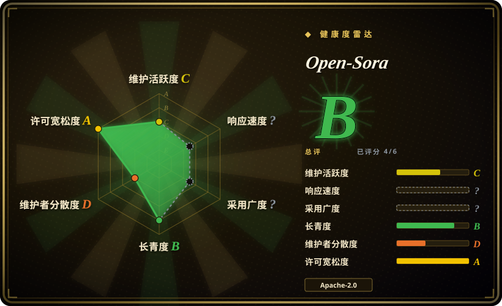
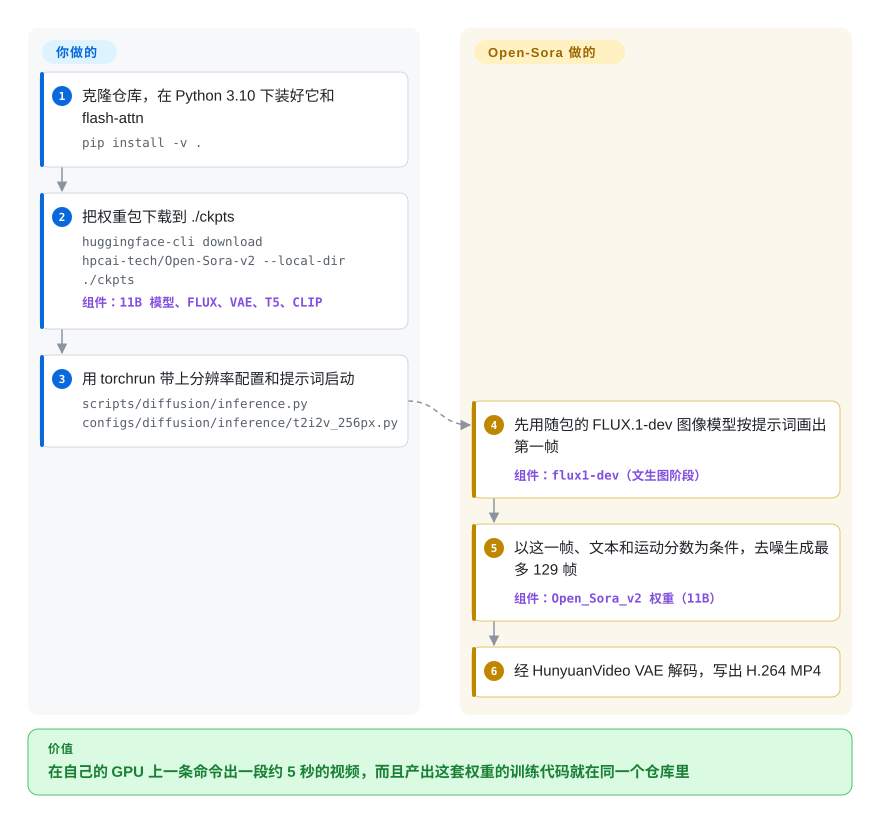

# Open-Sora

商业视频生成服务只给你成片，不给配方：你没法研究它、重训它，也没法自己部署。Open-Sora 把整套东西都公开了——一个 11B 文生视频／图生视频模型的权重、训练代码和数据流水线，外加一份把整轮训练算到 20 万美元的报告；但它从 2025 年 3 月起就不再更新，而且它下载的权重里夹着非 Apache 许可证。

## 何时使用

你是机器学习研究员或实验室工程师，任务是**训练**一个视频扩散模型，而不只是调用一个：可能是一篇要消融自编码器的论文，可能是需要自有数据的领域模型（手术录像、驾驶场景），也可能是内部要算清楚“完整训一个视频模型到底花多少钱”。多数开源视频模型只给权重加一个推理脚本，训练循环、数据筛选和并行技巧都不公开，你只能对着一份 PDF 反推。Open-Sora 是把配方从头到尾都放出来的那个选项：`scripts/diffusion/train.py` 配分阶段的配置（`image.py`、`stage1.py` 等），一个把视频片段 CSV 整理成分桶训练元数据的数据预处理脚本，一份 4.5 万条 Pexels 片段的示例数据集，自研的深度压缩视频自编码器（Video DC-AE）及其训练文档，以及已经接好的 ColossalAI 序列并行／张量并行——另外四代旧版本（v1.0–v1.3）各留一个分支，每代都有一份说明改了什么的报告。

当**可复现的训练路径本身就是交付物**、生成质量排第二时，选它而不是 [Wan2.2](https://github.com/Wan-Video/Wan2.2) 或 HunyuanVideo；如果你今天只想要最好的开源成片，选后两者。如果你手上是多卡 H100／H200 节点，想在一个地方看到一整套降本做法（从图像模型初始化、先低分辨率训练再做高分辨率图生视频微调、把潜空间压到 4×32×32），也可以想到它。

## 怎么用起来

Open-Sora 是一个扩散 Transformer：它从“潜空间”里的纯噪声出发——潜空间就是一张很小的数字网格，之后由自编码器还原成视频帧——在你的提示词引导下一步步去掉噪声。2.0 版专门为图生视频调过，所以纯文生视频是接力完成的：先由一个独立的图像模型（FLUX.1-dev，和权重包一起下载）按提示词画出一张静帧，再由 11B 视频模型把这张图动起来，最多 129 帧（24 fps 下约 5 秒），还可以用“运动分数”在平缓和剧烈之间调节。整个过程由 `torchrun` 加一个 Python 配置文件驱动；主路径上没有服务、没有 API、也没有图形界面——这是一个研究代码库，你要负责的是运行环境（版本对齐的 CUDA／torch／flash-attn）、显存，以及你自己套在脚本外面的任何封装。训练用同一套配置，由 ColossalAI 把计算拆到多张卡上；仓库自带的 Gradio 应用是唯一的交互界面。

<!-- flow-steps:begin (generated from flows/open-sora.json by tools/flow_card.py — do not edit) -->

流程文字版

1. **你**：克隆仓库，在 Python 3.10 下装好它和 flash-attn — `pip install -v .`
2. **你**：把权重包下载到 ./ckpts — `huggingface-cli download hpcai-tech/Open-Sora-v2 --local-dir ./ckpts` — 组件：`11B 模型、FLUX、VAE、T5、CLIP`
3. **你**：用 torchrun 带上分辨率配置和提示词启动 — `scripts/diffusion/inference.py configs/diffusion/inference/t2i2v_256px.py`
4. **Open-Sora**：先用随包的 FLUX.1-dev 图像模型按提示词画出第一帧 — 组件：`flux1-dev（文生图阶段）`
5. **Open-Sora**：以这一帧、文本和运动分数为条件，去噪生成最多 129 帧 — 组件：`Open_Sora_v2 权重（11B）`
6. **Open-Sora**：经 HunyuanVideo VAE 解码，写出 H.264 MP4

**价值**：在自己的 GPU 上一条命令出一段约 5 秒的视频，而且产出这套权重的训练代码就在同一个仓库里

<!-- flow-steps:end -->

## 何时不用

- **你在做商业产品，需要许可证干净的整套技术栈。** 代码和 Hugging Face 卡片写的是 Apache-2.0，但默认文生视频流程会加载 `flux1-dev.safetensors`，Black Forest Labs 对它用的是 FLUX.1 [dev] 非商用许可证；技术报告写明视频模型本身是从 Flux 初始化的；默认自编码器是 HunyuanVideo VAE，其腾讯混元社区许可证（原文就印在 Open-Sora 自己的 `LICENSE` 里）排除了欧盟、英国和韩国，并禁止用输出去改进其他模型。改用 Wan2.2，它在 Hugging Face 卡片上的权重许可证是 Apache-2.0——或者在发布任何 Open-Sora 生成的内容前先做法务审查。
- **你想要一个有人维护、能长期依赖的模型。** 最后一次代码提交是 2025-03-26；之后只有一次 README 修改（2026-04-09），13 个开放 PR 无人审阅（有贡献者等了五个月没人理，自己撤回了修复），机器人会把 14 天无动静的 issue 自动关掉。选 Wan2.2（默认分支 2026-09-21 仍有推送）或 Lightricks 的 LTX-2，出了 bug 还有人修。
- **你只有一张 24 GB 的消费级显卡。** README 自己在 H100／H800 上的测试显示：单卡生成 256×256 片段、即使开了 `--offload True`，峰值显存也要 52.5 GB；单卡 768×768 要 1656 秒、60.3 GB。桌面显卡请换更小或量化过的模型——LTX-Video、Wan2.2 的 5B 版本，或者用 [stable-diffusion.cpp](../../on-device-ml/local-image-generation/stable-diffusion-cpp.zh.md) 跑量化的 Wan 权重。
- **你想要节点图或图形界面。** [ComfyUI](../../on-device-ml/local-image-generation/comfyui.zh.md) 的 README 列出的视频工作流支持 Wan 2.1／2.2、LTX-Video、HunyuanVideo 1.5、CogVideoX 和 Mochi——没有 Open-Sora，所以你得自己写 `torchrun` 脚本。
- **你需要长镜头或高分辨率。** 生成长度上限是 `num_frames` 小于 129（约 5 秒），分辨率只有 256px 和 768px 两档。更长的镜头只能拼接，或者换一个为长输出设计的模型。
- **你要的是成片——脚本、配音、剪辑——而不是一段素材。** Open-Sora 每条提示词输出一段无声 MP4。要由 agent 驱动端到端出片，用 [video-production](../../video-production/INDEX.zh.md) 里的流水线，比如 [OpenMontage](../../video-production/open-montage.zh.md)，它把这类生成器当作其中一步来调用。
- **你把“20 万美元”读成了“复现很便宜”。** 报告按每 H200 GPU 小时 2 美元计价，折算约 10 万 H200 GPU 小时量级 [推断]，训练文档的批大小也是按 140 GB 的 H200、`--nproc_per_node 8` 调的。如果你只想在几张卡上改造一个模型，去微调一个更小的开源模型，而不是重跑这份配方。

## 横向对比

| 替代品 | 是否收录 | 我们的评价 | 取舍 |
|---|---|---|---|
| [Wan2.2](https://github.com/Wan-Video/Wan2.2) | 未收录 | 2026 年要做偏生产的开源视频生成，选 Wan2.2 而不是 Open-Sora：它仍在维护，代码和权重都是 Apache-2.0，ComfyUI 原生支持。 | 你得到活跃的上游、适合小显卡的 5B 版本和干净的许可证；失去的是 Open-Sora 那套从零训练、逐版本附报告的完整配方。本批次（标签页收录）未新增该页。 |
| [HunyuanVideo](https://github.com/Tencent-Hunyuan/HunyuanVideo) | 未收录 | 想要腾讯更大、仍在更新的模型，并能接受其社区许可证时选 HunyuanVideo；只有当开放的训练流水线比成片质量更重要时才选 Open-Sora。 | Open-Sora 2.0 发布时的人类偏好评测声称与 HunyuanVideo 11B 打平，但 Open-Sora 本身就依赖 HunyuanVideo 的 VAE——选 Open-Sora 并不能绕开腾讯许可证的地域限制。本批次（标签页收录）未新增该页。 |
| [LTX-Video](https://github.com/Lightricks/LTX-Video) | 未收录 | 延迟和消费级硬件说了算时，选 LTX-Video（或其后继 LTX-2）；需要在数据中心 GPU 上按公开配方重训时选 Open-Sora。 | 截至 2026-09-29，LTX-Video 近 30 天 Hugging Face 下载约 77.5 万次，Open-Sora-v2 约 1100 次——用户基数大得多；但它的权重是自定义的 other 许可证，必须自己读。本批次（标签页收录）未新增该页。 |
| [Open-Sora-Plan](https://github.com/PKU-YuanGroup/Open-Sora-Plan) | 未收录 | 想找另一个同样以“公开 Sora 配方”为目标、MIT 许可的学术复现项目时，对比 Open-Sora-Plan；看重基于 ColossalAI 的效率工程和成本报告时，选潞晨的 Open-Sora。 | 两者目标和年龄相近；Open-Sora-Plan 默认分支在 2026-03-08 还有推送，比 Open-Sora 最后一次代码改动晚一年，但两者都不是快速迭代的上游。本批次（标签页收录）未新增该页。 |
| [ComfyUI](../../on-device-ml/local-image-generation/comfyui.zh.md) | ✅ | 如果你要的是用现成模型交互式出视频而不是训练模型，用 ComfyUI 加 Wan／LTX／Hunyuan 节点，而不是 Open-Sora 的 torchrun 脚本。 | ComfyUI 是运行时和界面，不是模型：它给你可视化工作流和大量模型，但没有训练配方，而且它的支持列表里没有 Open-Sora。 |

## 技术栈

- **语言／框架：** Python 3.10，PyTorch 2.4.0 + torchvision 0.19（在 `requirements.txt` 里锁死），xformers 与 flash-attention（Hopper 上可选 FA3），liger-kernel。
- **并行：** [ColossalAI](../../llm-training/colossalai.zh.md)（`colossalai>=0.4.4`）在推理和训练中提供张量并行和序列并行；训练时用 TensorNVMe 保存检查点。
- **配置系统：** mmengine 风格的 Python 配置，支持 `_base_` 继承；每个键都能在命令行覆盖。
- **模型（v2.0）：** 11B 的 MMDiT 式 Transformer（双流块 + 单流块，形状与 FLUX.1 相同），以 T5-v1.1-XXL 和 CLIP ViT-L/14 的文本向量为条件；默认用 HunyuanVideo VAE，也可以通过 `high_compression.py` 换成自研的 Video DC-AE（4×32×32 压缩）。
- **附加：** 可选的提示词改写和动态运动分数评估会调用 `openai` 客户端；wandb／tensorboard 记录日志；`gradio/app.py` 是 Gradio 演示。

## 依赖

- **硬件：** 实际上需要 NVIDIA 数据中心 GPU——README 的 H100／H800 表里每卡峰值显存约 44–60 GB；768px 要想延迟可接受需 8 卡；训练配置按 8 卡 H200（140 GB）节点调好。
- **权重：** `hpcai-tech/Open-Sora-v2` 权重包（Hugging Face 或 ModelScope）——11B 模型、FLUX.1-dev 及其自编码器、HunyuanVideo VAE、T5-XXL、CLIP——下载到 `./ckpts`，每一项有各自的许可证。
- **CUDA 工具链：** CUDA 版本要和锁定的 torch／xformers wheel 对上（README 用的是 cu121 源）；flash-attn 需要从源码编译。
- **可选外部服务：** `--refine-prompt` 和 `--motion-score dynamic` 需要 OpenAI API key；除此之外不向外发请求。
- **训练数据：** 你自己的视频片段，整理成含 `path,text,num_frames,height,width,aspect_ratio,resolution,fps` 列的 CSV／parquet，或者用 250 GB 的 Pexels-45k 示例集。

## 运维难度

**高。** 没有东西要部署——没有服务也没有 API——但脚本周边全得你自己兜：torch 2.4／CUDA／xformers／flash-attn 的版本对齐，每个进程约 50 GB 显存，好几十 GB 的权重包，单卡生成一段 768px 片段要 10–30 分钟。要给用户提供服务，就得自己在 `torchrun` 外面写队列和 worker。上游已经停更，依赖漂移（新版 torch、新版 CUDA 驱动）只能你自己修；建议把整个环境固化进容器。训练则是集群规模的活。

## 健康度与可持续性

- **维护（2026-09-29）：已停滞。** 发布从 v1.0（2024-03）到 v1.3（2025-02），之后 2025-03-12 宣布 Open-Sora 2.0，但没有打 tag；最后一次代码提交在 2025-03-26。之后唯一的提交是一次 README 更新（2026-04-09）。2026 年的社区 PR 无人审阅；开放 issue 数少（14 个）是因为机器人在 7+7 天无动静后自动关闭，并不代表响应快。
- **治理／背书。** 仓库属于组织 HPC-AI Tech（潞晨科技，ColossalAI 背后的公司，ColossalAI 仍然活跃——2026-09-29 有推送）。README 现在把公司的商业视频产品（Video Ocean）和托管模型 API 放在最显眼的位置，说明精力可能已转向闭源产品 [推断]。贡献集中在公司的小团队（贡献者列表前两位合计约 497 次提交）。
- **年龄与 Lindy。** 创建于 2024-02（约 2.6 年）：约 13 个月高强度开发，随后 18 个月沉寂。对一个年轻且已经停下的项目，Lindy 先验给不了任何支撑——把它当成一件已完成的研究产物，而不是可依赖的平台。
- **采用度。** 约 2.98 万星、约 3100 fork，反映的是 2024 年“开源 Sora”热潮的关注度；但当下使用很少：截至 2026-09-29，`Open-Sora-v2` 在 Hugging Face 近 30 天下载 1149 次，而 LTX-Video 约 77.5 万次，Wan2.2-TI2V-5B 约 2.3 万次。
- **风险标记。** 决定性的风险是 Apache-2.0 徽章与实际权重栈之间的许可证落差（FLUX.1-dev 非商用、从 Flux 初始化的模型、腾讯混元的地域许可证）；其次是一个锁在 torch 2.4、不再打补丁的研究代码库。

## 存疑（未验证）

- [推断] FLUX.1 [dev] 非商用许可证是否延伸到 11B 的 Open-Sora 2.0 权重：报告确认模型从 Flux 初始化，并称其为“一个蒸馏模型”，随附配置的形状与 FLUX.1-dev 一致、权重包里也有 `flux1-dev.safetensors`，但 Open-Sora 没有任何文档说明用的是哪个 Flux 检查点、其许可证如何作用于衍生权重。请做法务审查。
- [推断] “约 10 万 H200 GPU 小时量级”是用报告标题里的 20 万美元除以报告给出的每 H200 GPU 小时 2 美元得到的；没有完整读分阶段成本表。
- [推断] “精力转向商业产品”是从 README 推广 Video Ocean 和托管模型 API、同时代码沉寂这两点推出来的；官方没有宣布 Open-Sora 停止维护。
- [未验证] 在 VBench 和人类偏好上与 HunyuanVideo 11B／Step-Video 30B 持平，是作者自己的评测，这里没有复现。
- [未验证] 没有实测在较新的驱动或消费级环境下，锁定的 torch 2.4／xformers 0.0.27.post2 组合能否顺利安装。
- [未验证] 单段耗时和显存数据取自 README 的 H100／H800 表（50 步）；实际数值取决于 offload、并行方式和分辨率设置。
- [未验证] Hugging Face 下载量是网站在 2026-09-29 显示的滚动 30 天数据，变化很快。
