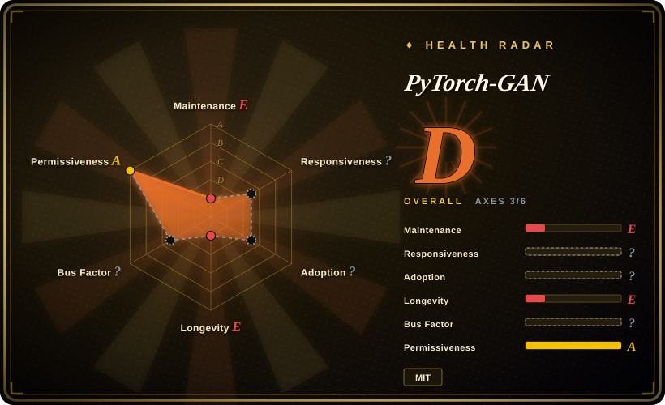
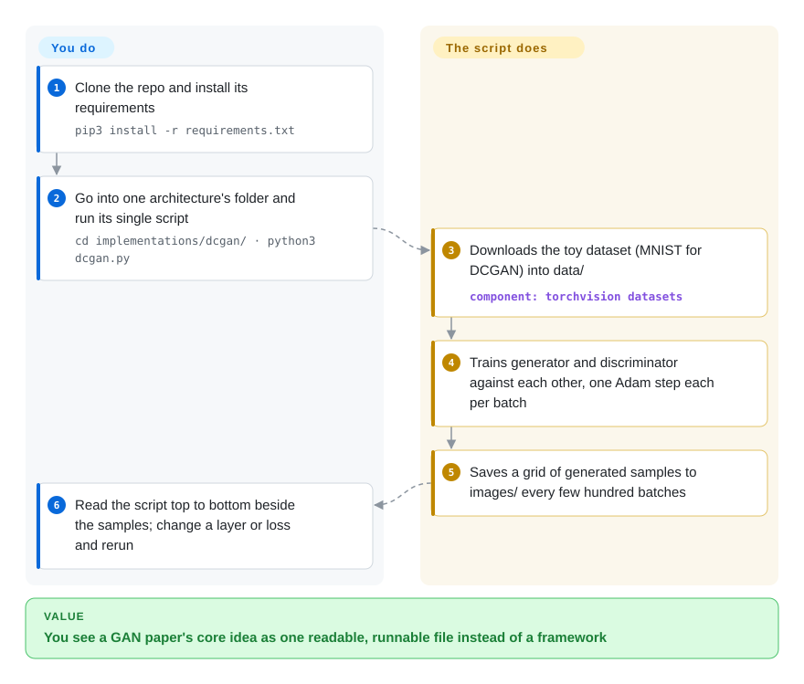

# PyTorch-GAN

A single-author collection of clean, from-scratch PyTorch implementations of many GAN papers (DCGAN, CycleGAN, WGAN, pix2pix, and dozens more) — built to be *read and learned from*, one self-contained script per architecture, not imported as a dependency.

## When to use

You're a student, researcher, or engineer who has read the GAN papers but wants to see the architectures wired up in real, runnable code — the generator/discriminator definitions, the loss functions, the training loop — without the indirection of a heavyweight framework. You clone this repo, open `implementations/dcgan/dcgan.py` (or `cyclegan/`, `wgan_gp/`, `pix2pix/`, …), and get a single compact script that you can read top-to-bottom in one sitting: each model is self-contained, uses plain PyTorch, and covers the paper's core idea — the author says outright that layer configurations do not always mirror the paper. You run it on a toy dataset (MNIST/CIFAR) to watch the training dynamics, tweak a layer or a loss term to build intuition, and copy the pattern into your own code.

You reach for this specific repo when you want *breadth of reference under one consistent style*: the same author implemented many GAN variants with a shared structure, so once you've read one you can read the next quickly and compare how, say, WGAN's loss differs from vanilla GAN's. It's a learning map of the classic GAN era, not a toolkit you build a product on.

## How it works

PyTorch-GAN is a folder of about thirty standalone training scripts, one per GAN paper, sharing one coding style. A GAN (generative adversarial network) is two networks trained against each other: a *generator* that invents images from random noise, and a *discriminator* that tries to tell invented images from real ones — like a forger and an inspector who both get better by competing. **Each script already contains both networks, the loss, the dataset download and the training loop; you just `cd` into its folder and run it.** It then fetches a small dataset (MNIST for DCGAN), alternates one optimizer step for each network per batch, and writes grids of generated samples to `images/` so you can watch quality improve. What you bring is the reading: the script is the textbook, and changing a layer or a loss term and rerunning is how you learn from it. There is no package to import and no API — copying a pattern into your own code is the intended reuse.

<!-- flow-steps:begin (generated from flows/pytorch-gan.json by tools/flow_card.py — do not edit) -->

Text version of the flow

1. **You**: Clone the repo and install its requirements — `pip3 install -r requirements.txt`
2. **You**: Go into one architecture's folder and run its single script — `cd implementations/dcgan/ · python3 dcgan.py`
3. **PyTorch-GAN**: Downloads the toy dataset (MNIST for DCGAN) into data/ — component: `torchvision datasets`
4. **PyTorch-GAN**: Trains generator and discriminator against each other, one Adam step each per batch
5. **PyTorch-GAN**: Saves a grid of generated samples to images/ every few hundred batches
6. **You**: Read the script top to bottom beside the samples; change a layer or loss and rerun

**Value**: You see a GAN paper's core idea as one readable, runnable file instead of a framework

<!-- flow-steps:end -->

## When NOT to use

- **You want a library to import and build on.** This is *copy-and-learn* code, not a packaged dependency — there's no PyPI release, no stable API, no abstraction layer. You read the scripts and adapt them; you don't `import pytorch_gan`.
- **You need production-grade or SOTA generation.** These are faithful but minimal educational implementations (small datasets, simple training loops, no distributed training, no mixed precision, no serving). For real generative quality the field has largely moved to **diffusion models** — GANs are no longer the default for image synthesis.
- **You need current architectures.** The collection covers the classic 2014–2018 GAN papers; it does **not** include modern GANs (StyleGAN2/3, etc.) or anything post-diffusion. No new architectures are being added.
- **You want a maintained codebase.** ⚠️ **The README itself says the repository "has gone stale" and the author no longer has time to maintain it**; the last commit on `master` is 2021-01-06. `requirements.txt` only asks for `torch>=0.4.0`, so old PyTorch idioms may need fixups on current versions. Don't expect bug fixes, dependency bumps, or support — for a reimplementation body that is still being updated, read lucidrains' repos instead.
- **You want the official, paper-accurate weights/numbers.** These are clean re-implementations for learning, not the authors' original repos — don't cite them to reproduce a paper's exact reported metrics; go to each paper's official implementation for that.

## Comparison

| Alternative | In index | Our verdict | Tradeoff |
|---|---|---|---|
| `diffusers` (Hugging Face) | 未收录 | Choose diffusers when you need a maintained library for modern diffusion generation with pretrained pipelines. | Maintained library for **diffusion** models (the modern default for generation) with pretrained pipelines and a real API; solves today's generation problem, but a different model family and not a from-scratch reading aid. |
| Official paper repos (StyleGAN, CycleGAN, …) | 未收录 | Choose official paper repos when you need the authors' own implementations. | The authors' own implementations — paper-accurate weights and numbers, but each is its own codebase with its own style/quirks; not a single consistently-written collection for browsing many GANs side by side. |
| lucidrains' implementations | 未收录 | Choose lucidrains' implementations when you need another clean PyTorch reimplementation body with broader current coverage. | Another prolific single-author body of clean PyTorch reimplementations spanning many architectures (incl. newer ones); often more actively updated, similar "read the code" value, broader/more current scope. |
| torchgan | 未收录 | Choose torchgan when you need an importable GAN library/framework with trainers, losses, and metrics. | An actual GAN *library/framework* (modular trainers, losses, metrics) you import and configure; better if you want reusable building blocks, less suited to reading one paper's architecture end-to-end. |

## Tech stack

- **Language:** Python, plain **PyTorch** — no higher-level training framework (no Lightning/Accelerate), so the training loop is explicit and readable.
- **Structure:** one directory per architecture under `implementations/`, each typically a single self-contained script defining the generator, discriminator, losses, and training loop.
- **Coverage:** classic GAN family — DCGAN, CGAN, WGAN / WGAN-GP, CycleGAN, pix2pix, ACGAN, InfoGAN, BEGAN, ESRGAN, and many more (the README lists each with a link to its paper).
- **Data:** examples run against small standard datasets (e.g. MNIST/CIFAR), downloaded by helper scripts rather than bundled.

## Dependencies

- **Runtime:** Python 3, PyTorch + torchvision, plus the usual numeric stack (numpy) and image helpers; exact pins live in the repo's `requirements.txt` and may be dated. [未验证]
- **Hardware:** a CUDA GPU is recommended for training anything beyond the smallest toy runs; many examples will *run* on CPU but slowly.
- **No service/infra:** nothing to deploy — it's scripts you run locally. The main practical dependency risk is version drift: old PyTorch idioms may need small fixes on a current PyTorch/CUDA stack. [推断]

## Ops difficulty

**Low — there's nothing to operate.** It's a folder of training scripts you run by hand (`cd implementations/<name>/ && python3 <name>.py` — run from inside the folder, because the scripts write to relative paths like `../../data/`), not a service. The only real friction is environment setup: getting a PyTorch/CUDA combo that works on your machine and patching any API calls that have since been deprecated, since the code hasn't been updated to track recent PyTorch releases. There's no deployment, no datastore, no scaling story — by design, because the artifact is *understanding*, not a running system.

## Health & viability

- **Responsiveness**: Cannot be scored — no_traffic.
- **Maintenance (as of 2026-10-08):** last commit on `master` **2021-01-06** (~5.75 years idle; the later 2024-06 `pushed_at` did not touch the default branch), and the README opens with the author's notice that the repo **"has gone stale"** and an invitation for someone to take it over. Abandoned by declaration, not just by silence: expect no fixes, dependency bumps, or new architectures.
- **Governance / bus factor:** a **single-author** repo (Erik Linder-Norén, a User account, not an org). Classic high-bus-factor / single-maintainer situation — there's no team or foundation behind it; its continued existence is "famous and frozen," not staffed.
- **Age & Lindy verdict (created 2018-04, ~8 yr):** old, but its value is a **frozen reference**, not ongoing maintenance — so plain age × *still-active* doesn't apply the usual way. The Lindy signal here is "this reading material has been useful for years and isn't going anywhere," not "this is a living, evolving project." Judge it as a stable teaching artifact, not a dependency to bet a system on.
- **Relevance decay (flag):** the field moved on. GANs have been **largely superseded by diffusion models** for generation, so the *educational* value (understanding the GAN era) persists while the *practical* value for new generation work has declined. Weigh this if your goal is building something today vs. learning the lineage.
- **Risk flags:** MIT-licensed (no relicense risk); the real risks are idleness and old APIs, not governance traps. [推断]

## Caveats (unverified)

- [未验证] ~17.5k GitHub stars (GitHub API, 2026-10-08); star counts are unreliable and date-sensitive — treat as indicative only.
- [推断] Whether the current scripts still run unmodified on a 2026 PyTorch/torchvision stack was not tested; `requirements.txt` pins only `torch>=0.4.0` with no upper bounds.
- [未验证] The exact list of implemented architectures (DCGAN, CycleGAN, WGAN-GP, pix2pix, etc.) is paraphrased from the README; confirm the current set against the repo's `implementations/` directory.
- [未验证] `requirements.txt` (read 2026-10-08) lists `torch>=0.4.0`, torchvision, matplotlib, numpy, scipy, pillow, urllib3 and scikit-image, all unpinned except the torch floor; which versions actually work together today is unverified.
- [推断] "One self-contained script per architecture" was confirmed for `implementations/dcgan/dcgan.py` (it downloads MNIST itself) and matches the 32 folders under `implementations/`; the other scripts were not opened one by one, and CycleGAN/pix2pix datasets come from the `data/download_*_dataset.sh` helpers instead.
- [推断] The "GANs superseded by diffusion" framing is a general characterization of the generative-modeling field, not a claim specific to this repo's contents.
