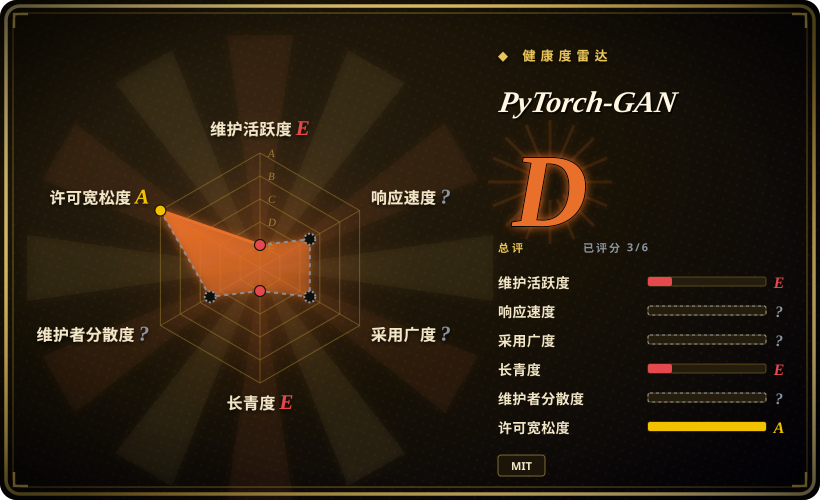
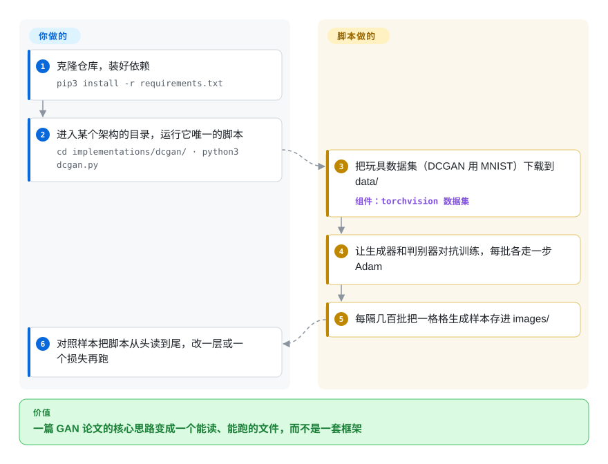

# PyTorch-GAN

一份单作者维护的合集，用 PyTorch 从零干净实现了大量 GAN 论文（DCGAN、CycleGAN、WGAN、pix2pix 等几十种）——目的是*供人阅读和学习*，每个架构一个自包含脚本，而不是当依赖来 import。

## 何时使用

你是一名学生、研究者或工程师，读过那些 GAN 论文，但想看看这些架构在真实、可运行的代码里是怎么接线的——生成器/判别器的定义、损失函数、训练循环——而不想被一个重量级框架的间接层挡住视线。你克隆这个仓库，打开 `implementations/dcgan/dcgan.py`（或 `cyclegan/`、`wgan_gp/`、`pix2pix/`……），拿到一个紧凑的单脚本，可以一口气从头读到尾：每个模型都自包含，用纯 PyTorch，抓住论文的核心思路——作者明说层的配置不一定和论文一致。你在玩具数据集（MNIST/CIFAR）上跑一跑、观察训练动态，改一层或改一个损失项来建立直觉，再把这套范式抄进自己的代码。

当你想要*在统一风格下的参考广度*时，你会选这个具体的仓库：同一个作者用一套共享结构实现了许多 GAN 变体，于是读完一个再读下一个就很快，还能对比——比如 WGAN 的损失和原版 GAN 的损失差在哪。它是经典 GAN 时代的一张学习地图，而不是你拿来做产品的工具箱。

## 怎么用起来

PyTorch-GAN 是一个装着约三十个独立训练脚本的目录，每篇 GAN 论文一个，代码风格统一。GAN（生成对抗网络）是两个互相较劲的网络：*生成器*从随机噪声里造图，*判别器*努力分辨造出来的图和真图——像造假者和鉴定师在竞争中一起变强。**每个脚本已经包含两个网络、损失函数、数据集下载和训练循环；你只要 `cd` 进它的目录运行它。**它会拉一个小数据集（DCGAN 用 MNIST），每批给两个网络各走一步优化，再把生成样本拼成网格存进 `images/`，让你看着质量一点点变好。你带来的是阅读：脚本就是教材，改一层或一个损失项再跑一遍，就是从中学东西的方式。没有可 import 的包，也没有 API——把某个范式抄进自己的代码才是它预期的复用方式。

<!-- flow-steps:begin (generated from flows/pytorch-gan.json by tools/flow_card.py — do not edit) -->

流程文字版

1. **你**：克隆仓库，装好依赖 — `pip3 install -r requirements.txt`
2. **你**：进入某个架构的目录，运行它唯一的脚本 — `cd implementations/dcgan/ · python3 dcgan.py`
3. **PyTorch-GAN**：把玩具数据集（DCGAN 用 MNIST）下载到 data/ — 组件：`torchvision 数据集`
4. **PyTorch-GAN**：让生成器和判别器对抗训练，每批各走一步 Adam
5. **PyTorch-GAN**：每隔几百批把一格格生成样本存进 images/
6. **你**：对照样本把脚本从头读到尾，改一层或一个损失再跑

**价值**：一篇 GAN 论文的核心思路变成一个能读、能跑的文件，而不是一套框架

<!-- flow-steps:end -->

## 何时不用

- **你想要一个可 import、可在其上构建的库。** 这是*抄了学*的代码，不是打包好的依赖——没有 PyPI release、没有稳定 API、没有抽象层。你读脚本、改脚本；你不会 `import pytorch_gan`。
- **你需要生产级或 SOTA 的生成质量。** 这些是忠实但最小化的教学实现（小数据集、简单训练循环，没有分布式训练、没有混合精度、没有 serving）。要真实的生成质量，这个领域早已大幅转向**扩散模型**——GAN 已不再是图像合成的默认选项。
- **你需要当下的架构。** 这份合集覆盖的是 2014—2018 的经典 GAN 论文；它**不包含**现代 GAN（StyleGAN2/3 等），也没有任何扩散时代之后的东西。也不会再加新架构。
- **你想要一个受维护的代码库。** ⚠️ **README 开头作者自己写明仓库「已经陈旧」，没时间再维护**；`master` 最后一次提交在 2021-01-06。`requirements.txt` 只要求 `torch>=0.4.0`，老的 PyTorch 写法在当前版本上可能需要小修。别指望 bug 修复、依赖升级或支持——想要仍在更新的重实现合集，改读 lucidrains 的仓库。
- **你想要官方、对论文准确的权重/数字。** 这些是为学习而写的干净重实现，不是作者们的原始仓库——别拿它来复现某篇论文确切报告的指标；那件事请去各论文的官方实现。

## 横向对比

| 替代品 | 是否收录 | 我们的评价 | 取舍 |
|---|---|---|---|
| `diffusers`（Hugging Face） | 未收录 | 需要面向现代扩散生成的受维护库和预训练 pipeline 时，选 diffusers。 | 面向**扩散**模型（当下生成的默认选项）的受维护库，带预训练 pipeline 和真正的 API；解决的是今天的生成问题，但属于不同模型家族，也不是一份「读代码」的从零阅读材料。 |
| 各论文官方仓库（StyleGAN、CycleGAN……） | 未收录 | 需要作者自己的实现时，选各论文官方仓库。 | 作者们自己的实现——权重和数字对论文准确，但每个都是各自的代码库、各有风格和怪癖；不是一份风格统一、可并排浏览多种 GAN 的合集。 |
| lucidrains 的实现 | 未收录 | 需要另一套覆盖更广、更新更勤的干净 PyTorch 重实现时，选 lucidrains 的实现。 | 另一位高产单作者写的大量干净 PyTorch 重实现，覆盖许多架构（含较新的）；通常更新更勤，类似的「读代码」价值，范围更广也更新。 |
| torchgan | 未收录 | 需要可 import、可配置、带 trainer/损失/指标的 GAN 库时，选 torchgan。 | 一个真正的 GAN *库/框架*（模块化 trainer、损失、指标），你 import 并配置它；想要可复用的积木时更合适，想端到端读懂某篇论文的架构则不如本仓库。 |

## 技术栈

- **语言：** Python，纯 **PyTorch**——没有更高层的训练框架（无 Lightning/Accelerate），所以训练循环是显式且可读的。
- **结构：** `implementations/` 下每个架构一个目录，通常是一个自包含脚本，定义生成器、判别器、损失和训练循环。
- **覆盖：** 经典 GAN 家族——DCGAN、CGAN、WGAN / WGAN-GP、CycleGAN、pix2pix、ACGAN、InfoGAN、BEGAN、ESRGAN 等等（README 逐个列出并链到对应论文）。
- **数据：** 示例跑在小型标准数据集上（如 MNIST/CIFAR），由 helper 脚本下载而非随仓库打包。

## 依赖

- **运行时：** Python 3、PyTorch + torchvision，加上常见数值栈（numpy）和图像 helper；确切的版本钉死在仓库的 `requirements.txt` 里，可能已经过时。[未验证]
- **硬件：** 训练任何超出最小玩具规模的东西都建议用 CUDA GPU；许多示例能在 CPU 上*跑*，但很慢。
- **无服务/基础设施：** 没有要部署的东西——就是你本地跑的脚本。主要的实际依赖风险是版本漂移：老的 PyTorch 写法在当前 PyTorch/CUDA 栈上可能需要小修。[推断]

## 运维难度

**低——没有什么要运维的。** 它是一堆你手动运行的训练脚本（`cd implementations/<name>/ && python3 <name>.py`——要在目录里面运行，因为脚本会写 `../../data/` 这样的相对路径），不是服务。唯一的真实摩擦在环境搭建：配出一套能在你机器上跑通的 PyTorch/CUDA 组合，并修补任何已被弃用的 API 调用，因为这份代码没有跟进近期的 PyTorch 发布。没有部署、没有数据存储、没有扩容方案——这是设计使然，因为它的产物是*理解*，而不是一个运行中的系统。

## 健康度与可持续性

- **响应速度**：无法计算——no_traffic。
- **维护（截至 2026-10-08）：** `master` 最后一次提交在 **2021-01-06**（闲置约 5.75 年；后来 2024-06 的 `pushed_at` 没有动默认分支），README 开头是作者的声明：仓库**「已经陈旧」**，并邀请有人来接手。这是作者宣布的废弃，而不只是沉默：别指望修复、依赖升级或新架构。
- **治理 / bus factor：** 这是一个**单作者**仓库（Erik Linder-Norén，User 账号而非组织）。典型的高 bus-factor / 单维护者情形——背后没有团队或基金会；它能继续存在是「出名且冻结」，并非有人在维护。
- **年龄与 Lindy 判定（创建于 2018-04，约 8 年）：** 老，但它的价值是**冻结的参考**，而非持续维护——所以单纯的年龄 × *仍活跃*在这里并不按常规套用。这里的 Lindy 信号是「这份阅读材料多年来一直有用、且不会消失」，而不是「这是一个仍在演进的活项目」。把它当成一份稳定的教学制品来判断，而不是一个值得押注系统的依赖。
- **相关性衰减（标记）：** 领域往前走了。GAN 在生成上已**被扩散模型大幅取代**，所以*教学*价值（理解 GAN 时代）仍在，而对新生成工作的*实用*价值已经下降。如果你的目标是今天造点东西、而非学习脉络，请权衡这一点。
- **风险标记：** MIT 许可（无 relicense 风险）；真正的风险是闲置和老 API，而非治理陷阱。[推断]

## 存疑（未验证）

- [未验证] 约 17.5k GitHub star（GitHub API，2026-10-08）；star 数不可靠且对日期敏感——仅作参考。
- [推断] 当前脚本能否在 2026 年的 PyTorch/torchvision 上不改就跑通，没有实测；`requirements.txt` 只钉了 `torch>=0.4.0`，没有上限。
- [未验证] 已实现架构的确切清单（DCGAN、CycleGAN、WGAN-GP、pix2pix 等）是从 README 转述的；确切集合请对照仓库的 `implementations/` 目录确认。
- [未验证] `requirements.txt`（2026-10-08 读取）列出 `torch>=0.4.0`、torchvision、matplotlib、numpy、scipy、pillow、urllib3 和 scikit-image，除 torch 下限外都没钉版本；今天哪些版本组合真能一起工作未经核实。
- [推断]「每个架构一个自包含脚本」在 `implementations/dcgan/dcgan.py` 上核实过（它自己下载 MNIST），也和 `implementations/` 下 32 个目录相符；其余脚本没有逐个打开，CycleGAN/pix2pix 的数据集则由 `data/download_*_dataset.sh` 脚本获取。
- [推断]「GAN 被扩散模型取代」的表述是对生成式建模领域的一般性概括，并非针对本仓库内容的具体断言。
