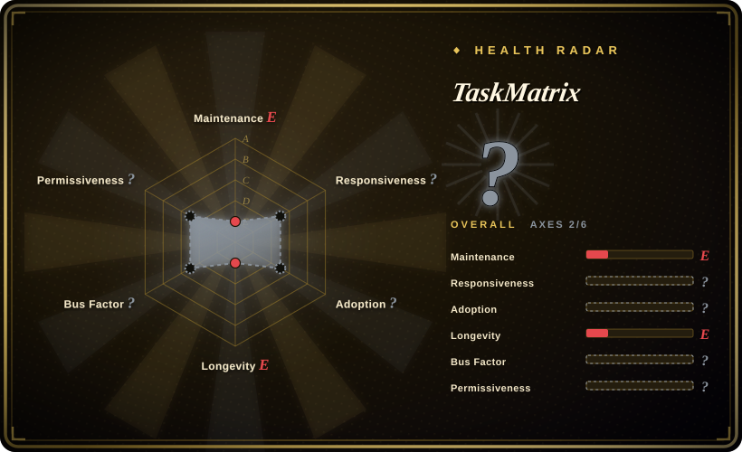
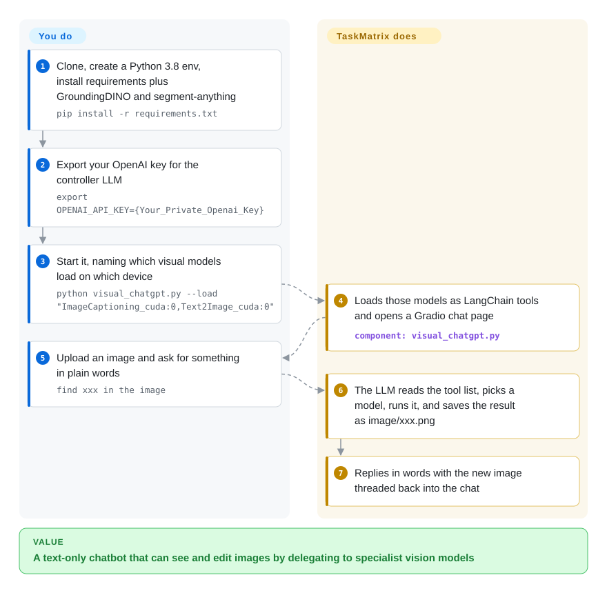

# TaskMatrix

A historical research demo (originally "Visual ChatGPT", from Microsoft) that wires ChatGPT to a fixed set of visual foundation models so you can chat to caption, generate, and edit images — interesting as an early tool-routing-agent design, but unmaintained since mid-2023 and superseded by modern multimodal LLMs.

## When to use

You're a researcher or engineer studying how the first wave of LLM "tool-routing agents" was built, and you want to read a concrete, runnable reference rather than a paper. You've used GPT-4o or Gemini where vision is native, and you're curious how people bolted vision onto a text-only ChatGPT *before* multimodal models existed: a prompt-driven router (the "Visual ChatGPT" pattern) that parses the user's request, decides which of ~20 visual foundation models (BLIP captioning, Stable Diffusion text-to-image, ControlNet/Pix2Pix editing, segmentation, depth, etc.) to invoke, threads the intermediate images back into the conversation, and stitches a natural-language answer around the tool outputs. TaskMatrix is a clean artifact of that design — you read it (and maybe stand up a piece of it on a GPU box) to understand the manager-prompt, the tool registry, and the image-state plumbing, not to ship it.

It's also a useful teaching reference when you're building your *own* tool-routing agent today and want to see an early, self-contained example of LLM-as-orchestrator over heavyweight specialist models — what the prompt scaffolding looked like, where it was brittle, and why native multimodal models eventually absorbed the whole pattern.

## How it works

TaskMatrix is one Python script, `visual_chatgpt.py`, that turns a text-only language model into a picture-handling assistant by giving it a toolbox. **The toolbox ships with it**: about twenty visual foundation models — large pretrained models that each do one visual job, such as captioning (BLIP), text-to-image (Stable Diffusion), or edge/depth/pose-guided generation (ControlNet) — each wrapped as a LangChain "tool" with a one-line description. You choose at launch which of them to load and on which GPU, supply an OpenAI key, and chat in a Gradio web page. The language model never sees pixels: a long prompt tells it that every image is a file named `image/xxx.png` and lists the tools, so it decides which tool to call, the tool writes a new file, and the model talks about that file name. It is like a manager who cannot see, directing a room of specialists by passing around labeled photos. Hosting the models, paying for the API, and keeping the 2023 dependency pins working are yours.

<!-- flow-steps:begin (generated from flows/taskmatrix.json by tools/flow_card.py — do not edit) -->

Text version of the flow

1. **You**: Clone, create a Python 3.8 env, install requirements plus GroundingDINO and segment-anything — `pip install -r requirements.txt`
2. **You**: Export your OpenAI key for the controller LLM — `export OPENAI_API_KEY={Your_Private_Openai_Key}`
3. **You**: Start it, naming which visual models load on which device — `python visual_chatgpt.py --load "ImageCaptioning_cuda:0,Text2Image_cuda:0"`
4. **TaskMatrix**: Loads those models as LangChain tools and opens a Gradio chat page — component: `visual_chatgpt.py`
5. **You**: Upload an image and ask for something in plain words — `find xxx in the image`
6. **TaskMatrix**: The LLM reads the tool list, picks a model, runs it, and saves the result as image/xxx.png
7. **TaskMatrix**: Replies in words with the new image threaded back into the chat

**Value**: A text-only chatbot that can see and edit images by delegating to specialist vision models

<!-- flow-steps:end -->

## When NOT to use

- **Anything you intend to keep running.** The default branch has had no commits since **2023-06-29** (more than three years as of 2026-10-08); it is abandoned in practice (not formally `archived`, but functionally dead). Read it, don't depend on it — for a working image-chat assistant use a modern multimodal LLM instead.
- **You want a current image-chat capability.** Modern multimodal LLMs (GPT-4o, Gemini, Claude with vision, Qwen-VL) do captioning / VQA / grounded reasoning natively, in one model, with no foundation-model zoo to host. The whole reason TaskMatrix existed — text-only ChatGPT couldn't see — no longer holds.
- **You want a maintained agent/tool-routing framework.** Today's agent frameworks (LangChain, modern function-calling, MCP-based tooling) do orchestration far better and are actively maintained. Don't build new work on TaskMatrix's bespoke prompt-router.
- **You can't pin old, heavy deps.** `requirements.txt` pins `langchain==0.0.101` and `torch==1.13.1` and leaves `transformers`, `diffusers` and ~25 others unpinned, on top of GroundingDINO, segment-anything, many GB of weights and an OpenAI key; a 2026 install will resolve today's `diffusers`/`transformers` against a 2023 LangChain API, so expect breakage. [未验证] If you only want the pattern, rebuild it on a current agent framework instead.
- **Security / supply-chain sensitivity.** Unmaintained for 3+ years means no patches; pinned old dependencies accumulate known CVEs over time. Treat it as throwaway research code, not something to expose or trust with secrets.

## Comparison

| Alternative | In index | Our verdict | Tradeoff |
|---|---|---|---|
| Modern multimodal LLMs (GPT-4o / Gemini / Claude vision / Qwen-VL) | 未收录 | Choose modern multimodal LLMs when you need native vision inside one maintained model. | Native vision in a single model — captioning, VQA, generation/editing via the model or its built-in tools; no foundation-model zoo to host, actively maintained. This is what replaced the whole TaskMatrix pattern. |
| HuggingGPT / JARVIS | 未收录 | Choose HuggingGPT/JARVIS when you need the same-era LLM-controller-over-model-catalog idea. | Same era, same idea — an LLM controller that routes tasks to a catalog of Hugging Face models; broader (not vision-only) task scope, also a research demo rather than a maintained product. |
| LangChain agents | 未收录 | Choose LangChain agents when you need a maintained general-purpose LLM tool-orchestration framework. | Maintained, general-purpose LLM tool-orchestration framework; you wire your own tools (including vision models) with current function-calling, instead of TaskMatrix's hand-rolled 2023 prompt-router. |
| Modern agent frameworks (function-calling / MCP-based tooling) | 未收录 | Choose modern agent frameworks when you need current standardized tool access for LLMs. | Current, standardized way to give an LLM tools; far better orchestration, structured tool I/O, and active support than this bespoke demo. |
| [autoresearch](../research-automation/autoresearch.md) | ✅ | Choose autoresearch when you need another single-author research-demo app for agent-driven ML training loops. | Also a single-author research-demo app, but a single-GPU *training* loop for agent-driven ML research — unrelated problem; shares only the "read-it-as-a-reference, don't deploy" posture. |

## Tech stack

- **Language:** Python (~80% per repo).
- **Controller:** an LLM (the README targets OpenAI's ChatGPT/`gpt-3.5` family via the OpenAI API) prompted as a manager that selects and sequences tools. Built on a 2023-era LangChain agent scaffold.
- **Tool zoo:** ~20 visual foundation models loaded as tools — image captioning (BLIP), text-to-image (Stable Diffusion), instruction/edit and conditioning (ControlNet, Pix2Pix), segmentation, depth/edge/pose estimation, VQA, etc. (exact set varies by version).
- **Mechanism:** a prompt-driven router parses intent, dispatches to a foundation model, persists intermediate images as conversation state, and composes a natural-language reply around the outputs.

## Dependencies

- **Runtime:** Python plus a heavy ML stack — `torch`, `transformers`, `diffusers`, `langchain`, and the various model-specific libraries, at versions pinned around 2023. [未验证]
- **Hardware:** a CUDA GPU with substantial VRAM to host multiple large vision models simultaneously; CPU-only is impractical for the generation/editing tools.
- **External services:** an OpenAI API key for the controller LLM (network + cost). Model weights for the visual foundation models must be downloaded (multi-GB).
- **Reproducibility risk:** because deps are old and unpinned-to-current, a clean install today may fail to resolve or run without manual version surgery — budget for that before assuming it works.

## Ops difficulty

**High, and not worth paying.** Even in 2023 this was a non-trivial stand-up: provision a large-VRAM GPU, download many GB of model weights, install a deep ML dependency tree, and supply an OpenAI key. In 2026 the difficulty is compounded by age — the pinned dependency versions predate current CUDA/PyTorch/`transformers` releases, so expect dependency-resolution breakage and patching just to boot it, with no maintainer to file issues against. There's no service-grade deployment story (no packaging, versioning, or CI to lean on); it was always a demo. Run a slice of it on a throwaway box to study the design, but do not operate it.

## Health & viability

- **Responsiveness**: Cannot be scored — no_data.
- **Maintenance (as of 2026-10-08):** last commit on `main` **2023-06-29** (the later 2024-01-06 `pushed_at` did not touch the default branch), no releases — **abandoned in practice** (not formally `archived` on GitHub, but functionally dead). No fixes, no maintainer to file issues against.
- **Governance / bus factor:** the repo lives under an individual `User` account (chenfei-wu) though the work originated at Microsoft Research as "Visual ChatGPT." [推断] Whatever institutional backing it once had is gone; there is no team or roadmap behind the current repo.
- **Age & Lindy verdict (created 2023-03, ~3 yr):** this is the **fails-Lindy** case — old *enough to be stale* but no longer active. Age here is a negative, not a positive: the longer it sits unmaintained against a fast-moving stack (CUDA/PyTorch/`transformers`/`diffusers`), the less likely a clean install even runs. Read it as a historical artifact of the pre-multimodal tool-routing era; do not bet on it.
- **Risk flags:** 3+ years unmaintained ⇒ pinned 2023-era deps accumulate known CVEs with no patches — a real supply-chain concern; do not expose it or trust it with secrets. License is MIT (file verified), though GitHub's API shows `NOASSERTION`. [未验证]

## Caveats (unverified)

- [未验证] ~34.0k GitHub stars (33,965 via the GitHub API on 2026-10-08); stars are unreliable and date-sensitive — treat as indicative only.
- [推断] The controller is `OpenAI(temperature=0)` from `langchain==0.0.101`, i.e. a completion-style model chosen by that old LangChain default; whether that model is still served by OpenAI, and so whether the chat works at all without a code change, was not tested.
- [未验证] The README's Quick Start clones `microsoft/TaskMatrix.git` and then runs `cd visual-chatgpt`, which does not match the cloned folder name; follow the intent, not the literal commands.
- **License:** the repo's `LICENSE.txt` is an MIT License (Copyright 2023 Microsoft) — **verified** by reading the file. Note that GitHub's API reports the license as `NOASSERTION` / "Other" (no SPDX auto-match), so tooling may show it as unlicensed; the file itself is MIT.
- [推断] The repo is **not** formally `archived` on GitHub, but with no commits since 2023-06-29 it is abandoned in practice — "abandoned" here is inferred from commit history, not a declared project status.
- [未验证] The tool roster (~20 visual foundation models; the README's GPU table lists 21 entries and `visual_chatgpt.py` defines a few more, e.g. Text2Box, Segmenting, Inpainting) was counted from the 2026-10-08 tree; which of them still load against current `diffusers`/`transformers` was not tested.
- [未验证] Dependency staleness / install breakage on current CUDA/PyTorch is inferred from the 2023-06 freeze and 2023-era pins, not from a fresh install attempt here — verify by trying a clean setup if you must run it.
