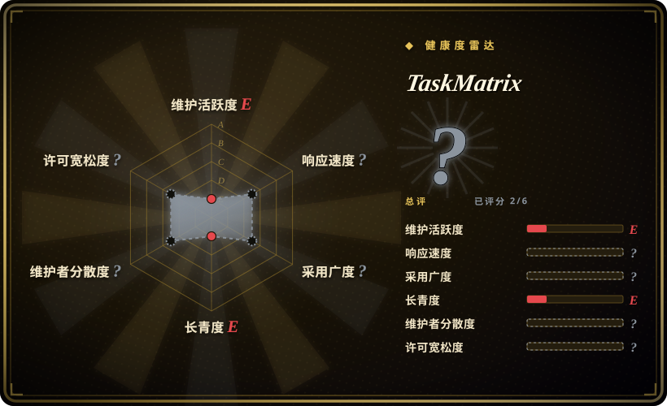
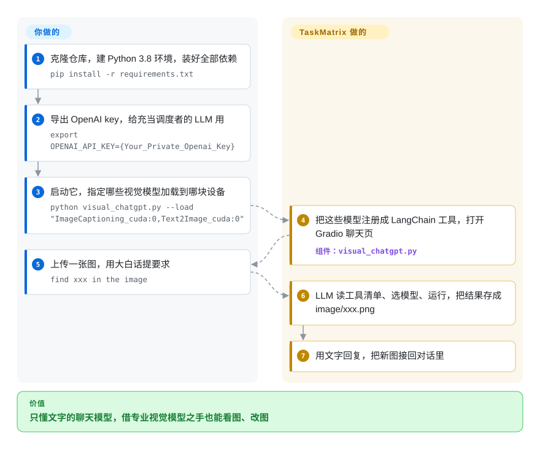

# TaskMatrix

一个历史性的研究 demo（最初叫「Visual ChatGPT」，出自微软）：它把 ChatGPT 接到一组固定的视觉基础模型上，让你能用对话来给图片做描述、生成和编辑——作为早期「工具路由 agent」的设计样本很有意思，但自 2023 年年中起已停更，并已被现代多模态大模型取代。

## 何时使用

你是研究者或工程师，想搞清楚第一波 LLM「工具路由 agent」当年是怎么搭的，而且你想读一份具体、能跑的参考实现，而不是一篇论文。你用过 GPT-4o 或 Gemini，那里视觉是原生的；你好奇在多模态模型出现*之前*，人们是怎么把视觉硬接到一个纯文本 ChatGPT 上的：一个 prompt 驱动的路由器（即「Visual ChatGPT」范式）解析用户请求，决定调用约 20 个视觉基础模型里的哪一个（BLIP 描述、Stable Diffusion 文生图、ControlNet/Pix2Pix 编辑、分割、深度等等），把中间图片回填进对话状态，再围绕工具输出拼出一段自然语言回答。TaskMatrix 正是那套设计的干净样本——你读它（也许在一台 GPU 机器上跑起其中一部分）是为了理解那份 manager prompt、工具注册表和图片状态管线，而不是为了把它部署上线。

当你今天要搭*自己的*工具路由 agent、想看一个早期、自包含的「LLM 当编排器、调度重型专家模型」的例子时，它也是有用的教学参考——看看当年的 prompt 脚手架长什么样、它在哪里脆弱，以及为什么原生多模态模型最终把整套范式吸收掉了。

## 怎么用起来

TaskMatrix 是一个 Python 脚本 `visual_chatgpt.py`，它给只懂文字的语言模型配一个工具箱，让它能处理图片。**工具箱随仓库附带**：约二十个视觉基础模型——每个都是只干一件视觉活的大型预训练模型，比如看图说话（BLIP）、文生图（Stable Diffusion）、按边缘 / 深度 / 姿态生成图（ControlNet）——每个都包装成一个带一句话说明的 LangChain「工具」。你在启动时决定加载哪些模型、放在哪块 GPU 上，提供一个 OpenAI key，然后在 Gradio 网页里聊天。语言模型从头到尾看不到像素：一段长 prompt 告诉它每张图都是一个名叫 `image/xxx.png` 的文件，并列出全部工具；它决定调哪个工具，工具写出一个新文件，模型再围绕这个文件名说话。好比一位看不见的经理，靠传递贴了标签的照片指挥一屋子专家。托管这些模型、付 API 费用、让 2023 年钉死的依赖继续能装上，都归你。

<!-- flow-steps:begin (generated from flows/taskmatrix.json by tools/flow_card.py — do not edit) -->

流程文字版

1. **你**：克隆仓库，建 Python 3.8 环境，装好全部依赖 — `pip install -r requirements.txt`
2. **你**：导出 OpenAI key，给充当调度者的 LLM 用 — `export OPENAI_API_KEY={Your_Private_Openai_Key}`
3. **你**：启动它，指定哪些视觉模型加载到哪块设备 — `python visual_chatgpt.py --load "ImageCaptioning_cuda:0,Text2Image_cuda:0"`
4. **TaskMatrix**：把这些模型注册成 LangChain 工具，打开 Gradio 聊天页 — 组件：`visual_chatgpt.py`
5. **你**：上传一张图，用大白话提要求 — `find xxx in the image`
6. **TaskMatrix**：LLM 读工具清单、选模型、运行，把结果存成 image/xxx.png
7. **TaskMatrix**：用文字回复，把新图接回对话里

**价值**：只懂文字的聊天模型，借专业视觉模型之手也能看图、改图

<!-- flow-steps:end -->

## 何时不用

- **任何你打算持续跑起来的场景。** 默认分支自 **2023-06-29** 起再无 commit（截至 2026-10-08 已超过三年）；它实际上已被废弃（GitHub 上没正式 `archived`，但功能上已死）。读它，别依赖它——要一个能用的图片对话助手，改用现代多模态大模型。
- **你想要一个当下可用的图片对话能力。** 现代多模态大模型（GPT-4o、Gemini、带视觉的 Claude、Qwen-VL）在单个模型里原生做描述 / VQA / 有据推理，不需要托管一整个基础模型动物园。TaskMatrix 存在的全部理由——纯文本 ChatGPT 看不见图——如今已不成立。
- **你想要一个受维护的 agent / 工具路由框架。** 今天的 agent 框架（LangChain、现代 function-calling、基于 MCP 的工具链）做编排远更好，且在持续维护。别在 TaskMatrix 那套定制 prompt 路由器上做新工作。
- **你没法 pin 住又老又重的依赖。** `requirements.txt` 钉死了 `langchain==0.0.101` 和 `torch==1.13.1`，却让 `transformers`、`diffusers` 等约 25 个包不钉版本，再加上 GroundingDINO、segment-anything、数 GB 权重和一个 OpenAI key；2026 年安装会把今天的 `diffusers`/`transformers` 配上 2023 年的 LangChain API，预期会坏。[未验证] 只想要这个范式的话，在当下的 agent 框架上重搭一遍。
- **安全 / 供应链敏感。** 停更三年多意味着没有任何补丁；钉死的老依赖会随时间累积已知 CVE。把它当作一次性研究代码，而不是能暴露在外或托付 secret 的东西。

## 横向对比

| 替代品 | 是否收录 | 我们的评价 | 取舍 |
|---|---|---|---|
| 现代多模态大模型（GPT-4o / Gemini / 带视觉的 Claude / Qwen-VL） | 未收录 | 需要单个持续维护的模型原生带视觉时，选现代多模态大模型。 | 单个模型原生带视觉——描述、VQA、生成 / 编辑由模型或其内建工具完成；无需托管基础模型动物园，且在持续维护。正是它取代了整套 TaskMatrix 范式。 |
| HuggingGPT / JARVIS | 未收录 | 需要同时代、同样“LLM 控制器调模型目录”思路时，选 HuggingGPT/JARVIS。 | 同时代、同思路——一个 LLM 控制器把任务路由到一批 Hugging Face 模型；任务面更广（不限视觉），同样是研究 demo 而非受维护的产品。 |
| LangChain agents | 未收录 | 需要受维护的通用 LLM 工具编排框架时，选 LangChain agents。 | 受维护的通用 LLM 工具编排框架；你用当下的 function-calling 自己接工具（包括视觉模型），而不是用 TaskMatrix 那套 2023 年手写的 prompt 路由器。 |
| 现代 agent 框架（function-calling / 基于 MCP 的工具链） | 未收录 | 需要当下标准化的 LLM 工具访问方式时，选现代 agent 框架。 | 当下给 LLM 配工具的标准化做法；编排、结构化工具 I/O 和活跃支持都远胜这个定制 demo。 |
| [autoresearch](../research-automation/autoresearch.zh.md) | ✅ | 需要另一个面向 agent 驱动 ML 训练循环的单作者研究 demo 时，选 autoresearch。 | 同样是单作者研究 demo 类 app，但它是个面向 agent 驱动 ML 研究的单卡*训练*循环——问题完全无关；只共享「当参考读、别部署」这个姿态。 |

## 技术栈

- **语言：** Python（仓库约 80%）。
- **控制器：** 一个 LLM（README 面向 OpenAI 的 ChatGPT/`gpt-3.5` 系列，经 OpenAI API 调用），被 prompt 成一个挑选并编排工具的 manager。建在 2023 年代的 LangChain agent 脚手架之上。
- **工具动物园：** 约 20 个作为工具加载的视觉基础模型——图像描述（BLIP）、文生图（Stable Diffusion）、指令 / 编辑与条件化（ControlNet、Pix2Pix）、分割、深度 / 边缘 / 姿态估计、VQA 等（确切集合随版本变化）。
- **机制：** prompt 驱动的路由器解析意图、派发给某个基础模型、把中间图片作为对话状态留存，再围绕输出组织出一段自然语言回复。

## 依赖

- **运行时：** Python 加一套重型 ML 栈——`torch`、`transformers`、`diffusers`、`langchain` 以及各模型专属库，版本钉在 2023 年前后。[未验证]
- **硬件：** 一块显存充裕的 CUDA GPU，以同时托管多个大型视觉模型；纯 CPU 跑生成 / 编辑类工具不现实。
- **外部服务：** 控制器 LLM 需要一个 OpenAI API key（联网 + 费用）。各视觉基础模型的权重需另行下载（数 GB）。
- **可复现性风险：** 因为依赖既老又未对齐当前版本，今天做一次干净安装可能无法解析或运行，需要手工做版本手术——动手前别假设它能跑起来。

## 运维难度

**高，而且不值得花。** 哪怕在 2023 年，这都不是个轻松的搭建：要备一块大显存 GPU、下载数 GB 模型权重、装一棵很深的 ML 依赖树，再配一个 OpenAI key。到了 2026 年，难度因年久而叠加——钉死的依赖版本早于当前 CUDA/PyTorch/`transformers`，所以光是把它启动起来就要预期依赖解析报错和打补丁，还没有维护者可以提 issue。它没有服务级部署方案（没有打包、版本或 CI 可依靠）；它从头到尾就是个 demo。在一台一次性机器上跑其中一部分来研读设计可以，但别把它当生产来运维。

## 健康度与可持续性

- **响应速度**：无法计算——no_data。
- **维护（截至 2026-10-08）：** `main` 最后一次提交在 **2023-06-29**（后来 2024-01-06 的 `pushed_at` 没有动默认分支），没有发布——**实际上已废弃**（GitHub 上未正式 `archived`，但功能上已死）。没有修复，也没有维护者可提 issue。
- **治理 / bus factor：** 仓库挂在个人 `User` 账号（chenfei-wu）下，尽管这项工作最初源于微软研究院、名为「Visual ChatGPT」。[推断] 它曾有的机构背书如今已不复存在；当前仓库背后没有团队、也没有路线图。
- **年龄与 Lindy 判定（创建于 2023-03，约 3 年）：** 这是**Lindy 失败**的典型——老到*已经过时*却不再活跃。这里的年龄是负分而非加分：在一个快速演进的栈（CUDA/PyTorch/`transformers`/`diffusers`）面前放任不维护越久，干净安装能跑起来的概率就越低。把它当作多模态之前那个工具路由时代的历史样本来读，别押注于它。
- **风险标记：** 停更三年多 ⇒ 钉死的 2023 年代依赖在无补丁下累积已知 CVE——这是真实的供应链隐患；别把它暴露在外、也别托付 secret。许可为 MIT（已读文件核实），尽管 GitHub API 显示为 `NOASSERTION`。[未验证]

## 存疑（未验证）

- [未验证] 约 34.0k GitHub star（2026-10-08 GitHub API 显示 33,965）；star 不可靠且对日期敏感——仅作参考。
- [推断] 调度者是 `langchain==0.0.101` 里的 `OpenAI(temperature=0)`，即由那个老版本 LangChain 默认选定的补全式模型；OpenAI 是否仍在提供该模型、因而不改代码还能不能聊起来，没有实测。
- [未验证] README 的 Quick Start 克隆的是 `microsoft/TaskMatrix.git`，随后却执行 `cd visual-chatgpt`，与克隆出的目录名对不上；照意图做，别照字面抄命令。
- **License：** 仓库的 `LICENSE.txt` 是一份 MIT License（Copyright 2023 Microsoft）——已通过读文件**核实**。注意 GitHub API 把 license 报告为 `NOASSERTION` /「Other」（没有 SPDX 自动匹配），所以某些工具可能显示为未授权；文件本身是 MIT。
- [推断] 该仓库在 GitHub 上**没有**被正式 `archived`，但自 2023-06-29 起再无 commit，实际上已被废弃——这里的「废弃」是从提交历史推断，而非项目声明的状态。
- [未验证] 工具清单（约 20 个视觉基础模型；README 的显存表列了 21 项，`visual_chatgpt.py` 里还多定义了 Text2Box、Segmenting、Inpainting 等几个）是按 2026-10-08 的代码树数的；其中哪些还能在当前 `diffusers`/`transformers` 上加载，没有实测。
- [未验证] 在当前 CUDA/PyTorch 上的依赖陈旧 / 安装报错，是从 2023-06 的冻结和 2023 年代的版本钉死推断的，并非本页做过一次干净安装；若你确要运行，请用一次干净搭建来核实。
