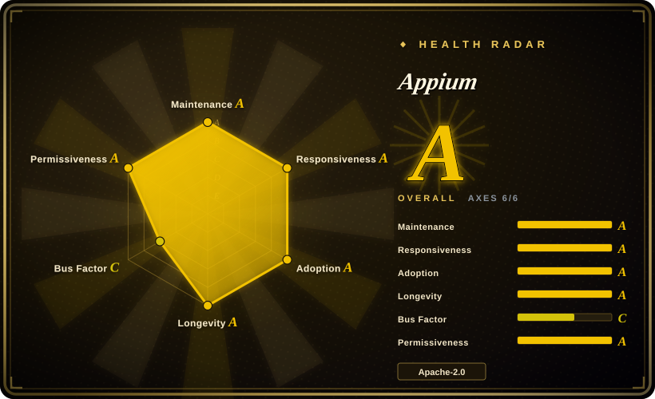
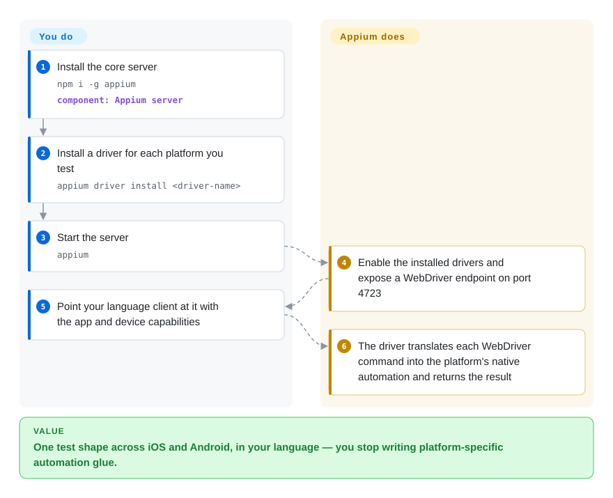

# Appium

Your team has one test suite and needs it to run against both an iOS app and its Android twin, in the language they already write tests in — and you do not want to rewrite it every time the platform's automation API shifts. Appium answers with a WebDriver server plus per-platform drivers: your test speaks standard WebDriver, and a driver translates each call into the native automation the device actually uses (on iOS, that is XCUITest underneath).

## When to use

You are standing up mobile end-to-end testing across platforms and want the least platform-specific surface: one protocol (W3C WebDriver), client libraries in JavaScript, Python, Java, Ruby, .NET and more, and drivers that isolate the platform details. You're willing to run a server and install a driver per platform, in exchange for a standard, well-documented ecosystem and a foundation-governed project — 13 years old and still the default in the field.

Pick Appium when *breadth and durability* decide the choice. If you are testing only React Native and want the best flakiness control, [`Detox`](detox.md) is more targeted; if you want the fastest path to a readable flow with no drivers, [`Maestro`](maestro.md) is closer. Appium's differentiator is that it is not a single-vendor toolkit — it is the standard layer underneath a large ecosystem, and on iOS it inherits Apple's officially-supported XCUITest path rather than Apple's private symbols.

## Q&A

**Does installing Appium let me automate iOS immediately?**
No. `npm i -g appium` installs only the core server, "which cannot automate anything on its own." You then install a platform driver — for iOS the XCUITest driver, which builds and runs [WebDriverAgent](webdriveragent.md) on the device.

**Can I stay on an older Appium version?**
The team states it "only provides support for the most recent version," and major upgrades ship migration guides (v1→v2→v3). Budget for the upgrade treadmill.

**Does it work with real devices?**
Yes — both simulators/emulators and physical devices, via the drivers. That is a deliberate difference from the simulator-only input tools in this category.

## How it works

Appium is a server that knows nothing about platforms by itself; drivers do. You install the server, then install a driver per platform (`appium driver install <driver-name>`), and start the server — it enables every installed driver and exposes a WebDriver endpoint (default host `0.0.0.0`, port `4723`). Your test code uses a language client to open a session with the capabilities that describe the app and device; the matching driver receives each WebDriver command and translates it into the native automation for that platform — on iOS it drives XCUITest/WebDriverAgent, on Android UiAutomator2 or Espresso — and returns the result through the same protocol. The handoff is clean: **you** own the test, the language, and the device capabilities; **Appium plus its drivers** own the protocol translation and the platform mechanics, so the same test shape travels across platforms.

<!-- flow-steps:begin (generated from flows/appium.json by tools/flow_card.py — do not edit) -->

Text version of the flow

1. **You**: Install the core server — `npm i -g appium` — component: `Appium server`
2. **You**: Install a driver for each platform you test — `appium driver install <driver-name>`
3. **You**: Start the server — `appium`
4. **Appium**: Enable the installed drivers and expose a WebDriver endpoint on port 4723
5. **You**: Point your language client at it with the app and device capabilities
6. **Appium**: The driver translates each WebDriver command into the platform's native automation and returns the result

**Value**: One test shape across iOS and Android, in your language — you stop writing platform-specific automation glue.

<!-- flow-steps:end -->

## When NOT to use

- **You need a single-binary, zero-server tool.** If all you want is to tap a simulator from a shell, [`baguette`](baguette.md) or [`AXe`](axe.md) skip the server and the drivers entirely.
- **You are testing a React Native app and want gray-box synchronization.** [`Detox`](detox.md) monitors the app's async operations to kill flakiness, which the black-box WebDriver model does not do.
- **You want the shortest path to a readable test.** Appium requires choosing drivers, client bindings, and capabilities; [`Maestro`](maestro.md) gets a first YAML flow running in minutes.
- **You cannot tolerate the upgrade treadmill.** Because only the latest major is supported, a stale Appium install is an unsupported one; teams that cannot upgrade on the project's cadence should weigh [`Maestro`](maestro.md) or a vendored `XCUITest` setup instead.
- **You need a capability that only a platform-native framework exposes.** For deep, app-internal iOS testing, Apple's `XCUITest` directly (or [WebDriverAgent](webdriveragent.md)) gives you the platform API without Appium's abstraction; for Android, Espresso/UIAutomator natively.

## Comparison

| Alternative | In index | Our verdict | Tradeoff |
|---|---|---|---|
| [`Maestro`](maestro.md) | ✅ | Pick Maestro when onboarding speed and readable YAML decide the choice, and you can live without physical iOS devices; pick Appium when you need the broadest device/language matrix and a standard protocol. | Maestro is far simpler and has built-in flakiness tolerance, but it is a younger, smaller surface with no physical-iOS support. |
| [`Detox`](detox.md) | ✅ | Pick Detox when the app is React Native and flakiness is the enemy; pick Appium when you must cover non-RN apps or Android with the same test code. | Detox's gray-box synchronization beats black-box waiting on RN apps, but it locks to React Native versions and is JS-only. |
| [`WebDriverAgent`](webdriveragent.md) | ✅ | Pick WebDriverAgent only if you are building the iOS automation layer itself; for testing, take Appium, which drives it for you. | WebDriverAgent is the engine, not a test framework — using it directly means building your own runner around a WebDriver server. |
| `XCUITest` | 非仓库 | Pick native `XCUITest` when you want Apple's first-party API with no third-party server, at the cost of writing Swift/Xcode test targets and losing cross-platform reuse. | First-party and durable, but Apple-only, Swift/Xcode-bound, and no cross-language clients. |

## Tech stack

- **Language:** TypeScript on Node.js.
- **Protocol:** W3C WebDriver, plus the Mobile JSON Wire and Appium extensions.
- **Architecture:** a core server + installable drivers + installable plugins; clients in many languages.
- **Drivers (separate projects):** XCUITest (iOS, wraps `WebDriverAgent`), UiAutomator2/Espresso (Android), and others across desktop/IoT.

## Dependencies

- **Runtime:** Node.js `^20.19.0 || ^22.12.0 || >=24.0.0` with npm ≥ 10; `npm i -g appium`.
- **Per platform:** the matching driver, its own prerequisites (Xcode + simulators for iOS; Android SDK/emulators for Android), and the platform toolchains.
- **External services:** none required — but a **Selenium Grid** or a hosted vendor (BrowserStack, Sauce Labs, etc., all `非仓库`) is a common way to fan sessions out.

## Ops difficulty

**Medium to high.** There is a server to run and a driver per platform to install and keep current, and the project supports only the latest major, so drivers, clients and server must move together. On iOS you are also maintaining Xcode, simulators and WebDriverAgent signing; on Android, SDKs and emulators. The payoff is a standard protocol and a huge ecosystem, but it is infrastructure, not a binary you drop in.

## Health & viability

- **Maintenance (2026-09).** Very active: last push 2026-09-23; stable v3.7.0 (2026-08-24) with v4.0.0-beta.1 out (2026-09-19).
- **Governance / bus factor.** Under the **OpenJS Foundation** — vendor-neutral foundation governance, which is the strongest longevity signal in this category. Contributor history is deep (jlipps ~3.5k commits, plus a broad roster), not a single-maintainer project.
- **Backing & longevity.** Created **2013**, ~13 years old and still active ⇒ a very strong **Lindy** signal, with foundation backing and corporate sponsorship on top.
- **Adoption.** ~22k stars, 6.3k forks, 845 watchers — the de-facto standard mobile automation framework, with an npm install base in the millions per month.
- **Risk flags.** "Only the most recent version is supported" is an explicit upgrade obligation; capability gaps surface in individual drivers (separate repos) rather than core; the server + driver + client matrix is a real maintenance surface.

## Caveats (unverified)

- [未验证] Star/fork/watcher/issue counts (~22004/6288/845/47) and the npm download figure (~4.42M) are as of 2026-09-24 and date-sensitive.
- [未验证] The frontmatter adoption raw resolves to the `@appium/types` npm sub-package, not the `appium` CLI package; the two have different download counts, so the radar's adoption axis and the prose figure come from different packages.
- [未验证] Node engine range is quoted from `package.json` at the version observed; confirm for the version you pin.
- [推断] "Under the OpenJS Foundation" is taken from the project's own documentation footer; I did not read the governance charter.
- [未验证] Which drivers are officially supported versus third-party changes over time — check the ecosystem drivers page for your target platform.
- [未验证] The v4.0.0-beta.1 status and whether it is recommended for new work; stable at the time of writing is v3.7.0.
