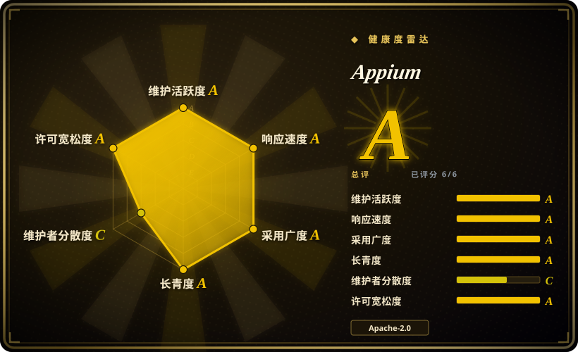
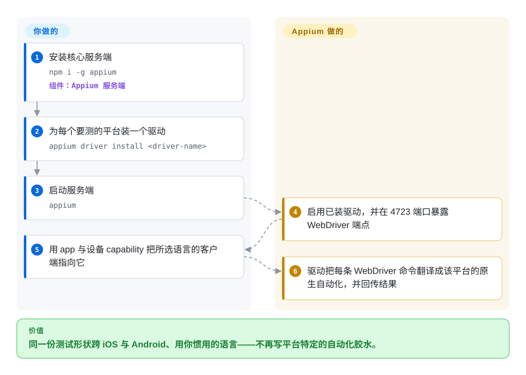

# Appium

你的团队只有一套测试，却要它同时跑 iOS app 和对应的 Android 版，还要用团队本来就在写的语言——而且不想每次平台自动化 API一动就重写。Appium 的答案是「WebDriver 服务端 + 逐平台驱动」：你的测试说标准 WebDriver，驱动把每条调用翻译成设备真正使用的原生自动化（在 iOS 上，底层就是 XCUITest）。

## 何时使用

你要铺开跨平台的移动端到端测试，希望平台相关面尽量小：一套协议（W3C WebDriver）、JavaScript／Python／Java／Ruby／.NET 等一众客户端库，以及把平台细节隔离掉的驱动。你愿意为此跑一个服务端、每个平台装一个驱动，换来一个标准、文档完善、由基金会治理的生态——13 年了，仍是这个领域的默认选择。

当**广度与耐久**是决定性因素时选 Appium。只测 React Native、且最在意压住 flaky 时，[`Detox`](detox.zh.md) 更对路；想要最快跑出可读流程、且不装驱动时，[`Maestro`](maestro.zh.md) 更近。Appium 的差异点是它不是单一厂商的工具箱——它是庞大生态底下的标准层，在 iOS 上继承的是 Apple 官方支持的 XCUITest 路径，而不是 Apple 私有符号。

## 快问快答

**装了 Appium 就能马上自动化 iOS 吗？**
不能。`npm i -g appium` 只装核心服务端，「它本身无法自动化任何东西」。你还要装平台驱动——iOS 上是 XCUITest 驱动，它会在设备上构建并运行 [WebDriverAgent](webdriveragent.zh.md)。

**能停在旧版本上不升级吗？**
团队明确「只支持最新版本」，且每次大版本升级都带迁移指南（v1→v2→v3）。请为升级节奏留预算。

**支持真机吗？**
支持——模拟器／仿真器和真机都能，靠驱动覆盖。这是它区别于本分类里那些纯模拟器输入工具的地方。

## 怎么用起来

Appium 是一个服务端，但它自身不懂任何平台；懂平台的是驱动。你装好服务端，再为每个平台装驱动（`appium driver install <driver-name>`），然后启动服务端——它会启用所有已装驱动，并暴露一个 WebDriver 端点（默认主机 `0.0.0.0`、端口 `4723`）。你的测试用某种语言的客户端、带着描述 app 与设备的 capability 打开一个会话；对应的驱动收到每条 WebDriver 命令，把它翻译成该平台的原生自动化——iOS 上驱动 XCUITest／WebDriverAgent，Android 上驱动 UiAutomator2 或 Espresso——再把结果按同一协议返回。交接很清晰：**你**拥有测试、语言和设备 capability；**Appium 及其驱动**拥有协议翻译和平台机制，于是同一份测试形状能跨平台迁移。

<!-- flow-steps:begin (generated from flows/appium.json by tools/flow_card.py — do not edit) -->

流程文字版

1. **你**：安装核心服务端 — `npm i -g appium` — 组件：`Appium 服务端`
2. **你**：为每个要测的平台装一个驱动 — `appium driver install <driver-name>`
3. **你**：启动服务端 — `appium`
4. **Appium**：启用已装驱动，并在 4723 端口暴露 WebDriver 端点
5. **你**：用 app 与设备 capability 把所选语言的客户端指向它
6. **Appium**：驱动把每条 WebDriver 命令翻译成该平台的原生自动化，并回传结果

**价值**：同一份测试形状跨 iOS 与 Android、用你惯用的语言——不再写平台特定的自动化胶水。

<!-- flow-steps:end -->

## 何时不用

- **你要的是零服务端的单体工具。** 只想从 shell 点一下模拟器，[`baguette`](baguette.zh.md) 或 [`AXe`](axe.zh.md) 直接跳过服务端和驱动。
- **你测的是 React Native，且想要灰盒同步。** [`Detox`](detox.zh.md) 通过监听 app 的异步操作来压 flaky，黑盒的 WebDriver 模型做不到这一点。
- **你想用最短路径写出可读的测试。** Appium 要你选驱动、绑定客户端、配 capability；[`Maestro`](maestro.zh.md) 几分钟就能跑起第一条 YAML 流程。
- **你承受不了升级节奏。** 因为只支持最新大版本，停滞的 Appium 就是不受支持的 Appium；跟不上项目节奏的团队，应评估 [`Maestro`](maestro.zh.md) 或自维护一套 `XCUITest`。
- **你需要只有平台原生框架才有的能力。** 深度、app 内部的 iOS 测试，直接用 Apple 的 `XCUITest`（或 [WebDriverAgent](webdriveragent.zh.md)）能拿到平台 API、不被 Appium 抽象挡住；Android 则用 Espresso／UIAutomator 原生实现。

## 横向对比

| 替代品 | 是否收录 | 我们的评价 | 取舍 |
|---|---|---|---|
| [`Maestro`](maestro.zh.md) | ✅ | 上手速度和可读 YAML 是决定因素、又能接受没有 iOS 真机时选 Maestro；需要最宽的设备／语言矩阵和标准协议时选 Appium。 | Maestro 简单得多、自带抗 flaky，但更年轻、面积更小，且不支持 iOS 真机。 |
| [`Detox`](detox.zh.md) | ✅ | app 是 React Native、头号敌人是 flaky 时选 Detox；必须用同一份测试代码覆盖非 RN 应用或 Android 时选 Appium。 | Detox 的灰盒同步在 RN 应用上胜过黑盒等待，但锁 React Native 版本、只支持 JS。 |
| [`WebDriverAgent`](webdriveragent.zh.md) | ✅ | 只有当你在自建 iOS 自动化底层时才直接选 WebDriverAgent；做测试就用 Appium，它替你驱动它。 | WebDriverAgent 是引擎、不是测试框架——直接用它意味着你要围绕一个 WebDriver 服务端自搭 runner。 |
| `XCUITest` | 非仓库 | 想要 Apple 第一方 API、不引入第三方服务端时选原生 `XCUITest`，代价是写 Swift／Xcode 测试 target、并放弃跨平台复用。 | 第一方且耐久，但仅限 Apple、绑 Swift／Xcode，且没有跨语言客户端。 |

## 技术栈

- **语言：** Node.js 上的 TypeScript。
- **协议：** W3C WebDriver，加 Mobile JSON Wire 与 Appium 扩展。
- **架构：** 核心服务端 + 可安装驱动 + 可安装插件；多语言客户端。
- **驱动（独立项目）：** XCUITest（iOS，包 `WebDriverAgent`）、UiAutomator2／Espresso（Android），以及桌面／IoT 等其他驱动。

## 依赖

- **运行时：** Node.js `^20.19.0 || ^22.12.0 || >=24.0.0` 与 npm ≥ 10；`npm i -g appium`。
- **按平台：** 对应驱动及其自身前置条件（iOS 需要 Xcode 与模拟器；Android 需要 Android SDK／仿真器）与平台工具链。
- **外部服务：** 不强制——但用 **Selenium Grid** 或托管厂商（BrowserStack、Sauce Labs 等，均为 `非仓库`）铺开会话是常见做法。

## 运维难度

**中到高。** 有一个服务端要跑，每个平台有驱动要装、要跟进，且项目只支持最新大版本，所以服务端、驱动、客户端必须一起动。iOS 上你还要维护 Xcode、模拟器和 WebDriverAgent 签名；Android 上要维护 SDK 与仿真器。回报是标准协议和庞大生态，但它是基础设施，不是一个丢进去就完事的二进制。

## 健康度与可持续性

- **维护（2026-09）。** 非常活跃：最后推送 2026-09-23；稳定版 v3.7.0（2026-08-24），v4.0.0-beta.1 已出（2026-09-19）。
- **治理／bus factor。** 归 **OpenJS 基金会**——厂商中立的基金会治理，是本分类里最强的长期信号。贡献历史深厚（jlipps 约 3.5k 次提交，加一长串贡献者），不是单人项目。
- **背书与寿命。** 建于 **2013**，约 13 年且仍活跃 ⇒ 很强的 **Lindy** 信号，之上还有基金会背书与企业赞助。
- **采用度。** 约 22k star、6.3k fork、845 watcher——事实标准，npm 月安装量在百万级。
- **风险标记。** 「只支持最新版本」是明确的升级义务；能力缺口往往出在各自独立的驱动仓库而非核心；服务端＋驱动＋客户端的矩阵是真实的维护面。

## 存疑（未验证）

- [未验证] star／fork／watcher／issue 数（约 22004／6288／845／47）与 npm 下载数（约 442 万）为 2026-09-24 时点，随时间变化。
- [未验证] frontmatter 的 adoption 原始值解析到 npm 子包 `@appium/types`，而非 `appium` CLI 包；两者下载量不同，雷达的采用轴与正文数字来自不同的包。
- [未验证] Node 版本范围引自观测版本的 `package.json`；请按你所固定的版本确认。
- [推断] 「归 OpenJS 基金会」取自项目自身文档页脚，我未阅读其治理章程。
- [未验证] 哪些驱动是官方支持、哪些是第三方，会随时间变化——请按你的目标平台查 ecosystem drivers 页。
- [未验证] v4.0.0-beta.1 的状态及是否推荐用于新项目；撰写时稳定版为 v3.7.0。
