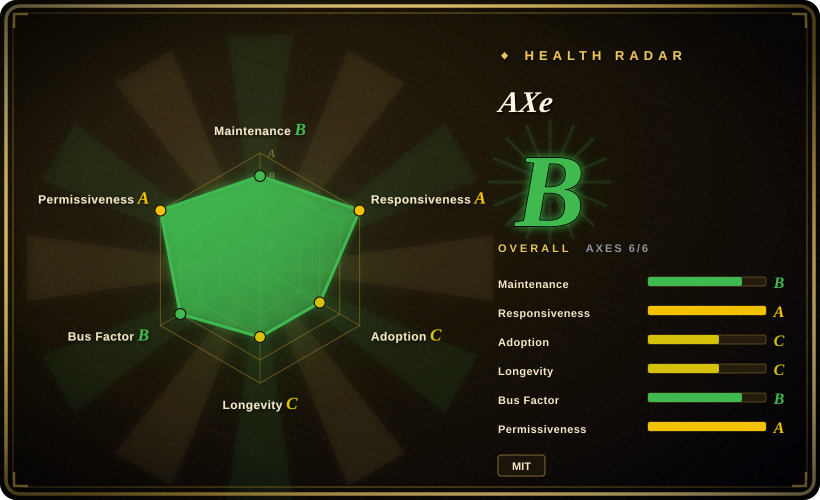
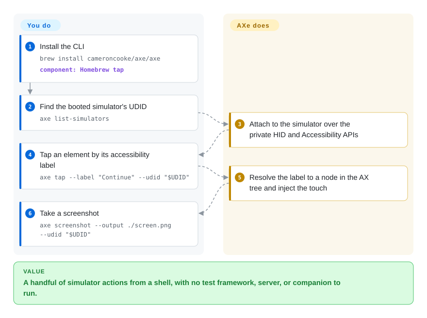

# AXe

You want to poke a booted iOS simulator from a shell — "tap the button labelled Continue, type this, screenshot it" — and you do not want a test framework, a server, or a companion process to get there. AXe is a single CLI that reads the simulator's accessibility tree and injects input through Apple's private HID path, so `axe tap --label "Continue"` works without a driver stack.

## When to use

You're scripting a simulator on a developer's Mac and the interaction is small: find the device, describe its UI, tap something by label or coordinate, type, take a screenshot — from a Bash script or an agent's tool call, with nothing else running. `xcrun simctl` cannot tap at all, and `idb`/`baguette` are more machinery than a handful of commands. AXe's pitch is exactly this narrow: one Homebrew binary, private HID and Accessibility APIs underneath, and a command surface you can read in one screen.

It is a reasonable choice when the alternative is a *bigger* dependency and the task is throwaway automation — smoke checks, a demo, an agent poking a screen. Pick it over [`baguette`](baguette.md) when you want the minimum and do not care about streaming or a farm; pick it over [`idb`](idb.md) when you do not need remote access or physical devices.

## Q&A

**Is AXe still maintained?**
Unclear. Its last release (v1.8.0) and last push were both in July 2026 — about two months quiet as of 2026-09-24 — and it has a single maintainer. Two months is "coasting", not "abandoned", but it is the main reason to hesitate. [未验证]

**Does it support physical devices?**
No — simulators only.

**Why does it build idb internally?**
Its README says the build compiles an immutable fork revision of idb; AXe is not a from-scratch reimplementation of the simulator plumbing.

## How it works

AXe is one Swift binary that reaches into Apple's private simulator services: it reads the accessibility tree to resolve a `--label` to a node, then injects input through the same private HID path Xcode uses. Under the hood its build pulls in a pinned fork of `idb`, so it inherits idb's approach to the device plumbing rather than reinventing it. Your side of the handoff is a single command per action — `list-simulators`, `describe-ui`, `tap`, `type`, `screenshot` — and AXe owns the tree lookup, the coordinate resolution, and the event injection. There is no server, no runner, and no test file; you are composing actions yourself.

<!-- flow-steps:begin (generated from flows/axe.json by tools/flow_card.py — do not edit) -->

Text version of the flow

1. **You**: Install the CLI — `brew install cameroncooke/axe/axe` — component: `Homebrew tap`
2. **You**: Find the booted simulator's UDID — `axe list-simulators`
3. **AXe**: Attach to the simulator over the private HID and Accessibility APIs
4. **You**: Tap an element by its accessibility label — `axe tap --label "Continue" --udid "$UDID"`
5. **AXe**: Resolve the label to a node in the AX tree and inject the touch
6. **You**: Take a screenshot — `axe screenshot --output ./screen.png --udid "$UDID"`

**Value**: A handful of simulator actions from a shell, with no test framework, server, or companion to run.

<!-- flow-steps:end -->

## When NOT to use

- **You need a maintenance guarantee.** One maintainer and a two-month silence since 2026-07 is a real continuity risk for anything beyond throwaway automation; prefer [`idb`](idb.md) (org-backed) or [`baguette`](baguette.md) (frequent releases) if you are wiring this into a durable pipeline.
- **You need physical devices or remote access.** AXe is simulator-only and local-only. Use [`idb`](idb.md) for devices and remote fan-out, or [Appium](appium.md) for a proper device-lab framework.
- **You want to write tests.** AXe has no assertions, waits, or reports — it is an action CLI. Use [Appium](appium.md) or [Maestro](maestro.md).
- **You want streaming or a multi-device view.** AXe takes screenshots; it does not stream. Use [`baguette`](baguette.md) if you need live frames or a farm.
- **You want cross-platform coverage.** AXe is Apple-only; [Maestro](maestro.md) or [Appium](appium.md) cover Android too.

## Comparison

| Alternative | In index | Our verdict | Tradeoff |
|---|---|---|---|
| [`idb`](idb.md) | ✅ | Pick idb when you need the maintained, org-backed primitive tool with devices and remote access; pick AXe only for a lighter local simulator script. | idb is actively released and reaches real devices, but requires a companion per target; AXe is leaner and now quieter. |
| [`baguette`](baguette.md) | ✅ | Pick baguette when you also want 60fps streaming, a web UI, or a device farm; pick AXe when a few simulator commands are all you need. | baguette is actively developed and streams, but is Apple-Silicon/Xcode-26 locked and heavier. |
| `xcrun simctl` | 非仓库 | Pick `simctl` for lifecycle/install/screenshot and AXe for the input simctl lacks — they are complementary, and `simctl` is the more durable half. | Ships with Xcode and never breaks, but cannot tap, type, or read the accessibility tree. |

## Tech stack

- **Language:** Swift; a Homebrew-distributed binary.
- **Underlying APIs:** Apple's private HID and Accessibility APIs, via a pinned fork of `idb` built during AXe's own build (`scripts/build.sh`).
- **Interface:** a CLI with `list-simulators`, `describe-ui`, `tap`, `type`, `screenshot` and more; docs at `axe-cli.com`.

## Dependencies

- **Host:** macOS with a supported **Xcode** — the README claims Xcode 26 and Xcode 27 support (validated against Xcode 26.5 and Xcode 27 Beta 3). [未验证]
- **Runtime:** booted iOS simulators; install via `brew install cameroncooke/axe/axe`.
- **External services:** none.

## Ops difficulty

**Low to adopt, risky to depend on.** Installation is one Homebrew line and there is nothing to operate. The operational concern is not complexity but continuity: a single-maintainer project that has been quiet since 2026-07, sitting on private Apple APIs that a future Xcode can invalidate. For a script that runs today, that is fine; for a pipeline you expect to run in two years, it is a bet on one person's availability.

## Health & viability

- **Maintenance (2026-09).** Low activity: latest release v1.8.0 on 2026-07-20 and last push 2026-07-21 — roughly two months of silence, not enough to call it abandoned but enough to watch.
- **Governance / bus factor.** Owned by a **user account** (`cameroncooke`), with contributions concentrated almost entirely in that one account (`cameroncooke` 106 vs. the next at 7). Bus factor is effectively one.
- **Backing & longevity.** No organization or foundation behind it. Created 2025-05, so it is young; the Lindy prior neither protects nor condemns it, but the single-maintainer model is the dominant risk.
- **Adoption.** ~2.2k stars and 95 forks — a healthy signal for a focused CLI, but small enough that the project's continuity depends on one person's interest.
- **Risk flags.** Single maintainer; ~2 months inactive; depends on private HID/Accessibility APIs *and* on an internal idb fork; simulator-only.

## Caveats (unverified)

- [未验证] Star/fork/watcher/issue counts (~2222/95/11/16) are as of 2026-09-24 and date-sensitive.
- [未验证] Whether the 2026-07 silence is a pause or an end; I found no statement from the maintainer either way.
- [未验证] The Xcode 26 / Xcode 27 compatibility claims come from AXe's own README (validated against Xcode 26.5 and Xcode 27 Beta 3); I did not reproduce them.
- [推断] The single-maintainer concentration is a continuity risk for production use, based on contributor counts rather than any stated roadmap.
