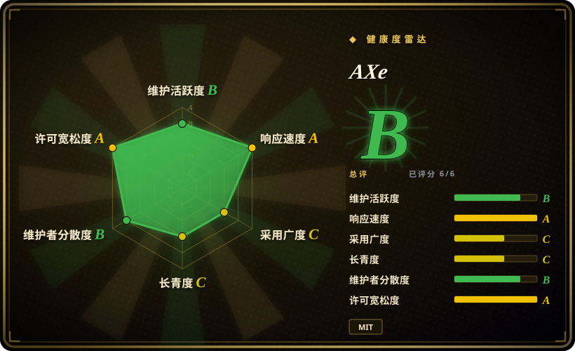
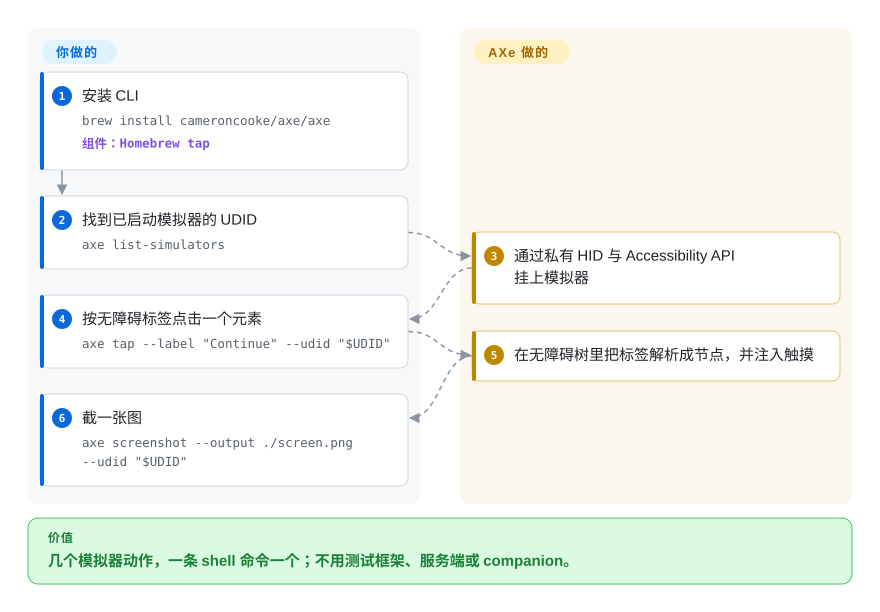

# AXe

你想从 shell 捅一下已启动的 iOS 模拟器——「点一下标着 Continue 的按钮、输入这段字、截个图」——又不想为此引入测试框架、服务端或 companion 进程。AXe 就是一条 CLI：它读模拟器的无障碍树，再通过 Apple 私有的 HID 通路上注入输入，于是 `axe tap --label "Continue"` 不需要任何驱动栈就能用。

## 何时使用

你在开发者 Mac 上给模拟器写脚本，交互很小：找设备、描述界面、按标签或坐标点一下、输入、截图——从 Bash 脚本或 agent 的工具调用里发起，别的什么都不用跑。`xcrun simctl` 根本不能点，`idb`／`baguette` 对这几条命令又太重。AXe 的卖点就是这么窄：一个 Homebrew 二进制，底下是私有 HID 与 Accessibility API，命令面一屏读完。

当替代方案是一个**更大**的依赖、而任务只是一次性的自动化——冒烟检查、做个演示、让 agent 戳一下界面——它是个合理选择。想要最小化、不在乎投屏和 farm 时，选它而不是 [`baguette`](baguette.zh.md)；不需要远端访问和真机时，选它而不是 [`idb`](idb.zh.md)。

## 快问快答

**AXe 还在维护吗？**
不清楚。它最后一个 release（v1.8.0）和最后一次推送都在 2026 年 7 月——到 2026-09-24 已安静约两个月——且只有一位维护者。两个月是「放缓」，不是「废弃」，但这正是该犹豫的理由。[未验证]

**支持真机吗？**
不支持，只支持模拟器。

**为什么它内部要构建 idb？**
它的 README 说，构建过程会编译 idb 的一个固定 fork 修订；AXe 不是从零重写模拟器那套底层管道。

## 怎么用起来

AXe 是一个 Swift 二进制，伸进 Apple 私有的模拟器服务：它读无障碍树把 `--label` 解析成节点，再通过 Xcode 用的同一条私有 HID 通路注入输入。底层构建会拉进一个固定版本的 `idb` fork，所以它继承的是 idb 的设备管道思路，而不是重新发明。你这一侧的交接是「一个动作一条命令」——`list-simulators`、`describe-ui`、`tap`、`type`、`screenshot`——树查找、坐标解析、事件注入都归 AXe。没有服务端、没有 runner、没有测试文件；动作由你自己组合。

<!-- flow-steps:begin (generated from flows/axe.json by tools/flow_card.py — do not edit) -->

流程文字版

1. **你**：安装 CLI — `brew install cameroncooke/axe/axe` — 组件：`Homebrew tap`
2. **你**：找到已启动模拟器的 UDID — `axe list-simulators`
3. **AXe**：通过私有 HID 与 Accessibility API 挂上模拟器
4. **你**：按无障碍标签点击一个元素 — `axe tap --label "Continue" --udid "$UDID"`
5. **AXe**：在无障碍树里把标签解析成节点，并注入触摸
6. **你**：截一张图 — `axe screenshot --output ./screen.png --udid "$UDID"`

**价值**：几个模拟器动作，一条 shell 命令一个；不用测试框架、服务端或 companion。

<!-- flow-steps:end -->

## 何时不用

- **你需要可依赖的维护。** 单一维护者、且自 2026-07 起安静了两个月，对任何超出一次性自动化的用途都是真实的存续风险；要接进长期流水线，优先用 [`idb`](idb.zh.md)（有组织背书）或 [`baguette`](baguette.zh.md)（发版频繁）。
- **你需要真机或远端访问。** AXe 只支持模拟器、只支持本机。真机与远端铺开用 [`idb`](idb.zh.md)，正式的设备机房框架用 [Appium](appium.zh.md)。
- **你想写测试。** AXe 没有断言、等待和报告——它是动作 CLI。用 [Appium](appium.zh.md) 或 [Maestro](maestro.zh.md)。
- **你想要投屏或多设备视图。** AXe 只截图，不投屏。需要实时画面或 farm 就用 [`baguette`](baguette.zh.md)。
- **你需要跨平台覆盖。** AXe 只支持 Apple；[Maestro](maestro.zh.md) 或 [Appium](appium.zh.md) 也覆盖 Android。

## 横向对比

| 替代品 | 是否收录 | 我们的评价 | 取舍 |
|---|---|---|---|
| [`idb`](idb.zh.md) | ✅ | 需要维护中、有组织背书、能覆盖真机与远端访问的原语工具时选 idb；只做轻量本地模拟器脚本才选 AXe。 | idb 活跃发版、够得到真机，但每个目标要 companion；AXe 更轻，但现在更安静。 |
| [`baguette`](baguette.zh.md) | ✅ | 还想要 60fps 投屏、Web UI 或设备 farm 时选 baguette；只需要几条模拟器命令时选 AXe。 | baguette 活跃开发且能投屏，但锁 Apple Silicon／Xcode 26 且更重。 |
| `xcrun simctl` | 非仓库 | 生命周期、装包、截图用 `simctl`，simctl 缺的输入用 AXe——两者互补，而 `simctl` 是更耐久的那一半。 | 随 Xcode 分发、几乎不会坏，但不能点击、输入，也读不了无障碍树。 |

## 技术栈

- **语言：** Swift；以 Homebrew 二进制分发。
- **底层 API：** Apple 私有 HID 与 Accessibility API，经 AXe 自身构建期间编译的固定 `idb` fork（`scripts/build.sh`）。
- **接口：** 一个 CLI，含 `list-simulators`、`describe-ui`、`tap`、`type`、`screenshot` 等；文档在 `axe-cli.com`。

## 依赖

- **宿主机：** 装了受支持 **Xcode** 的 macOS——README 声称支持 Xcode 26 与 Xcode 27（分别以 Xcode 26.5、Xcode 27 Beta 3 验证过）。[未验证]
- **运行时：** 已启动的 iOS 模拟器；安装用 `brew install cameroncooke/axe/axe`。
- **外部服务：** 无。

## 运维难度

**上手机，依赖险。** 安装就一句 Homebrew，没有任何要运营的东西。运维上的顾虑不是复杂度，而是延续性：单人维护、2026-07 后安静，还踩在 Apple 私有 API 上——未来的 Xcode 随时能让它失效。今天要跑的脚本无所谓；你指望两年后还在跑的流水线，就是在一人可支配性上下注。

## 健康度与可持续性

- **维护（2026-09）。** 活跃度低：最新 release v1.8.0 在 2026-07-20，最后推送 2026-07-21——约两个月的安静，还不足以叫废弃，但值得盯。
- **治理／bus factor。** 归属一个**个人账号**（`cameroncooke`），贡献几乎集中在这一个账号（`cameroncooke` 106，第二名仅 7）。bus factor 实际为 1。
- **背书与寿命。** 背后没有组织或基金会。建于 2025-05，很年轻；Lindy 先验既不保护也不判死它，但单人维护模式是主要风险。
- **采用度。** 约 2.2k star、95 fork——对一个聚焦的 CLI 算健康信号，但小到项目的存续取决于一个人的兴趣。
- **风险标记。** 单人维护；约两个月无活动；依赖私有 HID／Accessibility API **以及**内部的 idb fork；只支持模拟器。

## 存疑（未验证）

- [未验证] star／fork／watcher／issue 数（约 2222／95／11／16）为 2026-09-24 时点，随时间变化。
- [未验证] 2026-07 之后的安静是暂停还是终止；我没找到维护者的任何表态。
- [未验证] Xcode 26／Xcode 27 兼容性来自 AXe 自家 README（以 Xcode 26.5、Xcode 27 Beta 3 验证），我未复现。
- [推断] 单人贡献集中对生产使用是存续风险，依据是贡献者计数，而非任何已公布的路线图。
