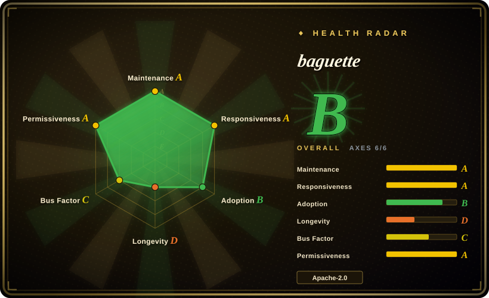
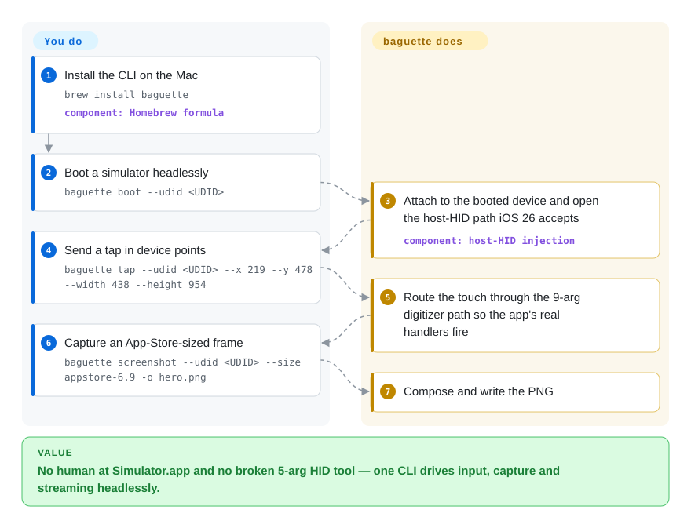

# baguette

Your script needs to drive an iOS app, but `xcrun simctl` can boot, install and screenshot a simulator and then stops — there is no `simctl tap` — while the older host-HID tools (`idb`, `AXe`) started dropping touches the moment iOS 26 changed the calling convention. baguette drives Apple's own simulator headlessly over the new host-HID path, so taps and edge gestures land, and it streams the screen at 60fps while it does.

## When to use

You're an iOS developer or release engineer on an Apple-Silicon Mac, and you want a script — or a coding agent — to drive a booted simulator: tap a coordinate, swipe the home indicator, type, take an App-Store-sized screenshot, and watch the screen, without a human opening Xcode or `Simulator.app`. `xcrun simctl` covers device lifecycle and capture but has no input path at all; `idb` and `AXe` can inject touches, but on iOS 26 their old five-argument HID call either misroutes to the wrong target or crashes `backboardd`, and `idb` still carries open iOS-26 regressions. baguette is built around the nine-argument signature Xcode 26 exposes, so its events route to the digitizer target iOS 26 honours.

Pick baguette over `idb` when you want a single self-contained CLI with a headless web UI (`baguette serve`), a multi-device farm view, and 60fps MJPEG/H.264 streaming off the same process — and you only ever target simulators. Pick `idb` instead the moment you need physical devices or a remote device-lab architecture.

## Q&A

**Is baguette a standalone iOS simulator I can run any app on?**
No. It is a headless remote for Apple's own simulator (the CoreSimulator/SimulatorKit stack that ships with Xcode). It can install a simulator-slice `.app` (backed by `xcrun simctl install`) and drive it, but it cannot run App Store or real-device binaries, and it is not an end-user runtime.

**Why not just use `xcrun simctl`?**
simctl owns lifecycle, install, screenshot and logs, but it has no simulation of touch — nothing to tap a button with. Use simctl for setup and baguette for input and streaming.

**Does it work with physical iPhones?**
No. It is simulator-only. For real devices, look at [idb](idb.md) or [Appium](appium.md).

## How it works

baguette is a single Swift binary that finds your active Xcode (`xcode-select -p`), `dlopen`s its private `CoreSimulator`/`SimulatorKit` frameworks at runtime, and then speaks the simulator's host-HID protocol the way Xcode itself does. For a plain tap it uses the nine-argument `IndigoHIDMessageForMouseNSEvent` signature; for streaming touches and screen-edge gestures it builds a real `IOHIDEvent` and patches the two byte slots the wrapper leaves unset, which is what makes the home-indicator swipe and the Notification-Center pull-down fire iOS's own recognizers rather than a canned animation. You keep doing what you were doing — sending a `tap`/`swipe` envelope or opening `http://localhost:8421/simulators` — while baguette handles device discovery, the HID encoding, frame capture (MJPEG or H.264/AVCC), and the WebSocket control channel. It does **not** need `DYLD_INSERT_LIBRARIES` on the touch path; the camera, motion and network features do inject small dylibs into the app under test, and that distinction matters when you decide what to trust it for.

<!-- flow-steps:begin (generated from flows/baguette.json by tools/flow_card.py — do not edit) -->

Text version of the flow

1. **You**: Install the CLI on the Mac — `brew install baguette` — component: `Homebrew formula`
2. **You**: Boot a simulator headlessly — `baguette boot --udid <UDID>`
3. **baguette**: Attach to the booted device and open the host-HID path iOS 26 accepts — component: `host-HID injection`
4. **You**: Send a tap in device points — `baguette tap --udid <UDID> --x 219 --y 478 --width 438 --height 954`
5. **baguette**: Route the touch through the 9-arg digitizer path so the app's real handlers fire
6. **You**: Capture an App-Store-sized frame — `baguette screenshot --udid <UDID> --size appstore-6.9 -o hero.png`
7. **baguette**: Compose and write the PNG

**Value**: No human at Simulator.app and no broken 5-arg HID tool — one CLI drives input, capture and streaming headlessly.

<!-- flow-steps:end -->

## When NOT to use

- **You need physical devices.** baguette is simulator-only. Use [idb](idb.md) (simulators *and* devices, with a remote companion) or a device cloud.
- **You are not on Apple Silicon, or your Xcode is older than 26.4.1.** It links Xcode's private frameworks and its own Homebrew formula refuses Intel; there is no fallback build. Use `xcrun simctl` for the lifecycle/install/screenshot subset, or a hosted device cloud.
- **You want a test framework, not a driver.** baguette injects input and reads the accessibility tree; it has no selectors, waits, or assertions. If you want to *write tests*, use [Appium](appium.md) or [Maestro](maestro.md) and let them drive the device.
- **Your app's camera / motion / network behaviour must survive an App Store-bound validation.** Those three features work by loading dylibs into the app under test via `DYLD_INSERT_LIBRARIES`; that is fine for local automation and wrong for anything you intend to ship as-is. Validate those subsystems on a real device.
- **You need an automation stack that survives Apple's next beta.** Every tool on the private-symbol path (baguette, `idb`, `AXe`) broke or wobbled when iOS 26 shipped. If long-term stability outweighs latency and streaming, prefer the official `XCUITest` route via [Appium](appium.md)/[WebDriverAgent](webdriveragent.md).
- **Xcode 27's Device Hub has already attached to the device.** Its HID daemon shadows the input surface and events ack but land nowhere; baguette ships `baguette heal` as a workaround, but if that is your daily environment, expect friction.
- **You need the `siri` button.** It crashes `backboardd` on every known private path and baguette refuses it.

## Comparison

| Alternative | In index | Our verdict | Tradeoff |
|---|---|---|---|
| [`idb`](idb.md) | ✅ | Pick idb when you also automate physical devices or want a remote companion/data-center fan-out; pick baguette for a lighter, simulator-only CLI with streaming and a farm UI. | idb reaches simulators *and* devices and exposes granular primitives remotely, but you run a companion per target and its iOS-26 regressions are still open. |
| [`AXe`](axe.md) | ✅ | Pick AXe when you want the smallest possible `axe tap` CLI and nothing else; pick baguette when you also want streaming, a farm, or an agent-facing surface. | AXe is a lean, single-purpose input CLI, but it is single-maintainer and has been quiet since 2026-07. |
| [`Appium`](appium.md) | ✅ | Pick Appium when you need a real cross-platform test framework with assertions and Android coverage; pick baguette when you need raw headless input and streaming, not a test harness. | Appium gives you a mature WebDriver ecosystem and official XCUITest underneath, but it is a server plus drivers, not a single binary. |
| `xcrun simctl` | 非仓库 | Pick `simctl` for lifecycle, install, screenshots and logs — it ships with Xcode and never breaks — but it cannot inject input, so it complements rather than replaces baguette. | Zero install and maximum stability, but no touch/keyboard/gesture path at all. |

## Tech stack

- **Language:** Swift 6.2, built for `arm64e-apple-macos26.0` with an Objective-C bridging header; a hybrid `swiftc` + SwiftPM build.
- **SwiftPM dependencies:** `swift-argument-parser`, `Mockable`, `Hummingbird`, `HummingbirdWebSocket`.
- **Private frameworks (runtime `dlopen`, not linked at build time):** `CoreSimulator`, `SimulatorKit`, plus `IOSurface`, `VideoToolbox`, `CoreGraphics`, `ImageIO`.
- **Injected dylibs (only for camera/motion/network):** ObjC dylibs cross-compiled for the simulator and loaded into the app under test via `DYLD_INSERT_LIBRARIES`.
- **Web UI:** hand-written HTML/CSS/JS under `Sources/Baguette/Resources/Web/`, served by the embedded Hummingbird server.

## Dependencies

- **Host:** macOS 15+ on **Apple Silicon** (Intel is refused by the formula), **Xcode 26.4.1+** selected via `xcode-select`.
- **Runtime:** one or more booted iOS simulators; a Homebrew install (`brew install baguette`).
- **External services:** none — everything runs locally and the server binds loopback by default.

## Ops difficulty

**Low to medium.** Day one is a single `brew install`, and nothing leaves the machine. The operational cost is version lock: baguette is married to a specific Xcode's private frameworks and to Apple's calling conventions, so a macOS/Xcode bump can require a baguette upgrade, and the project ships very frequently (40 releases between 2026-05 and 2026-09), which means pinning a known-good version rather than tracking latest. On a machine where you cannot control the Xcode version, treat it as fragile.

## Health & viability

- **Maintenance (2026-09).** Very active: last push 2026-09-24, and 40 releases between 2026-05-03 and 2026-09-22 (v0.2.0 latest). The cadence is a double-edged signal — healthy development, but an API still moving.
- **Governance / bus factor.** Owned by the `tddworks` GitHub organization, but effectively two contributors: `hanrw` (492 commits) and `crockalet` (124), with everyone else in single digits. `CONTRIBUTING.md` exists; there is no `GOVERNANCE`, `SECURITY.md`, or `CODEOWNERS`. [推断] A two-person bus factor is the main governance risk.
- **Backing & longevity.** No foundation or large-vendor backing. The repository is young (created 2026-05-01, ~5 months old), so the **Lindy** prior discounts it rather than supporting it: a young, fast-moving, high-star project is a risk flag, not proof of durability.
- **Adoption.** ~2.1k stars and 112 forks, but only 8 watchers — an unusual ratio for a project this starred, which I could not explain from the repo alone. Treat the popularity signal with caution. [未验证]
- **Risk flags.** Rests on Apple private symbols (iOS 26 already broke the competing tools on this path); Xcode-version lock; `DYLD_INSERT_LIBRARIES` dylibs for three features; Homebrew-only distribution.

## Caveats (unverified)

- [未验证] Star/fork/watcher counts (~2074/112/8) and open-issue count (3) are as of 2026-09-24 and date-sensitive.
- [未验证] Whether the star growth is organic — the 2.1k-stars-vs-8-watchers ratio is atypical and I found no independent source explaining it.
- [推断] The dense release cadence (0.1.x → 0.2.0 in ~5 months) indicates the public surface is still settling; pin a version rather than tracking latest.
- [未验证] Long-term reliability of the private-SimulatorKit path against future Xcode/iOS releases — it is a documented failure mode for this whole tool family, but future breakage is not predictable from the repo.
- [未验证] Exactly which Xcode/iOS combinations are validated beyond the CI matrix; the README states Xcode 26.4.1+ as the build floor.
