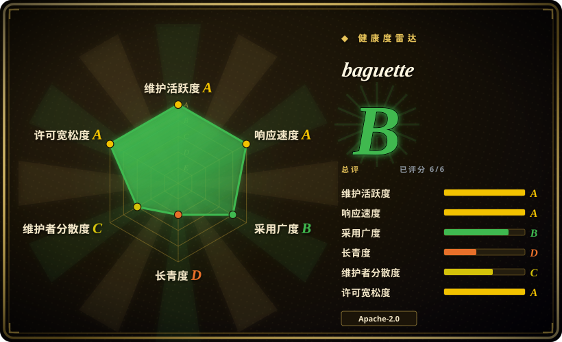
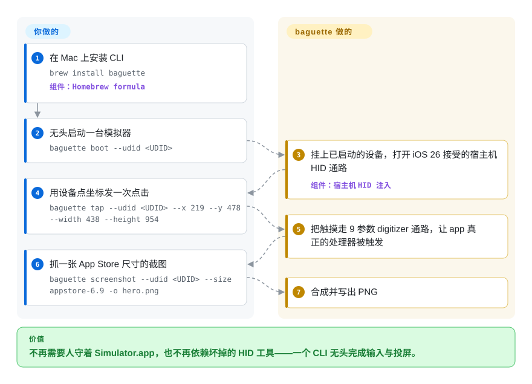

# baguette

你的脚本要驱动 iOS app，但 `xcrun simctl` 只能启动模拟器、装包、截图，然后就到此为止——它根本没有点击能力；而更早的宿主机 HID 工具（`idb`、`AXe`）在 iOS 26 改掉调用约定后开始丢事件。baguette 走 iOS 26 认的那条新宿主机 HID 通路，让点击和边缘手势真正生效，同时以 60fps 投屏。

## 何时使用

你是 iOS 开发者或发布工程师，手上是 Apple Silicon 的 Mac，想让脚本——或一个 coding agent——去驱动一台已启动的模拟器：点一个坐标、滑一下 Home 指示条、输入文字、抓一张 App Store 尺寸的截图，并且顺带看屏幕，全程不需要有人打开 Xcode 或 `Simulator.app`。`xcrun simctl` 能管设备生命周期和抓图，但完全没有输入通路；`idb` 和 `AXe` 能注入触摸，可它们在 iOS 26 上的旧五参数 HID 调用要么走错目标、要么直接把 `backboardd` 打崩，而且 `idb` 至今还挂着 iOS 26 的回归问题。baguette 围绕 Xcode 26 暴露的九参数签名构建，事件因此能落到 iOS 26 认的那个 digitizer 目标上。

当你想要的是「一个自带无头 Web UI（`baguette serve`）、多设备 farm 视图、同一进程里还有 60fps MJPEG／H.264 投屏」的独立 CLI，并且只打模拟器时，选 baguette 而不是 `idb`；一旦你需要真机或远端设备机房的架构，就应该转去 `idb`。

## 快问快答

**baguette 是一个能跑任意 app 的独立 iOS 模拟器吗？**
不是。它是 Apple 自带模拟器（随 Xcode 分发的 CoreSimulator／SimulatorKit 那套）的无头遥控器。它能装「模拟器切片」的 `.app`（底层走 `xcrun simctl install`）并驱动它，但跑不了 App Store 或真机二进制，也不是面向终端用户的运行时。

**那为什么不直接用 `xcrun simctl`？**
simctl 管生命周期、装包、截图和日志，但它没有任何触摸模拟——没有 `simctl tap` 可用。用 simctl 做环境准备，用 baguette 做输入和投屏。

**支持真机 iPhone 吗？**
不支持，只支持模拟器。真机场景看 [idb](idb.zh.md) 或 [Appium](appium.zh.md)。

## 怎么用起来

baguette 是一个 Swift 单体可执行文件：它先通过 `xcode-select -p` 找到当前 Xcode，运行时 `dlopen` 那两个私有的 `CoreSimulator`／`SimulatorKit` 框架，然后按 Xcode 自己的方式跟模拟器的宿主机 HID 协议对话。普通点击走九参数的 `IndigoHIDMessageForMouseNSEvent` 签名；流式触摸和屏幕边缘手势则会构造一个真实的 `IOHIDEvent` 并补上包装函数没初始化的两个字节槽——Home 指示条上滑和通知中心下拉之所以能触发 iOS 自己的识别器、而不是放一段录好的动画，靠的就是这一步。你这边照旧：发一个 `tap`／`swipe` 信封，或打开 `http://localhost:8421/simulators`；设备发现、HID 编码、抓帧（MJPEG 或 H.264／AVCC）和 WebSocket 控制通道都由 baguette 承担。注意它的触摸通路**不需要** `DYLD_INSERT_LIBRARIES`；会往被测 app 里注入 dylib 的是摄像头、传感器和网络这三个功能——这个区分决定了你能信任它做什么。

<!-- flow-steps:begin (generated from flows/baguette.json by tools/flow_card.py — do not edit) -->

流程文字版

1. **你**：在 Mac 上安装 CLI — `brew install baguette` — 组件：`Homebrew formula`
2. **你**：无头启动一台模拟器 — `baguette boot --udid <UDID>`
3. **baguette**：挂上已启动的设备，打开 iOS 26 接受的宿主机 HID 通路 — 组件：`宿主机 HID 注入`
4. **你**：用设备点坐标发一次点击 — `baguette tap --udid <UDID> --x 219 --y 478 --width 438 --height 954`
5. **baguette**：把触摸走 9 参数 digitizer 通路，让 app 真正的处理器被触发
6. **你**：抓一张 App Store 尺寸的截图 — `baguette screenshot --udid <UDID> --size appstore-6.9 -o hero.png`
7. **baguette**：合成并写出 PNG

**价值**：不再需要人守着 Simulator.app，也不再依赖坏掉的 HID 工具——一个 CLI 无头完成输入与投屏。

<!-- flow-steps:end -->

## 何时不用

- **你需要真机。** baguette 只支持模拟器。用 [idb](idb.zh.md)（模拟器*和*真机，带远端 companion 架构）或设备云。
- **你不是 Apple Silicon，或 Xcode 低于 26.4.1。** 它链的是 Xcode 私有框架，Homebrew 公式直接拒绝 Intel，也没有替代构建。只能用 `xcrun simctl` 覆盖生命周期／装包／截图那一小部分，或改用托管设备云。
- **你要的是测试框架，而不是驱动。** baguette 负责注入输入和读无障碍树，没有选择器、等待和断言。想*写测试*，请用 [Appium](appium.zh.md) 或 [Maestro](maestro.zh.md)，让它们去驱动设备。
- **被测 app 的摄像头／传感器／网络行为要经得起 App Store 提审级别的验证。** 这三个功能靠 `DYLD_INSERT_LIBRARIES` 把 dylib 灌进被测 app；本地自动化没问题，但凡你要原样上架的就不适用。这些子系统请在真机上验证。
- **你需要一套能扛过 Apple 下一轮 beta 的自动化栈。** 所有走私有符号的方案（baguette、`idb`、`AXe`）在 iOS 26 发布时都崩过或晃过。若长期稳定性比低延迟和投屏更重要，优先走 [Appium](appium.zh.md)／[WebDriverAgent](webdriveragent.zh.md) 背后的官方 `XCUITest` 路线。
- **Xcode 27 的 Device Hub 已经先挂上了设备。** 它的 HID 守护进程会遮蔽输入面，事件会 ack 但落不到实处；baguette 提供 `baguette heal` 作为绕法，但如果这是你的日常环境，就别指望顺手。
- **你需要 `siri` 按钮。** 已知的私有通路都会打崩 `backboardd`，baguette 直接拒绝。

## 横向对比

| 替代品 | 是否收录 | 我们的评价 | 取舍 |
|---|---|---|---|
| [`idb`](idb.zh.md) | ✅ | 你还要自动化真机、或想要远端 companion／机房扩容时选 idb；想要更轻的纯模拟器 CLI 加投屏和 farm UI 时选 baguette。 | idb 同时覆盖模拟器*和*真机、能以远端方式给出细粒度原语，代价是每个目标要挂 companion，且 iOS 26 回归问题仍未修完。 |
| [`AXe`](axe.zh.md) | ✅ | 只想要最小可用的 `axe tap` 命令、别的都不要时选 AXe；还想要投屏、farm 或面向 agent 的界面时选 baguette。 | AXe 是精简单一用途的输入 CLI，但单人维护、且自 2026-07 起就没动静。 |
| [`Appium`](appium.zh.md) | ✅ | 你需要带断言、还能覆盖 Android 的成熟测试框架时选 Appium；你需要的是无头原始输入和投屏、而不是测试骨架时选 baguette。 | Appium 给的是成熟的 WebDriver 生态，底层是官方的 XCUITest，但它是一个服务端加驱动，不是单个二进制。 |
| `xcrun simctl` | 非仓库 | 生命周期、装包、截图、日志用它——它随 Xcode 分发、几乎不会坏——但它不能注入输入，所以是补充而非替代 baguette。 | 零安装、最稳，但完全没有触摸／键盘／手势通路。 |

## 技术栈

- **语言：** Swift 6.2，面向 `arm64e-apple-macos26.0` 编译，带 Objective-C 桥接头；`swiftc` 与 SwiftPM 的混合构建。
- **SwiftPM 依赖：** `swift-argument-parser`、`Mockable`、`Hummingbird`、`HummingbirdWebSocket`。
- **私有框架（运行时 `dlopen`，构建期不链接）：** `CoreSimulator`、`SimulatorKit`，以及 `IOSurface`、`VideoToolbox`、`CoreGraphics`、`ImageIO`。
- **注入式 dylib（仅摄像头／传感器／网络）：** 面向模拟器交叉编译的 ObjC dylib，经 `DYLD_INSERT_LIBRARIES` 载入被测 app。
- **Web UI：** `Sources/Baguette/Resources/Web/` 下手写的 HTML／CSS／JS，由内嵌的 Hummingbird 服务器提供。

## 依赖

- **宿主机：** macOS 15+ 的 **Apple Silicon**（Intel 会被公式拒绝），经 `xcode-select` 选中的 **Xcode 26.4.1+**。
- **运行时：** 一台或多台已启动的 iOS 模拟器；通过 Homebrew 安装（`brew install baguette`）。
- **外部服务：** 无——全部本地运行，服务器默认只绑 loopback。

## 运维难度

**低到中。** 上手就是一句 `brew install`，且没有任何东西出网。真正的运维成本是版本锁定：baguette 和某一版 Xcode 的私有框架、以及 Apple 的调用约定绑死，macOS／Xcode 一跳就可能需要升级它；而项目发版极密（2026-05 到 2026-09 之间 40 个 release），所以你该固定一个已知可用的版本，而不是追最新。在无法控制 Xcode 版本的机器上，把它当脆弱组件对待。

## 健康度与可持续性

- **维护（2026-09）。** 非常活跃：最后推送 2026-09-24，2026-05-03 到 2026-09-22 之间发了 40 个 release（最新 v0.2.0）。这个节奏是双面的——开发健康，但 API 仍在动。
- **治理／bus factor。** 归 `tddworks` 这个 GitHub 组织，但实际只有两位贡献者：`hanrw`（492 次提交）和 `crockalet`（124 次），其余都是个位数。有 `CONTRIBUTING.md`，但没有 `GOVERNANCE`、`SECURITY.md` 或 `CODEOWNERS`。[推断] 两人 bus factor 是主要的治理风险。
- **背书与寿命。** 没有基金会或大厂背书。仓库很年轻（建于 2026-05-01，约 5 个月），所以 **Lindy** 先验在这里是扣分而非加分：年轻、快跑、高 star 的项目是风险标记，不是耐久性证明。
- **采用度。** 约 2.1k star、112 fork，但只有 8 个 watcher——对这个 star 量级来说比例反常，我无法仅凭仓库解释。[未验证]
- **风险标记。** 依赖 Apple 私有符号（iOS 26 已经打坏过这条路上的同类工具）；锁 Xcode 版本；三个功能用 `DYLD_INSERT_LIBRARIES` 注入 dylib；只通过 Homebrew 分发。

## 存疑（未验证）

- [未验证] star／fork／watcher 数（约 2074／112／8）与 open issue 数（3）为 2026-09-24 时点，随时间变化。
- [未验证] star 增长是否自然——2.1k star 对 8 watcher 的比例反常，我没找到独立来源解释。
- [推断] 密集的发版节奏（约 5 个月内从 0.1.x 到 0.2.0）说明公开接口仍在收敛；建议锁版本而非追最新。
- [未验证] 私有 SimulatorKit 通路在未来 Xcode／iOS 版本上的长期可靠性——这是整个工具族的已知失效模式，但未来何时再破无法从仓库预测。
- [未验证] CI 矩阵之外究竟验证了哪些 Xcode／iOS 组合；README 给出的构建下限是 Xcode 26.4.1+。
