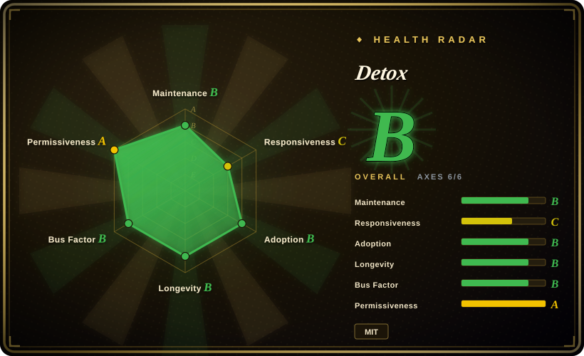
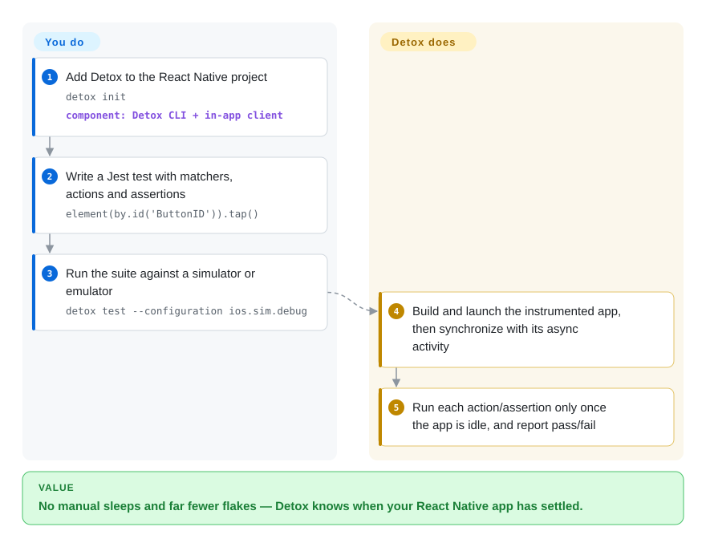

# Detox

Your React Native E2E suite is flaky because the runner is a black box: it cannot see the network request or animation still in flight, so it guesses with `sleep()` and guesses wrong. Detox takes the gray-box route — it has access to the app's internals and waits until the app is actually idle before each step, so tests stop racing the UI.

## When to use

You are testing a **React Native** app, your team writes JavaScript, and flakiness is the thing that keeps E2E from being trusted. You instrument the app build with Detox, write Jest tests using Detox's matchers and actions (`element(by.id('ButtonID')).tap()`, `expect(element(by.text('…'))).toBeVisible()`), and run them with `detox test` on an iOS simulator or an Android emulator/device. Because Detox synchronizes with the app's own async activity, you do not sprinkle waits, and a failure usually points at app logic rather than timing.

Choose Detox when the app is React Native and *zero flakiness* is the goal. Its gray-box advantage over [Maestro](maestro.md) (black-box YAML) and [Appium](appium.md) (black-box WebDriver) is real — but it comes with a narrower world: React Native only, a version-compatibility window, and no iOS physical devices.

## Q&A

**Do I need to modify my app for Detox?**
Effectively yes — Detox is gray-box and needs a Detox-enabled build of the app to observe its internals. It also sometimes needs small app tweaks when looping animations make it wait indefinitely. That instrumentation is the price of the synchronization.

**Which React Native versions are supported?**
The README states full compatibility with RN `v0.77.x`–`v0.84.x` under the New Architecture; newer versions "might work" but are not thoroughly tested, and older ones are not officially supported.

**Does it run on real devices?**
Android devices yes; **iOS physical devices are not supported** (simulators only).

## How it works

Detox is two cooperating pieces: a test runner you write against (Jest by default) and an in-app client that the Detox build links into your React Native app. When you run `detox test --configuration ios.sim.debug`, it builds and launches the instrumented app, and from then on it is **synchronized** with the app: before every action or assertion, Detox waits for the app's foreground async work — network, timers, animations — to settle, so `await element(by.id('ButtonID')).tap()` needs no manual delay. The handoff: **you** write the matchers, actions and assertions in JS; **Detox** owns the launch, the idle-synchronization and the injection of each step. This is why it beats black-box waiting — and also why it is React Native-specific: the synchronization relies on being inside the app.

<!-- flow-steps:begin (generated from flows/detox.json by tools/flow_card.py — do not edit) -->

Text version of the flow

1. **You**: Add Detox to the React Native project — `detox init` — component: `Detox CLI + in-app client`
2. **You**: Write a Jest test with matchers, actions and assertions — `element(by.id('ButtonID')).tap()`
3. **You**: Run the suite against a simulator or emulator — `detox test --configuration ios.sim.debug`
4. **Detox**: Build and launch the instrumented app, then synchronize with its async activity
5. **Detox**: Run each action/assertion only once the app is idle, and report pass/fail

**Value**: No manual sleeps and far fewer flakes — Detox knows when your React Native app has settled.

<!-- flow-steps:end -->

## When NOT to use

- **Your app is not React Native.** Detox is built for RN; for Flutter, native, Ionic or hybrid apps use [Maestro](maestro.md) or [Appium](appium.md).
- **You must test on a physical iPhone.** Unsupported. Use [Appium](appium.md) (via WebDriverAgent) or [`idb`](idb.md).
- **Your team does not write JavaScript.** The test API is JS/Jest; for Swift/Kotlin/Java test code use native `XCUITest`/Espresso (`非仓库`) or [Appium](appium.md) with a client library in your language.
- **You are on a React Native version outside the supported window.** RN 0.77–0.84 is the stated compatibility range; on newer or much older RN, verify before committing, or fall back to [Maestro](maestro.md).
- **You need to automate an arbitrary third-party app.** Gray-box means you build and instrument *your* app; to drive an app you cannot modify, use [Maestro](maestro.md) or [Appium](appium.md).

## Comparison

| Alternative | In index | Our verdict | Tradeoff |
|---|---|---|---|
| [`Appium`](appium.md) | ✅ | Pick Appium when you need cross-platform coverage beyond React Native, client libraries in your team's language, or physical devices; pick Detox when the app is RN and flakiness is the deciding problem. | Appium's black-box WebDriver model covers far more ground but cannot synchronize with the app's internals, so RN tests tend to be flakier; Detox trades that breadth for determinism. |
| [`Maestro`](maestro.md) | ✅ | Pick Maestro for framework-agnostic YAML and the fastest onboarding; pick Detox for a React Native app where synchronization depth matters more than simplicity. | Maestro is simpler and broader but black-box and without physical-iOS support either; Detox is deeper but narrower. |
| `XCUITest` | 非仓库 | Pick native `XCUITest` when you want Apple's first-party automation with no third-party layer; pick Detox when you want JS tests and RN-aware synchronization. | First-party and durable, but Apple-only, Swift/Xcode-bound, and not React-Native-aware. |

## Tech stack

- **Language:** JavaScript (Node.js), with Jest integration out of the box.
- **Architecture:** a test runner plus an in-app client linked into a Detox-enabled build (gray box).
- **Platforms:** iOS and Android, React Native apps only.
- **Test API:** matchers (`by.id`, `by.text`, `by.label`), actions (`tap`, `swipe`, `scroll`), and an `expect` object (`toBeVisible`, `toExist`, `toHaveText`).

## Dependencies

- **Runtime:** Node.js and npm/yarn (`detox` on npm); a React Native project with a Detox build configuration.
- **Platform tooling:** Xcode + iOS simulators for iOS; Android SDK + emulator/device for Android.
- **Build:** a Detox-instrumented app build (the runner builds and installs it as part of `detox test`).
- **External services:** none required.

## Ops difficulty

**Medium.** There is no server to run, but there is more project plumbing than Maestro: a Detox build configuration, an instrumented app build, and a test runner wired into CI. The recurring costs are keeping the Detox version aligned with your React Native version and handling the sync edge cases the docs call out (looping animations that stall synchronization). Release cadence is comparatively slow, so plan upgrades rather than assume they are continuous.

## Health & viability

- **Maintenance (2026-09).** Active but slower than its peers: last push 2026-09-07; npm latest v20.51.4 (2026-06-16) after 20.51.3 (2026-05-30) and 20.50.2 (2026-04-21) — roughly monthly-to-quarterly releases.
- **Governance / bus factor.** Under the **wix** organization with a broad, long-running contributor base (`asafkorem` 1124, `LeoNatan` 816, `rotemmiz` 742, `noomorph` 672, `d4vidi` 634) — not a single-maintainer project, and backed by Wix, whose mobile team still uses it.
- **Backing & longevity.** Created **2016** and still active ⇒ a strong **Lindy** signal; the framework has survived multiple React Native architecture shifts.
- **Adoption.** ~12k stars, 1911 forks, 351 watchers, and 1,857,806 `detox` npm installs in the last month — the default E2E framework in the React Native ecosystem.
- **Risk flags.** React Native version lock (0.77–0.84 for full compatibility); no iOS physical devices; JS-only; slower release cadence than Appium/Maestro; gray-box instrumentation means app changes may be needed.

## Caveats (unverified)

- [未验证] Star/fork/watcher/issue counts (~12028/1911/351/210) and the npm download figure (~1.86M) are as of 2026-09-24 and date-sensitive.
- [未验证] The exact latest version: the GitHub Releases list lags npm (npm showed 20.51.4 on 2026-06-16 while the release feed showed 20.51.3); confirm against npm/the changelog for the version you pin.
- [未验证] React Native compatibility beyond 0.84 is stated only as "might work" upstream; not tested here.
- [推断] "Default E2E framework for React Native" is a judgment from adoption signals, not a measured statistic.
- [未验证] Whether/where Detox can run on physical iOS devices; the README says not yet supported at the version observed.
