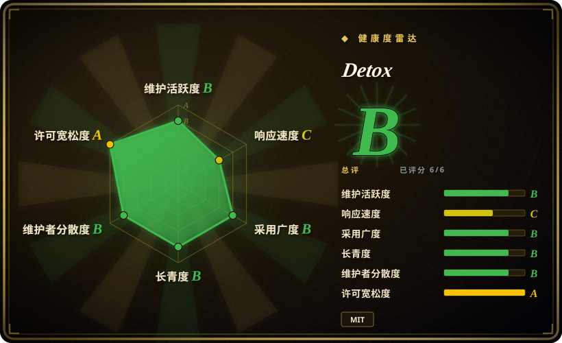
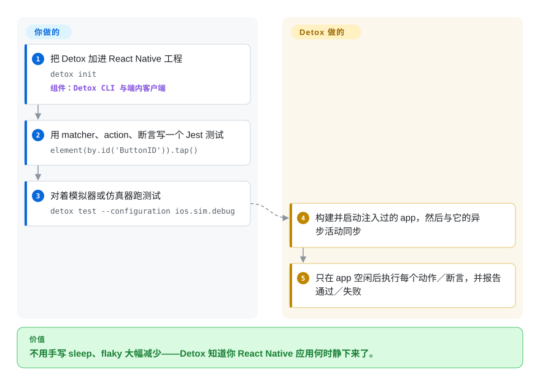

# Detox

你的 React Native 端到端测试 flaky，是因为 runner 是个黑盒：它看不见还在飞的网络请求或动画，只能靠 `sleep()` 猜，而猜错。Detox 走灰盒路线——它能访问 app 内部，每一步之前都等到 app 真正空闲，于是测试不再和界面抢时间。

## 何时使用

你在测一个 **React Native** 应用，团队写 JavaScript，而 flaky 正是让端到端测试不被信任的元凶。你给 app 构建注入 Detox，用它的 matcher 和 action 写 Jest 测试（`element(by.id('ButtonID')).tap()`、`expect(element(by.text('…'))).toBeVisible()`），再用 `detox test` 在 iOS 模拟器或 Android 仿真器／真机上跑。因为 Detox 与 app 自身的异步活动同步，你不用到处塞等待，失败通常指向 app 逻辑而不是时序。

当 app 是 React Native、且目标是*零 flaky* 时选 Detox。它相对 [Maestro](maestro.zh.md)（黑盒 YAML）和 [Appium](appium.zh.md)（黑盒 WebDriver）的灰盒优势是实打实的——但代价是更窄的世界：只支持 React Native、有版本兼容窗口、且不支持 iOS 真机。

## 快问快答

**需要改我的 app 才能用 Detox 吗？**
实际上需要——Detox 是灰盒，需要一份「启用了 Detox」的 app 构建才能观察其内部。当循环动画让同步卡死时，有时还要给 app 做小改动。这份注入就是同步能力的代价。

**支持哪些 React Native 版本？**
README 称在 New Architecture 下与 RN `v0.77.x`–`v0.84.x` 完全兼容；更新的版本「也许能跑」但未经充分测试，更老的则不在官方支持范围。

**支持真机吗？**
Android 真机可以；**iOS 真机不支持**（只支持模拟器）。

## 怎么用起来

Detox 是两个协作的部分：一个你写测试所面向的 runner（默认 Jest），以及一个由 Detox 构建链接进你 React Native app 的端内客户端。你跑 `detox test --configuration ios.sim.debug` 时，它构建并启动注入了客户端的 app，此后它就与 app **同步**：每个动作或断言之前，Detox 都等到 app 前台异步工作——网络、定时器、动画——静下来，所以 `await element(by.id('ButtonID')).tap()` 不需要任何手动延迟。分工是：**你**用 JS 写 matcher、action 和断言；**Detox** 负责启动、空闲同步和逐步注入。这就是它胜过黑盒等待的原因——也是它只适用 React Native 的原因：同步能力来自「身在 app 内部」。

<!-- flow-steps:begin (generated from flows/detox.json by tools/flow_card.py — do not edit) -->

流程文字版

1. **你**：把 Detox 加进 React Native 工程 — `detox init` — 组件：`Detox CLI 与端内客户端`
2. **你**：用 matcher、action、断言写一个 Jest 测试 — `element(by.id('ButtonID')).tap()`
3. **你**：对着模拟器或仿真器跑测试 — `detox test --configuration ios.sim.debug`
4. **Detox**：构建并启动注入过的 app，然后与它的异步活动同步
5. **Detox**：只在 app 空闲后执行每个动作／断言，并报告通过／失败

**价值**：不用手写 sleep、flaky 大幅减少——Detox 知道你 React Native 应用何时静下来了。

<!-- flow-steps:end -->

## 何时不用

- **你的 app 不是 React Native。** Detox 为 RN 而建；Flutter、原生、Ionic 或混合应用请用 [Maestro](maestro.zh.md) 或 [Appium](appium.zh.md)。
- **必须在 iPhone 真机上测。** 不支持。用 [Appium](appium.zh.md)（经 WebDriverAgent）或 [`idb`](idb.zh.md)。
- **团队不写 JavaScript。** 测试 API 是 JS／Jest；要用 Swift／Kotlin／Java 写测试，请用原生 `XCUITest`／Espresso（均为 `非仓库`），或 [Appium](appium.zh.md) 配你语言的客户端库。
- **你的 React Native 版本在支持窗口之外。** 声明范围是 RN 0.77–0.84；更新或更老的 RN 要先验证再投入，否则退回 [Maestro](maestro.zh.md)。
- **你要自动化任意第三方 app。** 灰盒意味着你构建并注入的是*你自己的* app；驱动一个你改不了的 app，请用 [Maestro](maestro.zh.md) 或 [Appium](appium.zh.md)。

## 横向对比

| 替代品 | 是否收录 | 我们的评价 | 取舍 |
|---|---|---|---|
| [`Appium`](appium.zh.md) | ✅ | 需要超出 React Native 的跨平台覆盖、用团队语言的客户端库或真机时选 Appium；app 是 RN、且 flaky 是决定性问题时选 Detox。 | Appium 的黑盒 WebDriver 模型覆盖地面大得多，但无法与 app 内部同步，RN 测试往往更 flaky；Detox 用这份广度换确定性。 |
| [`Maestro`](maestro.zh.md) | ✅ | 想要跨框架 YAML 和最快上手时选 Maestro；React Native 应用、且同步深度比简单更重要时选 Detox。 | Maestro 更简单、更广，但同为黑盒、也不支持 iOS 真机；Detox 更深但更窄。 |
| `XCUITest` | 非仓库 | 想要 Apple 第一方自动化、不引入第三方层时选原生 `XCUITest`；想要 JS 测试和 RN 感知的同步时选 Detox。 | 第一方且耐久，但仅限 Apple、绑 Swift／Xcode，且不具备 React Native 感知。 |

## 技术栈

- **语言：** JavaScript（Node.js），开箱集成 Jest。
- **架构：** 一个测试 runner 加一个链接进「启用 Detox 构建」的端内客户端（灰盒）。
- **平台：** iOS 与 Android，且仅限 React Native 应用。
- **测试 API：** matcher（`by.id`、`by.text`、`by.label`）、action（`tap`、`swipe`、`scroll`），以及 `expect` 对象（`toBeVisible`、`toExist`、`toHaveText`）。

## 依赖

- **运行时：** Node.js 与 npm／yarn（npm 包 `detox`）；一个带 Detox 构建配置的 React Native 工程。
- **平台工具：** iOS 需要 Xcode 与模拟器；Android 需要 SDK 与仿真器／真机。
- **构建：** 一份注入 Detox 的 app 构建（`detox test` 会把它构建并安装好）。
- **外部服务：** 不强制。

## 运维难度

**中。** 没有服务端要跑，但工程管道比 Maestro 多：一份 Detox 构建配置、一份注入过的 app 构建、以及接进 CI 的测试 runner。反复出现的成本，是让 Detox 版本与你的 React Native 版本保持对齐，以及处理文档点名的同步边界（会让同步停住的循环动画）。发版节奏相对慢，所以升级要提前规划，别假设它连续不断。

## 健康度与可持续性

- **维护（2026-09）。** 活跃但慢于同侪：最后推送 2026-09-07；npm 最新 v20.51.4（2026-06-16），此前 20.51.3（2026-05-30）、20.50.2（2026-04-21）——大致每一到数月一次。
- **治理／bus factor。** 归 **wix** 组织，贡献者基底广且长久（`asafkorem` 1124、`LeoNatan` 816、`rotemmiz` 742、`noomorph` 672、`d4vidi` 634）——不是单人项目，且背后是仍在用它的 Wix 移动团队。
- **背书与寿命。** 建于 **2016** 且仍活跃 ⇒ 强 **Lindy** 信号；它挺过了多次 React Native 架构变迁。
- **采用度。** 约 12k star、1911 fork、351 watcher，`detox` 上月 npm 安装约 1,857,806 次——React Native 生态里的默认端到端框架。
- **风险标记。** 锁 React Native 版本（完全兼容 0.77–0.84）；不支持 iOS 真机；只支持 JS；发版节奏慢于 Appium／Maestro；灰盒注入意味着可能需要改 app。

## 存疑（未验证）

- [未验证] star／fork／watcher／issue 数（约 12028／1911／351／210）与 npm 下载数（约 186 万）为 2026-09-24 时点，随时间变化。
- [未验证] 确切最新版本：GitHub Releases 落后于 npm（npm 显示 20.51.4／2026-06-16，而 release feed 只到 20.51.3）；请按你所固定版本查 npm／changelog。
- [未验证] 0.84 之后的 React Native 兼容性，上游只说「也许能跑」；此处未测。
- [推断] 「React Native 的默认端到端框架」是从采用信号得出的判断，不是度量出的统计。
- [未验证] Detox 能否、在哪里跑 iOS 真机；观测版本的 README 说暂不支持。
