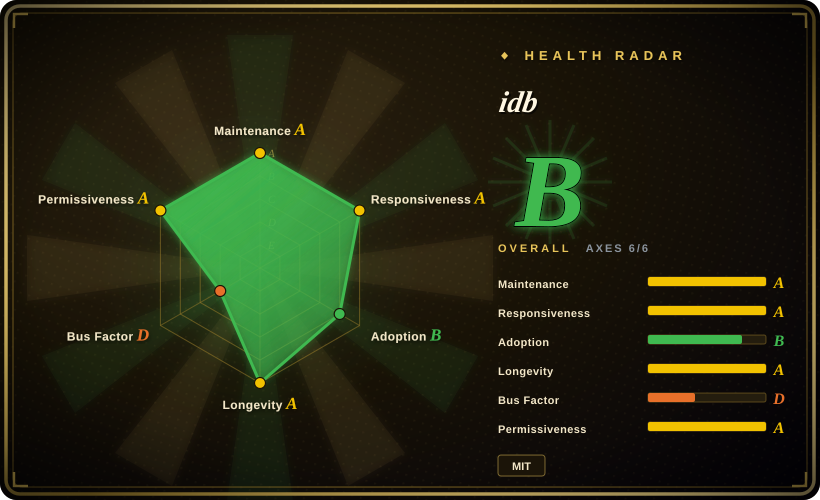
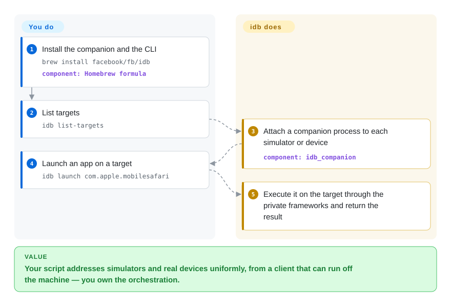

# idb

You want to automate iOS from a central machine — fan test shards out across a rack of simulators, or drive a tethered iPhone — and every GUI tool you tried assumes a human is watching Xcode. idb splits into a macOS "companion" that attaches to each target and a client that can run anywhere, then exposes granular automation primitives (list, launch, input, accessibility) over that channel; the same commands cover both simulators and physical devices.

## When to use

You're building a device lab or a CI farm: one control machine, many simulators (or a mix of simulators and tethered iPhones), and you want to address them uniformly from a script that does not have to live on the same host. `xcrun simctl` is local-only and has no input path; `baguette` is local-only and simulator-only. idb's answer is architectural: a **companion** process is attached to each target, and a thin client (`idb`, with a Python API) talks to it — so you can sequence your own workflow on top of granular primitives, from an IDE or a scheduler, and the primitives are meant to behave the same on a simulator and a real device.

Reach for idb when *remote* and *both target kinds* are the deciding requirements. If you only ever touch simulators on the machine you are sitting at, a single-binary tool like `baguette` is less machinery for the same taps.

## Q&A

**Does idb need Xcode installed?**
For the simulator path, yes in practice — it leaks into Xcode's private `FBSimulatorControl`/`FBDeviceControl` frameworks and requires macOS 15+ with Xcode 26.0+ to build. The Python client alone can run anywhere, but it is useless without its companion.

**Is it maintained, or is this another archived Meta project?**
As of 2026-09-24 it is actively developed (v1.6.2 released 2026-09-23). But Meta's history of archiving internal OSS is a real consideration for a multi-year bet — weigh it yourself. [推断]

**Why does iOS 26 break it?**
iOS 26 changed the simulator HID wire format; idb's input and accessibility reads have documented regressions on iOS 26 simulators (open issues #964 and #893).

## How it works

idb is two halves. The **companion** is a macOS process that attaches to one target — a booted simulator or a tethered device — and owns the private-framework plumbing (`FBSimulatorControl`/`FBDeviceControl`); the **client** is a CLI (`idb`) plus a Python package (`fb-idb`) that speaks to one or more companions over a local/remote channel. You issue primitives — list targets, list or launch apps, inject input, read the accessibility tree — and the client forwards each to the right companion, which executes it on the target and returns a result. The handoff is the point: you compose the workflow and own the orchestration, idb owns the target-specific mechanism and keeps the command surface consistent between a simulator and a real device. The repo is mid-migration from Objective-C to Swift, with the companion already Swift.

<!-- flow-steps:begin (generated from flows/idb.json by tools/flow_card.py — do not edit) -->

Text version of the flow

1. **You**: Install the companion and the CLI — `brew install facebook/fb/idb` — component: `Homebrew formula`
2. **You**: List targets — `idb list-targets`
3. **idb**: Attach a companion process to each simulator or device — component: `idb_companion`
4. **You**: Launch an app on a target — `idb launch com.apple.mobilesafari`
5. **idb**: Execute it on the target through the private frameworks and return the result

**Value**: Your script addresses simulators and real devices uniformly, from a client that can run off the machine — you own the orchestration.

<!-- flow-steps:end -->

## When NOT to use

- **You only need a local simulator.** idb's companion-per-target architecture is overhead you do not need; [`baguette`](baguette.md) or [`AXe`](axe.md) give you the same taps as one binary.
- **You want a test framework.** idb is a driver toolkit, not a runner — no selectors, waits, or reports. Use [Appium](appium.md) or [Maestro](maestro.md) if you want to *write tests*.
- **You are committed to iOS 26 today.** The input and accessibility regressions are open, so verify your exact flow before depending on it there; the private-symbol path is what broke. [未验证]
- **You cannot run a persistent process per target.** Device-lab fan-out is the feature, but it is also the cost: if your environment forbids long-lived companions or remote sockets, idb is the wrong shape.
- **Cross-platform coverage is the requirement.** idb is Apple-only; [Appium](appium.md) or [Maestro](maestro.md) cover Android with the same test code.
- **You want the smallest possible dependency for a one-off.** For a single scripted tap, `xcrun simctl` (lifecycle only) plus a lean input tool beats standing up idb.

## Comparison

| Alternative | In index | Our verdict | Tradeoff |
|---|---|---|---|
| [`baguette`](baguette.md) | ✅ | Pick baguette when you want one self-contained simulator-only binary with streaming and a web farm; pick idb when physical devices or remote fan-out are the requirement. | baguette is lighter and streams the screen, but it cannot reach a real device and is Apple-Silicon/Xcode-26 locked. |
| [`AXe`](axe.md) | ✅ | Pick AXe when you want a minimal local input CLI; pick idb when you need the remote architecture and the broader primitive surface. | AXe is simpler to adopt but single-maintainer and quiet since 2026-07. |
| [`Appium`](appium.md) | ✅ | Pick Appium when you need a cross-platform test framework and a standard protocol; pick idb when you want raw primitives and a device-lab channel to build your own runner on. | Appium gives durable, officially-supported iOS automation via XCUITest, but it is a server plus drivers rather than low-level primitives. |
| `xcrun simctl` | 非仓库 | Pick `simctl` for lifecycle, install, screenshots and logs regardless; it is idb's stable complement, and the only piece that never rides a private symbol. | Ships with Xcode, breakage-resistant, but no input and no device-lab fan-out. |

## Tech stack

- **Language:** Swift (companion and frameworks are migrating from Objective-C); the client ships a Python package.
- **In-repo frameworks:** `FBSimulatorControl`, `FBDeviceControl`, `FBControlCore`.
- **Transport:** a client/companion protocol (protobuf-based, per the build prerequisites) so the client can run off-host.
- **Private frameworks:** it exercises Xcode's private APIs to expose features the public tooling lacks.

## Dependencies

- **Host:** macOS 15+ with **Xcode 26.0+** to build and run simulators; `xcodegen` and protobuf tooling for source builds.
- **Client:** Python **3.10+** for `fb-idb`; the CLI ships with the Homebrew formula.
- **Install:** `brew install facebook/fb/idb`; the client alone is `pip3 install fb-idb`.
- **External services:** none required, though the architecture is explicitly designed for remote/device-lab deployment.

## Ops difficulty

**Medium to high.** The install is one Homebrew formula, but in practice you are operating a fleet: a companion process per target, a client/companion connection (local or remote), and a fast-moving private-framework dependency that Apple changes underneath you. The 175 open issues reflect a large surface with long-lived edge cases. For a single laptop it is more machinery than the job needs; for a device lab it is the intended shape.

## Health & viability

- **Maintenance (2026-09).** Active: v1.6.2 (2026-09-23), v1.6.1 (09-18), v1.6.0 (09-17) — a tight release run, last push 2026-09-23.
- **Governance / bus factor.** Owned by the `facebook` organization, but contributions concentrate heavily: `lawrencelomax` (6489 commits) dwarfs the next names (`xgerrit` 314, `c-ryan747` 162). [推断] Strong single-maintainer concentration inside a large-org wrapper.
- **Backing & longevity.** Created **2015** and still actively maintained ⇒ a strong **Lindy** signal, and it is the reference tool for Meta-scale iOS device labs. The open question is Meta's appetite to keep it alive rather than archive it, which its track record makes a live risk. [推断]
- **Adoption.** ~5.3k stars, 505 forks, 115 watchers; used for device-lab fan-out and by tooling that builds on `FBSimulatorControl`. 175 open issues is a large surface, not necessarily abandonment.
- **Risk flags.** Private-framework dependency (iOS 26 regressions are open: #964, #893); companion-per-target operational weight; heavy single-maintainer concentration.

## Caveats (unverified)

- [未验证] Star/fork/watcher/issue counts (~5339/505/115/175) are as of 2026-09-24 and date-sensitive.
- [未验证] The full set of iOS-26 regressions and their workarounds; I confirmed #964 and #893 but did not reproduce either.
- [未验证] Whether the Objective-C→Swift migration is complete or still in progress at the version you pin — the README describes it as ongoing.
- [推断] Meta's willingness to keep maintaining idb is a judgment based on its general OSS track record, not a statement about this project's roadmap.
- [未验证] Exact companion transport/protocol details beyond "protobuf-based" were not read from source.
