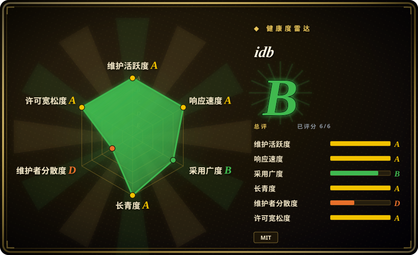
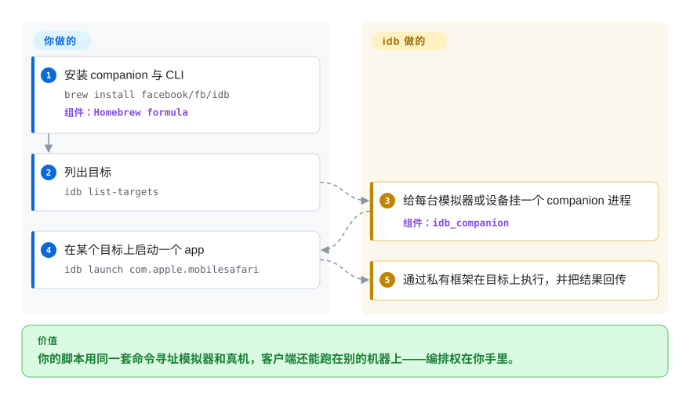

# idb

你想从一台中心机器自动化 iOS——把测试分片铺到一整排模拟器上，或者驱动一台连线的 iPhone——可你试过的每个图形工具都假设有人盯着 Xcode。idb 拆成两半：一个挂在每个目标上的 macOS「companion」，和一个能跑在任何地方的客户端；它在这条通道上暴露细粒度的自动化原语（列设备、启动、输入、无障碍），同一套命令同时覆盖模拟器和真机。

## 何时使用

你在搭设备机房或 CI farm：一台控制机、很多模拟器（或模拟器加连线 iPhone 的混合），你想用一个不必和它们同机的脚本统一寻址。`xcrun simctl` 只能本机、而且没有输入通路；`baguette` 只能本机、也只支持模拟器。idb 的答案是架构层面的：**companion** 进程挂在每个目标上，一个轻客户端（`idb`，带 Python API）跟它对话——于是你可以在细粒度原语之上编排自己的工作流，从 IDE 或调度器发起，而且这些原语被设计成在模拟器和真机上行为一致。

当决定性的需求是「**远端**」加「**两种目标都要**」时，选 idb。如果你只在自己坐着的这台机器上碰模拟器，像 `baguette` 这样的单体二进制用同样的点击能做到、机器更少。

## 快问快答

**idb 需要装 Xcode 吗？**
模拟器这条路实际上需要——它扎进 Xcode 私有的 `FBSimulatorControl`／`FBDeviceControl` 框架，构建要求 macOS 15+ 与 Xcode 26.0+。只有 Python 客户端可以跑在任何地方，但没有 companion 就没用。

**它还在维护，还是又一个被 Meta 归档的项目？**
到 2026-09-24 仍在活跃开发（v1.6.2 发布于 2026-09-23）。但 Meta 归档自家开源项目的历史，对长期下注是个真实考量——请自行权衡。[推断]

**为什么 iOS 26 会打坏它？**
iOS 26 改了模拟器的 HID 线格式；idb 的输入与无障碍读取在 iOS 26 模拟器上有成文回归（未关的 #964 与 #893）。

## 怎么用起来

idb 是两半。**companion** 是个 macOS 进程，挂到一个目标——已启动的模拟器或连线设备——并持有私有框架那部分脏活（`FBSimulatorControl`／`FBDeviceControl`）；**客户端**是一个 CLI（`idb`）加一个 Python 包（`fb-idb`），通过本地或远端通道跟一个或多个 companion 通信。你发原语——列目标、列出或启动 app、注入输入、读无障碍树——客户端把每一条转给对应的 companion，由它在目标上执行并回传结果。这个交接才是重点：你负责编排，idb 负责目标相关的机制，并让命令面在模拟器和真机之间保持一致。仓库正处于 Objective-C 迁移到 Swift 的过程中，companion 已经是 Swift。

<!-- flow-steps:begin (generated from flows/idb.json by tools/flow_card.py — do not edit) -->

流程文字版

1. **你**：安装 companion 与 CLI — `brew install facebook/fb/idb` — 组件：`Homebrew formula`
2. **你**：列出目标 — `idb list-targets`
3. **idb**：给每台模拟器或设备挂一个 companion 进程 — 组件：`idb_companion`
4. **你**：在某个目标上启动一个 app — `idb launch com.apple.mobilesafari`
5. **idb**：通过私有框架在目标上执行，并把结果回传

**价值**：你的脚本用同一套命令寻址模拟器和真机，客户端还能跑在别的机器上——编排权在你手里。

<!-- flow-steps:end -->

## 何时不用

- **只是本机模拟器。** 每个目标一个 companion 的架构是多余的负担；[`baguette`](baguette.zh.md) 或 [`AXe`](axe.zh.md) 用一个二进制给你同样的点击。
- **你要的是测试框架。** idb 是驱动工具箱，不是 runner——没有选择器、等待和报告。想*写测试*请用 [Appium](appium.zh.md) 或 [Maestro](maestro.zh.md)。
- **你今天就锁死在 iOS 26 上。** 输入与无障碍的回归还开着，依赖它之前先验证你的具体流程；坏掉的正是私有符号这条路。[未验证]
- **你不能为每个目标跑常驻进程。** 设备机房铺开是它的卖点，也是它的成本：如果你的环境不允许长驻 companion 或远端 socket，idb 就是错的形状。
- **需求是跨平台覆盖。** idb 只支持 Apple；[Appium](appium.zh.md) 或 [Maestro](maestro.zh.md) 能用同一份测试代码覆盖 Android。
- **你只想要一次性点击的最小依赖。** 一次脚本化点击，`xcrun simctl`（只管生命周期）加一个精简输入工具就够了，不必架 idb。

## 横向对比

| 替代品 | 是否收录 | 我们的评价 | 取舍 |
|---|---|---|---|
| [`baguette`](baguette.zh.md) | ✅ | 想要一个自带投屏与 Web farm 的纯模拟器单体二进制时选 baguette；真机或远端铺开是硬需求时选 idb。 | baguette 更轻、还能投屏，但够不到真机，且锁 Apple Silicon／Xcode 26。 |
| [`AXe`](axe.zh.md) | ✅ | 想要极简的本地输入 CLI 时选 AXe；需要远端架构和更宽的原语面时选 idb。 | AXe 上手更简单，但单人维护、2026-07 后停滞。 |
| [`Appium`](appium.zh.md) | ✅ | 需要跨平台测试框架和标准协议时选 Appium；想要原始原语和一条设备机房通道、用来自己搭 runner 时选 idb。 | Appium 通过 XCUITest 给出耐久、官方支持的 iOS 自动化，但它是服务端加驱动，而非底层原语。 |
| `xcrun simctl` | 非仓库 | 生命周期、装包、截图、日志一律用它；它是 idb 稳定的补充，也是唯一一个从不骑私有符号的部分。 | 随 Xcode 分发、不易坏，但没有输入、也没有设备机房铺开。 |

## 技术栈

- **语言：** Swift（companion 与框架正从 Objective-C 迁移）；客户端提供 Python 包。
- **仓库内框架：** `FBSimulatorControl`、`FBDeviceControl`、`FBControlCore`。
- **传输：** 一套客户端／companion 协议（据构建前置条件为 protobuf），使客户端可跑在异地。
- **私有框架：** 动用 Xcode 私有 API，以暴露公共工具缺失的功能。

## 依赖

- **宿主机：** macOS 15+ 与 **Xcode 26.0+** 才能构建和跑模拟器；源码构建还需要 `xcodegen` 与 protobuf 工具链。
- **客户端：** `fb-idb` 需要 Python **3.10+**；CLI 随 Homebrew 公式提供。
- **安装：** `brew install facebook/fb/idb`；只要客户端则是 `pip3 install fb-idb`。
- **外部服务：** 不强制，但架构明确面向远端／设备机房部署。

## 运维难度

**中到高。** 安装只是一句 Homebrew，但实际你是在运营一个机群：每个目标一个 companion、一套客户端／companion 连接（本地或远端），以及 Apple 会在你脚下改动的私有框架依赖。175 个未关 issue 反映的是面积大、长尾案例多。单台笔记本上它比活儿本身更重；设备机房里它才是对的形状。

## 健康度与可持续性

- **维护（2026-09）。** 活跃：v1.6.2（2026-09-23）、v1.6.1（09-18）、v1.6.0（09-17）——一波密集发版，最后推送 2026-09-23。
- **治理／bus factor。** 归 `facebook` 组织，但贡献高度集中：`lawrencelomax`（6489 次提交）远超后面的 `xgerrit`（314）、`c-ryan747`（162）。[推断] 在大型组织外壳下，实际是强单人集中。
- **背书与寿命。** 建于 **2015** 年且仍在活跃维护 ⇒ 强 **Lindy** 信号，也是 Meta 规模 iOS 设备机房的参考工具。未定的是 Meta 维持它的意愿、而不是归档它——鉴于其历史，这是个现实风险。[推断]
- **采用度。** 约 5.3k star、505 fork、115 watcher；用于设备机房铺开，也有工具构建在 `FBSimulatorControl` 之上。175 个未关 issue 是面积大，未必等于废弃。
- **风险标记。** 依赖私有框架（iOS 26 回归未关：#964、#893）；每个目标一个 companion 的运维重量；单人贡献高度集中。

## 存疑（未验证）

- [未验证] star／fork／watcher／issue 数（约 5339／505／115／175）为 2026-09-24 时点，随时间变化。
- [未验证] iOS 26 回归的完整清单及其绕法；我只确认了 #964 与 #893，两者都未复现。
- [未验证] Objective-C 到 Swift 的迁移在你固定的版本上是否已完成——README 描述为仍在进行。
- [推断] Meta 维持 idb 的意愿是基于其总体开源履历的判断，不是对该项目路线图的陈述。
- [未验证] companion 传输／协议的精确细节我只读到「基于 protobuf」，未读源码。
