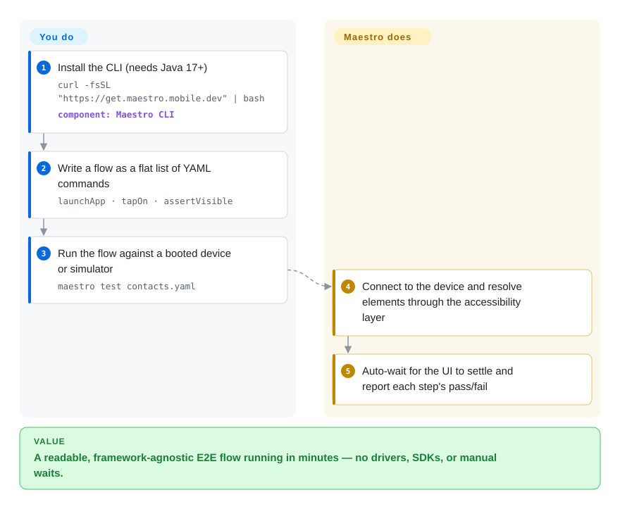

# Maestro

Mobile end-to-end tests are usually flaky and take a week to stand up: drivers to install, SDKs to wire, `sleep()` calls to paper over timing. Maestro runs plain YAML flows through the platform's accessibility layer, installs as one binary with no drivers or SDK, and auto-waits for elements — so a usable first test takes minutes and a red run usually means a real bug, not a race.

## When to use

You want mobile E2E coverage now, across Android and iOS (and web), without standing up a server or learning a platform automation API. You write a flow as a flat list of commands — `launchApp`, `tapOn: "Create new contact"`, `assertVisible` — run `maestro test`, and read the result; Maestro finds elements by text or accessibility label and retries until the UI settles. It is framework-agnostic (React Native, Flutter, native, Ionic, hybrid), so the same mental model travels across your apps.

Choose Maestro when **onboarding speed and readability** decide the choice, and your devices are Android (any) or iOS **simulators**. Its README claims Meta uses it to test React Native itself and Expo supports it as a preferred E2E platform [未验证] — signals of real adoption, but still upstream marketing until independently confirmed. If you need physical iOS devices, pick [Appium](appium.md) instead.

## Q&A

**Does Maestro support real iPhones?**
No. Flows run on simulators, emulators, browsers, and physical **Android** devices; physical iOS is explicitly not supported yet.

**What do I need installed?**
Java 17+ and the CLI (a one-line installer). No drivers, no SDKs, no Appium server.

**Can a coding agent drive it?**
Yes — an MCP server ships inside the CLI (`maestro mcp`), so MCP clients can inspect the screen, tap, scroll and assert on a live device. There is also `maestro studio`, a visual flow builder.

## How it works

Maestro is a single Kotlin/JVM binary that talks to the device through the **platform accessibility layer** rather than a driver server. You hand it a YAML flow: the `appId:` header names the app, then a flat list of commands (`launchApp`, `tapOn`, `assertVisible`, `inputText`, …). When you run `maestro test flow.yaml`, Maestro connects to the running emulator/simulator, interprets each command — resolving selectors by visible text or accessibility label — waits automatically for the element to be actionable, and reports each step's pass/fail with a live progress view. The split is simple: **you** write the flow in YAML; **Maestro** owns device connection, element resolution, waiting/flakiness tolerance, and execution. Because flows are interpreted, there is no compile step, and because it does not instrument the app, the same flow shape works across frameworks and platforms.

<!-- flow-steps:begin (generated from flows/maestro.json by tools/flow_card.py — do not edit) -->

Text version of the flow

1. **You**: Install the CLI (needs Java 17+) — `curl -fsSL "https://get.maestro.mobile.dev" | bash` — component: `Maestro CLI`
2. **You**: Write a flow as a flat list of YAML commands — `launchApp · tapOn · assertVisible`
3. **You**: Run the flow against a booted device or simulator — `maestro test contacts.yaml`
4. **Maestro**: Connect to the device and resolve elements through the accessibility layer
5. **Maestro**: Auto-wait for the UI to settle and report each step's pass/fail

**Value**: A readable, framework-agnostic E2E flow running in minutes — no drivers, SDKs, or manual waits.

<!-- flow-steps:end -->

## When NOT to use

- **You must run on physical iPhones.** They are unsupported. Use [Appium](appium.md) (with WebDriverAgent) or [`idb`](idb.md) for device-side automation.
- **Your app is React Native and flakiness is the core problem.** [`Detox`](detox.md) does gray-box synchronization — it knows when the app is busy — which black-box waiting cannot match.
- **You need platform-native assertions or a language-native test harness.** Maestro executes YAML commands; if your tests must live in Swift/Kotlin/JS with the language's own assertions and fixtures, use native `XCUITest`/Espresso (both `非仓库`) or [Appium](appium.md).
- **You need deep device-level primitives.** Maestro drives the UI, not the hardware or the HID layer; for coordinate injection, streaming, or accessibility-tree dumps, use [`baguette`](baguette.md)/[`AXe`](axe.md)/[`idb`](idb.md).
- **You need a fully OSS-scale-out runner.** Maestro Cloud (a hosted paid service, `非仓库`) is the vendor's parallel-execution answer; if you cannot use it, plan your own grid.

## Comparison

| Alternative | In index | Our verdict | Tradeoff |
|---|---|---|---|
| [`Appium`](appium.md) | ✅ | Pick Appium when you need physical iOS, a standard protocol, or client libraries in your team's language; pick Maestro for a first readable cross-platform suite in an afternoon. | Appium covers more devices and languages through a stable standard, but needs a server plus per-platform drivers; Maestro trades that breadth for simplicity. |
| [`Detox`](detox.md) | ✅ | Pick Detox for a React Native app where flakiness is the enemy; pick Maestro when you want framework-agnostic YAML and can accept less synchronization depth. | Detox's gray-box model beats black-box waiting on RN, but it locks to RN versions and is JS-only. |
| [`WebDriverAgent`](webdriveragent.md) | ✅ | Pick Maestro to write tests; pick WebDriverAgent only if you are building the iOS engine itself. | WebDriverAgent is a protocol endpoint, not a runner — using it directly means building your own test layer. |
| `XCUITest` | 非仓库 | Pick native `XCUITest` when you want first-party Apple assertions and no third-party tool, at the cost of Android coverage and YAML ergonomics. | First-party and durable, but Apple-only, Swift/Xcode-bound, and no cross-platform flows. |

## Tech stack

- **Language:** Kotlin, running on the JVM (**Java 17+** required).
- **Interface:** YAML flows interpreted by the CLI; `maestro studio` (visual IDE) and `maestro mcp` (MCP server for agents) are bundled.
- **Device access:** the platform accessibility layer rather than a driver protocol; no app instrumentation.
- **Distribution:** a one-line install script; no driver or SDK installation.

## Dependencies

- **Runtime:** **Java 17+** plus the CLI (`curl -fsSL "https://get.maestro.mobile.dev" | bash`).
- **Targets:** a running Android emulator/device, iOS simulator, or browser; physical Android works, physical iOS does not.
- **External services:** none for local runs; the vendor's **Maestro Cloud** (hosted, `非仓库`) is optional for parallel execution.

## Ops difficulty

**Low.** That is the point of the design: one install line, no drivers, no SDKs, no server, and flows are interpreted so there is nothing to compile. The operational work is mostly environmental — keeping Java, the emulator/simulator, and the app build current — plus deciding how to parallelize if you outgrow a single machine (the vendor's answer is a paid hosted service).

## Health & viability

- **Maintenance (2026-09).** Active: last push 2026-09-18; releases `cli-2.10.0` (2026-08-31), 2.9.0 (08-26), 2.8.0 (07-31) — a steady cadence.
- **Governance / bus factor.** Owned by the company **mobile-dev-inc**, with a spread contributor base (`dmitry-zaitsev` 330, `amanjeetsingh150` 278, and others) rather than a lone maintainer.
- **Backing & longevity.** A venture-backed vendor with a hosted **Maestro Cloud** product alongside the OSS CLI — an **open-core** shape. That funds development but means the OSS core's direction is the vendor's to set. Created 2022-03 (~4.5 years) and active ⇒ a moderate **Lindy** signal, weaker than Appium's 13 years.
- **Adoption.** ~15.8k stars, 969 forks, 71 watchers; the README's claims of use by Meta (React Native) and Expo support are adoption signals, but they are upstream claims I did not verify. [未验证]
- **Risk flags.** 527 open issues is a large backlog for a project this size; physical iOS remains unsupported; the hosted/orchestration story is vendor-controlled.

## Caveats (unverified)

- [未验证] Star/fork/watcher/issue counts (~15774/969/71/527) are as of 2026-09-24 and date-sensitive.
- [未验证] The claims that Meta tests React Native with Maestro and that Expo supports it come from Maestro's own README; I did not independently confirm them.
- [未验证] Whether a Homebrew formula exists; the documented install path is the `get.maestro.mobile.dev` script, and the Homebrew API had no `maestro` formula at check time.
- [推断] "Open-core with a hosted Maestro Cloud" is inferred from the README's Cloud section and the vendor org; the exact OSS/paid boundary is not pinned here.
- [未验证] iOS/Android parity of individual commands; the README example is Android and platform support can differ per command.
