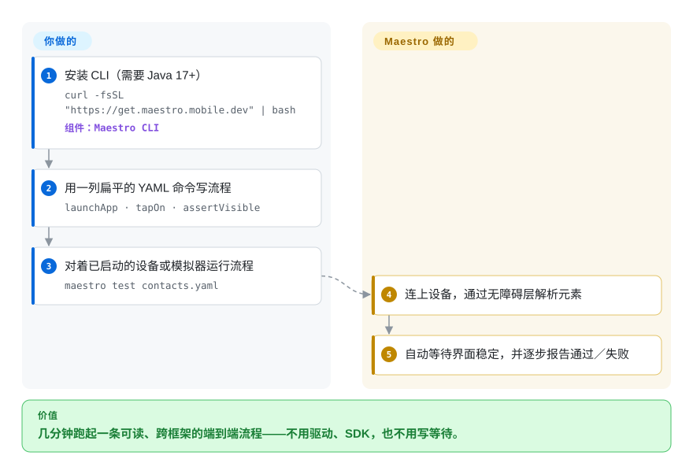

# Maestro

移动端端到端测试通常又 flaky 又难搭：装驱动、接 SDK、用 `sleep()` 去糊时序，一周就没了。Maestro 用扁平的 YAML 流程跑测试，走平台的**无障碍层**，一个二进制装完、不需要驱动或 SDK，还能自动等待元素——于是几分钟就能跑出第一条可用的测试，而一次红灯通常意味着真的有 bug，而不是竞态。

## 何时使用

你想现在就拿到移动端端到端覆盖，同时覆盖 Android 和 iOS（以及 Web），又不想架服务端或学某个平台的自动化 API。你把流程写成一列扁平命令——`launchApp`、`tapOn: "Create new contact"`、`assertVisible`——跑 `maestro test`，读结果；Maestro 按文字或无障碍标签找元素，并重试到界面稳定。它跨框架通用（React Native、Flutter、原生、Ionic、混合），所以同一套心智模型能在你各个 app 之间迁移。

当决定因素是**上手的快和流程的可读**、且设备是 Android（任意）或 iOS **模拟器**时，选 Maestro。它的 README 声称 Meta 用它测 React Native 本体、Expo 把它作为首选 E2E 平台 [未验证]——这是真实采用的信号，但在被独立证实前仍属上游宣传。你需要 iOS 真机，就该转 [Appium](appium.zh.md)。

## 快问快答

**支持真机 iPhone 吗？**
不支持。流程可跑在模拟器、仿真器、浏览器和 Android **真机**上；iOS 真机明确暂不支持。

**需要预先装什么？**
Java 17+ 和 CLI（一行安装脚本）。不需要驱动、SDK，也不需要 Appium 服务端。

**coding agent 能驱动它吗？**
能——MCP 服务端内置于 CLI（`maestro mcp`），MCP 客户端可以在实时设备上检查界面、点击、滚动、断言。另有 `maestro studio`，可视化流程构建器。

## 怎么用起来

Maestro 是一个 Kotlin／JVM 单体二进制，它通过**平台无障碍层**跟设备对话，而不是驱动服务端。你给它一条 YAML 流程：`appId:` 头指明应用，然后是一列扁平命令（`launchApp`、`tapOn`、`assertVisible`、`inputText`……）。你跑 `maestro test flow.yaml` 时，Maestro 连上正在运行的仿真器／模拟器，逐条解释命令——按可见文字或无障碍标签解析选择器——自动等待元素可操作，并用实时进度视图报告每一步的通过／失败。分工很简单：**你**用 YAML 写流程；**Maestro** 负责设备连接、元素解析、等待／抗 flaky 与执行。因为流程是解释执行的，没有编译步骤；因为它不注入 app，同一套流程形状能跨框架、跨平台成立。

<!-- flow-steps:begin (generated from flows/maestro.json by tools/flow_card.py — do not edit) -->

流程文字版

1. **你**：安装 CLI（需要 Java 17+） — `curl -fsSL "https://get.maestro.mobile.dev" | bash` — 组件：`Maestro CLI`
2. **你**：用一列扁平的 YAML 命令写流程 — `launchApp · tapOn · assertVisible`
3. **你**：对着已启动的设备或模拟器运行流程 — `maestro test contacts.yaml`
4. **Maestro**：连上设备，通过无障碍层解析元素
5. **Maestro**：自动等待界面稳定，并逐步报告通过／失败

**价值**：几分钟跑起一条可读、跨框架的端到端流程——不用驱动、SDK，也不用写等待。

<!-- flow-steps:end -->

## 何时不用

- **必须跑真机 iPhone。** 不支持。用 [Appium](appium.zh.md)（配 WebDriverAgent）或 [`idb`](idb.zh.md) 做真机侧自动化。
- **你的 app 是 React Native、且 flaky 是核心问题。** [`Detox`](detox.zh.md) 做灰盒同步——它知道 app 何时忙——黑盒等待做不到这一点。
- **你需要平台原生断言或语言原生的测试骨架。** Maestro 执行的是 YAML 命令；如果测试必须用 Swift／Kotlin／JS 写在语言自身的断言与 fixture 里，请用原生 `XCUITest`／Espresso（均为 `非仓库`）或 [Appium](appium.zh.md)。
- **你需要设备级底层原语。** Maestro 驱动的是 UI，不是硬件或 HID 层；要坐标注入、投屏或无障碍树转储，用 [`baguette`](baguette.zh.md)／[`AXe`](axe.zh.md)／[`idb`](idb.zh.md)。
- **你需要完全开源的水平扩展 runner。** Maestro Cloud（托管付费服务，`非仓库`）是厂商的并行执行答案；用不了它就得自己搭机群。

## 横向对比

| 替代品 | 是否收录 | 我们的评价 | 取舍 |
|---|---|---|---|
| [`Appium`](appium.zh.md) | ✅ | 需要 iOS 真机、标准协议或用团队语言的客户端库时选 Appium；想在一个下午内跑出第一条可读的跨平台套件时选 Maestro。 | Appium 通过稳定的标准覆盖更多设备与语言，但要服务端加逐平台驱动；Maestro 用这份广度换简单。 |
| [`Detox`](detox.zh.md) | ✅ | React Native 应用、头号敌人是 flaky 时选 Detox；想要跨框架的 YAML、能接受同步深度浅一些时选 Maestro。 | Detox 的灰盒模型在 RN 上胜过黑盒等待，但锁 RN 版本、只支持 JS。 |
| [`WebDriverAgent`](webdriveragent.zh.md) | ✅ | 写测试选 Maestro；只有你在造 iOS 引擎本身时才选 WebDriverAgent。 | WebDriverAgent 是协议端点而非 runner——直接用它意味着自建测试层。 |
| `XCUITest` | 非仓库 | 想要第一方 Apple 断言、不引入第三方工具时选原生 `XCUITest`，代价是没有 Android 覆盖、也没有 YAML 的顺手。 | 第一方且耐久，但仅限 Apple、绑 Swift／Xcode，且没有跨平台流程。 |

## 技术栈

- **语言：** Kotlin，跑在 JVM 上（要求 **Java 17+**）。
- **接口：** CLI 解释执行的 YAML 流程；捆绑 `maestro studio`（可视化 IDE）与 `maestro mcp`（面向 agent 的 MCP 服务端）。
- **设备访问：** 走平台无障碍层，而非驱动协议；不注入 app。
- **分发：** 一行安装脚本；不安装驱动或 SDK。

## 依赖

- **运行时：** **Java 17+** 加 CLI（`curl -fsSL "https://get.maestro.mobile.dev" | bash`）。
- **目标：** 一台运行中的 Android 仿真器／真机、iOS 模拟器或浏览器；Android 真机可用，iOS 真机不可用。
- **外部服务：** 本地运行不需要；厂商的 **Maestro Cloud**（托管，`非仓库`）在并行执行时可选。

## 运维难度

**低。** 这正是设计意图：一行安装，无驱动、无 SDK、无服务端，流程解释执行所以没有要编译的东西。运维工作主要是环境层面——保持 Java、仿真器／模拟器和 app 构建是新的——以及单机不够时决定怎么并行（厂商的答案是付费托管服务）。

## 健康度与可持续性

- **维护（2026-09）。** 活跃：最后推送 2026-09-18；发布 `cli-2.10.0`（2026-08-31）、2.9.0（08-26）、2.8.0（07-31）——节奏稳定。
- **治理／bus factor。** 归公司 **mobile-dev-inc**，贡献者较分散（`dmitry-zaitsev` 330、`amanjeetsingh150` 278 等），不是单人维护。
- **背书与寿命。** 一家有融资的厂商，OSS CLI 之外还有托管的 **Maestro Cloud**——**open-core** 形态。这能养开发，但也意味着 OSS 核心的方向由厂商决定。建于 2022-03（约 4.5 年）且活跃 ⇒ 中等 **Lindy** 信号，弱于 Appium 的 13 年。
- **采用度。** 约 15.8k star、969 fork、71 watcher；README 称 Meta（React Native）在用、Expo 支持，这些是采用信号，但属上游声明，我未验证。[未验证]
- **风险标记。** 对这个体量来说 527 个未关 issue 是很大的积压；iOS 真机仍不支持；托管／编排的故事由厂商掌控。

## 存疑（未验证）

- [未验证] star／fork／watcher／issue 数（约 15774／969／71／527）为 2026-09-24 时点，随时间变化。
- [未验证] 「Meta 用 Maestro 测 React Native」「Expo 支持它」出自 Maestro 自家 README，我未独立确认。
- [未验证] 是否有 Homebrew 公式；文档给出的安装路径是 `get.maestro.mobile.dev` 脚本，检查时 Homebrew API 没有 `maestro` 公式。
- [推断] 「open-core，外加托管 Maestro Cloud」是从 README 的 Cloud 章节与厂商组织推断的；OSS 与付费的确切边界此处未固定。
- [未验证] 各命令的 iOS／Android 对等性；README 示例是 Android，而平台支持可能逐命令不同。
