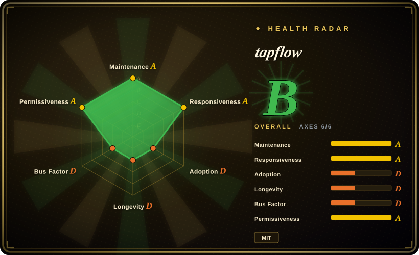
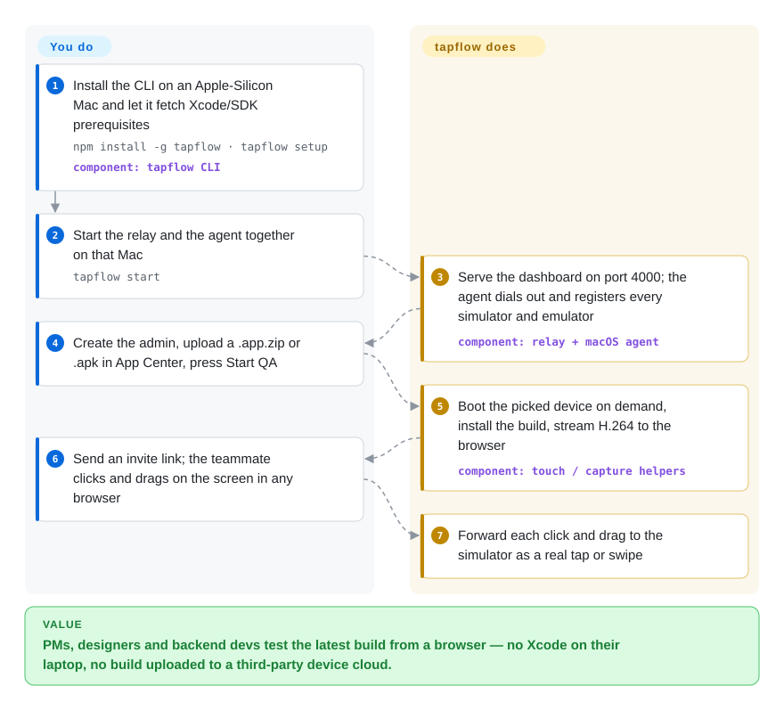

# tapflow

Every time the PM, a designer or a backend developer wants to check the latest mobile build, they ping the one person with Xcode — or you pay Appetize/BrowserStack and upload internal builds to their cloud. tapflow turns the Macs you already own into a shared, self-hosted simulator pool: the Mac runs the iOS Simulator / Android emulator and streams it into any teammate's browser, where clicks become taps.

## When to use

You lead a small mobile team. Every sprint, someone on Slack asks "how do I install the sandbox build to check what was deployed?", the designer wants the layout on an iPhone SE *and* a Pro Max, and the answer is always "come to my desk" — because only the two iOS developers have Xcode and a simulator runtime. A hosted simulator cloud would solve access, but it bills per minute and your compliance lead does not want pre-release `.app` builds leaving the company. You have a spare Apple-Silicon Mac mini in the office.

That is the moment for tapflow: `npm install -g tapflow`, `tapflow setup`, `tapflow start` on the Mac mini, and the team gets a browser dashboard with an App Center (upload `.app.zip` / `.apk`, track review status), per-build QA sessions, recordings, device audio, clipboard sync and an offline toggle — with builds, streams and accounts staying on the relay you host. Pick it over [baguette](baguette.md) when the audience is *people* (invites, roles, a build list) rather than a script; pick it over a hosted device cloud when data residency and cost beat breadth of real devices. It also exposes the same sessions to CI and coding agents through a REST screenshot endpoint and an experimental MCP server, but that is a bonus, not the reason to pick it.

## How it works

tapflow is three pieces. A **relay** (a Node.js server, Linux or Mac, also available as a Docker image) holds accounts in SQLite, stores uploaded builds and recordings, and serves the dashboard on one port. A **macOS agent** runs on each Mac with simulators and connects *outward* to the relay — like a phone calling in rather than waiting to be called, so no firewall ports open. On iOS it talks to Xcode's private SimulatorKit framework directly (small Swift helpers inject touches and grab frames without WebDriverAgent, Apple's usual test-automation server); on Android it drives the emulator through `adb`, the bundled `scrcpy-server` and the emulator's gRPC control port. The **browser dashboard** decodes the H.264 video stream with WebCodecs, or a WASM decoder on plain HTTP, and falls back to JPEG frames on old browsers. What you do: install on a Mac, create the admin account, upload builds, invite people. What tapflow does: boot devices on demand, install the build, stream the screen and audio, and turn every click into a tap on the device.

<!-- flow-steps:begin (generated from flows/tapflow.json by tools/flow_card.py — do not edit) -->

Text version of the flow

1. **You**: Install the CLI on an Apple-Silicon Mac and let it fetch Xcode/SDK prerequisites — `npm install -g tapflow · tapflow setup` — component: `tapflow CLI`
2. **You**: Start the relay and the agent together on that Mac — `tapflow start`
3. **tapflow**: Serve the dashboard on port 4000; the agent dials out and registers every simulator and emulator — component: `relay + macOS agent`
4. **You**: Create the admin, upload a .app.zip or .apk in App Center, press Start QA
5. **tapflow**: Boot the picked device on demand, install the build, stream H.264 to the browser — component: `touch / capture helpers`
6. **You**: Send an invite link; the teammate clicks and drags on the screen in any browser
7. **tapflow**: Forward each click and drag to the simulator as a real tap or swipe

**Value**: PMs, designers and backend devs test the latest build from a browser — no Xcode on their laptop, no build uploaded to a third-party device cloud.

<!-- flow-steps:end -->

## When NOT to use

- **You need real devices** — OEM Android skins, real cameras/Bluetooth/push on a physical iPhone, `.ipa` installs. tapflow only runs simulators and emulators (it rejects `.ipa`). Use `DeviceFarmer/stf` for an in-house Android real-device farm, or a hosted device cloud (BrowserStack App Live) for real iPhones.
- **Your agent machines are Intel Macs, or you cannot keep Macs on macOS/Xcode 26–27.** The agent ships arm64-only native helpers (issue #464, open) and only Xcode 26/27 are verified; the iOS path uses reverse-engineered private SimulatorKit symbols, so a new Xcode can break touch or capture until tapflow catches up. If you cannot pin OS and Xcode, a hosted simulator cloud such as Appetize absorbs that churn for you.
- **Your devices and viewers are on different networks with no VPN.** Agents must share the relay's LAN (wired recommended); outside access goes through Tailscale (whose free plan is non-commercial) or a VPS + rathole tunnel you run. For a distributed team without that plumbing, a hosted service is less work.
- **You want an automated test framework, not a manual-QA surface.** The flow runner and MCP server are labelled experimental, and Flow Capture (recording a manual session as a test) is not built yet (ROADMAP). For CI E2E suites use [Maestro](maestro.md) or [Appium](appium.md).
- **You only need to drive one simulator from a script on your own machine.** Running a relay, accounts and tokens is overhead; [baguette](baguette.md) or [AXe](axe.md) give you a single CLI for input and capture.
- **You only need Android in a browser.** `NetrisTV/ws-scrcpy` streams an Android device to a web page with far less machinery; tapflow's value is iOS plus a team workflow.
- **You need a vendor with an SLA or a multi-maintainer project.** One maintainer wrote ~2,300 of the commits, in under five months; there is no company or foundation behind it.

## Comparison

| Alternative | In index | Our verdict | Tradeoff |
|---|---|---|---|
| Appetize.io | not a repo | Pick Appetize when you want zero hardware and zero ops for browser-based simulator access; pick tapflow when builds must stay in-house and you already own Apple-Silicon Macs. | Hosted SaaS (not a repository): no Mac to maintain and no Xcode pinning, but per-minute billing and every build is uploaded to a third party. |
| BrowserStack App Live | not a repo | Pick BrowserStack when you must test on real, varied physical devices; pick tapflow when simulator/emulator coverage is enough and you want no recurring spend. | Commercial device cloud (not a repository): thousands of real devices and an SLA, at a subscription price and with builds leaving your network. |
| [baguette](baguette.md) | ✅ | Pick baguette when one developer or script needs headless iOS-simulator input and streaming; pick tapflow when a whole team needs accounts, a build list and Android too. | baguette is a single Swift CLI with a local web UI and no accounts; tapflow adds relay, auth, App Center and Android at the cost of running a server. Both ride private SimulatorKit symbols. |
| `DeviceFarmer/stf` | not indexed | Pick STF when your QA runs on a rack of physical Android phones; pick tapflow when you need iOS and are fine with simulators. | Mature browser control of real Android devices, but Android-only and a heavier deployment. Not added in this tab-intake batch. |
| `NetrisTV/ws-scrcpy` | not indexed | Pick ws-scrcpy when you only need to see and touch one Android device in a browser; pick tapflow when you need iOS, builds and team roles. | A lightweight scrcpy web client with no build or user management, and Android only. Not added in this tab-intake batch. |

## Tech stack

- **Language / layout:** TypeScript pnpm monorepo on Node.js ≥ 22 — `cli` (npm package `tapflow`), `relay`, `dashboard`, `agent-core`, `ios-agent`, `android-agent`, `flow-runner`, `mcp-server`, `protocol` (as of v0.26.1).
- **Relay:** `ws` WebSockets, `better-sqlite3` for accounts and team data, `jsonwebtoken` auth, `busboy` uploads, `acme-client` for HTTPS certificates, `nodemailer`, `zod`.
- **Dashboard:** React + React Router, Radix UI, TanStack Query, visx charts; `tinyh264` as the WASM H.264 decoder next to browser WebCodecs.
- **iOS agent:** Swift helpers (`touch-helper`, `screencapture-helper`, keyboard/rotation) that load Xcode's private SimulatorKit and read frames from IOSurface via VideoToolbox; `xcrun simctl`; a Swift macOS network extension for the offline toggle; logic partly derived from baguette (Apache-2.0, per NOTICE).
- **Android agent:** `adb`, a bundled `scrcpy-server` (Apache-2.0), the emulator's gRPC controller proto.
- **Automation:** `@tapflowio/mcp-server` on `@modelcontextprotocol/sdk`; a YAML flow runner that writes JUnit reports.

## Dependencies

- **Relay host:** Node.js ≥ 22 on Linux or macOS (~512 MB RAM, 1 vCPU per the docs), or the `tapflow/tapflow` Docker image with a persistent data volume holding the SQLite DB and signing secret.
- **Each agent Mac:** Apple Silicon; macOS 26 or 27 with Xcode 26 or 27 and an iOS Simulator runtime for iOS; Java + Android SDK with an `arm64-v8a` AVD for Android. `tapflow setup` installs these, including Homebrew and a JDK, and asks for sudo.
- **macOS permissions:** audio-recording permission for device sound; approval of a system network extension for iOS network control (everything else works without it).
- **Network:** agents on the relay's LAN; for off-site viewers, Tailscale or a VPS + rathole tunnel, plus optional HTTPS for the higher-resolution stream.
- **Browsers:** any modern browser; nothing installed on the tester's side.

## Ops difficulty

**Medium.** A single-Mac trial is three commands and runs locally. A team deployment means an always-on relay (PM2 or Docker, a pinned `JWT_SECRET`, backups of the SQLite volume), one agent per Mac with an `agent`-scope token, and a tunnel or reverse proxy for anyone off the LAN. The continuing cost is version lock: each Mac has to stay on a verified macOS/Xcode pair, a new Xcode can break the private-API iOS path, and each Mac holds only about 2–4 running simulators, so capacity planning means adding Macs. Releases ship every few days, so pin a version and read the changelog before upgrading.

## Health & viability

- **Maintenance (2026-09-28).** Very active: last push 2026-09-28; 15 releases from v0.14.0 (2026-07-08) to v0.26.1 (2026-09-27), several a week recently. The README promises backward compatibility by default within v0.x, while ROADMAP.md says breaking changes may appear in minor versions until v1.0.0.
- **Governance / bus factor.** A personal-account project: `jo-duchan` has 2,297 commits; the next contributor has 19. Contributors are many but drive-by (the repo is tagged `good-first-issue`). Bus factor is effectively one. The repo ships a `.claude/` directory of agent commands and hooks, and contributor notes on adversarial review. [推断] Most development is agent-assisted, which explains the commit volume.
- **Backing & longevity.** No company or foundation; a docs site at tapflow.dev and a Docker Hub org. Created 2026-05-07, under five months old, so the **Lindy** prior gives it little credit — it is young and fast-moving, not proven durable.
- **Adoption.** ~770 stars and 87 forks, but only 8 watchers (2026-09-28); npm `tapflow` had 1,236 downloads in the last month per the health snapshot (1,554 in the npm 2026-08-28..09-26 window); Docker Hub `tapflow/tapflow` shows 18,285 pulls. Modest but real usage. No named production adopters found.
- **Risk flags.** MIT license, with Apache-2.0 notices for baguette-derived logic and bundled scrcpy-server. The technical risk is dependence on Apple's private SimulatorKit (Xcode 27 already moved the binary) and on a network extension signed with the maintainer's Developer ID — issue #670 asks what happens if that certificate is revoked, and #676 notes its XPC listener does not validate the connecting process (both open).

## Caveats (unverified)

- [未验证] Star, fork, watcher, download and pull counts are as of 2026-09-28 and change quickly; the 770-stars-vs-8-watchers ratio is atypical and I found no source explaining it.
- [未验证] Streaming latency (p50 ~11–17 ms decode-to-present) and ~30 fps come from the project's own streaming latency log; not reproduced here.
- [推断] "Most development is agent-assisted" is inferred from the `.claude/` harness and ~2,300 single-author commits in under five months, not stated by the maintainer.
- [未验证] Behaviour on future Xcode releases (28+): the docs say support is top priority but promise no timeline, and breakage of the private-API path cannot be predicted from the repo.
- [未验证] The "2–4 simulators per Mac" capacity figure is the docs' rule of thumb, depending on RAM; not measured.
- [未验证] Whether the Docker Hub pull count reflects distinct users or CI re-pulls.
