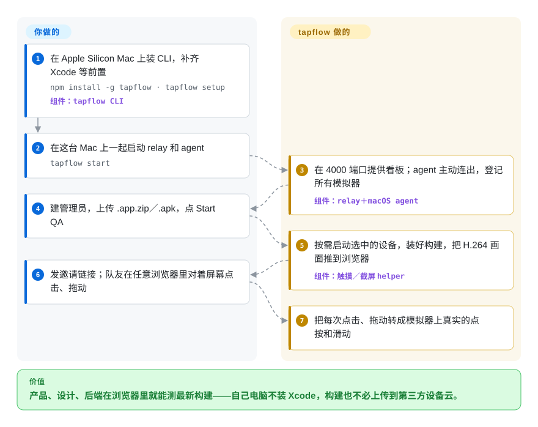

# tapflow

产品、设计、后端每次想看一眼最新的手机构建，都得去找那个装了 Xcode 的同事；要么就给 Appetize／BrowserStack 付钱，把内部构建传到人家云上。tapflow 把你手里现成的 Mac 变成团队共用、自己托管的模拟器池：Mac 跑 iOS 模拟器／Android 模拟器，画面推到队友的浏览器里，鼠标一点就是一次点按。

## 何时使用

你带一个小移动端团队。每个迭代都有人在群里问“沙箱构建怎么装，我想看看上线的是啥”，设计要同时看 iPhone SE 和 Pro Max 上的排版，而答案永远是“来我工位”——因为只有两个 iOS 开发装了 Xcode 和模拟器运行时。托管的模拟器云能解决访问问题，但按分钟计费，合规负责人也不想让未发布的 `.app` 构建离开公司。办公室里正好有一台闲着的 Apple Silicon Mac mini。

这就是用 tapflow 的时机：在 Mac mini 上 `npm install -g tapflow`、`tapflow setup`、`tapflow start`，团队就有了一个浏览器看板——App Center（上传 `.app.zip`／`.apk`，跟踪评审状态）、按构建开 QA 会话、录屏、设备声音、双向剪贴板、一键断网——构建、画面和账号都留在你自己托管的 relay 上。受众是“人”（邀请、角色、构建列表）而不是脚本时，选它而不是 [baguette](baguette.zh.md)；数据不出公司和成本比真机覆盖面更重要时，选它而不是托管设备云。它还通过 REST 截图接口和实验性的 MCP 服务器把同一批会话开放给 CI 和编码 agent，但那是附赠，不是选它的理由。

## 怎么用起来

tapflow 分三块。**relay** 是一个 Node.js 服务（Linux 或 Mac 均可，也有 Docker 镜像），用 SQLite 存账号，保存上传的构建和录屏，并在同一个端口上提供看板。**macOS agent** 跑在每台有模拟器的 Mac 上，主动向外连 relay——像手机主动打进来，而不是等别人打过去，所以防火墙不用开端口。iOS 这边它直接调用 Xcode 的私有框架 SimulatorKit（几个 Swift 小程序负责注入触摸、抓帧，不需要 WebDriverAgent，也就是苹果生态常用的那个测试自动化服务）；Android 这边通过 `adb`、打包进来的 `scrcpy-server` 和模拟器的 gRPC 控制端口来驱动。**浏览器看板**用 WebCodecs 解码 H.264 视频流，纯 HTTP 下改用 WASM 解码器，老浏览器再退到 JPEG 帧。你做的：在 Mac 上安装、建管理员账号、上传构建、邀请人。tapflow 做的：按需启动设备、装好构建、推送画面和声音，并把每次点击变成设备上的点按。

<!-- flow-steps:begin (generated from flows/tapflow.json by tools/flow_card.py — do not edit) -->

流程文字版

1. **你**：在 Apple Silicon Mac 上装 CLI，补齐 Xcode 等前置 — `npm install -g tapflow · tapflow setup` — 组件：`tapflow CLI`
2. **你**：在这台 Mac 上一起启动 relay 和 agent — `tapflow start`
3. **tapflow**：在 4000 端口提供看板；agent 主动连出，登记所有模拟器 — 组件：`relay＋macOS agent`
4. **你**：建管理员，上传 .app.zip／.apk，点 Start QA
5. **tapflow**：按需启动选中的设备，装好构建，把 H.264 画面推到浏览器 — 组件：`触摸／截屏 helper`
6. **你**：发邀请链接；队友在任意浏览器里对着屏幕点击、拖动
7. **tapflow**：把每次点击、拖动转成模拟器上真实的点按和滑动

**价值**：产品、设计、后端在浏览器里就能测最新构建——自己电脑不装 Xcode，构建也不必上传到第三方设备云。

<!-- flow-steps:end -->

## 何时不用

- **你需要真机**——各家 Android 定制系统、真实摄像头／蓝牙／推送、装 `.ipa`。tapflow 只跑模拟器（上传 `.ipa` 会被拒）。自建 Android 真机农场用 `DeviceFarmer/stf`，要真 iPhone 就用托管设备云（BrowserStack App Live）。
- **跑 agent 的是 Intel Mac，或者你没法把 Mac 固定在 macOS／Xcode 26–27。** agent 自带的原生 helper 只有 arm64 版本（issue #464 仍开着），经过验证的也只有 Xcode 26／27；iOS 通路用的是逆向出来的 SimulatorKit 私有符号，新版 Xcode 可能让触摸或截屏失效，直到 tapflow 跟上。无法锁定系统和 Xcode 版本时，托管模拟器云（如 Appetize）替你吸收这些变动。
- **设备和看的人不在同一张网，又没有 VPN。** agent 必须和 relay 在同一局域网（推荐有线）；外部访问要走 Tailscale（免费版限非商业用途）或你自己维护的 VPS＋rathole 隧道。分散办公又不想搭这些的团队，托管服务更省事。
- **你要的是自动化测试框架，不是人工 QA 界面。** flow runner 和 MCP 服务器都标着实验性，把人工操作录成测试的 Flow Capture 还没做（见 ROADMAP）。CI 里的端到端测试用 [Maestro](maestro.zh.md) 或 [Appium](appium.zh.md)。
- **你只想在自己电脑上用脚本驱动一台模拟器。** 跑 relay、账号和 token 纯属额外负担；[baguette](baguette.zh.md) 或 [AXe](axe.zh.md) 一个 CLI 就能完成输入和截屏。
- **你只需要在浏览器里看 Android。** `NetrisTV/ws-scrcpy` 用少得多的部件就能把一台 Android 设备推到网页上；tapflow 的价值在于 iOS 加上团队流程。
- **你需要有 SLA 的供应商，或多人维护的项目。** 约 2,300 次提交几乎出自一位维护者之手，时间不到五个月；背后没有公司或基金会。

## 横向对比

| 替代品 | 是否收录 | 我们的评价 | 取舍 |
|---|---|---|---|
| Appetize.io | 非仓库 | 想零硬件、零运维地在浏览器里用模拟器，选 Appetize；构建必须留在公司、手里又有 Apple Silicon Mac，选 tapflow。 | 托管 SaaS（不是仓库）：不用维护 Mac、不用锁 Xcode 版本，但按分钟计费，每个构建都要传给第三方。 |
| BrowserStack App Live | 非仓库 | 必须在多种真实设备上测，选 BrowserStack；模拟器覆盖就够、又不想有持续开销，选 tapflow。 | 商业设备云（不是仓库）：成千上万台真机加 SLA，代价是订阅费，而且构建要离开你的网络。 |
| [baguette](baguette.zh.md) | ✅ | 一个开发者或一段脚本要无头控制 iOS 模拟器并投屏，选 baguette；整个团队要账号、构建列表，还要 Android，选 tapflow。 | baguette 是单个 Swift CLI，带本地网页、没有账号体系；tapflow 多了 relay、鉴权、App Center 和 Android，代价是要运行一个服务。两者都依赖 SimulatorKit 私有符号。 |
| `DeviceFarmer/stf` | 未收录 | QA 跑在一排 Android 真机上，选 STF；需要 iOS、又接受用模拟器，选 tapflow。 | 在浏览器里控制 Android 真机的成熟方案，但只支持 Android，部署也更重。本次标签页收录批次未添加。 |
| `NetrisTV/ws-scrcpy` | 未收录 | 只要在浏览器里看、点一台 Android 设备，选 ws-scrcpy；需要 iOS、构建管理和团队角色，选 tapflow。 | 轻量的 scrcpy 网页客户端，没有构建和用户管理，且只支持 Android。本次标签页收录批次未添加。 |

## 技术栈

- **语言与结构：** 基于 Node.js ≥ 22 的 TypeScript pnpm monorepo——`cli`（npm 包名 `tapflow`）、`relay`、`dashboard`、`agent-core`、`ios-agent`、`android-agent`、`flow-runner`、`mcp-server`、`protocol`（截至 v0.26.1）。
- **relay：** `ws` 做 WebSocket，`better-sqlite3` 存账号与团队数据，`jsonwebtoken` 鉴权，`busboy` 处理上传，`acme-client` 申请 HTTPS 证书，另有 `nodemailer`、`zod`。
- **看板：** React＋React Router、Radix UI、TanStack Query、visx 图表；浏览器 WebCodecs 之外，用 `tinyh264` 作为 WASM H.264 解码器。
- **iOS agent：** Swift helper（`touch-helper`、`screencapture-helper`、键盘／旋转），加载 Xcode 私有的 SimulatorKit，经 VideoToolbox 从 IOSurface 读帧；`xcrun simctl`；一个 Swift 写的 macOS 网络扩展负责断网开关；部分逻辑源自 baguette（Apache-2.0，见 NOTICE）。
- **Android agent：** `adb`、打包进来的 `scrcpy-server`（Apache-2.0）、模拟器的 gRPC controller proto。
- **自动化：** 基于 `@modelcontextprotocol/sdk` 的 `@tapflowio/mcp-server`；输出 JUnit 报告的 YAML flow runner。

## 依赖

- **relay 主机：** Linux 或 macOS 上的 Node.js ≥ 22（文档称约 512 MB 内存、1 个 vCPU 即可），或者 `tapflow/tapflow` Docker 镜像，外加一个持久化数据卷（存 SQLite 库和签名密钥）。
- **每台 agent Mac：** Apple Silicon；iOS 需 macOS 26 或 27、Xcode 26 或 27 及 iOS 模拟器运行时；Android 需 Java＋Android SDK 和一个 `arm64-v8a` 的 AVD。`tapflow setup` 会装好这些，包括 Homebrew 和 JDK，过程中会要 sudo。
- **macOS 权限：** 设备声音需要录音权限；iOS 断网功能需要批准一个系统网络扩展（不批准也不影响其他功能）。
- **网络：** agent 与 relay 同一局域网；场外访问需 Tailscale 或 VPS＋rathole 隧道，想要更高分辨率的画面还得配 HTTPS。
- **浏览器：** 任意现代浏览器；测试者那边什么都不用装。

## 运维难度

**中等。** 单台 Mac 试用只要三条命令，全在本地跑。团队部署则需要一个常驻 relay（PM2 或 Docker、固定 `JWT_SECRET`、备份 SQLite 数据卷），每台 Mac 一个带 `agent` 权限 token 的 agent，再给局域网外的人配隧道或反向代理。长期成本在版本锁定：每台 Mac 都得停在验证过的 macOS／Xcode 组合上，新版 Xcode 可能让 iOS 的私有 API 通路失效；每台 Mac 大约只能同时跑 2–4 个模拟器，扩容就是加 Mac。发版间隔只有几天，所以要锁版本，升级前先读 changelog。

## 健康度与可持续性

- **维护（2026-09-28）。** 非常活跃：最后推送 2026-09-28；从 v0.14.0（2026-07-08）到 v0.26.1（2026-09-27）共 15 个版本，最近一周好几个。README 承诺 v0.x 内默认向后兼容，ROADMAP.md 却写着 v1.0.0 之前次版本号也可能有破坏性变更。
- **治理与巴士因子。** 个人账号项目：`jo-duchan` 有 2,297 次提交，第二名只有 19 次。贡献者不少但都是零星参与（仓库打了 `good-first-issue` 标签）。巴士因子实际为一。仓库里带着一个 `.claude/` 目录（agent 命令和 hook），以及关于对抗式评审的贡献者笔记。[推断] 大部分开发由 agent 辅助完成，这也解释了提交量。
- **背景与长期性。** 没有公司或基金会；有文档站 tapflow.dev 和一个 Docker Hub 组织。创建于 2026-05-07，不到五个月，**Lindy** 先验几乎不给它加分——它年轻、迭代快，还谈不上经过时间检验。
- **采用度。** 约 770 star、87 fork，但只有 8 个 watcher（2026-09-28）；npm 包 `tapflow` 按健康度快照近一个月下载 1,236 次（npm 2026-08-28 至 09-26 窗口为 1,554 次）；Docker Hub `tapflow/tapflow` 显示 18,285 次拉取。用量不大但真实存在。没找到公开的生产用户。
- **风险信号。** MIT 许可，另有 baguette 衍生逻辑和打包的 scrcpy-server 的 Apache-2.0 声明。技术风险在于依赖苹果私有的 SimulatorKit（Xcode 27 已经挪过一次二进制位置），以及一个用维护者本人 Developer ID 签名的网络扩展——issue #670 在问证书被吊销怎么办，#676 指出它的 XPC 监听不校验连接进程（两者都未关闭）。

## 存疑（未验证）

- [未验证] star、fork、watcher、下载量和拉取量都是 2026-09-28 的数字，变化很快；770 star 对 8 个 watcher 的比例不寻常，没找到解释它的来源。
- [未验证] 串流延迟（解码到呈现 p50 约 11–17 ms）和约 30 fps 来自项目自己的延迟测量记录，本页没有复现。
- [推断] “大部分开发由 agent 辅助”是从 `.claude/` 目录和不到五个月里约 2,300 次单人提交推出来的，维护者没有明说。
- [未验证] 未来 Xcode（28 及以后）上的表现：文档说支持新版本是最高优先级，但没给时间表；私有 API 通路会不会坏，从仓库里无法预测。
- [未验证] “每台 Mac 2–4 个模拟器”是文档按内存给的经验值，没有实测。
- [未验证] Docker Hub 拉取量代表的是独立用户还是 CI 反复拉取，无法区分。
