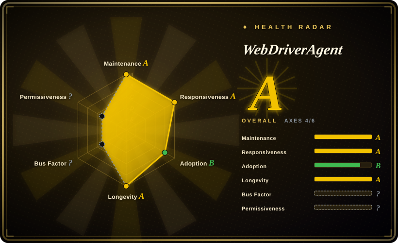
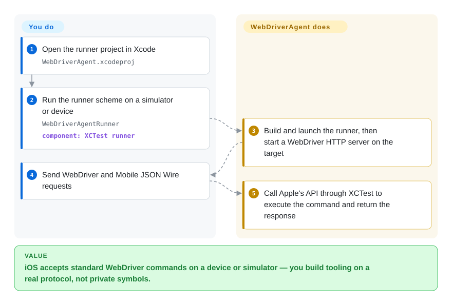

# WebDriverAgent

You want iOS to accept standard WebDriver commands — launch this app, tap this view, tell me if it's on screen — the same way a browser accepts Selenium, and you're building the tooling that does the asking. WebDriverAgent is that server: it links Apple's `XCTest` framework and turns WebDriver requests into real on-device actions, and it is the engine Appium's iOS driver runs underneath.

## When to use

You're **building the automation layer**, not consuming one: writing or extending an iOS driver, wiring a custom CI runner, or debugging why [Appium](appium.md)'s XCUITest sessions misbehave on a particular device — in which case you need to understand and sometimes run the engine directly. WebDriverAgent exposes a WebDriver server on the target, backed by `XCTest`, so any client that speaks the protocol can drive an iOS or tvOS device or simulator without going through Appium at all.

For everyone else this is a **transitive dependency**: install Appium's XCUITest driver and WebDriverAgent gets built and launched for you. Reach for it directly only when the protocol endpoint itself is what you need, and you can carry the Xcode/signing burden that comes with it.

## Q&A

**Do I install WebDriverAgent myself to run Appium tests?**
Usually no. Appium's XCUITest driver ships and runs it (the npm package is `appium-webdriveragent`); most teams never open this repo.

**What can it do that the host-HID tools cannot?**
It runs a real WebDriver server on the device via `XCTest`, giving you app launch/kill, element queries and view assertions through a standard protocol — not just coordinate injection.

**Which platforms?**
iOS and tvOS, devices and simulators. Not Android and not macOS (there, Appium's Mac2 driver is the equivalent).

## How it works

WebDriverAgent is an `XCTest`-based runner plus a WebDriver server. You build the runner into the target (opening `WebDriverAgent.xcodeproj` and running the `WebDriverAgentRunner` scheme is the documented path), and it starts an HTTP server on the device or simulator. From then on it is a protocol endpoint: you send W3C WebDriver and Mobile JSON Wire requests, the runner calls Apple's API through `XCTest` to execute them — launch an app, find elements, tap, scroll, read the accessibility tree — and returns the response. The division of labor is the whole idea: **you** (or your driver) speak the protocol and own the test logic; **WebDriverAgent** owns the on-device execution via Apple's supported automation framework, which is why it is more durable than tools that ride private simulator symbols.

<!-- flow-steps:begin (generated from flows/webdriveragent.json by tools/flow_card.py — do not edit) -->

Text version of the flow

1. **You**: Open the runner project in Xcode — `WebDriverAgent.xcodeproj`
2. **You**: Run the runner scheme on a simulator or device — `WebDriverAgentRunner` — component: `XCTest runner`
3. **WebDriverAgent**: Build and launch the runner, then start a WebDriver HTTP server on the target
4. **You**: Send WebDriver and Mobile JSON Wire requests
5. **WebDriverAgent**: Call Apple's API through XCTest to execute the command and return the response

**Value**: iOS accepts standard WebDriver commands on a device or simulator — you build tooling on a real protocol, not private symbols.

<!-- flow-steps:end -->

## When NOT to use

- **You just want mobile E2E tests.** Do not drive WebDriverAgent by hand — use [Appium](appium.md) (which runs it for you) or [Maestro](maestro.md). Writing your own client around a raw WebDriver server is building a test framework you did not mean to build.
- **You want host-side input without instrumenting the app.** WebDriverAgent installs and runs a test runner on the target; if all you need is coordinate taps, the simulator-only [`baguette`](baguette.md) / [`AXe`](axe.md) or the device-capable [`idb`](idb.md) inject from the host instead.
- **You need Android or cross-platform coverage.** It is Apple-only; use [Appium](appium.md) or [Maestro](maestro.md) with the platform drivers.
- **You cannot manage Xcode projects and code signing.** Building the runner requires an Xcode project and a signing identity; that overhead is exactly why Appium wraps it.
- **You need macOS app automation.** Use Appium's Mac2 driver, not WebDriverAgent.

## Comparison

| Alternative | In index | Our verdict | Tradeoff |
|---|---|---|---|
| [`Appium`](appium.md) | ✅ | Pick Appium for any real testing need — it drives WebDriverAgent for you and adds the protocol translation, clients and cross-platform story; pick WebDriverAgent directly only when you are building that layer. | Appium is a server plus drivers, but you stop maintaining a test runner yourself; WebDriverAgent alone leaves you to write the client and runner. |
| [`idb`](idb.md) | ✅ | Pick idb when you want granular host-side primitives on simulators and devices without an on-device test runner; pick WebDriverAgent when you need a standard in-app WebDriver endpoint. | idb injects from the host and reaches devices, but it rides private frameworks and carries iOS-26 regressions; WebDriverAgent uses Apple's supported `XCTest` path. |
| [`AXe`](axe.md) | ✅ | Pick AXe for a minimal local simulator input CLI; pick WebDriverAgent only when the deliverable is the automation engine itself. | AXe is far simpler but single-maintainer and quiet since 2026-07; WebDriverAgent is a component with no standalone UX. |
| `XCUITest` | 非仓库 | Pick native `XCUITest` when you want Apple's first-party framework with no third-party server; pick WebDriverAgent when you specifically need the WebDriver/JSON-Wire protocol surface. | `XCUITest` is first-party and durable but Apple-only and Swift/Xcode-bound; WebDriverAgent is the protocol layer built on top of it. |

## Tech stack

- **Language:** Objective-C (originally Facebook's, now under the appium org).
- **Runtime:** links Apple's `XCTest.framework`; builds a runner bundle (`WebDriverAgentRunner`).
- **Protocols:** W3C WebDriver, Mobile JSON Wire Protocol.
- **Packaging:** published to npm as `appium-webdriveragent` for Appium's XCUITest driver to consume.

## Dependencies

- **Host:** macOS with **Xcode** (the project is opened/built in Xcode); Node.js for the bundling scripts.
- **Target:** an iOS/tvOS simulator or a device, with a signing identity for device builds.
- **Consumers:** normally depends on [Appium](appium.md)'s XCUITest driver rather than a human.
- **External services:** none.

## Ops difficulty

**High if run directly, invisible if consumed via Appium.** On its own it means maintaining an Xcode project, a signing identity, and a runner bundle per target — real iOS build engineering. Wrapped by Appium, all of that is automated away and the operational cost moves to Appium. Its `semantic-release` automation produces very frequent versions (v16.12.10 in 2026-09), so anything that pins it must track Appium's compatibility expectations.

## Health & viability

- **Maintenance (2026-09).** Very active: v16.12.9 (2026-09-19) → v16.12.10 (2026-09-21); releases are automated and frequent; last push 2026-09-21.
- **Governance / bus factor.** Under the **appium** organization (part of the OpenJS ecosystem), with a sustained contributor roster (`mykola-mokhnach` ~435 commits, `KazuCocoa` ~248) rather than one person.
- **Backing & longevity.** Descended from Facebook's original WebDriverAgent (2015) and maintained under Appium since 2017 — a long, still-active lineage ⇒ a solid **Lindy** signal, reinforced by Appium's foundation backing.
- **Adoption.** ~1.8k stars, 642 forks — modest as a standalone repo, but its real adoption is **transitive**: effectively every Appium iOS session in the world runs it.
- **Risk flags.** No standalone UX (it is a component); Xcode/signing burden for direct use; version compatibility is effectively tied to Appium's XCUITest driver.

## Caveats (unverified)

- [未验证] Star/fork/watcher/issue counts (~1794/642/49/46) are as of 2026-09-24 and date-sensitive.
- [未验证] The GitHub API reports the license as `NOASSERTION`; I read `LICENSE` and it is a BSD 3-clause text with a Facebook non-endorsement clause — recorded here as `BSD-3-Clause`.
- [推断] "Part of the OpenJS ecosystem" is inferred from Appium's foundation status; WebDriverAgent itself has no separate governance document that I read.
- [未验证] The exact WebDriver/JSON-Wire command coverage at the version you pin; the README points at the wiki for query details, which I did not read in full.
- [未验证] How much of Facebook's original codebase remains after years of Appium maintenance — not measured.
