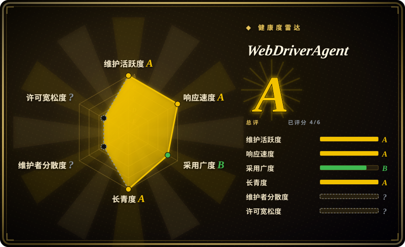
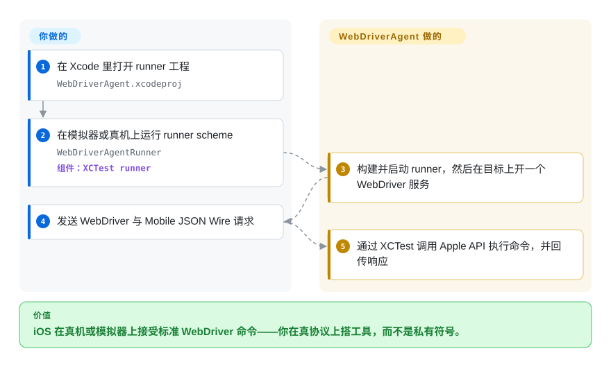

# WebDriverAgent

你想让 iOS 像浏览器接受 Selenium 那样接受标准 WebDriver 命令——启动这个 app、点这个视图、告诉我它在不在屏幕上——而你就是负责「发问」的那层工具的作者。WebDriverAgent 就是这个服务端：它链接 Apple 的 `XCTest` 框架，把 WebDriver 请求变成真机上的真实动作，也正是 Appium iOS 驱动底下跑的那个引擎。

## 何时使用

你在**造自动化底层**，而不是在用现成工具：写或扩展一个 iOS 驱动、接一套自定义 CI runner，或者排查 [Appium](appium.zh.md) 的 XCUITest 会话在某台设备上为什么不对——这时你需要理解、有时还要亲手跑这个引擎。WebDriverAgent 在目标上暴露一个由 `XCTest` 支撑的 WebDriver 服务端，于是任何会说该协议的客户端都能驱动 iOS／tvOS 真机或模拟器，完全不经过 Appium。

对其他人来说它是**传递依赖**：装上 Appium 的 XCUITest 驱动，WebDriverAgent 会被自动构建并启动。只有当你需要的就是那个协议端点本身、并且能扛住随之而来的 Xcode／签名负担时，才直接用它。

## 快问快答

**跑 Appium 测试需要自己装 WebDriverAgent 吗？**
一般不用。Appium 的 XCUITest 驱动会自带并运行它（npm 包名 `appium-webdriveragent`）；多数团队从没打开过这个仓库。

**它能做宿主 HID 工具做不到的什么？**
它通过 `XCTest` 在设备上跑一个真正的 WebDriver 服务端，用标准协议提供 app 启动／结束、元素查询与视图断言——不只是坐标注入。

**支持哪些平台？**
iOS 与 tvOS，真机和模拟器都行。不支持 Android，也不支持 macOS（那边对应的是 Appium 的 Mac2 驱动）。

## 怎么用起来

WebDriverAgent 是一个基于 `XCTest` 的 runner 加一个 WebDriver 服务端。你把 runner 构建到目标上（文档路径是打开 `WebDriverAgent.xcodeproj`、运行 `WebDriverAgentRunner` scheme），它会在真机或模拟器上启动一个 HTTP 服务。此后它就是一个协议端点：你发 W3C WebDriver 与 Mobile JSON Wire 请求，runner 通过 `XCTest` 调 Apple API 执行——启动 app、找元素、点击、滚动、读无障碍树——再返回响应。分工就是全部要点：**你**（或你的驱动）说协议、拥有测试逻辑；**WebDriverAgent** 拥有通过 Apple 官方自动化框架完成的端上执行——这也是它比骑私有模拟器符号的工具更耐久的原因。

<!-- flow-steps:begin (generated from flows/webdriveragent.json by tools/flow_card.py — do not edit) -->

流程文字版

1. **你**：在 Xcode 里打开 runner 工程 — `WebDriverAgent.xcodeproj`
2. **你**：在模拟器或真机上运行 runner scheme — `WebDriverAgentRunner` — 组件：`XCTest runner`
3. **WebDriverAgent**：构建并启动 runner，然后在目标上开一个 WebDriver 服务
4. **你**：发送 WebDriver 与 Mobile JSON Wire 请求
5. **WebDriverAgent**：通过 XCTest 调用 Apple API 执行命令，并回传响应

**价值**：iOS 在真机或模拟器上接受标准 WebDriver 命令——你在真协议上搭工具，而不是私有符号。

<!-- flow-steps:end -->

## 何时不用

- **你只是想做移动端到端测试。** 别手搓 WebDriverAgent——用 [Appium](appium.zh.md)（它替你跑）或 [Maestro](maestro.zh.md)。围绕一个裸 WebDriver 服务端自己写客户端，等于在造一个你本来没打算造的测试框架。
- **你想从宿主机注入输入、又不想动被测 app。** WebDriverAgent 会在目标上装并跑一个测试 runner；只需要坐标点击的话，纯模拟器的 [`baguette`](baguette.zh.md)／[`AXe`](axe.zh.md) 或能覆盖真机的 [`idb`](idb.zh.md) 从宿主机注入。
- **你需要 Android 或跨平台覆盖。** 它只支持 Apple；用 [Appium](appium.zh.md) 或 [Maestro](maestro.zh.md) 配各平台驱动。
- **你搞不定 Xcode 工程和代码签名。** 构建 runner 需要一个 Xcode 工程和一个签名身份；这份麻烦正是 Appium 要把它包起来的原因。
- **你要自动化 macOS 应用。** 用 Appium 的 Mac2 驱动，而不是 WebDriverAgent。

## 横向对比

| 替代品 | 是否收录 | 我们的评价 | 取舍 |
|---|---|---|---|
| [`Appium`](appium.zh.md) | ✅ | 任何真实的测试需求都选 Appium——它替你驱动 WebDriverAgent，还加上协议翻译、客户端和跨平台能力；只有当你在造那一层时才直接选 WebDriverAgent。 | Appium 是一个服务端加驱动，但你不用自己维护测试 runner；单用 WebDriverAgent 则要自己写客户端和 runner。 |
| [`idb`](idb.zh.md) | ✅ | 想在模拟器和真机上拿宿主机侧的细粒度原语、又不装端上测试 runner 时选 idb；需要标准的 app 内 WebDriver 端点时选 WebDriverAgent。 | idb 从宿主机注入、够得到真机，但骑私有框架、带着 iOS 26 回归；WebDriverAgent 走 Apple 官方支持的 `XCTest` 通路。 |
| [`AXe`](axe.zh.md) | ✅ | 要一个极简的本地模拟器输入 CLI 选 AXe；只有当交付物是自动化引擎本身时才选 WebDriverAgent。 | AXe 简单得多，但单人维护、2026-07 后停滞；WebDriverAgent 是组件，没有独立用户体验。 |
| `XCUITest` | 非仓库 | 想要 Apple 第一方框架、不引入第三方服务端时选原生 `XCUITest`；当你要的正是 WebDriver／JSON-Wire 协议面时选 WebDriverAgent。 | `XCUITest` 第一方且耐久，但仅限 Apple、绑 Swift／Xcode；WebDriverAgent 是架在它上面的协议层。 |

## 技术栈

- **语言：** Objective-C（原属 Facebook，现归 appium 组织）。
- **运行时：** 链接 Apple 的 `XCTest.framework`；构建出 runner bundle（`WebDriverAgentRunner`）。
- **协议：** W3C WebDriver、Mobile JSON Wire Protocol。
- **打包：** 以 `appium-webdriveragent` 发布到 npm，供 Appium 的 XCUITest 驱动消费。

## 依赖

- **宿主机：** 装有 **Xcode** 的 macOS（工程在 Xcode 里打开／构建）；打包脚本需要 Node.js。
- **目标：** 一台 iOS／tvOS 模拟器或真机；真机构建需要签名身份。
- **消费方：** 通常依赖 [Appium](appium.zh.md) 的 XCUITest 驱动，而非人来直接使用。
- **外部服务：** 无。

## 运维难度

**直接跑很高，经 Appium 消费则不可见。** 单独用意味着维护一个 Xcode 工程、一个签名身份、以及每个目标一份 runner bundle——实打实的 iOS 构建工程。被 Appium 包住后这些都被自动化掉，运维成本转移到 Appium。它的 `semantic-release` 自动化产生非常频繁的版本（2026-09 的 v16.12.10），所以任何固定它的东西都得跟上 Appium 的兼容预期。

## 健康度与可持续性

- **维护（2026-09）。** 非常活跃：v16.12.9（2026-09-19）→ v16.12.10（2026-09-21）；发版自动化且频繁；最后推送 2026-09-21。
- **治理／bus factor。** 归 **appium** 组织（OpenJS 生态的一部分），贡献者持续成串（`mykola-mokhnach` 约 435 次、`KazuCocoa` 约 248 次），不是单人。
- **背书与寿命。** 源自 Facebook 2015 年的 WebDriverAgent，2017 年起由 Appium 维护——一条长且仍活跃的血脉 ⇒ 稳固的 **Lindy** 信号，再叠加 Appium 的基金会背书。
- **采用度。** 约 1.8k star、642 fork——作为独立仓库不算高，但真实采用是**传递性**的：世界上几乎每一次 Appium iOS 会话都在跑它。
- **风险标记。** 没有独立用户体验（它是组件）；直接使用有 Xcode／签名负担；版本兼容实际上绑在 Appium 的 XCUITest 驱动上。

## 存疑（未验证）

- [未验证] star／fork／watcher／issue 数（约 1794／642／49／46）为 2026-09-24 时点，随时间变化。
- [未验证] GitHub API 把许可证标为 `NOASSERTION`；我读了 `LICENSE`，是带 Facebook 非背书条款的 BSD 三条款文本——此处记为 `BSD-3-Clause`。
- [推断] 「OpenJS 生态的一部分」是从 Appium 的基金会状态推断的；WebDriverAgent 自身没有我读过的独立治理文件。
- [未验证] 你所固定版本上 WebDriver／JSON-Wire 命令的确切覆盖范围；README 指向 wiki 查详情，我未通读。
- [未验证] 经过多年 Appium 维护后 Facebook 原始代码还剩多少——未做度量。
