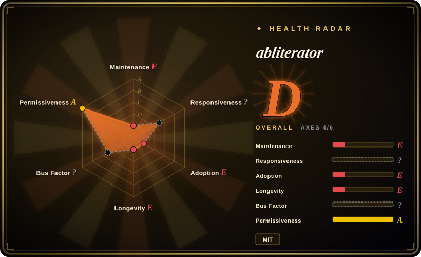
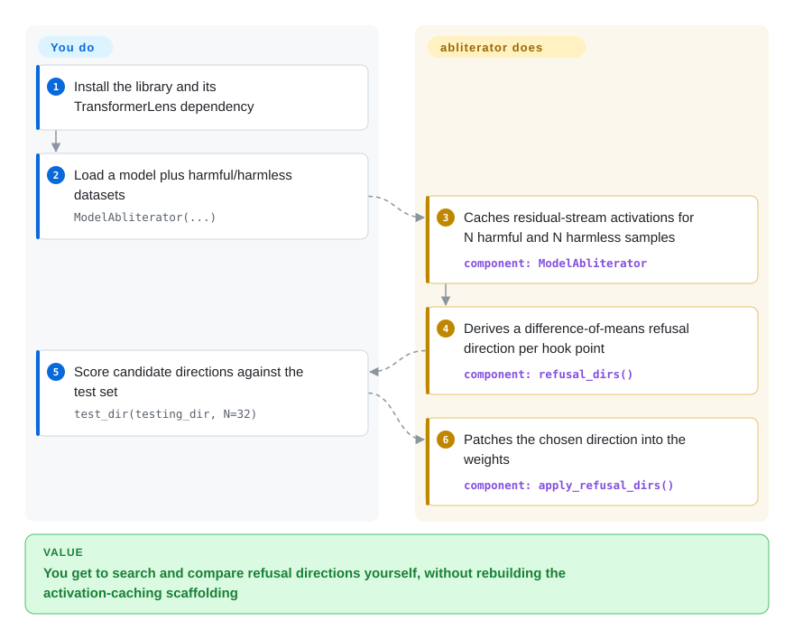

# abliterator

You want to try your own refusal-removal recipe — which hook, which layer, which direction — but every hand-rolled attempt means rewriting the same activation caching, scoring and weight-patching scaffolding. abliterator is a small TransformerLens-based library that hands you those pieces: cache the activations once, score candidate refusal directions, apply the one you pick.

## When to use

You are doing interpretability or ablation research and want to drive the experiment yourself, in a notebook, against TransformerLens's hook points — not run an end-to-end pipeline. After a one-time `cache_activations(N=...)` over harmful and harmless samples, the library gives you `refusal_dirs()` (a difference-of-means direction per hook), `test_dir(...)` to apply a candidate temporarily and score it by how much the unwanted token rate drops, `apply_refusal_dirs(...)` to bake it in, `mse_harmless(...)` as a quality check, and a `with my_model:` context so you can apply and revert without reloading.

Pick abliterator over [Heretic](heretic.md) when you need to see and steer each step, or want the broader set of activation points TransformerLens exposes; pick it over [ErisForge](erisforge.md) when your stack is already TransformerLens rather than plain Transformers. The deciding tradeoff: you get full manual control under a real MIT `LICENSE` file, and you accept a repo dormant since mid-2024 with no model export and a git-pinned dependency.

## How it works

abliterator is scaffolding around TransformerLens. You construct a `ModelAbliterator` with a model and the two prompt sets; it runs the model over N harmful and N harmless samples and caches the activations you asked for (by default the residual stream at `resid_pre` / `resid_mid` / `resid_post`, or `attn_out` / `mlp_out`). `refusal_dirs()` then computes, for each cached hook point, the difference-of-means direction between harmful and harmless activations. `test_dir()` applies one candidate direction to the model, runs the test set, and returns a `(negative_score, positive_score)` pair counting tokens you do not want versus tokens you do want; you pick the best-scoring direction and `apply_refusal_dirs()` patches it into the weights (optionally blacklisting layers). The library stops there — you write the search loop, and saving a Hugging Face model is still "functionality coming soon."

<!-- flow-steps:begin (generated from flows/abliterator.json by tools/flow_card.py — do not edit) -->

Text version of the flow

1. **You**: Install the library and its TransformerLens dependency
2. **You**: Load a model plus harmful/harmless datasets — `ModelAbliterator(...)`
3. **abliterator**: Caches residual-stream activations for N harmful and N harmless samples — component: `ModelAbliterator`
4. **abliterator**: Derives a difference-of-means refusal direction per hook point — component: `refusal_dirs()`
5. **You**: Score candidate directions against the test set — `test_dir(testing_dir, N=32)`
6. **abliterator**: Patches the chosen direction into the weights — component: `apply_refusal_dirs()`

**Value**: You get to search and compare refusal directions yourself, without rebuilding the activation-caching scaffolding

<!-- flow-steps:end -->

<!-- flow-steps:begin (generated from flows/abliterator.json by tools/flow_card.py — do not edit) -->
<!-- flow-steps:end -->

## When NOT to use

- **You want a decensored checkpoint at the end, not an experiment.** abliterator never implemented Hugging Face export, so use [Heretic](heretic.md) or [ErisForge](erisforge.md) when the deliverable is a saved or uploaded model.
- **You want the search automated.** Here there is no optimizer: you enumerate directions and pick by hand, so for a hands-off refusal/KL tradeoff use [Heretic](heretic.md).
- **Your stack is plain `transformers` and you do not want a TransformerLens dependency.** Use [ErisForge](erisforge.md) or [remove-refusals-with-transformers](remove-refusals-with-transformers.md), which work without TransformerLens.
- **You need something maintained.** The last push is 2024-06-11 (verified 2026-09-24), and `requirements.txt` pins `transformer-lens` from a git `@dev` branch, so a fresh install can break against upstream; for a live codebase use [Heretic](heretic.md) or [ErisForge](erisforge.md).
- **You want a documented, stable API.** The author calls it "exceedingly barebones," "a glorified IPython notebook," with "documentation… slim" — treat it as a starting template, not a dependency you vendor.

## Comparison

| Alternative | In index | Our verdict | Tradeoff |
|---|---|---|---|
| [Heretic](heretic.md) | ✅ | Pick abliterator when you want to script and inspect the ablation yourself; pick Heretic when you want the parameter search and the refusal/KL measurement automated and a model exported. | abliterator gives control and MIT terms but no optimizer and no export; Heretic automates everything but is AGPL and heavier. |
| [ErisForge](erisforge.md) | ✅ | Pick abliterator if you are already on TransformerLens hooks; pick ErisForge if you want a pip-installable `transformers` library that can both ablate and augment a concept. | Both are small libraries; abliterator is dormant with a git-pinned dep, ErisForge is a bit newer but ships no `LICENSE` file. |
| [remove-refusals-with-transformers](remove-refusals-with-transformers.md) | ✅ | Pick abliterator for interactive experiments and caching; pick remove-refusals for the shortest readable script that computes a refusal direction without TransformerLens. | abliterator is a library you compose; the other is two scripts you copy and edit. |
| [deccp](deccp.md) | ✅ | Pick abliterator for general experiments; pick deccp only if your target is Chinese-LLM censorship and you want its dataset and writeup. | deccp is narrower and explicitly unsupported; abliterator is broader but also idle. |

## Tech stack

- **Language:** Python ≥ 3.8 (`pyproject.toml`).
- **Core dependency:** TransformerLens, pinned in `requirements.txt` to `git+https://github.com/TransformerLensOrg/TransformerLens.git@dev` — an unpinned dev branch.
- **Also:** PyTorch ≥ 2.3, `einops`, `datasets`, `scikit-learn`, `tqdm`, `jaxtyping`, `transformers`.

## Dependencies

- **A GPU** (CUDA by default; the loader takes a `device` argument) — large models are cited in the examples.
- **TransformerLens** plus its own model-loading constraints; supported architectures are whatever TransformerLens supports.
- **User-supplied prompt sets:** the README uses `get_harmful_instructions()` / `get_harmless_instructions()`.

## Ops difficulty

**Low to run, high to finish.** There is nothing to deploy — it is a library you import into a notebook, and the caching step saves to a `.pth` file so you can resume. The effort is in the missing pieces: you write the direction search, and there is no export path to a servable model, so the output is weights you still have to handle yourself.

## Health & viability

- **Maintenance — dormant.** Last push 2024-06-11, roughly 27 months before this review (2026-09-24); no releases; the author's own README calls it a template to be built up "over time."
- **Governance / bus factor — effectively single-author.** `FailSpy` has 21 commits, then four contributors with 1–5; GitHub User-owned.
- **Adoption & Lindy — the origin, not the tool.** 713 stars and 101 forks; the README and deccp's credits tie FailSpy to coining "abliterated," so it is historically important as the technique's reference implementation even though the code is idle.
- **Risk flags.** Dormant, no export, slim docs, and a `transformer-lens @ …@dev` git pin that makes reproducibility dependent on an upstream branch.

## Caveats (unverified)

- [未验证] The README's own characterization ("barebones," "glorified IPython notebook," "documentation coming soon") is the author's; the code was not run here.
- [推断] "Never released" is read from the absence of GitHub releases and a `0.0.0` version in `pyproject.toml`; a package could exist elsewhere.
- [未验证] Whether the git-pinned TransformerLens `dev` dependency still installs cleanly with current PyTorch was not tested.
- [未验证] The quality of the token-based `(negative_score, positive_score)` metric versus a KL-divergence metric was not compared.
