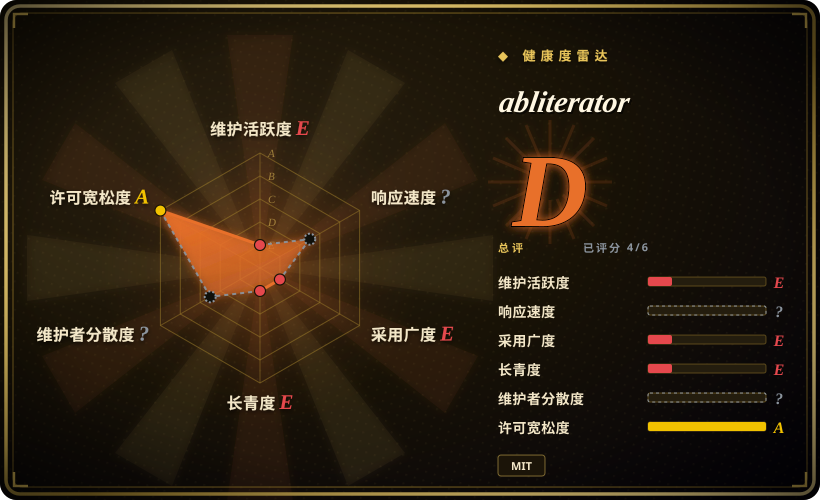
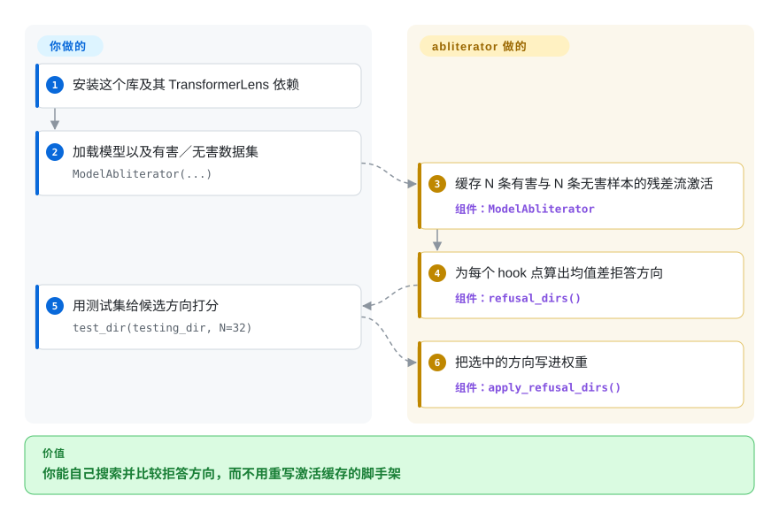

# abliterator

你想自己试一套移除拒答的做法——挑哪个 hook、哪一层、哪个方向——但每次手写都要把同样的激活缓存、打分和改权重脚手架重写一遍。abliterator 是一个基于 TransformerLens 的小型库，把这些零件递给你：缓存一次激活，给候选的拒答方向打分，再把选中的那个应用上去。

## 何时使用

你在做可解释性消融研究，想自己在 notebook 里驱动实验，直接对着 TransformerLens 的 hook 点操作，而不是跑一条端到端流水线。用 `cache_activations(N=...)` 对有害与无害样本缓存一次激活之后，库会给你 `refusal_dirs()`（每个 hook 一个“均值差”方向）、`test_dir(...)`（临时套上一个候选方向并按目标 token 比例打分）、`apply_refusal_dirs(...)`（真正写进权重）、`mse_harmless(...)`（质量检查），以及 `with my_model:` 上下文，让你套上再撤销而不用重新加载模型。

当你需要看清并控制每一步，或者想用 TransformerLens 暴露的更多激活点时，选 abliterator 而不是 [Heretic](heretic.zh.md)；当你的技术栈本来就是 TransformerLens 而不是原生 Transformers 时，选它而不是 [ErisForge](erisforge.zh.md)。决定性的取舍：你换来完全手动控制和一个货真价实的 MIT `LICENSE` 文件，代价是接受一个自 2024 年年中起就停更、没有模型导出、还依赖 git 分支的仓库。

## 怎么用起来

abliterator 是搭在 TransformerLens 外面的一层脚手架。你用模型和两套提示词构造一个 `ModelAbliterator`，它把模型跑过 N 条有害和 N 条无害样本，缓存你指定的激活（默认是 `resid_pre`／`resid_mid`／`resid_post` 的残差流，也可以选 `attn_out`／`mlp_out`）。然后 `refusal_dirs()` 为每个缓存点计算有害与无害激活的均值差方向；`test_dir()` 把一个候选方向套到模型上、跑测试集，返回一对 `(negative_score, positive_score)`，分别统计你不想要的 token 和你想要的 token；你挑分最好的方向，用 `apply_refusal_dirs()` 写进权重（可以先把某些层拉黑）。到这儿库就停住了——搜索循环要你自己写，而“另存为 Hugging Face 模型”至今仍是“功能即将推出”。

<!-- flow-steps:begin (generated from flows/abliterator.json by tools/flow_card.py — do not edit) -->

流程文字版

1. **你**：安装这个库及其 TransformerLens 依赖
2. **你**：加载模型以及有害／无害数据集 — `ModelAbliterator(...)`
3. **abliterator**：缓存 N 条有害与 N 条无害样本的残差流激活 — 组件：`ModelAbliterator`
4. **abliterator**：为每个 hook 点算出均值差拒答方向 — 组件：`refusal_dirs()`
5. **你**：用测试集给候选方向打分 — `test_dir(testing_dir, N=32)`
6. **abliterator**：把选中的方向写进权重 — 组件：`apply_refusal_dirs()`

**价值**：你能自己搜索并比较拒答方向，而不用重写激活缓存的脚手架

<!-- flow-steps:end -->

<!-- flow-steps:begin (generated from flows/abliterator.json by tools/flow_card.py — do not edit) -->
<!-- flow-steps:end -->

## 何时不用

- **你要的是一份去审查检查点，而不是一次实验。** abliterator 从未实现 Hugging Face 导出；当交付物是保存或上传的模型时，用 [Heretic](heretic.zh.md) 或 [ErisForge](erisforge.zh.md)。
- **你想让搜索自动完成。** 这里没有优化器：你只能枚举方向、手动挑选；想要自动平衡拒答与 KL 散度就用 [Heretic](heretic.zh.md)。
- **你的栈是原生 `transformers`，不想引入 TransformerLens。** 用 [ErisForge](erisforge.zh.md) 或 [remove-refusals-with-transformers](remove-refusals-with-transformers.zh.md)，它们不依赖 TransformerLens。
- **你需要一个仍在维护的项目。** 最后推送是 2024-06-11（2026-09-24 核实），而 `requirements.txt` 把 `transformer-lens` 钉在 git `@dev` 分支上，全新安装可能被上游改坏；要活代码库就用 [Heretic](heretic.zh.md) 或 [ErisForge](erisforge.zh.md)。
- **你想依赖一套有文档、稳定的 API。** 作者自称它“极其简陋”“更像一个美化过的 IPython notebook”“文档……很单薄”——把它当模板起点，而不是可以 vendor 的依赖。

## 横向对比

| 替代品 | 是否收录 | 我们的评价 | 取舍 |
|---|---|---|---|
| [Heretic](heretic.zh.md) | ✅ | 想自己写脚本、逐步检查消融过程时选 abliterator；想自动完成参数搜索、拒答／KL 度量并导出模型时选 Heretic。 | abliterator 给你控制权和 MIT 条款，但没有优化器也没有导出；Heretic 全自动，代价是 AGPL 与更重。 |
| [ErisForge](erisforge.zh.md) | ✅ | 若你本来就基于 TransformerLens 的 hook，选 abliterator；想要一个可 `pip` 安装、既能消融又能增强概念的 `transformers` 库，选 ErisForge。 | 两者都是小库；abliterator 停更且依赖钉在 git 分支，ErisForge 稍新些但仓库没有 `LICENSE` 文件。 |
| [remove-refusals-with-transformers](remove-refusals-with-transformers.zh.md) | ✅ | 想要交互式实验与激活缓存，选 abliterator；想要最短、可读、不依赖 TransformerLens 的脚本，选 remove-refusals。 | abliterator 是你组合调用的库；另一个是你复制修改的两个脚本。 |
| [deccp](deccp.zh.md) | ✅ | 通用实验选 abliterator；只有当目标是中国大模型审查、并且想要它的数据集与文章时，才选 deccp。 | deccp 更窄且明确不再支持；abliterator 更通用，但同样停更。 |

## 技术栈

- **语言：** Python ≥ 3.8（`pyproject.toml`）。
- **核心依赖：** TransformerLens，在 `requirements.txt` 里钉到 `git+https://github.com/TransformerLensOrg/TransformerLens.git@dev`——一个没有版本锁定的 dev 分支。
- **其余：** PyTorch ≥ 2.3、`einops`、`datasets`、`scikit-learn`、`tqdm`、`jaxtyping`、`transformers`。

## 依赖

- **一张显卡**（默认 CUDA，加载器接受 `device` 参数）——README 的例子引用的是大模型。
- **TransformerLens** 及其自身的模型加载限制；支持的架构等同于 TransformerLens 支持的架构。
- **自备提示词集：** README 用的是 `get_harmful_instructions()`／`get_harmless_instructions()`。

## 运维难度

**跑起来低，收尾高。** 没有东西要部署，就是一个 import 进 notebook 的库，而且缓存步骤会写 `.pth` 文件，可以续跑。工作量在于缺的那部分：方向搜索要你自己写，而且没有导出成可服务模型的路径，所以产物是一堆你还要自己处理的权重。

## 健康度与可持续性

- **维护——停更。** 最后推送 2024-06-11，距本次核查（2026-09-24）约 27 个月；无任何 release；作者在 README 里把它称作一个待“随时间补齐”的模板。
- **治理／巴士系数——基本一个人。** `FailSpy` 有 21 次提交，之后四位贡献者各 1–5 次；归 GitHub 个人账号。
- **采用度与 Lindy——它是源头，不是工具。** 713 star、101 fork；README 与 deccp 的致谢都把“abliterated”一词的提出与 FailSpy 联系在一起，所以作为该技术的参考实现它有历史意义，尽管代码已经闲置。
- **风险信号。** 停更、无导出、文档单薄，以及 `transformer-lens @ …@dev` 的 git 钉版让可复现性绑在一个上游分支上。

## 存疑（未验证）

- [未验证] README 的自我描述（“简陋”“美化过的 IPython notebook”“文档即将推出”）来自作者；本次未运行代码。
- [推断] “从未发布”是从没有任何 GitHub release 以及 `pyproject.toml` 里的 `0.0.0` 版本读出的；别处可能存在打包版本。
- [未验证] 钉在 git `dev` 的 TransformerLens 依赖在当前的 PyTorch 下是否还能干净安装，未做测试。
- [未验证] 它以 token 计数的 `(negative_score, positive_score)` 指标，与基于 KL 散度的指标相比质量如何，未做对比。
