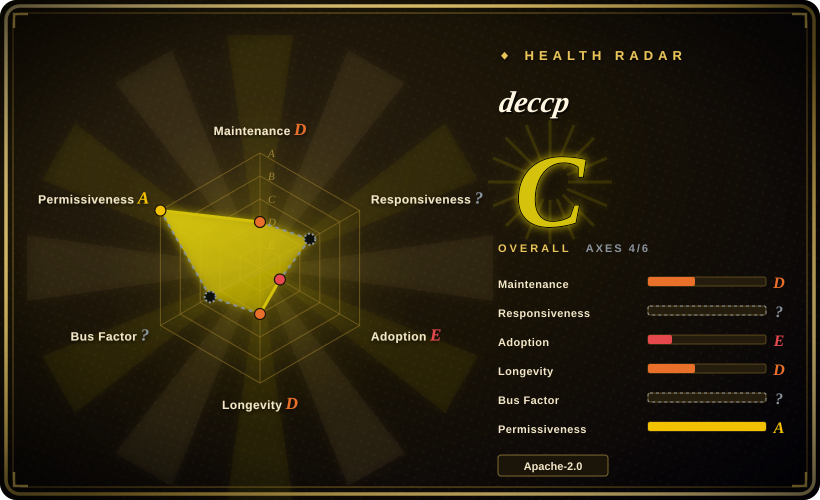
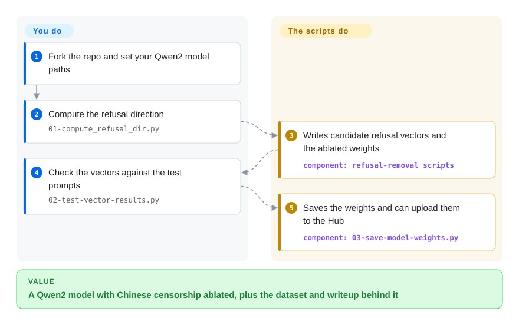

# deccp

Chinese-language models often refuse or deflect specific political and historical topics, and measuring that behavior is itself hard. deccp is a one-off proof of concept that un-censors Qwen2 Instruct models, shipped together with the author's hand-checked refusal dataset, the resulting model on Hugging Face, and a detailed writeup.

## When to use

Your target is Chinese-LLM censorship specifically, and you want the *material around* the technique as much as the code: the README calls it "a PoC for un-censoring Qwen 2 Instruct models," the prompts were hand-checked against `Qwen/Qwen2-7B-Instruct` for actual refusals, and the repository links a curated dataset and an analysis blog post. The workflow is four numbered scripts — compute the refusal direction, test the vector results, save the weights, upload to Hugging Face — adapted from [remove-refusals-with-transformers](remove-refusals-with-transformers.md).

Pick deccp over [Heretic](heretic.md) or [ErisForge](erisforge.md) when the value you want is its Chinese-censorship dataset, evaluation framing and writeup rather than a maintained general tool. The deciding tradeoff: a focused, Apache-2.0, fully-documented case study of one model family, against a codebase the author explicitly says he will not support.

## How it works

deccp is the single-direction refusal-removal recipe, wired for Qwen2. `01-compute_refusal_dir.py` loads a Qwen2 Instruct model, runs the repo's harmful and harmless prompt files through it, and derives the refusal direction as a difference of activations — the same core idea as every other tool here. `02-test-vector-results.py` checks the resulting vector against the test prompts, then `03-save-model-weights.py` orthogonalizes the weights and saves them, and `04-upload-model-to-hf.py` publishes the model. The layer handling is written for Qwen2's architecture, and the author notes that for any other model you must adapt the layer setup yourself.

<!-- flow-steps:begin (generated from flows/deccp.json by tools/flow_card.py — do not edit) -->

Text version of the flow

1. **You**: Fork the repo and set your Qwen2 model paths
2. **You**: Compute the refusal direction — `01-compute_refusal_dir.py`
3. **deccp**: Writes candidate refusal vectors and the ablated weights — component: `refusal-removal scripts`
4. **You**: Check the vectors against the test prompts — `02-test-vector-results.py`
5. **deccp**: Saves the weights and can upload them to the Hub — component: `03-save-model-weights.py`

**Value**: A Qwen2 model with Chinese censorship ablated, plus the dataset and writeup behind it

<!-- flow-steps:end -->

<!-- flow-steps:begin (generated from flows/deccp.json by tools/flow_card.py — do not edit) -->
<!-- flow-steps:end -->

## When NOT to use

- **You need ongoing support or fixes.** The README states plainly: "no, I won't be supporting this codebase at all," and calls it "more of a one-off curiosity"; for a maintained tool use [Heretic](heretic.md) or [ErisForge](erisforge.md).
- **Your model is not a Qwen2 Instruct checkpoint.** The scripts and the hand-checked prompts are specific to Qwen2; other architectures need the layer handling rewritten — use [remove-refusals-with-transformers](remove-refusals-with-transformers.md) or [Heretic](heretic.md) instead.
- **You want a Chinese-censorship *measurement* rather than a removal.** The repo's eval scripts are part of the PoC, not a maintained benchmark; if you need systematic evaluation, build on a dedicated eval harness rather than this.
- **You want a general refusal-removal pipeline.** deccp is narrow by design; [Heretic](heretic.md) is model-agnostic and automated.
- **You want anything after 2025.** Last push 2025-04-30 (verified 2026-09-24); newer Qwen generations and `transformers` versions postdate it.

## Comparison

| Alternative | In index | Our verdict | Tradeoff |
|---|---|---|---|
| [Heretic](heretic.md) | ✅ | Pick deccp only for its Chinese-censorship focus and writeup; pick Heretic for a maintained, model-agnostic, automatic pipeline. | deccp is a documented one-off; Heretic is an active tool but AGPL and heavier. |
| [remove-refusals-with-transformers](remove-refusals-with-transformers.md) | ✅ | Pick deccp when you want the Chinese-specific dataset and analysis; pick the Sumandora repo as the general, upstream recipe deccp is based on. | deccp adds prompts and analysis but narrows to Qwen2; the upstream repo stays general and equally idle. |
| [ErisForge](erisforge.md) | ✅ | Pick deccp for the case study; pick ErisForge when you want a library that can also *add* a behavior and score refusals. | ErisForge is generic and packaged; deccp is focused and unsupported. |
| [abliterator](abliterator.md) | ✅ | Pick deccp for Chinese-LLM work; pick abliterator when you want TransformerLens-based interactive experimentation. | Both are niche; abliterator is a general hook toolkit, deccp is a targeted PoC. |

## Tech stack

- **Language:** Python scripts (`01-compute_refusal_dir.py` … `04-upload-model-to-hf.py`) plus helpers `abliterator.py`, `multilayer-compute.py`, `multilayer-inference.py`, `test-model.py`.
- **Model layer:** PyTorch + Hugging Face Transformers with `einops` (the README describes the code as assembled from other projects, with patchy confidence in the linear algebra).
- **Assets:** a refusal dataset (`deccp_dataset/`, also on Hugging Face) and `harmful.txt` / `harmless.txt` prompt files.

## Dependencies

- **A GPU** and a Qwen2 Instruct checkpoint (the README's reference is `Qwen/Qwen2-7B-Instruct`).
- **Hugging Face Hub credentials** for `04-upload-model-to-hf.py`; the other scripts run locally.
- **No requirements file** is present at the repository root, so the dependency set must be inferred from imports.

## Ops difficulty

**Low, but one-shot.** Four numbered scripts run in order and produce a saved (and optionally uploaded) model; there is no service. Because the scripts assume Qwen2 and there is no packaging or config layer, adapting them to another model or keeping them running is manual work the author has declined to own.

## Health & viability

- **Maintenance — abandoned by declaration.** Last push 2025-04-30; the README's "Future Work" section is framed as a hand-off for someone else, and the author states he will not support the codebase.
- **Governance / bus factor — one contributor.** `lhl` has all 31 contributions; the repo is owned by an Organization (`AUGMXNT`) but effectively a single author's project.
- **Adoption & Lindy — small, but a documented case study.** 98 stars, 19 forks; its standing comes from the accompanying analysis and dataset rather than from ongoing use, and it sits downstream of [remove-refusals-with-transformers](remove-refusals-with-transformers.md).
- **Risk flags.** Explicit no-support stance; PoC scoped to Qwen2; idle since 2025-04; no requirements file; the README links Chinese generative-AI regulation (TC260-003) context, a reminder that the regulatory environment around this use case is not neutral.

## Caveats (unverified)

- [未验证] The dataset's quality and the reported refusal rates were not independently checked; the README says the prompts were hand-checked against one Qwen2 checkpoint.
- [推断] "Dormant" is read from the last push (2025-04-30) plus the author's statement that he will not support the codebase.
- [未验证] The dependency list could not be confirmed from a manifest because the repo has no `requirements.txt`; imports were not exhaustively enumerated.
- [未验证] Whether the scripts run against current `transformers`/`torch` versions, or newer Qwen models, was not tested.
- [推断] The README's TC260-003 references signal that the intended use touches regulated subject matter; jurisdiction-specific legal exposure was not assessed.
