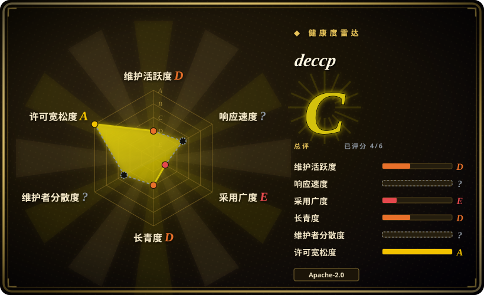
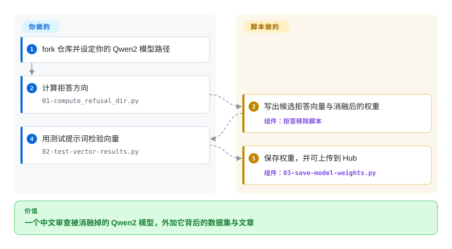

# deccp

中文大模型常常对特定的政治与历史话题拒答或顾左右而言他，而连“测出这种行为”本身都不容易。deccp 是一个一次性的概念验证，用来给 Qwen2 Instruct 模型“去审查”，并连同作者手工核过的拒答数据集、Hugging Face 上的成品模型以及一篇详细分析一起发布。

## 何时使用

你的目标专门是中文大模型的审查，而且你要的不只是代码，还有围绕它的材料：README 称它是“一个给 Qwen 2 Instruct 模型去审查的概念验证”，提示词经过手工核对，确认会真的触发 `Qwen/Qwen2-7B-Instruct` 的拒答，仓库还链接了整理好的数据集与一篇分析文章。流程是四个编号脚本——算拒答方向、测向量结果、保存权重、上传 Hugging Face——改编自 [remove-refusals-with-transformers](remove-refusals-with-transformers.zh.md)。

当你要的价值是它的中文审查数据集、评测框架与文章，而不是一个持续维护的通用工具时，选 deccp 而不是 [Heretic](heretic.zh.md) 或 [ErisForge](erisforge.zh.md)。决定性的取舍：一个聚焦、Apache-2.0、文档齐全的单一模型家族案例研究，代价是作者明确表示不会维护这套代码。

## 怎么用起来

deccp 就是单方向拒答移除配方，为 Qwen2 接好了线。`01-compute_refusal_dir.py` 加载一个 Qwen2 Instruct 模型，把仓库的有害与无害提示词文件跑一遍，以激活之差算出拒答方向——与这里其他工具同一个核心思路。`02-test-vector-results.py` 用测试提示词检验得到的向量，接着 `03-save-model-weights.py` 对齐权重并保存，`04-upload-model-to-hf.py` 把模型发布出去。层处理是按 Qwen2 的架构写的，作者也说明，换任何别的模型你都得自己改层的接法。

<!-- flow-steps:begin (generated from flows/deccp.json by tools/flow_card.py — do not edit) -->

流程文字版

1. **你**：fork 仓库并设定你的 Qwen2 模型路径
2. **你**：计算拒答方向 — `01-compute_refusal_dir.py`
3. **deccp**：写出候选拒答向量与消融后的权重 — 组件：`拒答移除脚本`
4. **你**：用测试提示词检验向量 — `02-test-vector-results.py`
5. **deccp**：保存权重，并可上传到 Hub — 组件：`03-save-model-weights.py`

**价值**：一个中文审查被消融掉的 Qwen2 模型，外加它背后的数据集与文章

<!-- flow-steps:end -->

<!-- flow-steps:begin (generated from flows/deccp.json by tools/flow_card.py — do not edit) -->
<!-- flow-steps:end -->

## 何时不用

- **你需要长期支持或修 bug。** README 说得很直白：“不，我完全不会维护这套代码”，并称它“更像一次性的好奇之作”；要持续维护的工具就用 [Heretic](heretic.zh.md) 或 [ErisForge](erisforge.zh.md)。
- **你的模型不是 Qwen2 Instruct 检查点。** 脚本和手工核对的提示词都针对 Qwen2；换架构要重写层处理——改用 [remove-refusals-with-transformers](remove-refusals-with-transformers.zh.md) 或 [Heretic](heretic.zh.md)。
- **你要的是“测量”中文审查而不是移除它。** 仓库的评测脚本属于概念验证的一部分，不是持续维护的基准；需要系统评测就在专门的评测框架上做。
- **你想要通用的拒答移除流水线。** deccp 按设计就是窄的；[Heretic](heretic.zh.md) 与模型无关且自动化。
- **你想要 2025 年之后的任何东西。** 最后推送是 2025-04-30（2026-09-24 核实）；更新的 Qwen 世代和 `transformers` 版本都在它之后。

## 横向对比

| 替代品 | 是否收录 | 我们的评价 | 取舍 |
|---|---|---|---|
| [Heretic](heretic.zh.md) | ✅ | 只有当你要它的中文审查关注与文章时才选 deccp；想要持续维护、模型无关、自动化的流水线就选 Heretic。 | deccp 是有文档的一次性项目；Heretic 是活跃工具，但 AGPL 且更重。 |
| [remove-refusals-with-transformers](remove-refusals-with-transformers.zh.md) | ✅ | 想要中文专用的数据集与分析时选 deccp；想要它改编自的那份通用上游配方时选 Sumandora 仓库。 | deccp 多了提示词与分析但收窄到 Qwen2；上游仓库保持通用，也同样闲置。 |
| [ErisForge](erisforge.zh.md) | ✅ | 想要案例研究选 deccp；想要一个还能“加上”行为并给拒答打分的库，选 ErisForge。 | ErisForge 通用且成体系；deccp 聚焦但不再支持。 |
| [abliterator](abliterator.zh.md) | ✅ | 做中文大模型相关工作选 deccp；想要基于 TransformerLens 的交互式实验选 abliterator。 | 两者都小众；abliterator 是通用 hook 工具箱，deccp 是定向概念验证。 |

## 技术栈

- **语言：** Python 脚本（`01-compute_refusal_dir.py` … `04-upload-model-to-hf.py`），外加辅助文件 `abliterator.py`、`multilayer-compute.py`、`multilayer-inference.py`、`test-model.py`。
- **模型层：** PyTorch ＋ Hugging Face Transformers 与 `einops`（README 说代码是从别的项目拼来的，作者对自己的线性代数把握有限）。
- **素材：** 一个拒答数据集（`deccp_dataset/`，Hugging Face 上也有），以及 `harmful.txt`／`harmless.txt` 提示词文件。

## 依赖

- **一张显卡**和一个 Qwen2 Instruct 检查点（README 的参考是 `Qwen/Qwen2-7B-Instruct`）。
- **Hugging Face Hub 凭据**供 `04-upload-model-to-hf.py` 使用；其余脚本本地运行。
- **仓库根目录没有 requirements 文件**，依赖集只能从 import 推断。

## 运维难度

**低，但一次性。** 四个编号脚本按序跑完，产出一个保存好（可选上传）的模型；没有服务。由于脚本假定 Qwen2，也没有打包或配置层，把它挪到别的模型或长期跑下去都是手工活，而作者已声明不接手。

## 健康度与可持续性

- **维护——作者声明放弃。** 最后推送 2025-04-30；README 的“未来工作”一节是按“交接给别人”的口吻写的，作者明确表示不会维护这套代码。
- **治理／巴士系数——一位贡献者。** `lhl` 一个人占了全部 31 次提交；仓库归一个组织（`AUGMXNT`），但实际上是单人项目。
- **采用度与 Lindy——小而完整的一则案例。** 98 star、19 fork；它的价值来自随附的分析与数据集，而不是持续使用，且处在 [remove-refusals-with-transformers](remove-refusals-with-transformers.zh.md) 的下游。
- **风险信号。** 明确不支持的立场；概念验证只覆盖 Qwen2；自 2025-04 起闲置；没有 requirements 文件；README 链接了中国生成式 AI 监管（TC260-003）背景，提醒这个用途所处的监管环境并非中立。

## 存疑（未验证）

- [未验证] 数据集质量与报告的拒答率未独立核查；README 说提示词只针对一个 Qwen2 检查点做过手工核对。
- [推断] “闲置”是从最后推送（2025-04-30）加上作者表示不会维护这套代码读出的。
- [未验证] 因为仓库没有 `requirements.txt`，依赖清单无法从清单确认；本次也没有穷举 import。
- [未验证] 脚本在当前 `transformers`／`torch` 版本、或更新的 Qwen 模型上能否运行，未做测试。
- [推断] README 引用 TC260-003 说明预期用途触及受监管题材；具体司法辖区的法律风险未做评估。
