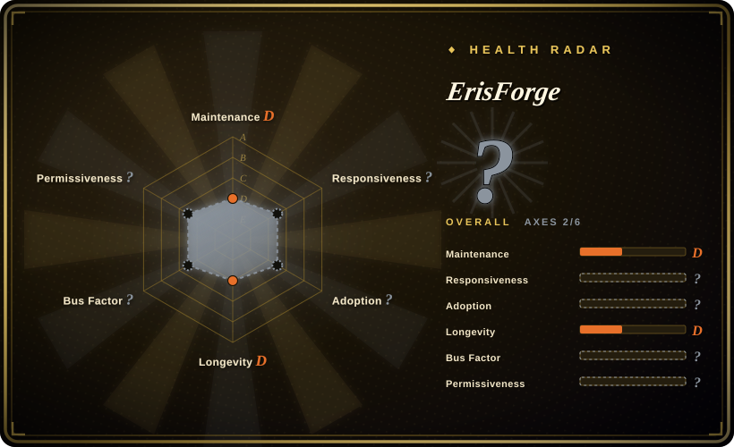
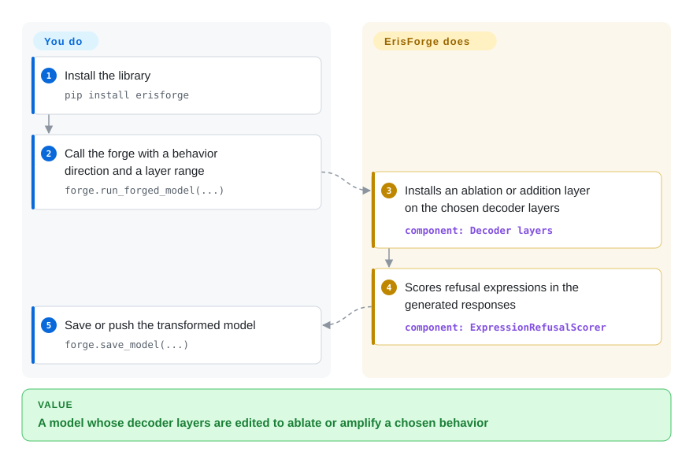

# ErisForge

You want to change what a model refuses — or make it more willing to talk about a topic — without writing the decoder-layer surgery yourself, and you would rather `pip install` a small library than adopt a full training or abliteration pipeline. ErisForge applies an "ablation" direction (remove a behavior) or an "addition" direction (amplify one) to the decoder layers you choose, scores refusals in the output, and can save the result.

## When to use

You are prototyping a behavior edit on a `transformers` model and want library-level control: pick the layer range (`min_layer`/`max_layer`), supply the behavior direction, and either ablate it or add it. ErisForge gives you `run_forged_model(...)` to transform and test in one call, an `ExpressionRefusalScorer` to count refusal phrases (e.g. "I'm sorry, I cannot…") in responses, and `save_model(...)` that writes the model locally or pushes it to the Hugging Face Hub.

Pick ErisForge over [Heretic](heretic.md) when you want to compose your own experiment — and specifically when you want an *addition* transform, which Heretic does not do — instead of an automated refusal/KL search. Pick it over [abliterator](abliterator.md) when you do not want a TransformerLens dependency, or over [remove-refusals-with-transformers](remove-refusals-with-transformers.md) when you want a library rather than two scripts to copy. The deciding tradeoff: a pip-installable, permissive (declared) library with both ablate and augment, against a single-maintainer project whose repository ships no `LICENSE` file.

## How it works

ErisForge wraps a Hugging Face `transformers` model. You load the model and tokenizer, then call `forge.run_forged_model(...)` with an `objective_behaviour_dir` (the direction vector for the behavior you want to change), the layer range, and some test instructions. It registers `AblationDecoderLayer` or `AdditionDecoderLayer` on those decoder layers — the ablation variant projects the direction out of the layer's output; the addition variant adds it — and runs the instructions through the modified model so you can read the responses. `ExpressionRefusalScorer` then counts refusal expressions in those responses, and `forge.save_model(...)` bakes an applied direction into the weights and can push the model to the Hub. You supply the direction and the layer choice; the library does the layer surgery and the scoring.

<!-- flow-steps:begin (generated from flows/erisforge.json by tools/flow_card.py — do not edit) -->

Text version of the flow

1. **You**: Install the library — `pip install erisforge`
2. **You**: Call the forge with a behavior direction and a layer range — `forge.run_forged_model(...)`
3. **ErisForge**: Installs an ablation or addition layer on the chosen decoder layers — component: `Decoder layers`
4. **ErisForge**: Scores refusal expressions in the generated responses — component: `ExpressionRefusalScorer`
5. **You**: Save or push the transformed model — `forge.save_model(...)`

**Value**: A model whose decoder layers are edited to ablate or amplify a chosen behavior

<!-- flow-steps:end -->

<!-- flow-steps:begin (generated from flows/erisforge.json by tools/flow_card.py — do not edit) -->
<!-- flow-steps:end -->

## When NOT to use

- **A compliance review needs an unambiguous license.** The README and `pyproject.toml` say MIT, but the repository has no `LICENSE` file and GitHub detects none (verified 2026-09-24); if that ambiguity blocks you, use [abliterator](abliterator.md) (MIT file present) or [remove-refusals-with-transformers](remove-refusals-with-transformers.md) (Apache-2.0).
- **You want the refusal/quality tradeoff optimized for you.** ErisForge applies the direction you hand it; there is no parameter search, so choose [Heretic](heretic.md) when you want the best refusal-vs-KL point found automatically.
- **You work in TransformerLens.** If your experiments use TransformerLens hooks and activation caching, [abliterator](abliterator.md) fits that stack better.
- **You need current-model coverage.** Its pins target an older `torch`/`transformers` pair (`torch~=2.5.1`, `transformers~=4.46.2`), so very new architectures may need dependency work first; for a fast-moving pipeline use [Heretic](heretic.md).
- **You want a maintained project with a team behind it.** The repo is essentially one author (81 commits) with a last push in 2026-03; plan to own any breakage.

## Comparison

| Alternative | In index | Our verdict | Tradeoff |
|---|---|---|---|
| [Heretic](heretic.md) | ✅ | Pick ErisForge when you want a library and the ability to *add* a behavior; pick Heretic when you want automatic optimization and a ready decensored checkpoint. | ErisForge is composable and lighter to install; Heretic is more automated but AGPL and GPU-heavy. |
| [abliterator](abliterator.md) | ✅ | Pick ErisForge for a plain-`transformers` library with model export; pick abliterator when you are on TransformerLens and want its activation caching. | ErisForge has a save/push path and no TransformerLens dep; abliterator has broader hook access but no export. |
| [remove-refusals-with-transformers](remove-refusals-with-transformers.md) | ✅ | Pick ErisForge when you want an installable library with refusal scoring; pick remove-refusals when you want the minimal readable recipe to adapt. | ErisForge is more packaged but single-maintainer with a license gap; the script is Apache-2.0 and simpler. |
| [deccp](deccp.md) | ✅ | Pick ErisForge for general use; pick deccp only for its Chinese-censorship focus, dataset and writeup. | deccp is narrower and explicitly unsupported; ErisForge is general but lightly maintained. |

## Tech stack

- **Language:** Python ≥ 3.11.
- **Model layer:** PyTorch (~2.5.1) + Hugging Face Transformers (~4.46.2); `einops`, `tiktoken`, `tqdm`.
- **Library surface:** `ErisForge.run_forged_model` / `save_model`, `AblationDecoderLayer` / `AdditionDecoderLayer`, `ExpressionRefusalScorer`; notebook and script examples under `examples/`.
- **Packaging:** `pip install erisforge` or from source (`pip install -r requirements.txt`).

## Dependencies

- **A GPU** with a working PyTorch build; the examples load models via `AutoModelForCausalLM`.
- **A behavior direction vector** you supply (`objective_behaviour_dir`) — the library does not compute one from harmful/harmless data the way [Heretic](heretic.md) or [remove-refusals-with-transformers](remove-refusals-with-transformers.md) do.
- **Hugging Face Hub access token** only if you push a model with `to_hub=True`.

## Ops difficulty

**Low.** It is a library you import into a script or notebook; there is no service and no long optimization run. The work is choosing the direction and layer range and judging the output — and, if you want a reusable refusal direction, computing that vector is on you.

## Health & viability

- **Maintenance — lightly maintained.** Last push 2026-03-02 (about six months before this review); two releases, most recently v1.1.0 on 2025-02-18.
- **Governance / bus factor — single author.** `Tsadoq` accounts for all 81 contributions in the contributors API; GitHub User-owned.
- **Adoption & Lindy — small and young.** 280 stars, 21 forks, 3 open issues; created 2024-10. It is cited in its own README as building on [remove-refusals-with-transformers](remove-refusals-with-transformers.md), [deccp](deccp.md) and [abliterator](abliterator.md), so it is a downstream synthesis rather than an origin.
- **Risk flags.** No `LICENSE` file despite MIT claims in README and `pyproject.toml` (verified 2026-09-24); single maintainer; dependency pins that already lag current `transformers`.

## Caveats (unverified)

- [未验证] The refusal scorer's accuracy is not benchmarked here; `ExpressionRefusalScorer` matches refusal expressions, so it is a phrase proxy like Heretic's keyword rate.
- [未验证] The README's Python examples were not executed; `requires-python = ">=3.11"` comes from `pyproject.toml`.
- [推断] "No LICENSE file" is read from the repository tree and GitHub's license detector returning none; the README's MIT claim is therefore not well documented, but we did not ask the maintainer.
- [未验证] Whether the pinned `torch`/`transformers` versions cover current model families was not tested.
