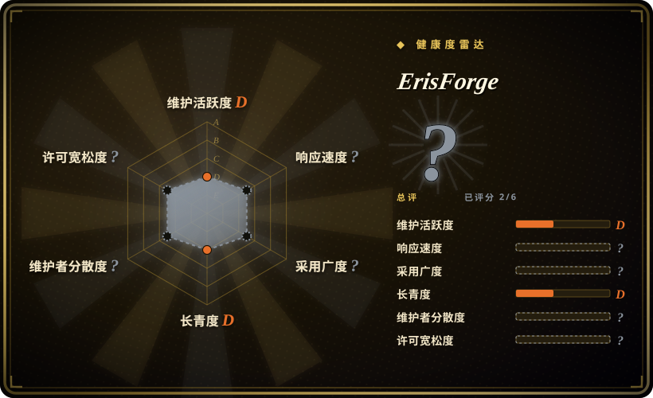
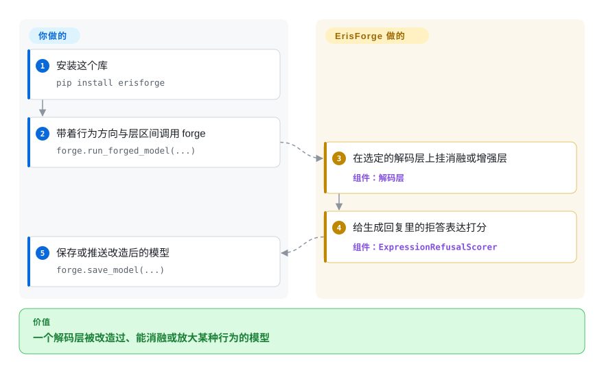

# ErisForge

你想改变一个模型对哪些话题拒答——或者让它更愿意聊某个话题——又不想自己写解码层手术；与其上整套训练或消融流水线，你更愿意 `pip install` 一个小库。ErisForge 把一条“消融”方向（抹掉某种行为）或一条“增强”方向（放大某种行为）施加到你选定的解码层上，对输出里的拒答打分，还能保存结果。

## 何时使用

你在给一个 `transformers` 模型做行为编辑的原型，想要库级别的控制：选层区间（`min_layer`／`max_layer`）、给出行为方向，然后消融它或增强它。ErisForge 提供 `run_forged_model(...)` 一步完成变换与测试，提供 `ExpressionRefusalScorer` 统计回复里的拒答短语（例如“I'm sorry, I cannot…”），还提供 `save_model(...)` 把模型写到本地或推到 Hugging Face Hub。

想自己组合实验时选 ErisForge 而不是 [Heretic](heretic.zh.md)——尤其是你需要“增强”这类变换，而 Heretic 不做；不想引入 TransformerLens 依赖时选它而不是 [abliterator](abliterator.zh.md)；想要一个库而不是两个要复制的脚本时选它而不是 [remove-refusals-with-transformers](remove-refusals-with-transformers.zh.md)。决定性的取舍：一个可 `pip` 安装、声明宽松许可、消融与增强兼备的库，代价是单一维护者、且仓库没有 `LICENSE` 文件。

## 怎么用起来

ErisForge 包在一个 Hugging Face `transformers` 模型外面。你加载模型与分词器，然后调用 `forge.run_forged_model(...)`，传入 `objective_behaviour_dir`（你想改变的行为方向向量）、层区间和一批测试指令。它会在这些解码层上挂 `AblationDecoderLayer` 或 `AdditionDecoderLayer`——消融版把该方向从层输出里投影掉，增强版则把它加上——然后把指令跑过修改后的模型，让你读回复。`ExpressionRefusalScorer` 接着统计回复里的拒答表达，`forge.save_model(...)` 把已施加的方向固化进权重，并可以推到 Hub。方向与选层由你提供，层手术与打分由库完成。

<!-- flow-steps:begin (generated from flows/erisforge.json by tools/flow_card.py — do not edit) -->

流程文字版

1. **你**：安装这个库 — `pip install erisforge`
2. **你**：带着行为方向与层区间调用 forge — `forge.run_forged_model(...)`
3. **ErisForge**：在选定的解码层上挂消融或增强层 — 组件：`解码层`
4. **ErisForge**：给生成回复里的拒答表达打分 — 组件：`ExpressionRefusalScorer`
5. **你**：保存或推送改造后的模型 — `forge.save_model(...)`

**价值**：一个解码层被改造过、能消融或放大某种行为的模型

<!-- flow-steps:end -->

<!-- flow-steps:begin (generated from flows/erisforge.json by tools/flow_card.py — do not edit) -->
<!-- flow-steps:end -->

## 何时不用

- **合规审查需要没有歧义的许可证。** README 与 `pyproject.toml` 都写着 MIT，但仓库里没有 `LICENSE` 文件，GitHub 也识别不到（2026-09-24 核实）；如果这种歧义会卡住你，用 [abliterator](abliterator.zh.md)（有 MIT 文件）或 [remove-refusals-with-transformers](remove-refusals-with-transformers.zh.md)（Apache-2.0）。
- **你想让别人替你把拒答与质量的取舍调好。** ErisForge 只施加你给的方向，没有参数搜索；想要自动找到最优的拒答／KL 点，选 [Heretic](heretic.zh.md)。
- **你的工作在 TransformerLens 里。** 如果你的实验用 TransformerLens 的 hook 和激活缓存，[abliterator](abliterator.zh.md) 更贴合。
- **你需要覆盖最新模型。** 它的依赖钉在偏旧的 `torch`／`transformers` 组合（`torch~=2.5.1`、`transformers~=4.46.2`），很新的架构可能要先处理依赖；快速迭代的流水线用 [Heretic](heretic.zh.md)。
- **你想要一个有团队、持续维护的项目。** 这个仓库基本是一位作者（81 次提交），最后推送是 2026-03；破损得你自己负责。

## 横向对比

| 替代品 | 是否收录 | 我们的评价 | 取舍 |
|---|---|---|---|
| [Heretic](heretic.zh.md) | ✅ | 想要一个库、并且能给模型“加上”某种行为时选 ErisForge；想要自动优化和现成的去审查检查点时选 Heretic。 | ErisForge 可组合、安装更轻；Heretic 更自动，代价是 AGPL 与更吃显卡。 |
| [abliterator](abliterator.zh.md) | ✅ | 想要一个带模型导出的原生 `transformers` 库，选 ErisForge；若你在 TransformerLens 上并想要它的激活缓存，选 abliterator。 | ErisForge 有保存／推送路径且不依赖 TransformerLens；abliterator 的 hook 面更广但没有导出。 |
| [remove-refusals-with-transformers](remove-refusals-with-transformers.zh.md) | ✅ | 想要可安装、带拒答打分的库，选 ErisForge；想要最小可读、便于改造的配方，选 remove-refusals。 | ErisForge 更成体系，但是单一维护者且许可证有缺口；脚本是 Apache-2.0 且更简单。 |
| [deccp](deccp.zh.md) | ✅ | 通用场景选 ErisForge；只有当你要它的中文审查关注、数据集与文章时，才选 deccp。 | deccp 更窄且明确不再支持；ErisForge 更通用，但维护也轻。 |

## 技术栈

- **语言：** Python ≥ 3.11。
- **模型层：** PyTorch（~2.5.1）＋ Hugging Face Transformers（~4.46.2）；`einops`、`tiktoken`、`tqdm`。
- **库接口：** `ErisForge.run_forged_model`／`save_model`、`AblationDecoderLayer`／`AdditionDecoderLayer`、`ExpressionRefusalScorer`；`examples/` 下有 notebook 与脚本示例。
- **打包：** `pip install erisforge`，或从源码 `pip install -r requirements.txt`。

## 依赖

- **一张显卡**和可用的 PyTorch；示例通过 `AutoModelForCausalLM` 加载模型。
- **一个行为方向向量**（`objective_behaviour_dir`）由你提供——这个库不会像 [Heretic](heretic.zh.md) 或 [remove-refusals-with-transformers](remove-refusals-with-transformers.zh.md) 那样，从有害／无害数据里替你算出来。
- **Hugging Face Hub 访问令牌**仅在用 `to_hub=True` 推送模型时需要。

## 运维难度

**低。** 它是一个 import 进脚本或 notebook 的库；没有服务，也没有漫长的优化过程。工作量在于选方向和层区间、判断输出——如果你想要一条可复用的拒答方向，那个向量还得你自己算。

## 健康度与可持续性

- **维护——轻度维护。** 最后推送 2026-03-02（距本次核查约六个月）；两个 release，最近的是 2025-02-18 的 v1.1.0。
- **治理／巴士系数——单一作者。** 贡献者 API 里 `Tsadoq` 一个人占了全部 81 次提交；归 GitHub 个人账号。
- **采用度与 Lindy——小而年轻。** 280 star、21 fork、3 个开 issue；创建于 2024-10。它的 README 自认建立在前述 [remove-refusals-with-transformers](remove-refusals-with-transformers.zh.md)、[deccp](deccp.zh.md) 与 [abliterator](abliterator.zh.md) 之上，属于下游的综合，而非源头。
- **风险信号。** README 与 `pyproject.toml` 都声称 MIT，但仓库里没有 `LICENSE` 文件（2026-09-24 核实）；单一维护者；依赖钉版已落后于当前 `transformers`。

## 存疑（未验证）

- [未验证] 拒答打分器的准确率本次未做基准测试；`ExpressionRefusalScorer` 匹配的是拒答表达，因此和 Heretic 的关键词率一样属于短语代理指标。
- [未验证] README 的 Python 示例未实际运行；`requires-python = ">=3.11"` 来自 `pyproject.toml`。
- [推断] “没有 LICENSE 文件”是从仓库文件树与 GitHub 许可证检测器均无结果读出的；因此 README 的 MIT 声明缺乏文件支撑，但我们没有向维护者求证。
- [未验证] 钉住的 `torch`／`transformers` 版本是否覆盖当前模型家族，未做测试。
