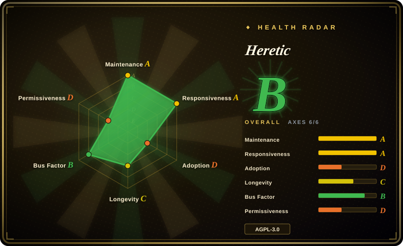
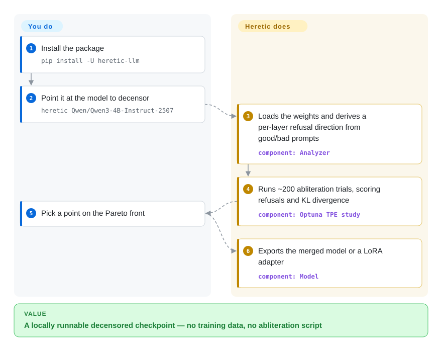

# Heretic

You point an open model at a topic it was aligned to avoid, and instead of an answer you get "I'm sorry, but I can't help with that." Heretic edits the model's saved weights to suppress that refusal behavior, searching automatically for the edit that removes refusals while changing the rest of the model as little as possible.

## When to use

You run open-weight models yourself — a workstation GPU or a rented box — and you keep hitting prompts the aligned base model refuses outright even though they are legitimate for your work: alignment research, red-teaming your own product's guardrails, fiction or role-play, or domain content your policy is more permissive about than the vendor's. Fine-tuning or DPO would move the behavior, but you have no labeled dataset and no appetite for a training run. Heretic needs no data you author (it ships with two public prompt sets), runs on one GPU, and searches the ablation parameters for you.

Pick Heretic over the manual abliteration scripts — FailSpy's abliterator, ErisForge, Sumandora's script — when you want the hyperparameter search done for you *and* a measured quality cost: it reports both the refusal rate and the KL divergence from the original model, and hands you a Pareto front to choose from, instead of committing to one hand-tuned weight kernel. The deciding tradeoff: you accept a one-year-old, single-maintainer AGPL-3.0 project, and in exchange you get the most automated path from a base checkpoint to a low-damage decensored one.

## How it works

Heretic drives a Hugging Face Transformers model through an abliteration loop. It first runs two small prompt sets through the model — a few hundred "harmless" prompts and a few hundred "harmful" ones — and records, at every transformer layer, the internal activation vector (the "residual stream") at the first response token. For each layer it takes the mean harmful activation minus the mean harmless activation; that difference is the direction the layer leans on when the model is about to refuse. Heretic then subtracts that direction out of the weights of two component types — the attention output projection and the MLP down projection — so the refusal direction is harder for the layer to express.

The subtraction is not one fixed strength. A weight "kernel" decides how hard each layer is edited, and Heretic uses Optuna's TPE (a Bayesian search) to run roughly 200 trials over the kernel's shape and the choice of direction, scoring each trial on two things: how often the response contains a refusal marker, and the KL divergence — how much the edited model's next-word probabilities differ from the original on harmless prompts. You provide the model ID and, at the end, pick a trial off the Pareto front; everything between a checkpoint ID and a decensored checkpoint — residual analysis, the search, the weight edit, the export — is its side.

<!-- flow-steps:begin (generated from flows/heretic.json by tools/flow_card.py — do not edit) -->

Text version of the flow

1. **You**: Install the package — `pip install -U heretic-llm`
2. **You**: Point it at the model to decensor — `heretic Qwen/Qwen3-4B-Instruct-2507`
3. **Heretic**: Loads the weights and derives a per-layer refusal direction from good/bad prompts — component: `Analyzer`
4. **Heretic**: Runs ~200 abliteration trials, scoring refusals and KL divergence — component: `Optuna TPE study`
5. **You**: Pick a point on the Pareto front
6. **Heretic**: Exports the merged model or a LoRA adapter — component: `Model`

**Value**: A locally runnable decensored checkpoint — no training data, no abliteration script

<!-- flow-steps:end -->

## When NOT to use

- **You need a durable capability you can evaluate, not a suppressed tendency.** Abliteration changes a bias in the weights; it cannot promise the model answers every prompt, and the project's own guidance says a KL divergence above ~0.5 usually means real damage to the original model. If the deliverable is "this model must reliably do X," build it with data instead — fine-tune with [Unsloth](../llm-training/unsloth.md) or [HF TRL](../llm-training/trl.md), which target the exact behavior and can be regression-tested.
- **You need a permissive license you can embed and modify in a closed product.** Heretic is AGPL-3.0-or-later, so linking its code into a proprietary service carries copyleft obligations. When tooling-license fit is the constraint, use [FailSpy/abliterator](https://github.com/FailSpy/abliterator) (MIT) or [remove-refusals-with-transformers](https://github.com/Sumandora/remove-refusals-with-transformers) (Apache-2.0).
- **You have no accelerator.** CPU-only processing is orders of magnitude slower and realistic only for tiny models; if you cannot rent or borrow a GPU, download an already-published abliterated checkpoint from Hugging Face rather than producing one.
- **Your target is a pure state-space or exotic research architecture.** The README supports most dense models, several MoE architectures and some hybrids (e.g. Qwen3.5), but not all; verify your architecture is covered before committing a long run, and otherwise fall back to a model-specific recipe or a supported base.
- **You need the safety alignment preserved, or you are unsure your use is lawful.** This tool's entire purpose is to remove alignment; provider terms, local law and the base model's license still constrain what you may do with the result, and Heretic does not change any of them. If you need the aligned behavior, keep the base model or a vendor-sanctioned variant — do not reach for this.

## Comparison

| Alternative | In index | Our verdict | Tradeoff |
|---|---|---|---|
| [abliterator](abliterator.md) | ✅ | Pick abliterator when you want to script individual ablation experiments against TransformerLens hooks; pick Heretic when you want the parameter search and the refusal/KL measurement done for you. | abliterator is a low-level, MIT-licensed library, but dormant since 2024-06; Heretic is automatic and active yet AGPL and GPU-bound. |
| [ErisForge](erisforge.md) | ✅ | Pick ErisForge when you want a small PyTorch library to ablate a chosen concept (not just refusals); pick Heretic when the goal is specifically refusal removal with an automatic quality tradeoff. | ErisForge is more general but ships no `LICENSE` file (verified 2026-09-24) and is far less used (280 stars). |
| [remove-refusals-with-transformers](remove-refusals-with-transformers.md) | ✅ | Pick this when you want a short, readable, Apache-2.0 reference script to understand or adapt abliteration yourself; pick Heretic when you need a maintained pipeline with checkpointing, quantization and export. | The script is permissive and simple but was last pushed 2025-11 and has no optimizer or quality metric. |
| [deccp](deccp.md) | ✅ | Pick deccp when your target is Chinese-LLM censorship specifically and you want its evaluation framing; pick Heretic for a general, model-agnostic pipeline. | deccp is narrower and dormant since 2025-04 (98 stars); Heretic is broader and active. |
| Fine-tuning away refusals — [Unsloth](../llm-training/unsloth.md) and [HF TRL](../llm-training/trl.md) | ✅ | Pick fine-tuning when you can source preference data and need a behavior you can evaluate and reproduce; pick Heretic when you have no dataset and want a one-command weight edit. | Fine-tuning targets the behavior directly and is more controllable, but costs data, labeling and a real training run; abliteration is cheaper but blunt and its refusal score is a keyword proxy. |

## Tech stack

- **Language:** Python 3.10+.
- **Model layer:** Hugging Face Transformers on PyTorch, PEFT (LoRA adapters, mergeable), bitsandbytes (4-bit quantization), `datasets`, `huggingface_hub`.
- **Search:** Optuna (multivariate TPE, `JournalStorage` checkpointing); `lm-eval` for the optional benchmark action.
- **CLI/config:** `questionary` + `rich` interactive prompts; `pydantic-settings` over a TOML config (`config.default.toml`); `tomli-w`.
- **Optional `research` extra:** PaCMAP, matplotlib, scikit-learn, `geom-median`, `imageio` for residual-geometry tables and per-layer projection plots.

## Dependencies

- **Python ≥ 3.10 and PyTorch ≥ 2.2** (some models need newer PyTorch; loading MXFP4 models such as gpt-oss requires `torch.accelerator`, added in 2.6).
- **A GPU:** NVIDIA (CUDA) or AMD (ROCm) are the supported paths; CPU-only works but is far slower.
- **VRAM:** author's rule of thumb is ~2.5 GB per billion parameters; `quantization = "bnb_4bit"` can cut that by roughly 70% at some quality cost.
- **Downloads:** the base model plus two Hugging Face prompt datasets (`mlabonne/harmless_alpaca`, `mlabonne/harmful_behaviors`) on first run.
- **For merged export of a quantized model:** substantial system RAM — the code estimates ~3× the parameter count in GB for a CPU merge, and warns it can freeze a machine.

## Ops difficulty

**Medium.** There is no service to run — one CLI, invoked as `heretic <model>`, with an interactive menu at the end. The cost is compute and downloads: a full run is tens of minutes for a 4B model and hours for larger ones, on hardware you must supply. It checkpoints every trial to `checkpoints/<model>.jsonl`, so an interrupted study resumes and Ctrl+C stops gracefully. Pin the version: `master` is `2.0.0.dev0`, and the reproducibility-file schema changed between 1.x and 2.x (the code tells you to install Heretic 1.4 for old run files).

## Health & viability

- **Maintenance — active (as of 2026-09-23).** Created 2025-09-21; last push 2026-09-22; 200 commits; releases from v1.0.1 (2025-11) through v1.4.0 (2026-06-14); `master` carries 2.0.0.dev0. Dense cadence, but a real backlog (86 open issues, 37 open PRs).
- **Governance / bus factor — single maintainer.** The repo is owned by a GitHub User (`p-e-w`, Philipp Emanuel Weidmann); the contributors API shows `p-e-w` at 110 commits, `dependabot[bot]` at 22, and a long tail (`anrp` 8, `Vinay-Umrethe` 7, …). The roadmap is one person's, so the bus factor is low [推断].
- **Backing & Lindy — young but strongly adopted.** About one year old, with 32.2k stars and 3.6k forks; the README claims 5000+ community-published Heretic models on Hugging Face and cites independent Reddit benchmarks favoring it over competing abliterations [未验证]. Age cuts against a Lindy prior, but adoption has cleared the "is anyone using this" bar [推断].
- **Adoption & ecosystem.** PyPI package `heretic-llm`; a docs site (heretic-project.org); Discord and Matrix channels; a Codeberg mirror; and thousands of downstream model packs.
- **Risk flags.** AGPL-3.0-or-later (copyleft — it governs the code you embed or modify, not necessarily the exported weights); single-maintainer ownership; the purpose itself is removing safety alignment, so policy and legal exposure are use-dependent. On the positive side the supply chain is unusually hardened: `uv.lock` pins every dependency, updates are delayed 7 days, release archives are Sigstore-signed, and maintainer commits are GPG-signed.

## Caveats (unverified)

- [未验证] The "5000+ models" count and the quality comparisons (e.g. the gemma-3-12b KL/refusal table vs the mlabonne and huihui abliterations) are author and community claims; they were not reproduced here.
- [未验证] Runtime and VRAM figures ("~20–30 min for Qwen3-4B on an RTX 3090", "~2.5 GB VRAM per billion parameters") come from the author and are hardware- and config-dependent.
- [未验证] The refusal score is a keyword list (e.g. `sorry`, `i cannot`, `as an ai`) counted over generated responses — a proxy, not proof: a model can still refuse in phrasings the list misses, and a low refusal rate does not mean refusals are gone.
- [推断] If you embed or modify Heretic's source in a product, AGPL-3.0-or-later obligations apply; exported model weights most likely inherit the base model's license rather than Heretic's, but this was not legally assessed.
- [未验证] Whether the edit generalizes across languages and to adversarial prompts was not tested here; the scorer's evaluation prompts are English.
- [推断] Bus-factor risk follows from one maintainer owning most of the roadmap, even though the dependency and CI hygiene reduce operational risk.
