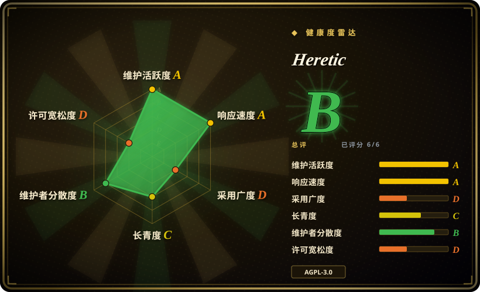
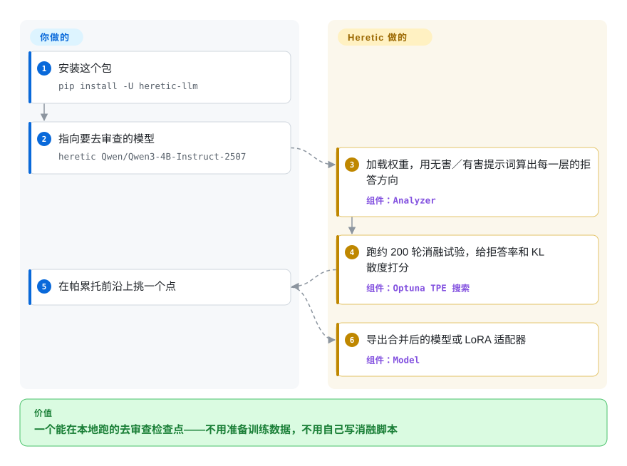

# Heretic

你把一个开源模型用在自己的机器上，一碰到某个话题，它不回答，只甩你一句“很抱歉，我无法协助”。Heretic 直接改模型保存下来的权重，把这类拒答行为压下去，并自动在“拒答尽量少”和“其余能力尽量别改坏”之间找平衡。

## 何时使用

你自己在跑开源权重模型——一张工作站显卡，或者一台租来的机器——却反复撞上一类提示词：对齐后的底座模型直接拒答，但在你的场景里它们完全正当，比如对齐研究、给自己产品的护栏做红队测试、小说与角色扮演，或者某项政策比厂商更宽松的领域内容。微调或 DPO 也能改变这个行为，但你手里没有标注数据，也不想跑一轮训练。Heretic 不需要你自己写数据（它自带两套公开提示词集），单卡就能跑，还会替你搜索消融参数。

当你需要“参数搜索也替你做完，并给出可量化的质量代价”时，选 Heretic 而不是那些手动消融脚本——FailSpy 的 abliterator、ErisForge、Sumandora 的脚本。它同时报告拒答率和与原始模型的 KL 散度，并把一条帕累托前沿交给你挑，而不是让你赌上一组手调的权重核。决定性的取舍：你要接受一个只有一年历史、单一维护者、AGPL-3.0 的项目，换来从底模到低损伤去审查检查点之间最省事的一条路。

## 怎么用起来

Heretic 驱动一个 Hugging Face Transformers 模型走完一轮消融流程。它先把两小批提示词喂给模型——几百条“无害”提示词和几百条“有害”提示词——并在每一层记录首个回复 token 处的内部激活向量（也就是“残差流”）。对每一层，它取“有害激活均值减去无害激活均值”，这个差就是模型即将拒答时该层倾向使用的方向。随后 Heretic 把这个方向从两类组件的权重里减掉——注意力输出投影和 MLP 下投影——让该层更难表达这个拒答方向。

减法不是固定强度。一条权重“核”决定每一层被改多重，Heretic 用 Optuna 的 TPE（一种贝叶斯搜索）在核的形状和方向索引上跑大约 200 轮试验，每轮按两件事打分：回复里出现拒答标记的频率，以及在无害提示词上编辑后模型的 KL 散度（即它的下一个词概率分布偏离原模型多少）。你只需要给出模型 ID，最后从帕累托前沿上挑一轮；从一个检查点 ID 到一个去审查检查点之间的全部工作——残差分析、搜索、改权重、导出——都是它那一侧。

<!-- flow-steps:begin (generated from flows/heretic.json by tools/flow_card.py — do not edit) -->

流程文字版

1. **你**：安装这个包 — `pip install -U heretic-llm`
2. **你**：指向要去审查的模型 — `heretic Qwen/Qwen3-4B-Instruct-2507`
3. **Heretic**：加载权重，用无害／有害提示词算出每一层的拒答方向 — 组件：`Analyzer`
4. **Heretic**：跑约 200 轮消融试验，给拒答率和 KL 散度打分 — 组件：`Optuna TPE 搜索`
5. **你**：在帕累托前沿上挑一个点
6. **Heretic**：导出合并后的模型或 LoRA 适配器 — 组件：`Model`

**价值**：一个能在本地跑的去审查检查点——不用准备训练数据，不用自己写消融脚本

<!-- flow-steps:end -->

## 何时不用

- **你要的是一项可评估的稳定能力，而不是被压下去的倾向。** 消融改的是权重里的偏好，它无法保证模型对每一条提示词都作答；项目自己的说明也指出，KL 散度超过约 0.5 通常意味着原模型能力已受明显损伤。如果交付要求是“这个模型必须稳定做到 X”，那就用数据来做——用 [Unsloth](../llm-training/unsloth.zh.md) 或 [HF TRL](../llm-training/trl.zh.md) 微调，能对准具体行为，也能做回归测试。
- **你需要一个能嵌进闭源产品、可自由修改的宽松许可证。** Heretic 是 AGPL-3.0-or-later，把它的代码链进闭源服务会触发 copyleft 义务。当约束是工具本身的许可是否合用时，改用 [FailSpy/abliterator](https://github.com/FailSpy/abliterator)（MIT）或 [remove-refusals-with-transformers](https://github.com/Sumandora/remove-refusals-with-transformers)（Apache-2.0）。
- **你没有加速卡。** 纯 CPU 处理慢几个数量级，只有极小模型才现实；如果租不到也借不到显卡，就直接下载 Hugging Face 上已经发布好的消融检查点，而不是自己产一个。
- **你的目标是纯状态空间模型或冷门研究架构。** README 支持大多数稠密模型、若干 MoE 架构和部分混合架构（如 Qwen3.5），但并非全部；开跑前先确认你的架构在支持范围内，否则改用针对该架构的方案或换成受支持的底座。
- **你需要保留安全对齐，或者不确定自己的用途是否合法。** 这个工具的全部目的就是移除对齐；服务商条款、当地法律和底模许可证依然约束你对产物能做什么，Heretic 一条都不会改变。如果你需要对齐后的行为，就保留原模型或使用厂商认可的变体，不要伸手拿它。

## 横向对比

| 替代品 | 是否收录 | 我们的评价 | 取舍 |
|---|---|---|---|
| [abliterator](abliterator.zh.md) | ✅ | 想针对 TransformerLens 的 hook 写单次消融实验脚本时选 abliterator；想要参数搜索和拒答／KL 度量都替你做完时选 Heretic。 | abliterator 是 MIT 的底层库，但自 2024-06 起停更；Heretic 自动且活跃，代价是 AGPL 与必须上显卡。 |
| [ErisForge](erisforge.zh.md) | ✅ | 想用一个小型 PyTorch 库消融任意选定的概念（不限于拒答）时选 ErisForge；目标明确是移除拒答、并要自动的质量取舍时选 Heretic。 | ErisForge 更通用，但仓库里没有 `LICENSE` 文件（2026-09-24 核实），用量也小得多（280 star）。 |
| [remove-refusals-with-transformers](remove-refusals-with-transformers.zh.md) | ✅ | 想要一份简短、易读、Apache-2.0 的参考脚本，自己理解或改造消融时选它；需要带断点续跑、量化和导出能力的持续维护流水线时选 Heretic。 | 该脚本宽松又简单，但最后推送停在 2025-11，既没有优化器也没有质量指标。 |
| [deccp](deccp.zh.md) | ✅ | 目标专门是中文大模型的审查、并且想用它的评测框架时选 deccp；要一个通用的、与模型无关的流水线时选 Heretic。 | deccp 更窄，且自 2025-04 起停更（98 star）；Heretic 覆盖面更广也更活跃。 |
| 用微调把拒答行为训掉——[Unsloth](../llm-training/unsloth.zh.md) 与 [HF TRL](../llm-training/trl.zh.md) | ✅ | 能弄到偏好数据、需要一个可评估、可复现的行为时选微调；没有数据集、只想一条命令改权重时选 Heretic。 | 微调直接对准目标行为、更可控，但要付出数据、标注和一轮真实训练；消融更便宜却更粗暴，且它的拒答率只是关键词代理指标。 |

## 技术栈

- **语言：** Python 3.10+。
- **模型层：** PyTorch 上的 Hugging Face Transformers、PEFT（可合并的 LoRA 适配器）、bitsandbytes（4-bit 量化）、`datasets`、`huggingface_hub`。
- **搜索：** Optuna（多变量 TPE、`JournalStorage` 断点续跑）；可选的基准测试动作走 `lm-eval`。
- **命令行与配置：** `questionary` + `rich` 的交互提示；基于 TOML 配置（`config.default.toml`）的 `pydantic-settings`；`tomli-w`。
- **可选 `research` 扩展：** PaCMAP、matplotlib、scikit-learn、`geom-median`、`imageio`，用于残差几何表和逐层投影图。

## 依赖

- **Python ≥ 3.10，PyTorch ≥ 2.2**（部分模型需要更新的 PyTorch；加载 MXFP4 等模型如 gpt-oss 需要 `torch.accelerator`，2.6 才加入）。
- **显卡：** 支持 NVIDIA（CUDA）与 AMD（ROCm）；纯 CPU 能跑但慢得多。
- **显存：** 作者的经验值是每 10 亿参数约 2.5 GB；把 `quantization` 设为 `bnb_4bit` 可省掉约七成，代价是些许质量。
- **下载：** 首次运行会拉取底模以及两个 Hugging Face 提示词数据集（`mlabonne/harmless_alpaca`、`mlabonne/harmful_behaviors`）。
- **量化模型的合并导出：** 需要大量系统内存——代码估算 CPU 合并约需参数量 GB 的三倍，并警告可能导致机器卡死。

## 运维难度

**中等。** 没有需要长期运行的服务，只有一个命令行：`heretic <模型>`，结尾是交互菜单。代价在算力和下载：4B 模型一整轮要几十分钟，更大的模型要数小时，硬件得你自己出。它每轮试验都写入 `checkpoints/<模型>.jsonl`，中断的研究能续跑，Ctrl+C 也能优雅停止。记得锁版本：`master` 是 `2.0.0.dev0`，且 1.x 与 2.x 之间的复现文件格式不兼容（代码会提示旧运行文件请装 Heretic 1.4）。

## 健康度与可持续性

- **维护——活跃（截至 2026-09-23）。** 仓库创建于 2025-09-21；最后推送 2026-09-22；200 次提交；从 v1.0.1（2025-11）到 v1.4.0（2026-06-14）持续发版；`master` 已是 2.0.0.dev0。节奏密集，但积压真实存在（86 个开 issue、37 个开 PR）。
- **治理／巴士系数——单一维护者。** 仓库属于一个 GitHub 个人账号（`p-e-w`，Philipp Emanuel Weidmann）；贡献者 API 里 `p-e-w` 110 次提交、`dependabot[bot]` 22 次，其余是长尾（`anrp` 8、`Vinay-Umrethe` 7 等）。路线图掌握在一个人手里，巴士系数低 [推断]。
- **背书与 Lindy——年轻但采用度高。** 约一年历史，32.2k star、3.6k fork；README 声称社区在 Hugging Face 上发布了 5000+ 个 Heretic 模型，并引用 Reddit 上的独立基准显示其优于同类消融 [未验证]。年龄对 Lindy 先验不利，但采用度已经跨过“有没有人用”这道门槛 [推断]。
- **采用与生态。** PyPI 包名 `heretic-llm`；有文档站（heretic-project.org）；Discord 与 Matrix 频道；Codeberg 镜像；下游模型包数以千计。
- **风险信号。** AGPL-3.0-or-later（copyleft——约束的是你要嵌入或修改的代码，未必是导出的权重）；单一维护者；用途本身是移除安全对齐，政策与法律风险取决于你怎么用。正面看，供应链加固得异常认真：`uv.lock` 锁定全部依赖、更新延迟 7 天、发布归档有 Sigstore 签名、维护者提交有 GPG 签名。

## 存疑（未验证）

- [未验证] “5000+ 模型”这一数量，以及质量对比（例如 gemma-3-12b 的 KL／拒答表对比 mlabonne 与 huihui 的消融版本），来自作者与社区声明，本次未复现。
- [未验证] 运行时长与显存数字（“RTX 3090 上 Qwen3-4B 约 20–30 分钟”“每 10 亿参数约 2.5 GB 显存”）来自作者，实际取决于模型、硬件与配置。
- [未验证] 拒答率是用一份关键词表（如 `sorry`、`i cannot`、`as an ai`）在生成结果里计数得到的代理指标，不是证明：模型仍可能用表里没收录的说法拒答，拒答率低不代表拒答消失。
- [推断] 若你把 Heretic 的源码嵌入或修改后放进产品，AGPL-3.0-or-later 的义务会生效；导出的模型权重更可能沿用底模许可证而非 Heretic 的，但这一点未经法律评估。
- [未验证] 这种编辑能否跨语言、并对抗对抗性提示词，本次未做测试；评分用的评测提示词是英文的。
- [推断] 巴士系数风险来自一个人掌握大部分路线图，不过依赖与 CI 的卫生程度降低了运维层面的风险。
