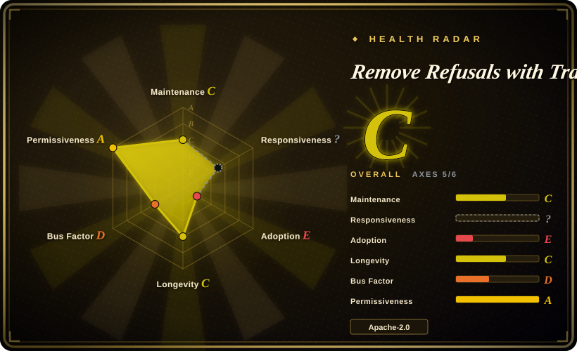
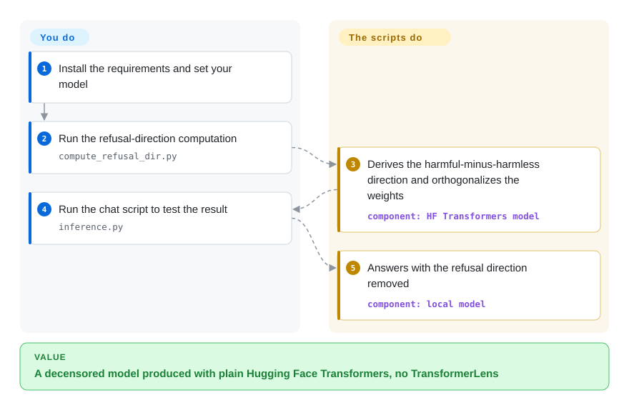

# Remove Refusals with Transformers

You want to see the whole refusal-removal trick in a couple of readable scripts — no framework, no optimizer, no TransformerLens — so you can understand it or adapt it into your own code. This repo is the minimal pure-`transformers` implementation: one script computes a refusal direction and orthogonalizes the model with it, a second script chats with the result.

## When to use

You are reading up on abliteration, or building your own pipeline, and you want the shortest working reference in plain Hugging Face Transformers. The README's whole workflow is: set the model and quantization in `compute_refusal_dir.py` and `inference.py`, run the first to compute the harmful-minus-harmless direction and apply it, then run the second to test. It ships `harmful.txt` and `harmless.txt` prompt sets, and because it uses no TransformerLens, it works with any model `transformers` can load — the author tested it on a 6 GB RTX 2060 and reports it scaling to larger models.

Pick this over [abliterator](abliterator.md) when you do not want a TransformerLens dependency, over [ErisForge](erisforge.md) when you want a script to read rather than a pip package to install, and over [Heretic](heretic.md) when you specifically want to see and edit the mechanism. The deciding tradeoff: two Apache-2.0 scripts you own and can modify, against a proof-of-concept with no optimizer, no export, no tests and a last push in 2025-11.

## How it works

The repo is two scripts and two prompt files. `compute_refusal_dir.py` loads the model (with optional bitsandbytes quantization), runs the harmful and harmless prompts through it, collects the activations at each layer, and derives a refusal direction as the difference of their means — the same single-direction idea behind every abliteration tool. It then orthogonalizes the model's weights against that direction and saves the modified model. `inference.py` loads the saved model and lets you chat with it to check the result. There is no search: the direction and the layers come from the script's settings, which you edit by hand.

<!-- flow-steps:begin (generated from flows/remove-refusals-with-transformers.json by tools/flow_card.py — do not edit) -->

Text version of the flow

1. **You**: Install the requirements and set your model
2. **You**: Run the refusal-direction computation — `compute_refusal_dir.py`
3. **Remove Refusals with Transformers**: Derives the harmful-minus-harmless direction and orthogonalizes the weights — component: `HF Transformers model`
4. **You**: Run the chat script to test the result — `inference.py`
5. **Remove Refusals with Transformers**: Answers with the refusal direction removed — component: `local model`

**Value**: A decensored model produced with plain Hugging Face Transformers, no TransformerLens

<!-- flow-steps:end -->

<!-- flow-steps:begin (generated from flows/remove-refusals-with-transformers.json by tools/flow_card.py — do not edit) -->
<!-- flow-steps:end -->

## When NOT to use

- **You want a maintained, hands-off pipeline.** The README calls it "a crude, proof-of-concept implementation" — there is no optimizer, no quality metric, no CLI and no export step beyond saving weights; for that use [Heretic](heretic.md).
- **You want a library you can `import`.** It is scripts, not a package; use [ErisForge](erisforge.md) when you want composable functions with refusal scoring and Hub upload.
- **Your architecture names its layers unusually.** The README warns that some Qwen implementations break because the script assumes `model.model.layers`; if your model does not follow the usual naming, expect to edit the layer access.
- **You want no maintenance surprises.** Last push 2025-11-27 (verified 2026-09-24) and no releases; pin nothing because there is nothing to pin — treat it as a reference to fork, not a dependency.
- **You need a tracked license boundary for a product.** It is Apache-2.0, which is fine to vendor, but the project is single-maintainer and idle, so you own the fork.

## Comparison

| Alternative | In index | Our verdict | Tradeoff |
|---|---|---|---|
| [Heretic](heretic.md) | ✅ | Pick this to understand or adapt the method; pick Heretic when you want the refusal/quality tradeoff optimized and a checkpoint exported. | The script is transparent and dependency-light; Heretic is automated, heavier and AGPL. |
| [ErisForge](erisforge.md) | ✅ | Pick this for the minimal recipe; pick ErisForge when you want an installable library that can also *add* a behavior and score refusals. | ErisForge is more packaged but has a license-file gap and single-maintainer risk; this script is Apache-2.0 and simpler. |
| [abliterator](abliterator.md) | ✅ | Pick this if you want to avoid TransformerLens; pick abliterator for interactive experimentation and activation caching. | This script is plain `transformers` and readable; abliterator offers a richer hook API but is dormant. |
| [deccp](deccp.md) | ✅ | Pick this as the general recipe; pick deccp for its Chinese-censorship dataset and analysis, which this repo does not cover. | deccp narrows to Qwen2 and declares itself unsupported; this repo is broader but equally idle. |

## Tech stack

- **Language:** Python.
- **Model layer:** Hugging Face Transformers + PyTorch, with `bitsandbytes` and `accelerate` for quantization and device placement; `einops`, `jaxtyping`, `tqdm`.
- **Surface:** two scripts (`compute_refusal_dir.py`, `inference.py`) plus `harmful.txt` / `harmless.txt` and `requirements.txt`.

## Dependencies

- **A GPU:** the author's reference run was a 6 GB RTX 2060, so small models (<3B) are the comfortable range, though larger models are reported to work.
- **Hugging Face Transformers** and a model you can load; `bitsandbytes` if you enable quantization (the README notes quantization can be mixed).
- **Prompt files** you can edit: `harmful.txt` and `harmless.txt` are consumed directly.

## Ops difficulty

**Low.** No service, no scheduler: edit the two scripts' settings, run them in order, chat with the result. Quantization makes it fit small cards. Because the settings are hardcoded in the files rather than a config file, reusing it for a second model means editing the scripts again.

## Health & viability

- **Maintenance — idle since 2025-11-27.** No releases; the README describes it as a crude proof of concept; the repository is essentially frozen.
- **Governance / bus factor — one author.** `Sumandora` has 9 commits, `gitmylo` 2; GitHub User-owned.
- **Adoption & Lindy — the most-forked reference.** 2.2k stars and 330 forks (as of 2026-09) make it the widely-copied baseline that [ErisForge](erisforge.md) and [deccp](deccp.md) both credit; its influence, not its maintenance, is what recommends it.
- **Risk flags.** Idle; proof-of-concept self-description; hardcoded settings; no tests; known layer-naming failures for some Qwen checkpoints.

## Caveats (unverified)

- [未验证] The "works with every model HF Transformers supports" claim, and the "works with bigger models" note, are the author's; the code was not run here.
- [未验证] The exact layer-naming failures ("some Qwen implementations") are described only loosely in the README; the specific affected checkpoints were not enumerated.
- [推断] "No releases" is read from the absence of GitHub releases; the project may be used via direct clone only.
- [未验证] Whether the scripts still run against current `transformers`/`torch` versions was not tested.
