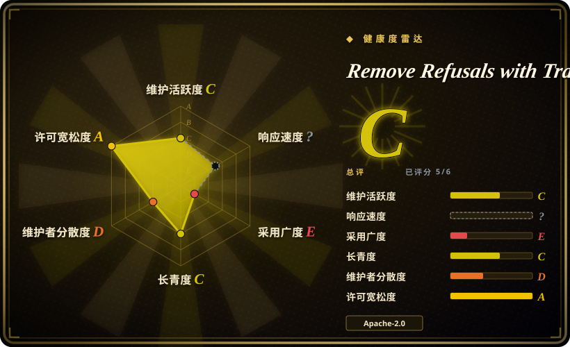
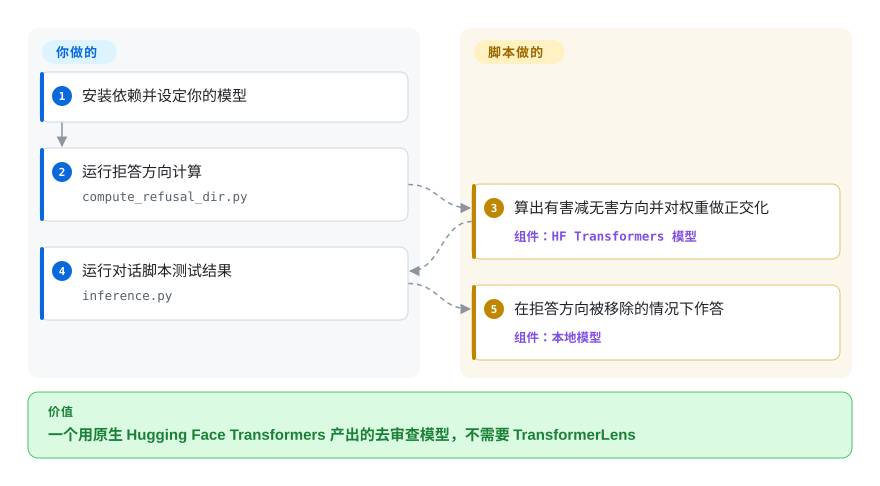

# Remove Refusals with Transformers

你想把移除拒答这套把戏看全，就两个可读的脚本——没有框架、没有优化器、不用 TransformerLens——好让你看懂它，或者改造成自己的代码。这个仓库就是最精简的原生 `transformers` 实现：一个脚本算出拒答方向并用它正交化模型，第二个脚本用来和结果对话。

## 何时使用

你在研究消融（abliteration），或在搭自己的流水线，想要原生 Hugging Face Transformers 下最短的可用参考。README 的整个流程就是：在 `compute_refusal_dir.py` 和 `inference.py` 里设好模型与量化，先跑第一个算出“有害减无害”方向并施加，再跑第二个来测试。它自带 `harmful.txt` 与 `harmless.txt` 两套提示词；因为不用 TransformerLens，任何 `transformers` 能加载的模型它都能用——作者在 6GB 的 RTX 2060 上测过，并表示更大的模型也能跑。

不想引入 TransformerLens 依赖时选它而不是 [abliterator](abliterator.zh.md)；想看脚本而不是装 pip 包时选它而不是 [ErisForge](erisforge.zh.md)；想亲眼看到并亲手改机制时选它而不是 [Heretic](heretic.zh.md)。决定性的取舍：两个归你所有、可自由修改的 Apache-2.0 脚本，代价是一个没有优化器、没有导出、没有测试、最后推送停在 2025-11 的概念验证。

## 怎么用起来

这个仓库就是两个脚本加两个提示词文件。`compute_refusal_dir.py` 加载模型（可选 bitsandbytes 量化），把有害与无害提示词跑一遍，收集各层激活，以两者均值的差算出拒答方向——也就是所有消融工具背后那同一个单方向思路。随后它对这条方向正交化模型权重并保存修改后的模型。`inference.py` 加载保存好的模型，让你对话检查结果。全程没有搜索：方向与层都来自脚本里的设置，由你手工修改。

<!-- flow-steps:begin (generated from flows/remove-refusals-with-transformers.json by tools/flow_card.py — do not edit) -->

流程文字版

1. **你**：安装依赖并设定你的模型
2. **你**：运行拒答方向计算 — `compute_refusal_dir.py`
3. **Remove Refusals with Transformers**：算出有害减无害方向并对权重做正交化 — 组件：`HF Transformers 模型`
4. **你**：运行对话脚本测试结果 — `inference.py`
5. **Remove Refusals with Transformers**：在拒答方向被移除的情况下作答 — 组件：`本地模型`

**价值**：一个用原生 Hugging Face Transformers 产出的去审查模型，不需要 TransformerLens

<!-- flow-steps:end -->

<!-- flow-steps:begin (generated from flows/remove-refusals-with-transformers.json by tools/flow_card.py — do not edit) -->
<!-- flow-steps:end -->

## 何时不用

- **你想要一条持续维护、开箱即用的流水线。** README 自称这是“一个粗糙的概念验证”——没有优化器、没有质量指标、没有命令行、除了保存权重也没有导出步骤；要这些就用 [Heretic](heretic.zh.md)。
- **你想要一个能 `import` 的库。** 它是脚本不是包；想要可组合的函数、拒答打分和 Hub 上传，用 [ErisForge](erisforge.zh.md)。
- **你的架构层命名不规范。** README 提醒某些 Qwen 实现会失败，因为脚本假定 `model.model.layers`；如果你的模型不遵循常见命名，准备好改层访问代码。
- **你不想被维护问题打扰。** 最后推送 2025-11-27（2026-09-24 核实），且没有 release；没有版本可钉——把它当一份 fork 起点，而不是依赖。
- **产品需要清晰的许可证边界。** 它是 Apache-2.0，可以 vendor，但项目是单一维护者且已闲置，fork 之后由你负责。

## 横向对比

| 替代品 | 是否收录 | 我们的评价 | 取舍 |
|---|---|---|---|
| [Heretic](heretic.zh.md) | ✅ | 想理解或改造方法时选本页；想要把拒答与质量的取舍自动调好并导出检查点时选 Heretic。 | 脚本透明、依赖轻；Heretic 全自动、更重、且是 AGPL。 |
| [ErisForge](erisforge.zh.md) | ✅ | 想要最小配方时选本页；想要一个还能“加上”某种行为、并给拒答打分的可安装库时选 ErisForge。 | ErisForge 更成体系但许可证文件缺失且有单一维护者风险；脚本是 Apache-2.0 且更简单。 |
| [abliterator](abliterator.zh.md) | ✅ | 想避开 TransformerLens 时选本页；想要交互式实验和激活缓存时选 abliterator。 | 本页脚本是原生 `transformers` 且好读；abliterator 的 hook 接口更丰富但已停更。 |
| [deccp](deccp.zh.md) | ✅ | 通用配方选本页；想要它针对中文审查的数据集与分析时选 deccp，本仓库不覆盖这些。 | deccp 收窄到 Qwen2 并自认不再支持；本仓库更通用，但同样闲置。 |

## 技术栈

- **语言：** Python。
- **模型层：** Hugging Face Transformers ＋ PyTorch，配合 `bitsandbytes` 与 `accelerate` 做量化与设备放置；`einops`、`jaxtyping`、`tqdm`。
- **形态：** 两个脚本（`compute_refusal_dir.py`、`inference.py`），加上 `harmful.txt`／`harmless.txt` 与 `requirements.txt`。

## 依赖

- **一张显卡：** 作者的参考运行环境是 6GB 的 RTX 2060，所以小模型（<3B）是舒服的区间，更大的模型据称也能跑。
- **Hugging Face Transformers** 和一个你能加载的模型；启用量化时需要 `bitsandbytes`（README 说量化可以混用）。
- **提示词文件：** `harmful.txt` 与 `harmless.txt` 会被直接读取，可自行编辑。

## 运维难度

**低。** 没有服务、没有调度器：改两个脚本里的设置，按顺序运行，再和结果对话。量化能让它塞进小显存卡。由于设置是硬编码在文件里而不是配置文件，换第二个模型就要再改一次脚本。

## 健康度与可持续性

- **维护——自 2025-11-27 起闲置。** 无 release；README 自称粗糙的概念验证；仓库基本冻结。
- **治理／巴士系数——一个人。** `Sumandora` 有 9 次提交，`gitmylo` 2 次；归 GitHub 个人账号。
- **采用度与 Lindy——被 fork 最多的参考。** 2.2k star、330 fork（截至 2026-09），使它成为被广泛复制的基线，[ErisForge](erisforge.zh.md) 与 [deccp](deccp.zh.md) 都致谢过它；推荐它的是影响力，而不是维护状态。
- **风险信号。** 闲置；自称概念验证；设置硬编码；没有测试；对某些 Qwen 检查点存在已知的层命名失败。

## 存疑（未验证）

- [未验证] “支持所有 HF Transformers 支持的模型”以及“更大的模型也能跑”这两点来自作者；本次未运行代码。
- [未验证] 具体的层命名失败（“某些 Qwen 实现”）在 README 里只说得很笼统，未列出受影响的检查点。
- [推断] “没有 release”是从没有任何 GitHub release 读出的；该项目可能只通过直接 clone 使用。
- [未验证] 脚本在当前 `transformers`／`torch` 版本下是否还能运行，未做测试。
