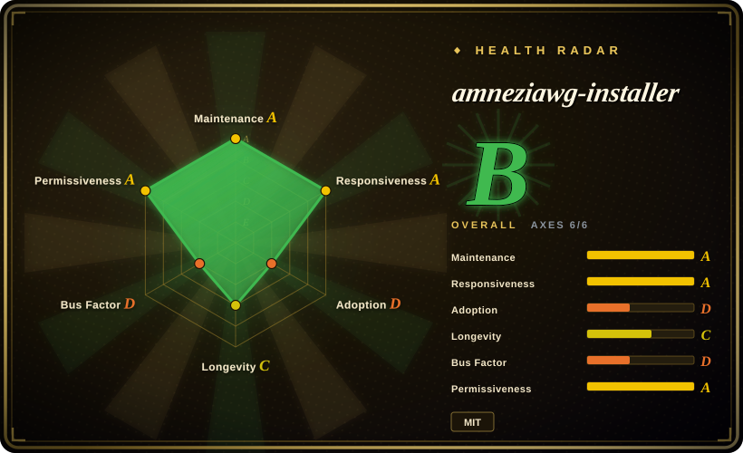
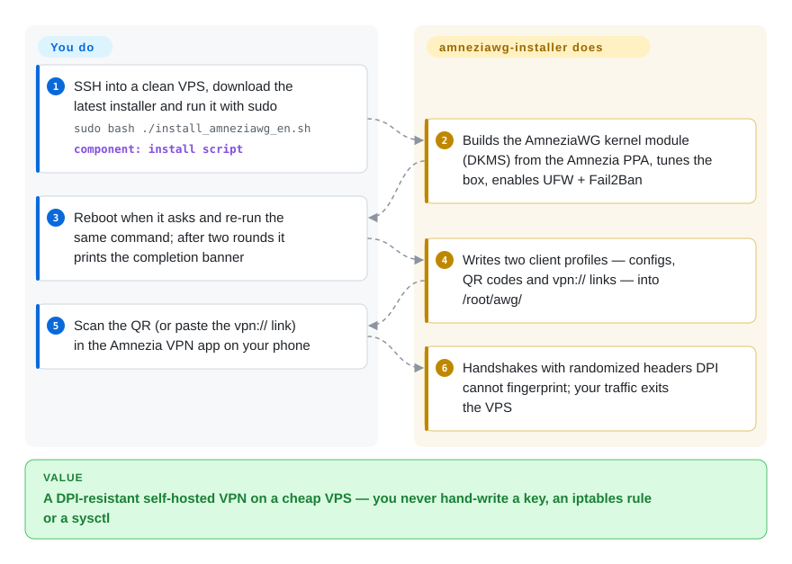

# amneziawg-installer

Your self-hosted WireGuard stops handshaking overnight — the phone connects on Wi-Fi but never on mobile data, because the carrier's DPI (deep packet inspection) fingerprints WireGuard's fixed packet sizes and header bytes and drops it. This is one readable bash script that turns a clean Ubuntu/Debian VPS into an AmneziaWG server — the same WireGuard mechanics with randomized headers there is no fixed signature to match — in one command plus two reboots.

## When to use

You are behind a DPI that blocks plain WireGuard — Russia's TSPU, Iran, Turkmenistan, an office or campus firewall — and a commercial VPN is not an acceptable answer (trust, shared exit IPs, cost). You rent a cheap VPS ($3–5/month, 1 GB RAM) to be your own exit, but you don't want to hand-assemble an obfuscated tunnel: keys, iptables, sysctl, kernel module, firewall rules. You SSH into a clean Ubuntu 24.04 / Debian 13 box, run one command, answer three questions (port, subnet, routing mode), reboot twice, then scan a QR into the Amnezia VPN app on your phone. That is this project's entire trigger scenario.

The deciding tradeoff against its substitutes: the obfuscation lives **inside the protocol** (an in-kernel AmneziaWG module — no Docker, no web panel, no separate masking proxy daemon burning RAM on a $4 box), and the whole server gets tuned and hardened for you — UFW deny-all with rate-limited SSH, Fail2Ban, BBR, buffers and swap sized to the actual RAM. You pick this over wg-easy when the box is headless and cheap and you want zero always-on services besides the VPN; over the official Amnezia app when you want the *server* tuned rather than a Docker container dropped onto an untuned host; over a plain WireGuard installer when WireGuard demonstrably stops working on your network. Family-and-friends pattern fits too: a guest gets a 7-day client (`--expires=7d`) that a cron job removes by itself, and bots can drive management over the `--json` interface.

## How it works

The installer is a 6,600-line readable bash script (plus a 3,000-line `manage` script) that you run as root on a clean box. **It does the whole server; you only make a few decisions and reboot twice.** Underneath, it installs the AmneziaWG kernel module — WireGuard modified so the header fields DPI fingerprints (packet sizes, magic bytes, timing) are randomized and padded — via DKMS (the Linux mechanism that auto-rebuilds kernel modules when the kernel updates) from the Amnezia PPA, a third-party package repo on Launchpad. It then tunes the box (sysctl buffers sized to RAM, BBR congestion control, swap) and locks it down (UFW, Fail2Ban, 600/700 file permissions). Afterward, client lifecycle is the `manage` script: `add`/`remove`/`list`/`stats`, applied hot via `awg syncconf` with no service restart, plus backups, per-client traffic stats, and a JSON mode for scripts. Your phone never configures anything: each client's `.conf`, QR code, and one-tap `vpn://` link land in `/root/awg/` on the server, and you scan or paste one of them into the Amnezia app.

<!-- flow-steps:begin (generated from flows/amneziawg-installer.json by tools/flow_card.py — do not edit) -->

Text version of the flow

1. **You**: SSH into a clean VPS, download the latest installer and run it with sudo — `sudo bash ./install_amneziawg_en.sh` — component: `install script`
2. **amneziawg-installer**: Builds the AmneziaWG kernel module (DKMS) from the Amnezia PPA, tunes the box, enables UFW + Fail2Ban
3. **You**: Reboot when it asks and re-run the same command; after two rounds it prints the completion banner
4. **amneziawg-installer**: Writes two client profiles — configs, QR codes and vpn:// links — into /root/awg/
5. **You**: Scan the QR (or paste the vpn:// link) in the Amnezia VPN app on your phone
6. **amneziawg-installer**: Handshakes with randomized headers DPI cannot fingerprint; your traffic exits the VPS

**Value**: A DPI-resistant self-hosted VPN on a cheap VPS — you never hand-write a key, an iptables rule or a sysctl

<!-- flow-steps:end -->

## When NOT to use

- **Plain WireGuard still works where you live.** Keep standard WireGuard (e.g. [angristan/wireguard-install](https://github.com/angristan/wireguard-install), 未收录): every standard WG client connects, there are no obfuscation parameters to keep tuned, and config updates never force a client reissue. AmneziaWG requires AWG-2.0-capable clients, and its 3.x features are not even in generated configs yet.
- **You want a browser panel to rotate peers.** There is no panel here, by design — management is SSH + CLI. Use [wg-easy](https://github.com/wg-easy/wg-easy) (未收录) on a Docker home-lab box, or [wiresock/amneziawg-install](https://github.com/wiresock/amneziawg-install) (未收录) for a native no-Docker panel; a panel is an always-on service, exactly what this project strips off the box.
- **You need multiple protocols or protocol mimicry.** OpenVPN/VLESS support or masking traffic as QUIC/DNS against active probing belongs to the official [Amnezia VPN app](https://github.com/amnezia-vpn/amnezia-client) (未收录, deploys a multi-protocol Docker stack over SSH) or wiresock's separate obfuscation proxy. This installer is AmneziaWG-only, and its obfuscation targets everyday DPI, not active probing.
- **The target is not a clean, disposable, single-purpose Ubuntu/Debian box.** The script runs `apt upgrade`, removes packages (snapd, unattended-upgrades — automatic security updates stop — packagekit, udisks2), turns host IPv6 off by default, and reboots twice. On a shared or production server, do a manual AmneziaWG setup instead; `--no-tweaks`/`--keep-packages` soften the cleanup but the reboots remain.
- **Not Ubuntu/Debian, or the kernel is old.** CentOS/Alpine are unsupported; Synology DSM 7.4 (kernel 4.4) cannot load the module (needs ≥5.15) — the upstream userspace route is the documented fallback there.

## Comparison

| Alternative | In index | Our verdict | Tradeoff |
|---|---|---|---|
| [angristan/wireguard-install](https://github.com/angristan/wireguard-install) | 未收录 | When your network does not DPI-block WireGuard, pick the plain installer and keep standard clients; pick this page's project only once handshakes actually stop completing. | No special clients, no obfuscation tuning, simpler mental model; but fingerprintable and already blocked in several countries. Real repo not added in this tab-intake batch. |
| [wg-easy](https://github.com/wg-easy/wg-easy) | 未收录 | When you want browser-based peer management on a box that already runs Docker, pick wg-easy; when the box is headless, cheap and single-purpose, pick this page's project. | GUI vs none; costs a Docker daemon, a web port and a userspace module in a container — and it is plain WireGuard, so it does not answer DPI blocking. Real repo not added in this tab-intake batch. |
| [wiresock/amneziawg-install](https://github.com/wiresock/amneziawg-install) | 未收录 | When you want an AmneziaWG server *plus* a no-Docker web panel or a separate masking proxy, pick wiresock; when you want zero always-on extras and protocol-internal obfuscation, pick this page's project. | Native panel and Rust obfuscation proxy vs none here; the proxy's full bidirectional mode pairs with their commercial client. Real repo not added in this tab-intake batch. |
| [Amnezia VPN app](https://github.com/amnezia-vpn/amnezia-client) | 未收录 | When the setup must be click-through with no terminal and multi-protocol, pick the official app; when you want the server itself tuned and hardened, pick this page's project. | App deploys the server side as Docker containers over SSH — GUI and protocol choice gained, server-level tuning, package cleanup and kernel-module performance forgone. Real repo not added in this tab-intake batch. |
| [spcfox/amnezia-wg-easy](https://github.com/spcfox/amnezia-wg-easy) | 未收录 | Archived (verified 2026-09-28) — treat as a pattern source only; for a maintained AWG-in-Docker path start from wg-easy or wiresock instead. | wg-easy's UX with AWG support, but an archived repo gets no dependency or security fixes. Real repo not added in this tab-intake batch. |

## Tech stack

- **Language:** pure Bash — installer `install_amneziawg_en.sh` (6,616 lines) and `manage_amneziawg_en.sh` (3,053 lines) with Russian twins; readable and reviewable before running as root.
- **What it installs:** `amneziawg-dkms` kernel module from the Amnezia PPA (Launchpad; key embedded and repo-scoped), `amneziawg-tools` + `wireguard-tools`, `qrencode`, UFW, Fail2Ban, plus DKMS/gcc/kernel headers for the build (prebuilt module packages on some ARM boards).
- **Release engineering:** minisign-signed releases since v5.29.0 (public key in `KEYS.txt`), SHA256-pinned helper scripts, a documented signing threat model (`docs/SIGNING_DESIGN.md`).
- **CI:** GitHub Actions running 2,416 bats tests across 166 files (counted at tag v5.37.0), shellcheck, docs-consistency, ARM package builds.
- **Automation surface:** `manage` exposes `--json` on nearly every command; third-party Telegram bots and a macOS GUI are built on it.

## Dependencies

- **A clean, dedicated VPS:** Ubuntu 24.04 / 26.04 or Debian 13 (Ubuntu 25.10 / Debian 12 migration-only), x86_64 / ARM64 / ARMv7, ≥512 MB RAM (1 GB recommended), root over SSH, and tolerance for two reboots.
- **Third-party apt repo:** the Amnezia PPA on Launchpad supplies the kernel module; it is an external dependency (the installer retries around PPA outages, and pins the repo key).
- **Clients must speak AmneziaWG 2.0:** Amnezia VPN ≥4.8.12.7 (all platforms) or AmneziaWG ≥2.0.0 (Windows/Android/iOS). Plain WireGuard clients will not connect. Perl is optional (only for `vpn://` URI generation; present by default on Ubuntu/Debian).

## Ops difficulty

**Low to install, low to run — the sharp edges are about what the box becomes, not mechanics.** One command, a few questions, two reboots, ~20 minutes [推断]. Day-2 is one script: add/remove/stats/backup hot-applied without service restarts, expired clients cleaned by cron every 5 minutes, the module auto-rebuilt by DKMS after kernel updates (x86). The edges to know: package cleanup stops `unattended-upgrades`, so automatic security updates cease unless you re-enable them; host IPv6 is off unless `--allow-ipv6`; ARM boards running a prebuilt module get no auto-rebuild — re-run the installer after a kernel change; changing obfuscation flags (`--mobile`, `--preset`, `--port`) invalidates every issued client config and forces a `regen` reissue round; `--uninstall` exists and leaves a keys-backup archive in `/root` that you must delete yourself.

## Health & viability

- **Maintenance (2026-09-28): exceptionally active.** v5.37.0 released 2026-09-27 — five tagged releases in September 2026 alone; last push 2026-09-27; not archived.
- **Governance / bus factor: single maintainer.** CODEOWNERS is `@bivlked` only; 488 of the ~493 human contributions are his (Ivan Bondarev). Mitigants: MIT license, readable bash, minisign-signed releases with a published threat model, and a SECURITY.md that names supported versions (5.37.x full, 5.36.x security-only) with 48h/7d/30d response SLAs. A third-party ecosystem (Telegram bots, a macOS GUI) already depends on the `manage --json` contract, which raises recovery cost if he stops but also signals a committed user base.
- **Backing & age/Lindy: young, personal, riding an upstream.** Created 2025-04 (~1.5 years old) — no foundation or vendor; funding is GitHub Sponsors plus an affiliate hosting link in the README. The protocol and the PPA module builds belong to the upstream amnezia-vpn org, so the page's project is best understood as excellent automation over someone else's protocol. Age × still-active reads as *promising, not yet Lindy-scale*.
- **Adoption.** ~1.3k stars / 107 forks (2026-09-28); the README lists third-party tutorials and press (Hetzner Community, Debian Forums, XDA, LowEndTalk) [未验证]; the 2,416-test CI suite (counted at v5.37.0) corroborates engineering seriousness beyond hobby-grade.
- **Risk flags.** A root-running remote script — verify the minisign signature before running (key in `KEYS.txt`; README explains why copying the key in the same session protects only transit). Third-party kernel module via PPA. The hardening changes the security posture (unattended-upgrades removed). Russian-carrier obfuscation data ages quickly as blocking evolves. License MIT, no relicense history.

## Caveats (unverified)

- [推断] "~20 minutes to a working VPN" and the two-reboot cadence are maintainer-reported timings; no clean VPS was provisioned to reproduce them for this page.
- [未验证] Third-party coverage (Hetzner Community tutorial, Debian Forums how-to, XDA review, LibHunt ranking) is linked from the README's "Featured in" section; the articles themselves were not opened during verification.
- [推断] Mobile-carrier presets (Yota, Tele2, Megafon, Beeline) come from user reports in issues/discussions; the README itself warns "no guarantee: blocking and carrier parameters change over time".
- [未验证] DPI resistance is relative, not absolute — the README concedes address and UDP-port blocking remain (hence `--mobile` and port changes); no independent DPI test was performed for this page.
- [未验证] "The PPA now carries the AmneziaWG 3.x line; x86 kernels ≥6.7 get a 3.x module" reflects the README at v5.37.0; the PPA contents were not queried directly.
- [推断] 1,323 stars / 107 forks / 17 watchers / 10 open issues as of 2026-09-28 — date-sensitive counts.
